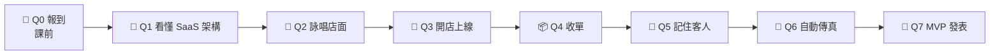

# VibeNTPU（115-1）Vibe Coding × SaaS 創業實戰 — 課程資料庫 🚀

國立臺北大學通識課程單元，**專為完全沒有電機資訊背景的同學設計**。
授課教師：江振宇（[教師個人網頁](https://web.ntpu.edu.tw/~cychiang/)）
本 repo 是這個單元的「課本＋講義＋互動教材＋示範作品」，上課前打開當週資料夾照著做就好。

> 🌱 **沒寫過程式？太好了，這堂課就是為你設計的。**
> 兩週、4 小時，你會用 **VS Code ＋ GitHub Copilot** 做出一個**真的在網路上、能收集客戶名單**的創業網站，
> 並學會全世界工程師每天都在用的 **Git／GitHub**。

---

## 🎯 教學目標

「**先懂 Why，再學 How**」。
不懂現代網路服務（SaaS）的架構，「用 AI 寫 Code → 丟上 GitHub → 連到 Netlify」看起來只是一套死板的操作；
懂了之後你會發現：**現代的科技創業，可以像「組裝樂高」一樣，借用別人的雲端服務來拼湊出自己的產品。**

上完這個單元，你將能：
1. 看懂你每天使用的**社群媒體背後的 SaaS 架構**，並用「美食街比喻」說明現代網路服務；
2. 用 **GitHub** 管理版本（repo、clone、commit、sync），用 **Copilot**（Vibe Coding）做出自己創業題目的網站，並部署到全世界；
3. 用 BaaS 收集早鳥名單、用 LocalStorage 記住使用者、體驗 CI/CD 自動更新；
4. 用專業的架構語言發表你的 MVP。

完整目標與評分 👉 [docs/course_plan.md](docs/course_plan.md)

## 🧠 這個 repo 的設計理念

這門課的每個安排都根據**教育心理學**設計，目標是讓你「有興趣、做得到、想繼續」：

| 你會遇到的設計 | 為什麼這樣做 |
| --- | --- |
| 🥚 上課前就先成功一次（請 Copilot 做 Hello NTPU） | 親身成功經驗是「我做得到」的最強來源（自我效能） |
| 📱 從你每天滑的 IG、LINE 講起 | 從熟悉的經驗出發，新知識才有地方「掛」（先備知識、相關性） |
| 🍱 全程用「美食街比喻」 | 先用熟悉的東西理解，再換上專業術語（具體 → 抽象） |
| 🧰 用業界真正在用的 VS Code、GitHub、Copilot | 真實情境中學習，學到的能直接帶走（真實學習） |
| 📋 一頁版步驟卡、咒語產生器 | 一次只處理一件新事，大腦不超載（認知負荷理論） |
| 👀 我做 → 🤝 我們做 → 🚀 你做 | 先看示範、再填空、最後獨立完成（範例效應＋鷹架） |
| 🗺️ 冒險地圖、徽章、經驗值 | 進度看得見，每一步都有回饋（遊戲化） |
| 💪 錯誤 = 經驗值、紅綠便利貼 | 敢錯才敢嘗試（成長型思維、心理安全感） |
| 🎯 自己選題目、選 AI、選風格 | 自主感是內在動機的來源（自我決定論） |
| 🤝 駕駛／領航員、作品巡禮、作品牆 | 一起學不孤單（歸屬感、同儕教學） |
| 🥉🥈🥇 三級示範作品 | 先知道好作品長怎樣，再動手（透明化評量） |

詳細說明與參考文獻 👉 [docs/learning_design.md](docs/learning_design.md)

---

## 🗺️ 冒險地圖



| 等級 | 🥚 實習生 | 🐣 見習創辦人 | 🐥 創辦人 | 🦅 連續創業家 | 🦄 獨角獸 |
| --- | --- | --- | --- | --- | --- |
| XP | 0 | 100 | 250 | 400 | 500+ |

關卡、支線任務與徽章 👉 [docs/quest_map.md](docs/quest_map.md)
用 [🎒 冒險護照](templates/passport_README.md) 記錄進度，用 [🩺 Vibe 健檢站](tools/vibe_check.html) 驗收！

## 📱 你每天滑的社群媒體，背後長什麼樣子？

IG、YouTube、LINE、TikTok 都是 SaaS。你按下一個「❤️」，背後有幾十種雲端服務在接力：


| 社群巨頭 | 我們的 MVP |
| --- | --- |
| 幾十種自建服務、數千～數萬名工程師、全球資料中心 | **4 塊 SaaS 積木**：Copilot 寫的前端＋GitHub＋Netlify＋Netlify Forms |
| 花了好幾年 | **4 小時** |

📖 完整圖解（按讚時序圖、IaaS／PaaS／SaaS 三層蛋糕、巨頭 vs MVP 對照）👉 [social_media_architecture.md](lectures/wk01_1007_saas-storefront/social_media_architecture.md)
🎮 互動版（可點擊、可播放「按讚／發限動／滑動態／傳 LINE」）👉 [social_saas.html](lectures/wk01_1007_saas-storefront/slides/social_saas.html)

## 🍱 麻瓜版網路架構圖：我們自己的創業怎麼組？

**傳統創業**＝自己去深山買荒地蓋餐廳（自己牽水電、請保全、蓋廚房），花幾十萬、搞好幾個月。
**現代 SaaS 創業**＝直接進駐「百貨公司美食街」，你只做四件事：

| 積木 | 美食街比喻 | 真實技術 | 哪週用 |
| --- | --- | --- | --- |
| 👨‍💻 前端 Frontend | 裝潢、菜單、點餐櫃檯 | HTML／CSS／JS（**Copilot** 在 **VS Code** 裡寫） | 第 1 週 |
| 🗄️ 版本控制 | 總部保險箱＋自動傳真機 | Git ＋ [GitHub](https://github.com/)（VS Code 按 Commit／Sync） | 第 1 週 |
| ☁️ 雲端託管 SaaS | 美食街免費攤位 | [Netlify](https://www.netlify.com/) | 第 1 週 |
| 📦 後端即服務 BaaS | 訂單代收中心 | [Netlify Forms](https://docs.netlify.com/manage/forms/setup/) | 第 2 週 |

> 💡 **聰明的現代創業者，是「用 SaaS 服務來打造自己的 SaaS 產品」！**

互動版 👉 [foodcourt.html](lectures/wk01_1007_saas-storefront/slides/foodcourt.html)　｜　完整圖解 👉 [saas_architecture.md](lectures/wk01_1007_saas-storefront/saas_architecture.md)

---

## 📅 每週講義

每週上課用的講義、步驟卡、互動教材與學習單都在 [lectures/](lectures/README.md)，**上課前先打開當週資料夾**。

| 週 | 日期 | 主題 | 關卡 | 資料夾 |
| --- | --- | --- | --- | --- |
| 課前 | 10/7 前 | 申請帳號、跟 AI 打招呼 | 🥚 Q0 | [before_class.md](docs/tutorials/before_class.md) |
| 1 | 10/7 | 看懂 SaaS 商業邏輯 ＆ 打造數位店面 | 🧠🎨🏪 Q1–Q3 | [wk01_1007_saas-storefront/](lectures/wk01_1007_saas-storefront/README.md) |
| 2 | 10/14 | SaaS 的靈魂：串接後端與體驗自動化迭代 | 📦💾🔄🎤 Q4–Q7 | [wk02_1014_baas-cicd/](lectures/wk02_1014_baas-cicd/README.md) |
| 期末 | — | 創業計畫發表 | 🎤 | [pitch_template.md](docs/pitch_template.md) |

## ✅ 第一堂課 checklist

1. 完成 [🥚 Q0 報到任務](docs/tutorials/before_class.md)：GitHub 帳號、[VS Code ＋ Git ＋ Copilot](docs/tutorials/vscode_copilot_starter.md)、Netlify 帳號，並請 Copilot 做出 Hello NTPU。
2. 預習 [Git 與 GitHub 入門](docs/tutorials/git_intro.md)，或先玩 [Git 存檔點模擬器](lectures/wk01_1007_saas-storefront/slides/git_flow.html)。
3. 讀 [docs/course_plan.md](docs/course_plan.md)：學習目標、評分方式與上課小規則（3 分鐘就看完）。
4. 瀏覽 [samples/](samples/README.md)：看看 🥉🥈🥇 三個等級的示範作品長什麼樣子。
5. 想一個你在乎的創業題目（[依學院分類的點子](lectures/wk01_1007_saas-storefront/README.md#31-選一個你在乎的題目5-分鐘)）。
6. 上課時打開 [第 1 週步驟卡](lectures/wk01_1007_saas-storefront/steps.md)，跟隊友一起照著打勾。

## 🆘 卡關了怎麼辦？

**卡關是正常的，每個工程師每天都在卡關。** 問問題的建議順序：

1. 📖 查 [卡關急救手冊](docs/tutorials/error_guide.md)（90% 的問題都在這裡）
2. 🤖 把錯誤畫面截圖問 AI
3. 🙋 問隔壁組
4. 🟥 貼紅色便利貼／課程群組發問／開一張 [🆘 求救單](https://github.com/cychiang-ntpu/VibeNTPU/issues/new?template=help_request.yml)

⏱️ **15 分鐘法則**：自己試 15 分鐘沒進展，就求救。卡太久不是毅力，是浪費時間。

---

## 📁 目錄結構

```
VibeNTPU/
├── lectures/                    每週講義（依日曆日期編號）
│   ├── wk01_1007_saas-storefront/   第 1 週：社群媒體 SaaS 架構圖、README、steps、prompts、worksheet、slides/
│   └── wk02_1014_baas-cicd/         第 2 週：同上
├── docs/
│   ├── course_plan.md           學習目標、時程、評分、上課規則
│   ├── learning_design.md       🧠 教育心理學設計說明
│   ├── quest_map.md             🗺️ 冒險地圖：關卡、支線、徽章
│   ├── tutorials/               新手教學（VS Code＋Copilot、Git／GitHub、部署、表單、LocalStorage、CI/CD、卡關急救）
│   ├── glossary.md              名詞小辭典
│   ├── resources.md             📚 延伸學習資源
│   ├── pitch_template.md        🎤 期末 Pitch 模板
│   └── teacher_guide.md         👩‍🏫 教師備課指南
├── samples/                     🥉 LOW／🥈 MEDIUM／🥇 HIGH 三級示範作品＋評語
├── tools/
│   ├── vibe_check.html          🩺 Vibe 健檢站（瀏覽器自我檢查＋完課證書）
│   └── ci/                      自動健檢腳本與 GitHub Actions 範本
├── templates/passport_README.md 🎒 冒險護照（貼到自己的 repo）
├── showcase/                    🖼️ 作品牆
└── .github/                     求救單、作品牆登記表、課程自動檢查
```

## 📚 延伸學習

所有參考連結整理在 👉 [docs/resources.md](docs/resources.md)：SaaS 商業模式、系統架構、精實創業、VS Code 與 Copilot、HTML/CSS/JS、Git／GitHub、Netlify、Vibe Coding、資安與個資、Pitch 技巧。

## 🎤 上完這個單元，你可以這樣說

> 「我們團隊運用 **GitHub Copilot 進行 AI 輔助開發（Vibe Coding）** 產出前端介面，以 **Git／GitHub** 做版本控制，並採用了現代的 **SaaS 網路架構**，將網站**無伺服器部署**在 **Netlify** 雲端上。針對初期的 **MVP** 測試，我們捨棄了繁重的資料庫開發，改用輕量級的 **BaaS** 雲端表單服務來收集第一批早鳥用戶名單，大幅降低了創業的**試錯成本**！」

## 📝 授權

教材內容採用 [CC BY-NC-SA 4.0](https://creativecommons.org/licenses/by-nc-sa/4.0/deed.zh-hant)，程式碼（`samples/`、`tools/`、`lectures/*/slides/*.html`）採用 [MIT License](https://opensource.org/license/mit)。歡迎其他老師非商業改作使用。
