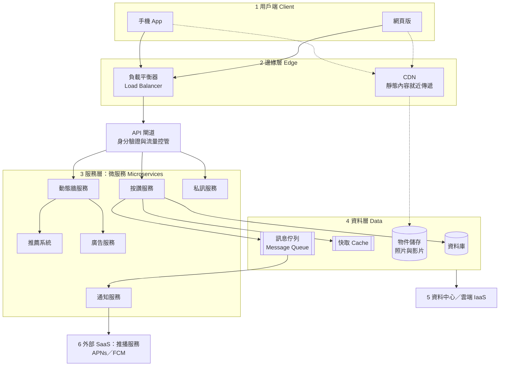

# VibeNTPU：Vibe Coding × SaaS 創業實戰（115-1）

國立臺北大學通識課程單元｜授課教師：江振宇（[教師個人網頁](https://web.ntpu.edu.tw/~cychiang/)）
上課日期：2026 年 10 月 7 日、10 月 14 日（週三），各 2 小時｜對象：非電機資訊背景之大學部學生
課程儲存庫：<https://github.com/cychiang-ntpu/VibeNTPU>（預設分支 `master`）

本儲存庫（repository，以下簡稱 repo）收錄本單元的講義、操作步驟、互動教材、評量規準、示範作品與自我檢核工具。學生於每次上課前開啟當週資料夾即可取得全部教材；教師與助教可參考 [教師備課指南](docs/teacher_guide.md) 與 [教學設計說明](docs/learning_design.md)。

---

## 1. 課程簡介

軟體即服務（Software as a Service, SaaS）已是當代數位產品的主流交付形式：使用者透過瀏覽器或 App 取得服務，而服務提供者把運算、儲存、部署與維運分工給多個雲端平台。對創業者而言，這代表「驗證一個產品構想」的門檻已大幅降低：不必自建機房或聘請完整工程團隊，也能在數小時內推出可供真實使用者操作的最小可行產品（Minimum Viable Product, MVP）。

同時，生成式 AI 程式助理使「以自然語言描述需求、由 AI 產生程式碼、再由人檢視與修正」的開發方式成為可能，業界稱之為 Vibe Coding。此方式降低了進入門檻，卻也帶來新的風險：產生的程式碼可能有錯誤、安全漏洞或授權疑慮，使用者必須具備足夠的架構概念，才能判斷 AI 的輸出是否合理。

本單元以兩次共 4 小時的實作課程，讓非電資背景的學生：

1. 先理解現代網路服務的 SaaS 分層架構（Why），再動手操作（How）；
2. 使用業界標準工具鏈（VS Code、GitHub Copilot、Git／GitHub、Netlify），完成一個可公開存取、可收集潛在客戶名單的 MVP；
3. 以正確的技術語彙說明自己產品的架構選擇與取捨，並以真實使用者資料進行初步市場驗證。

## 2. 教學目標

1. **建立架構觀**：讓學生能將日常使用的社群媒體服務拆解為用戶端、邊緣層、服務層、資料層與基礎設施，理解「雲端服務分工」是現代產品的基本形態。
2. **培養 AI 協作素養**：讓學生體驗以 AI 程式助理產生程式碼的完整流程，同時建立「人負責檢查、驗證與決策」的責任意識。
3. **熟悉版本控制與持續部署**：以 Git／GitHub 管理版本，體驗持續整合與持續部署（Continuous Integration / Continuous Deployment, CI/CD）如何縮短迭代週期。
4. **連結創業實務**：以精實創業（Lean Startup）的「建構—測量—學習」循環為框架，用最低成本驗證需求。

## 3. 學習目標

完成本單元後，學生應能：

| 編號 | 學習目標 | 認知層次（Bloom 修訂版） | 對應檢核點 |
| --- | --- | --- | --- |
| LO1 | 依據社群媒體 SaaS 架構圖，**解釋**一次「按讚」操作所經過的服務與資料流 | 理解 | 檢核點 1 |
| LO2 | **區分**前端、版本控制、雲端託管、後端即服務（Backend as a Service, BaaS）四個元件的職責 | 理解／分析 | 檢核點 1 |
| LO3 | 使用 VS Code 與 GitHub Copilot **產生並修改**符合自訂產品題目的單頁網站 | 應用／創造 | 檢核點 2 |
| LO4 | 以 Git 完成 clone、stage、commit、sync，並將 GitHub repo 連接 Netlify **部署**網站 | 應用 | 檢核點 2、3 |
| LO5 | 串接 Netlify Forms **收集**使用者資料，並說明資料流向與個人資料保護責任 | 應用／評鑑 | 檢核點 4 |
| LO6 | **比較**瀏覽器端儲存（LocalStorage）與伺服器端資料庫在安全性、持久性與適用情境上的差異 | 分析 | 檢核點 5 |
| LO7 | 透過實際修改與自動部署，**說明** CI/CD 對迭代速度與品質的影響 | 理解／評鑑 | 檢核點 6 |
| LO8 | 以問題、解方、架構與驗證數據**建構**一段 1 分鐘的 MVP 發表 | 創造 | 檢核點 7 |

學習目標、評量權重與評分規準詳見 [docs/course_plan.md](docs/course_plan.md)。

## 4. 工具鏈

| 工具 | 類別 | 在本課程中的用途 | 備註 |
| --- | --- | --- | --- |
| [Visual Studio Code](https://code.visualstudio.com/) | 整合開發環境（IDE） | 編輯檔案、預覽網頁、操作「原始檔控制」面板 | 免費、跨平台 |
| [GitHub Copilot](https://github.com/features/copilot) | AI 程式助理 | Agent 模式產生與修改程式碼；Ask 模式解釋程式碼 | 綁定學生 GitHub 帳號；Free 方案有每月用量上限，可申請 [GitHub Education](https://education.github.com/) |
| [Git](https://git-scm.com/) ＋ [GitHub](https://github.com/) | 版本控制系統與程式碼託管平台 | Clone、Stage、Commit、Sync（push／pull） | 以 VS Code 圖形介面操作，不要求使用命令列 |
| [Netlify](https://www.netlify.com/) | 靜態網站託管與部署平台 | 從 GitHub 自動建置與部署，提供 HTTPS 與 CDN | 免費方案足以完成課程 |
| [Netlify Forms](https://docs.netlify.com/manage/forms/setup/) | 後端即服務（BaaS） | 無需自寫後端即可接收表單資料 | 需手動開啟 Form detection；免費方案有每月收件上限 |
| LocalStorage（[MDN](https://developer.mozilla.org/zh-TW/docs/Web/API/Window/localStorage)） | 瀏覽器 Web Storage API | 在使用者瀏覽器中保存簡易會員狀態 | 僅供示範，不適合保存敏感資料 |

## 5. 架構總覽

### 5.1 從社群媒體看 SaaS 分層架構

以 Instagram、YouTube、LINE 等大型服務為例，一次看似簡單的「按讚」操作，會依序經過用戶端、邊緣層、API 閘道、多個微服務、資料層，最後觸發外部推播服務。下圖為教學用的概念化架構，實際各公司的實作細節不盡相同。



完整說明（按讚時序圖、IaaS／PaaS／SaaS 分層、大型平台與 MVP 的對照）見 [社群媒體 SaaS 架構講義](lectures/wk01_1007_saas-storefront/social_media_architecture.md)；可操作的互動版本見 [social_saas.html](lectures/wk01_1007_saas-storefront/slides/social_saas.html)。

### 5.2 本課程 MVP 的四個元件

傳統做法須自行採購伺服器、設定網路與資料庫；本課程則採「組合既有雲端服務」的方式，只需處理四個元件。課堂中以「進駐百貨公司美食街，而非自建餐廳」作為引入類比，隨後即對應到下表的真實技術。

| 元件 | 職責 | 本課程採用的技術 | 使用週次 |
| --- | --- | --- | --- |
| 前端（Frontend） | 使用者看到並操作的介面 | HTML／CSS／JavaScript，由 GitHub Copilot 在 VS Code 中產生 | 第 1 週 |
| 版本控制（Version Control） | 保存每一次修改的歷史，並作為部署來源 | Git ＋ GitHub，透過 VS Code 的 Commit／Sync 操作 | 第 1 週 |
| 雲端託管（Hosting） | 將網站發布到網際網路，提供 HTTPS 與 CDN | Netlify，連接 GitHub 自動部署 | 第 1 週 |
| 後端即服務（BaaS） | 接收與保存使用者送出的資料 | Netlify Forms；另以 LocalStorage 保存瀏覽器端狀態 | 第 2 週 |

此架構的取捨：成本近乎為零、上線速度快、無需維運伺服器；但缺乏真正的身分驗證、資料查詢能力有限，且受免費方案額度限制。這些限制正是 MVP 階段「先驗證需求、再投資技術」的刻意選擇，於第 2 週課程中討論。互動版見 [foodcourt.html](lectures/wk01_1007_saas-storefront/slides/foodcourt.html)，完整講義見 [saas_architecture.md](lectures/wk01_1007_saas-storefront/saas_architecture.md)。

## 6. 課程進度

| 週次 | 日期 | 主題 | 檢核點 | 教材 |
| --- | --- | --- | --- | --- |
| 課前 | 10/7 前 | 帳號申請、開發環境安裝、以 Copilot 產生第一個頁面 | 檢核點 0 | [課前準備](docs/tutorials/before_class.md) |
| 第 1 週 | 10/7（三） | SaaS 商業邏輯與架構；以 AI 產生前端並部署上線 | 檢核點 1–3 | [wk01_1007_saas-storefront](lectures/wk01_1007_saas-storefront/README.md) |
| 第 2 週 | 10/14（三） | 串接 BaaS、瀏覽器端狀態保存、體驗 CI/CD；MVP 發表 | 檢核點 4–7 | [wk02_1014_baas-cicd](lectures/wk02_1014_baas-cicd/README.md) |
| 期末 | 另行公告 | 創業計畫發表 | — | [發表模板](docs/pitch_template.md) |

各檢核點的完成證據與驗證方式見 [學習檢核點](docs/checkpoints.md)；每週教材結構見 [lectures/README.md](lectures/README.md)。

## 7. 第一次上課前的準備

- [ ] 完成 [課前準備](docs/tutorials/before_class.md)：註冊 GitHub 與 Netlify 帳號，安裝並設定 [VS Code、Git 與 GitHub Copilot](docs/tutorials/vscode_copilot_starter.md)，以 Copilot 產生 Hello NTPU 頁面（檢核點 0）。
- [ ] 若可能，提早申請 [GitHub Education](https://education.github.com/)；審核通常需要數日。
- [ ] 預習 [Git 與 GitHub 入門](docs/tutorials/git_intro.md)，或操作 [Git 流程模擬器](lectures/wk01_1007_saas-storefront/slides/git_flow.html)。
- [ ] 閱讀 [課程規劃](docs/course_plan.md) 中的評量方式、AI 使用規範與課堂規範。
- [ ] 瀏覽 [示範作品](samples/README.md)，了解三個表現等級的差異。
- [ ] 構思一個自己關心的產品題目（第 1 週講義附有依學院分類的題目參考）。
- [ ] 上課時開啟 [第 1 週步驟卡](lectures/wk01_1007_saas-storefront/steps.md)。

## 8. 求助方式

操作過程中遇到錯誤屬於正常現象，專業工程師的日常工作也包含大量除錯。建議依下列順序求助：

1. 查閱 [疑難排解手冊](docs/tutorials/error_guide.md)，多數常見錯誤均有對應處理步驟。
2. 將錯誤訊息或截圖提供給 Copilot（Ask 模式），請它解釋原因；注意不要貼上密碼或他人個資。
3. 詢問同組或鄰組同學。
4. 使用課堂即時回饋卡（紅色）請助教協助，或於課後 [開立求助單](https://github.com/cychiang-ntpu/VibeNTPU/issues/new?template=help_request.yml)。

**15 分鐘求助原則**：同一問題自行嘗試 15 分鐘仍無進展時，應立即求助。長時間卡關對學習並無助益。

## 9. 教學設計摘要

本單元的各項安排依據教育心理學與學習科學研究設計，完整論證與參考文獻見 [docs/learning_design.md](docs/learning_design.md)。

| 依據的原則 | 在本 repo 中的具體設計 |
| --- | --- |
| 自我效能（Bandura, 1977）：親身成功經驗是最強的效能來源 | 課前以 Copilot 產生 Hello NTPU 頁面，確保每位學生在第一堂課前已有一次成功經驗 |
| 認知負荷理論（Sweller, 1988）：新手工作記憶有限 | 每段只引入一個新概念；一頁式步驟卡避免注意力分散；提示詞產生器以結構化填寫取代從零撰寫 |
| 範例效應與鷹架撤除（worked example and fading） | 教師示範 → 引導填寫 → 獨立完成的三階段實作 |
| 建構式對準（Biggs, 1996） | 學習目標、課堂活動、檢核點與評分規準逐項對應 |
| 真實學習（authentic learning） | 使用業界實際採用的 VS Code、GitHub、Copilot、Netlify；作品公開上線並面對真實使用者 |
| 形成性評量（Black & Wiliam, 1998） | 自我檢核工具、互動測驗、課堂即時回饋卡、出場券 |
| 透明化評量（Winkelmes et al., 2016） | 事先公開分析式評分規準，並提供 LOW／MEDIUM／HIGH 三級示範作品與評語 |
| 自我決定論（Deci & Ryan, 2000）與過度辯證效應 | 學生自選題目與風格；以檢核點提供資訊性回饋，不設點數、徽章或排行榜 |
| 心理安全感（Edmondson, 1999）與配對程式設計 | 15 分鐘求助原則、非口頭求助管道、駕駛／導航員輪替 |

## 10. 目錄結構

```
VibeNTPU/
├── lectures/                      每週教材（依上課日期命名）
│   ├── wk01_1007_saas-storefront/   第 1 週：講義、架構講義、步驟卡、提示詞、學習單、slides/
│   └── wk02_1014_baas-cicd/         第 2 週：同上
├── docs/
│   ├── course_plan.md             學習目標、進度、評量權重、評分規準、AI 使用規範
│   ├── learning_design.md         教學設計理據與參考文獻
│   ├── checkpoints.md             學習檢核點與延伸任務
│   ├── tutorials/                 操作教學（環境設定、Git、部署、表單、LocalStorage、CI/CD、疑難排解）
│   ├── glossary.md                術語表
│   ├── resources.md               延伸學習資源
│   ├── pitch_template.md          MVP 發表結構與準備指引
│   └── teacher_guide.md           教師備課指南
├── samples/                       LOW／MEDIUM／HIGH 三級示範作品與評語
├── tools/
│   ├── vibe_check.html            網站自我檢核工具（瀏覽器版，含完課證明）
│   └── ci/                        命令列檢核程式、GitHub Actions 範本、repo 維護腳本
├── templates/portfolio_README.md  學習歷程檔案範本（貼到學生自己的 repo）
├── showcase/                      作品牆
└── .github/                       Issue 表單（求助、作品牆登記）與課程 CI 設定
```

## 11. 參考資料

- 延伸學習資源總表：[docs/resources.md](docs/resources.md)（SaaS 商業模式、系統架構、精實創業、VS Code 與 Copilot、Web 前端、Git／GitHub、Netlify、資訊安全與個資、簡報技巧）。
- 術語表：[docs/glossary.md](docs/glossary.md)。
- Ries, E. (2011). *The Lean Startup*. Crown Business.
- Mell, P., & Grance, T. (2011). *The NIST Definition of Cloud Computing* (NIST Special Publication 800-145). National Institute of Standards and Technology.
- GitHub Docs：<https://docs.github.com/>；Netlify Docs：<https://docs.netlify.com/>；MDN Web Docs：<https://developer.mozilla.org/>。

## 12. 授權

教材內容採用 [CC BY-NC-SA 4.0](https://creativecommons.org/licenses/by-nc-sa/4.0/deed.zh-hant) 授權；程式碼（`samples/`、`tools/`、`lectures/*/slides/*.html`）採用 [MIT License](https://opensource.org/license/mit)。歡迎其他教師於非商業用途下改作使用，並請註明出處。
