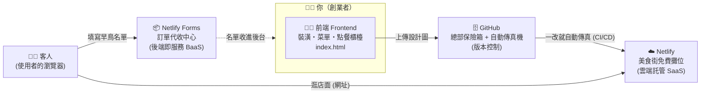

# VibeNTPU：用 AI 與 SaaS 積木，4 小時打造你的第一個創業 MVP 🚀

> 國立臺北大學通識課程・非電資背景也能上手的「Vibe Coding × SaaS 創業」實戰教材
>
> **先懂 Why（為什麼要這樣做），再學 How（怎麼做）。**

不懂現代網路服務（SaaS）的架構，「用 AI 寫 Code → 丟上 GitHub → 連到 Netlify」看起來就只是一套死板的操作步驟。
懂了之後你會發現：**現代的科技創業，可以像「組裝樂高」一樣，借用別人的雲端服務來拼湊出自己的產品。**

這個 repo 就是這堂課的「課本 + 講義 + 範例程式」，請依照下面的路線圖一步一步 follow。

---

## 🗺️ 課程路線圖

| 週次 | 日期 | 主題 | 你會帶走的成果 |
| --- | --- | --- | --- |
| 課前 | 10/7 之前 | [課前準備：申請帳號](docs/00-before-class.md) | GitHub 帳號、Netlify 帳號、一個 AI 助理 |
| 第一週 | 10/7（2 小時） | [看懂 SaaS 商業邏輯 ＆ 打造數位店面](week1/README.md) | 一個全世界都能打開的網址 🌍 |
| 第二週 | 10/14（2 小時） | [SaaS 的靈魂：串接後端與自動化迭代](week2/README.md) | 能收集早鳥名單、會「記得」使用者的 MVP 📋 |
| 期末 | — | [期末 Pitch 模板](docs/pitch-template.md) | 一段連資工系都佩服的架構說明 🎤 |

---

## 🍱 麻瓜版網路架構圖（整堂課的核心比喻）

> 詳細解說請看 👉 [docs/01-saas-architecture.md](docs/01-saas-architecture.md)

**傳統創業（自建主機）** ＝ 自己去深山買一塊荒地，從零蓋一間餐廳：自己牽水電（伺服器環境）、請保全（資安與防火牆）、蓋大廚房（後端資料庫）。
👉 初期花幾十萬、搞好幾個月，一旦沒客人就破產。

**現代 SaaS 創業（樂高積木法）** ＝ 直接進駐「百貨公司美食街」，水電保全百貨公司都弄好了。你只做四件事：



| 積木 | 美食街比喻 | 真實技術 | 哪一週用到 |
| --- | --- | --- | --- |
| 👨‍💻 前端 Frontend | 餐廳的裝潢、菜單、點餐櫃檯 | HTML / CSS / JavaScript | 第一週 |
| 🗄️ 版本控制 | 總部的保險箱與自動傳真機 | [GitHub](https://github.com/) | 第一週 |
| ☁️ 雲端託管 SaaS | 美食街的免費攤位（水電、門牌都有） | [Netlify](https://www.netlify.com/) | 第一週 |
| 📦 後端即服務 BaaS | 訂單代收中心 | [Netlify Forms](https://docs.netlify.com/forms/setup/) | 第二週 |

> 💡 **今天這堂課，我們完全不碰複雜的 GCP，因為聰明的現代創業者，是「用 SaaS 服務來打造自己的 SaaS 產品」！**

---

## 📁 Repo 結構

```
VibeNTPU/
├── README.md                     ← 你在這裡：課程總覽
├── LICENSE                       ← 授權（教材 CC BY-NC-SA／程式碼 MIT）
├── docs/
│   ├── 00-before-class.md        ← 課前準備（帳號申請清單）
│   ├── 01-saas-architecture.md   ← 麻瓜版網路架構圖（觀念課講義）
│   ├── glossary.md               ← 名詞小辭典（SaaS、BaaS、CI/CD…）
│   ├── faq.md                    ← 常見問題與錯誤排除
│   ├── pitch-template.md         ← 期末 Pitch 模板
│   ├── resources.md              ← 延伸學習資源總整理 📚
│   └── teacher-notes.md          ← 教師備課筆記（時間分配與講稿）
├── week1/
│   ├── README.md                 ← 第一週課程流程
│   ├── prompts.md                ← AI 咒語集（前端產生）
│   └── deploy-github-netlify.md  ← 圖文步驟：GitHub 上傳 + Netlify 部署
├── week2/
│   ├── README.md                 ← 第二週課程流程
│   ├── prompts.md                ← AI 咒語集（表單、LocalStorage、改版）
│   ├── netlify-forms.md          ← Netlify Forms 設定與後台查看
│   ├── localstorage.md           ← LocalStorage 原理白話解說
│   └── cicd.md                   ← CI/CD 自動部署體驗
└── examples/
    ├── README.md                 ← 範例說明與部署方式
    ├── week1-landing/index.html  ← 第一週完成品範例（形象首頁）
    └── week2-waitlist/index.html ← 第二週完成品範例（早鳥名單 + 會員儀表板）
```

---

## ⚡ 我很急，給我最短路徑

1. 課前：申請 [GitHub](https://github.com/signup) 帳號，並準備一個 AI 助理（[Claude](https://claude.ai/)、[ChatGPT](https://chatgpt.com/)、[Gemini](https://gemini.google.com/) 擇一）。
2. 第一週：用 [week1/prompts.md](week1/prompts.md) 的咒語產生 `index.html` → 照 [week1/deploy-github-netlify.md](week1/deploy-github-netlify.md) 上線。
3. 第二週：用 [week2/prompts.md](week2/prompts.md) 加上早鳥表單與會員歡迎畫面 → 照 [week2/netlify-forms.md](week2/netlify-forms.md) 開啟表單收集 → 照 [week2/cicd.md](week2/cicd.md) 體驗自動更新。
4. 卡關了？先看 [docs/faq.md](docs/faq.md)。
5. 想看完成品長什麼樣子？直接打開 [examples/](examples/) 裡的範例。

---

## 🌟 上完這堂課，你可以這樣說

> 「我們團隊運用了 **AI 輔助開發（Vibe Coding）** 產出前端介面，並採用了現代的 **SaaS 網路架構**，將網站**無伺服器部署**在 **Netlify** 雲端上。針對初期的 **MVP** 測試，我們捨棄了繁重的資料庫開發，改用輕量級的 **BaaS** 雲端表單服務來收集第一批早鳥用戶名單，大幅降低了創業的**試錯成本**！」

更多期末發表技巧 👉 [docs/pitch-template.md](docs/pitch-template.md)

---

## 📚 延伸學習

所有參考連結都整理在 👉 [docs/resources.md](docs/resources.md)，包含：SaaS 商業模式、精實創業、HTML/CSS/JS 入門、GitHub 與 Netlify 官方文件、Vibe Coding 的由來與注意事項。

## 📝 授權

教材內容採用 [CC BY-NC-SA 4.0](https://creativecommons.org/licenses/by-nc-sa/4.0/deed.zh-hant)，範例程式碼採用 [MIT License](https://opensource.org/license/mit)，歡迎其他老師非商業改作使用。
