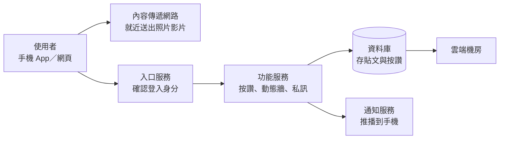

# VibeNTPU：Vibe Coding × SaaS 創業實戰（115-1）

國立臺北大學通識課程單元｜授課教師：江振宇（[教師個人網頁](https://web.ntpu.edu.tw/~cychiang/)）
上課日期：2026 年 10 月 7 日、10 月 14 日（週三），各 2 小時｜對象：非電機資訊背景的大學部學生
課程儲存庫：<https://github.com/cychiang-ntpu/VibeNTPU>（預設分支 `master`）

這個 repo（儲存庫，放在 GitHub 上的專案資料夾）收錄本單元全部教材。學生教材都是**手把手操作指南**：照著步驟一步一步做，就能完成自己的網站。不需要任何程式基礎。

---

## 從這裡開始

依序打開下面四份文件，照著做即可。

1. **課前準備**：[docs/tutorials/before_class.md](docs/tutorials/before_class.md)
   註冊帳號、安裝 VS Code，並用 AI 做出第一個「Hello NTPU」網頁。約 60 分鐘，請在 10/7 上課前完成。
2. **第 1 週手把手實作（10/7）**：[lectures/wk01_1007_saas-storefront/README.md](lectures/wk01_1007_saas-storefront/README.md)
   用 AI 做出自己產品的首頁，並把它發布成任何人都能打開的網站。課堂 2 小時。
3. **第 2 週手把手實作（10/14）**：[lectures/wk02_1014_baas-cicd/README.md](lectures/wk02_1014_baas-cicd/README.md)
   幫網站加上報名表單和簡易會員畫面，並體驗「修改後自動更新上線」。課堂 2 小時。
4. **期末發表**：[docs/pitch_template.md](docs/pitch_template.md)
   照著填空講稿，準備 1 分鐘（課堂）與 3 分鐘（期末）的產品發表。約 30 分鐘準備。

每做完一段，可以對照 [學習檢核點](docs/checkpoints.md) 確認自己已經完成。

## 這門課會做出什麼

兩次課結束時，你會有一個**真的上線的產品網站**（例如「三峽租屋雷達」）：

- 有自己的網址（`https://你的名字.netlify.app`），用手機就能打開。
- 有報名表單，別人填寫後你可以在後台看到名單。
- 你每次修改內容，網站會自動更新。
- 你能用一分鐘向別人介紹：這個產品解決什麼問題、是怎麼做出來的。

網站程式碼由 AI 助理 GitHub Copilot 幫你產生，你負責描述需求、檢查結果、做決定。

## 課程架構圖

我們每天用的社群媒體（例如 Instagram）背後，是由好幾個分工的服務組成的。下圖是簡化版：



想看一次「按讚」怎麼跑完全程，見 [社群媒體 SaaS 架構講義](lectures/wk01_1007_saas-storefront/social_media_architecture.md)。

本課程不需要自己蓋這麼多服務。我們只組合四個現成的雲端服務，就能做出能用的產品：

| 部分 | 白話說明 | 我們用的工具 | 哪一週 |
| --- | --- | --- | --- |
| 前端 | 使用者看到、會點的網頁畫面 | VS Code ＋ GitHub Copilot 產生的網頁 | 第 1 週 |
| 版本控制 | 保存每一次修改，像雲端存檔 | Git ＋ GitHub | 第 1 週 |
| 雲端託管 | 把網頁放上網路，給它一個網址 | Netlify | 第 1 週 |
| 後端服務（BaaS） | 幫你收下使用者填的表單資料 | Netlify Forms；另用 LocalStorage 記住會員狀態 | 第 2 週 |

## 課程進度

| 時間 | 做什麼 | 完成的檢核點 | 教材 |
| --- | --- | --- | --- |
| 10/7 前 | 註冊帳號、安裝軟體、做出第一個網頁 | 檢核點 0 | [課前準備](docs/tutorials/before_class.md) |
| 10/7（三） | 了解架構；用 AI 做首頁；發布上線 | 檢核點 1–3 | [第 1 週](lectures/wk01_1007_saas-storefront/README.md) |
| 10/14（三） | 加上表單與會員畫面；自動更新；1 分鐘發表 | 檢核點 4–7 | [第 2 週](lectures/wk02_1014_baas-cicd/README.md) |
| 期末（另行公告） | 3 分鐘產品發表 | — | [發表模板](docs/pitch_template.md) |

評分方式與 AI 使用規範見 [課程規劃](docs/course_plan.md)；不同品質的作品長什麼樣子，見 [示範作品](samples/README.md)。

## 遇到問題怎麼辦

出錯很正常，工程師每天也在處理錯誤。請依序：

1. 查 [疑難排解手冊](docs/tutorials/error_guide.md)，找跟你畫面一樣的問題編號（Q1–Q18）。
2. 把錯誤訊息貼給 Copilot（Ask 模式），請它用白話解釋。不要貼密碼或別人的個資。
3. 問旁邊的同學。
4. 舉紅色回饋卡請助教協助；課後可以 [開立求助單](https://github.com/cychiang-ntpu/VibeNTPU/issues/new?template=help_request.yml)。

**15 分鐘原則**：同一個問題自己試了 15 分鐘還沒進展，就直接求助，不要一直卡著。

## 給老師

- [課程規劃](docs/course_plan.md)：學習目標、評量權重、評分規準、AI 使用規範。
- [教學設計理據](docs/learning_design.md)：各項安排的學理依據與參考文獻。
- [教師備課指南](docs/teacher_guide.md)：課前準備、課堂引導、常見故障與評量流程。

## 選讀：深入原理

課堂不要求。完成實作後，想知道「為什麼這樣做」，可以讀 [深入原理（選讀）](docs/deep_dive/README.md)。

## 目錄結構

```
VibeNTPU/
├── lectures/          每週手把手實作（第 1 週、第 2 週）
├── docs/
│   ├── tutorials/     課前準備、各項操作教學、疑難排解手冊
│   ├── deep_dive/     深入原理（選讀）
│   ├── checkpoints.md 學習檢核點
│   ├── course_plan.md 課程規劃與評分
│   └── pitch_template.md 發表模板
├── samples/           三個等級的示範作品
├── templates/         學習歷程檔案範本
├── tools/             網站自我檢核工具
└── showcase/          作品牆
```

## 授權

教材內容採用 [CC BY-NC-SA 4.0](https://creativecommons.org/licenses/by-nc-sa/4.0/deed.zh-hant) 授權；程式碼（`samples/`、`tools/`、`lectures/*/slides/*.html`）採用 [MIT License](https://opensource.org/license/mit)。歡迎其他教師於非商業用途下改作使用，並請註明出處。
