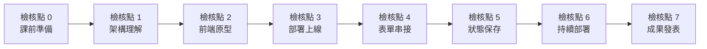

# 學習檢核點

[← 回課程首頁](../README.md)

整個課程分成 8 個檢核點（檢核點 0–7）。每做完一段，對照下表「怎麼確認完成」，就知道自己有沒有跟上。檢核點**不計分、不排名**，只是幫你確認進度。請把完成情形記在自己 repo 的 [學習歷程檔案](../templates/portfolio_README.md)。

---

## 1. 檢核點流程

課前完成檢核點 0；第 1 週完成檢核點 1–3；第 2 週完成檢核點 4–7。

## 2. 檢核點一覽

| 檢核點 | 要做什麼 | 怎麼確認完成 | 步驟在哪裡 |
| --- | --- | --- | --- |
| 0 課前準備 | 註冊 GitHub 和 Netlify 帳號；安裝 VS Code；用 Copilot 做出 Hello NTPU 網頁 | VS Code 裡能預覽出寫著「Hello NTPU」的網頁 | [課前準備](tutorials/before_class.md) |
| 1 架構理解 | 做課堂上的架構小測驗 | 測驗畫面顯示答對 80% 以上 | [第 1 週](../lectures/wk01_1007_saas-storefront/README.md) |
| 2 前端原型 | 在 GitHub 建立 repo，下載到 VS Code，用 Copilot 產生產品首頁 `index.html` | VS Code 預覽畫面出現你的產品名稱 | [第 1 週](../lectures/wk01_1007_saas-storefront/README.md) |
| 3 部署上線 | 提交（Commit）並同步（Sync）到 GitHub；在 Netlify 發布網站 | 用手機打開 `https://…netlify.app` 看得到你的網站；[自我檢核工具](../tools/vibe_check.html) Level 1 通過 | [第 1 週](../lectures/wk01_1007_saas-storefront/README.md) |
| 4 表單串接 | 在網站加上報名表單，接到 Netlify Forms | Netlify 後台 **Forms** 頁面看得到 3 筆以上資料；自我檢核 Level 2 通過 | [第 2 週](../lectures/wk02_1014_baas-cicd/README.md) |
| 5 狀態保存 | 用 LocalStorage 做出簡易會員畫面 | 送出表單後出現會員畫面，重新整理頁面後還在；自我檢核 Level 3 通過 | [第 2 週](../lectures/wk02_1014_baas-cicd/README.md) |
| 6 持續部署 | 修改網站內容，只做 Commit 和 Sync | 沒有打開 Netlify，網站約 1 分鐘後就自動更新 | [第 2 週](../lectures/wk02_1014_baas-cicd/README.md) |
| 7 成果發表 | 1 分鐘介紹你的產品 | 課堂上完成發表 | [發表模板](pitch_template.md) |

**注意：**

- Netlify 後台會顯示填寫者的 Email。截圖前請用色塊遮住個資。
- 自我檢核工具只檢查網頁檔案內容，不能確認網站真的上線。檢核點 3–6 請一定用公開網址實際打開確認。

## 3. 延伸任務（選做）

給做得比較快或有興趣的同學，**不影響成績**。完成後可記在學習歷程檔案。

- 把 Netlify 網址改成好記的名字（例如 `ntpu-rent-radar`）。
- 用手機瀏覽，找出 2 個排版問題，請 Copilot 修好。
- 請 5 位不是同學、但符合目標客群的人填寫表單，記下他們的回饋。
- 在作品巡禮時，用「我喜歡／我希望／如果」給 3 位同學回饋。
- 到 [作品牆](../showcase/README.md) 登記你的作品。
- 讀一篇 [深入原理（選讀）](deep_dive/README.md)，寫下對自己產品的啟發。

## 4. 完課證明

完成檢核點 0–7 後，可以在 [網站自我檢核工具](../tools/vibe_check.html) 產生完課證明。完課證明只表示你走完了學習流程，不代表成績。
