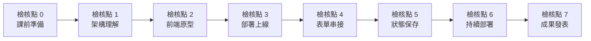

# 學習檢核點

[← 回課程首頁](../README.md)

本單元將完整的 MVP 開發流程切分為八個檢核點（檢核點 0–7）。每個檢核點說明完成條件、應留存的證據與驗證方式，目的在於讓學生與教師能以可觀察的證據確認學習進度，並及早發現卡關位置。

檢核點屬於形成性回饋，本身**不計分、不排名**；評分依 [課程規劃](course_plan.md#3-評量方式與權重) 所列之證據與規準進行。學生請將進度記錄於自己 repo 中的 [學習歷程檔案](../templates/portfolio_README.md)。設計理由見 [教學設計理據](learning_design.md#53-外在獎勵的風險為何移除點數等級與徽章)。

---

## 1. 檢核點流程

課前完成檢核點 0；第 1 週完成檢核點 1–3；第 2 週完成檢核點 4–7。

## 2. 檢核點一覽

| 編號 | 名稱 | 完成條件 | 完成證據 | 驗證方式 | 對應學習目標 | 教材 |
| --- | --- | --- | --- | --- | --- | --- |
| 檢核點 0 | 課前準備 | GitHub、Netlify 帳號；VS Code、Git、Copilot 可用；以 Copilot 產生 Hello NTPU 頁面 | Hello NTPU 頁面的 VS Code 預覽截圖；GitHub 帳號名稱 | 第 1 週開場由助教抽查；學生於學習歷程檔案勾選 | — | [課前準備](tutorials/before_class.md) |
| 檢核點 1 | 架構理解 | 架構互動測驗答對 80% 以上（social_saas.html 或 foodcourt.html） | 測驗結果畫面截圖 | 課堂上展示給同組導航員確認；截圖存於學習歷程檔案 | LO1、LO2 | [社群媒體架構互動教材](../lectures/wk01_1007_saas-storefront/slides/social_saas.html)、[美食街互動教材](../lectures/wk01_1007_saas-storefront/slides/foodcourt.html) |
| 檢核點 2 | 前端原型 | 建立 GitHub repo、在 VS Code clone，並以 Copilot 產生可預覽的 index.html | GitHub 上的 repo 網址；本機預覽畫面 | 開啟 repo 頁面確認存在；VS Code 中可預覽 `index.html` | LO3、LO4 | [第 1 週提示詞](../lectures/wk01_1007_saas-storefront/prompts.md) |
| 檢核點 3 | 部署上線 | Commit＋Sync 至 GitHub；Netlify 部署成功；自我檢核工具 Level 1 通過 | GitHub 上含 `index.html` 的 commit；`https://*.netlify.app` 公開網址 | 以手機開啟網址；GitHub Commits 頁面可見 commit；[自我檢核工具](../tools/vibe_check.html) Level 1 全部必要項目通過 | LO4 | [GitHub 與 Netlify 部署](tutorials/github_netlify_deploy.md) |
| 檢核點 4 | 表單串接 | Netlify Forms 收到 3 筆以上資料；Level 2 通過 | Netlify Forms 後台收件列表截圖（**Email 等個資須遮蔽**） | 截圖顯示表單名稱與至少 3 筆資料；自我檢核 Level 2 通過 | LO5 | [Netlify Forms](tutorials/netlify_forms.md) |
| 檢核點 5 | 狀態保存 | LocalStorage 模擬會員狀態；Level 3 通過 | 送出表單後顯示會員畫面，重新整理後仍保留 | 於公開網址實際操作；開發者工具 Application → Local Storage 可見資料；自我檢核 Level 3 通過 | LO6 | [LocalStorage](tutorials/localstorage.md) |
| 檢核點 6 | 持續部署 | 修改後 Commit＋Sync，未操作 Netlify 即自動更新 | 一筆修改用的 commit 與其觸發的 Netlify 部署紀錄 | GitHub commit 的時間與訊息，對應 Netlify Deploys 頁面中相同 commit 的部署紀錄 | LO7 | [CI/CD](tutorials/cicd.md) |
| 檢核點 7 | 成果發表 | 1 分鐘 MVP 發表 | 發表時使用的網址與架構說明 | 課堂發表，依 [評分規準](course_plan.md#4-分析式評分規準) 評量 | LO2、LO8 | [發表模板](pitch_template.md) |

### 2.1 驗證時的注意事項

- **截圖遮蔽個資**：Netlify Forms 後台會顯示填寫者的 Email 與姓名。截圖前以馬賽克或色塊遮蔽，僅保留表單名稱、筆數與時間。
- **自我檢核的限制**：[自我檢核工具](../tools/vibe_check.html) 以靜態分析檢查 `index.html` 是否包含必要元素，無法確認網站是否真的部署成功或表單是否真的收到資料。檢核點 3–6 必須搭配公開網址與平台紀錄驗證。
- **批次驗證**：教師可收齊學生的 `index.html`，以命令列版本批次檢核，詳見 [教師備課指南](teacher_guide.md#5-評量流程)。

## 3. 延伸任務（選做）

延伸任務供進度較快或有興趣深入的學生自選，**不影響成績**。完成者可於學習歷程檔案記錄，並附上證據。

| 任務 | 內容 | 完成證據 | 對應能力 |
| --- | --- | --- | --- |
| 自訂網址名稱 | 將 Netlify 預設網址改為有意義的子網域名稱（例如 `ntpu-rent-radar`） | 新的 `*.netlify.app` 網址 | 平台設定 |
| 行動版排版修正 | 以手機實際瀏覽，找出至少 2 個排版問題並請 Copilot 修正 | 修正前後對照截圖；對應 commit | 響應式設計（Responsive Web Design, RWD） |
| 表單通知設定 | 設定 Netlify Forms 的 Email 通知（見 [Netlify Forms 教學](tutorials/netlify_forms.md)） | 通知設定頁面截圖（遮蔽個資） | BaaS 設定 |
| 市場驗證：5 位非同學的目標使用者 | 邀請 5 位非同學、符合目標客群的人填寫表單，並記錄觀察 | 學習歷程檔案中的市場驗證紀錄 | 客戶開發 |
| GitHub Actions 自動檢核 | 在自己的 repo 安裝 [自動檢核工作流程](tutorials/vibe_check_ci.md)，取得通過狀態 | Actions 頁面中通過的執行紀錄 | 持續整合 |
| 同儕回饋 | 於作品巡禮中，以「我喜歡／我希望／如果」給 3 位同學具體回饋 | 回饋內容紀錄 | 評鑑與溝通 |
| 延伸閱讀心得 | 從 [延伸學習資源](resources.md) 選讀一篇，寫出重點與對自己產品的啟示 | 學習歷程檔案中的心得段落 | 自主學習 |
| A/B 測試 | 製作兩種標題版本，比較表單轉換率，並討論樣本數限制 | 兩版本的網址或 commit；數據與結論 | 實驗設計 |
| 雙語介面 | 為網站加入中文與英文切換功能 | 可運作的切換功能；對應 commit | 國際化（Internationalization, i18n） |
| 作品牆登記 | 透過 [作品牆登記表](https://github.com/cychiang-ntpu/VibeNTPU/issues/new?template=showcase.yml) 將作品登記至 [作品牆](../showcase/README.md) | Issue 連結 | 公開呈現 |
| Commit 訊息品質 | 累積 10 筆以上能清楚說明修改目的的 commit 訊息 | GitHub Commits 頁面 | 版本控制實務 |
| 產品架構分析 | 選擇一個常用的 App（例如外送、音樂串流、校園論壇），參考 [社群媒體架構講義](../lectures/wk01_1007_saas-storefront/social_media_architecture.md) 繪製其可能的 SaaS 架構並說明依據 | 架構圖與說明 | 架構分析 |

## 4. 完課證明

完成檢核點 0–7 的學生，可於 [網站自我檢核工具](../tools/vibe_check.html) 產生完課證明。完課證明僅表示已完成本單元的學習流程，不代表成績。
