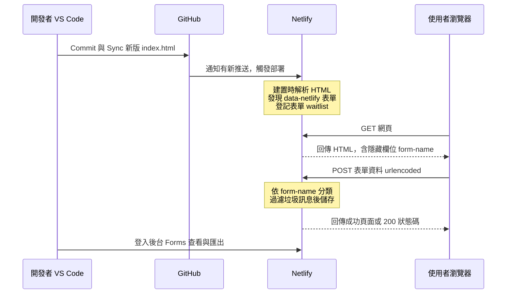
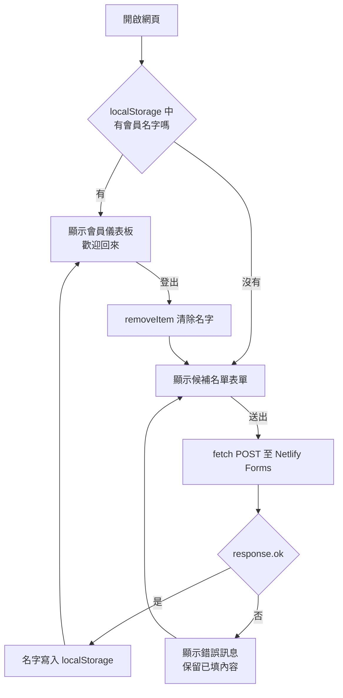
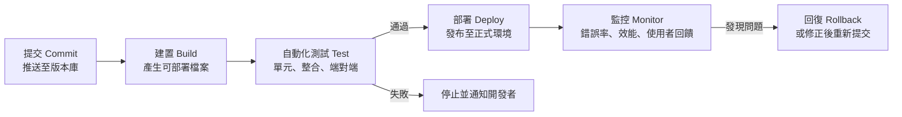

# 表單、儲存與 CI/CD（深入閱讀）

選讀、課堂不要求。本頁收錄第 2 週 Netlify Forms、LocalStorage 與持續部署的原理說明，原本放在講義中。課堂操作請看 [第 2 週手把手實作](../../lectures/wk02_1014_baas-cicd/README.md)，以及三份步驟教學：[Netlify Forms](../tutorials/netlify_forms.md)、[LocalStorage](../tutorials/localstorage.md)、[CI/CD](../tutorials/cicd.md)。

---

## 第一部分：Netlify Forms 的運作機制

Netlify Forms 是一種後端即服務（Backend as a Service, BaaS）：Netlify 代為提供「接收表單資料的端點、儲存、後台介面與通知」，開發者不需要撰寫任何伺服器程式。其運作分為兩個階段。

### 1.1 部署階段：建置時解析 HTML

每次部署時，Netlify 的建置系統會讀取網站的靜態 HTML 檔案，尋找帶有 `data-netlify="true"`（或 `netlify`）屬性的 `<form>`。找到後，Netlify 會：

1. 以 `<form>` 的 `name` 屬性登記一個表單（本課程為 `waitlist`），並記下其中各欄位的 `name`。
2. 在處理後的 HTML 中自動加入一個隱藏欄位 `form-name`，使一般的表單送出能被辨識。
3. 為該網站啟用表單接收：之後送到這個網站的相符 POST 請求，會被 Netlify 攔截並儲存。

兩個直接推論：

- **表單偵測必須開啟**：自 2023 年 4 月起，新建立的網站預設關閉表單偵測（[Netlify 公告](https://answers.netlify.com/t/forms-detection-now-off-by-default/90414)）。關閉時，建置系統不會解析表單。
- **開啟後必須重新部署**：解析只發生在部署時。先推送程式碼、後開啟偵測，必須再觸發一次部署。

### 1.2 送出階段：瀏覽器發出 HTTP POST

使用者按下送出時，瀏覽器依 `<form>` 的設定發出一個 HTTP 請求：

- **方法**：`POST`，資料放在請求本文（body）中。
- **編碼**：預設為 `application/x-www-form-urlencoded`，也就是把每個具 `name` 的欄位編成 `name=值`，以 `&` 連接，非英數字元以百分比編碼（percent-encoding）表示。例如：

```text
form-name=waitlist&name=%E5%B0%8F%E6%98%8E&email=ming%40example.com&role=%E5%A4%A7%E5%AD%B8%E7%94%9F
```

Netlify 收到後，依 `form-name` 的值找出對應表單，依欄位名稱存入後台，並回傳一個成功頁面（若 `<form>` 設有 `action="/thanks"` 等路徑，則導向該頁）。



### 1.3 以 AJAX 送出：為什麼一定要帶 form-name

第 2 週提示詞 2 改用 JavaScript 的 `fetch()` 在背景送出，以便頁面不跳轉。此時請求由我們的程式組成，因此必須自行滿足上述格式：

```javascript
const form = document.querySelector('form[name="waitlist"]');
form.addEventListener('submit', async (event) => {
  event.preventDefault();                       // 取消瀏覽器預設的整頁送出
  const body = new URLSearchParams(new FormData(form)).toString();
  const response = await fetch('/', {
    method: 'POST',
    headers: { 'Content-Type': 'application/x-www-form-urlencoded' },
    body,                                        // 必須包含 form-name=waitlist
  });
  if (!response.ok) throw new Error('送出失敗：' + response.status);
});
```

- `FormData` 會讀取表單內所有具 `name` 的欄位。若 HTML 原始碼中沒有 `form-name` 隱藏欄位，請求中就不會有它，Netlify 無法判斷資料屬於哪個表單，資料會被忽略。
- 本文必須是 urlencoded 字串，不能是 `JSON.stringify(...)` 產生的 JSON。
- 自己寫的隱藏欄位與 Netlify 自動加入的欄位內容相同，不會衝突。

### 1.4 以 JavaScript 產生的表單

若表單是由 JavaScript 在瀏覽器中動態產生（例如以 React、Vue 等框架渲染，或以 `innerHTML` 插入），建置系統讀取的靜態 HTML 中並沒有這個表單，因此偵測不到。官方建議的做法是在靜態 HTML 中另放一個具相同 `name` 與欄位的隱藏表單，供建置系統偵測。本課程的做法更簡單：要求 Copilot 將表單直接寫在 `index.html` 中。

### 1.5 正確的表單結構

以 [第 2 週提示詞 1](../../lectures/wk02_1014_baas-cicd/prompts.md) 產生表單後，檢查 `<form>` 是否具備以下結構：

```html
<form name="waitlist" method="POST" data-netlify="true" netlify-honeypot="bot-field">
  <!-- 表單名稱：AJAX 送出時必須由 HTML 帶上 -->
  <input type="hidden" name="form-name" value="waitlist" />

  <!-- honeypot：真人看不到，自動化程式填寫後會被過濾 -->
  <p hidden><label>請勿填寫：<input name="bot-field" /></label></p>

  <!-- 每個欄位都要有 name，後台才會出現該欄 -->
  <label>姓名 <input type="text" name="name" required /></label>
  <label>Email <input type="email" name="email" required /></label>

  <p>您的資料僅用於產品上線通知，不會提供給第三方。</p>
  <button type="submit">加入早鳥名單</button>
</form>
```

| 檢查項目 | 作用 |
| --- | --- |
| `name="waitlist"` | 後台以此名稱建立表單；須與 `form-name` 的 `value` 完全相同 |
| `method="POST"` | 資料放在請求本文；預設的 GET 會把資料附在網址上，Netlify 不會接收 |
| `data-netlify="true"` | 讓建置系統偵測並登記此表單 |
| 隱藏欄位 `form-name` | 讓 AJAX 請求可被正確歸類 |
| 每個欄位都有 `name` | 瀏覽器只送出具 `name` 的欄位 |
| `netlify-honeypot` 與 `bot-field` | 垃圾訊息防護（見第 1.8 節） |
| 蒐集目的說明 | 個資告知（見第 1.10 節） |

### 1.6 提示詞 1 各項技術要求的理由

| 要求 | 理由 |
| --- | --- |
| `name="waitlist"` | Netlify 以表單名稱建立後台中的表單項目；沒有名稱時，後台難以辨識，多個表單也無法區分 |
| `method="POST"` | 表單資料放在 HTTP 請求本文（body）中送出。若使用預設的 GET，資料會附加在網址上，既不會被 Netlify 接收，也可能留在瀏覽紀錄與伺服器日誌中 |
| `data-netlify="true"` | Netlify 在部署時解析 HTML，只有帶這個屬性（或 `netlify` 屬性）的表單會被登記並建立接收端點 |
| 隱藏欄位 `form-name` | Netlify 依據請求中的 `form-name` 值判斷資料屬於哪個表單。一般 HTML 送出時，Netlify 會在部署處理中自動補上此欄位；但提示詞 2 改以 JavaScript（AJAX）送出，必須由我們自行帶上，否則資料會被忽略 |
| 每個欄位都有 `name` | 瀏覽器只會送出有 `name` 的欄位，並以 `name=值` 的形式編碼；沒有 `name` 的欄位不會出現在後台 |
| honeypot 欄位 | 一個真人看不到、但自動化程式常會填寫的陷阱欄位；有值的送出會被視為垃圾訊息而過濾 |
| 表單直接寫在 HTML | Netlify 的偵測發生在部署時、讀取的是靜態 HTML 檔，不會執行 JavaScript；由 JavaScript 產生的表單不會被偵測到 |
| 個資告知 | 依個人資料保護法的精神，向當事人直接蒐集資料時應告知蒐集目的等事項（見第 1.10 節） |
| 不要執行 git | 保留由學生自己在原始檔控制面板檢視差異、撰寫 Commit 訊息的步驟，確保你知道提交了什麼；Agent 模式可以執行終端機指令，若它自行 commit 或 push，你將失去這個檢查點 |

### 1.7 提示詞 2 各項技術要求的理由

| 要求 | 理由 |
| --- | --- |
| 攔截預設送出（`event.preventDefault()`） | 瀏覽器預設會以整頁導向的方式送出表單並載入新頁面；攔截後才能留在原頁、原地更新畫面 |
| 使用 `fetch()` 以 POST 送到 `/` | `fetch()` 在背景發出 HTTP 請求，這種不重新載入頁面的通訊方式通稱 AJAX。Netlify 會攔截送到網站路徑的表單 POST，送到 `/` 即可 |
| `application/x-www-form-urlencoded` | 這是 HTML 表單的標準編碼格式（`name=%E5%B0%8F%E6%98%8E&email=...`），也是 Netlify Forms 接受的格式；若改送 JSON，Netlify 無法解析 |
| `URLSearchParams(new FormData(form))` | `FormData` 讀取表單中所有具 `name` 的欄位（包含隱藏的 `form-name`），`URLSearchParams` 將其轉為 urlencoded 字串 |
| 成功後才寫入 localStorage | 避免送出失敗時，畫面卻顯示「已加入」，造成使用者與後台資料不一致 |
| 不在 localStorage 存 Email | LocalStorage 未加密，可被頁面上任何腳本讀取；依資料最小化原則，只存顯示所需的名字 |
| 使用 `textContent` | 若以 `innerHTML` 插入使用者輸入，輸入內容若含 HTML 或腳本會被瀏覽器執行，形成跨站腳本攻擊（Cross-Site Scripting, XSS）的風險 |
| 錯誤處理 | 網路中斷或伺服器錯誤時仍需給使用者明確回饋 |

### 1.8 垃圾訊息防護

公開的表單很快會收到自動化程式送出的垃圾資料。Netlify 提供多層防護：

- **自動過濾**：Netlify 會對送出內容進行垃圾訊息判斷，被判定為垃圾的資料會另列於垃圾訊息清單，不會觸發通知。
- **honeypot 欄位**：在 `<form>` 加上 `netlify-honeypot="bot-field"`，並放一個隱藏的 `bot-field` 欄位。真人看不到而不會填寫；自動化程式傾向填寫所有欄位，一旦此欄有值，該筆即被捨棄。優點是對使用者零干擾，缺點是較進階的機器人可以避開。
- **reCAPTCHA（選用）**：在 `<form>` 加上 `data-netlify-recaptcha="true"`，並在表單中放置 `<div data-netlify-recaptcha="true"></div>`，Netlify 會插入 Google reCAPTCHA 驗證。防護較強，但會增加使用者操作步驟、可能降低轉換率，且涉及將使用者行為資料提供給第三方。

官方說明：[Netlify Forms spam filters](https://docs.netlify.com/manage/forms/spam-filters/)

### 1.9 免費方案的額度

Netlify 免費方案對表單送出次數設有上限，對課堂練習與早期驗證通常足夠。額度與超額後的處理方式會隨方案調整，請以 [Netlify 價格頁面](https://www.netlify.com/pricing/) 為準，不要依賴講義或網路文章中的數字。若將來資料量或功能需求超出範圍，可評估其他服務，例如 [Google 表單](https://www.google.com/forms/about/)、[Tally](https://tally.so/)、[Formspree](https://formspree.io/) 或 [Supabase](https://supabase.com/)；遷移前應先匯出既有資料。

### 1.10 個人資料保護法

姓名與 Email 屬於可直接或間接識別特定個人的資料，受臺灣《[個人資料保護法](https://law.moj.gov.tw/LawClass/LawAll.aspx?pcode=I0050021)》規範。以下為原則性說明，不構成法律意見；課堂練習是否適用該法須視具體情境判斷，但當網站對外公開、向一般大眾蒐集資料時，應以符合法規的標準處理。

| 原則 | 法條要旨 | 對候補名單的具體做法 |
| --- | --- | --- |
| 告知義務 | 第 8 條：向當事人直接蒐集個資時，應明確告知蒐集者名稱、蒐集目的、個資類別、利用之期間、地區、對象及方式、當事人得行使之權利及方式，以及不提供時對其權益的影響 | 在表單旁以簡短文字說明：誰在蒐集、用途（例如產品上線通知）、保存到何時、如何要求查詢或刪除 |
| 目的限制 | 第 5 條：蒐集、處理或利用應尊重當事人權益，不得逾越特定目的之必要範圍，並應與蒐集目的具有正當合理之關聯 | 為「上線通知」蒐集的 Email，不應轉作其他行銷或提供他人 |
| 資料最小化 | 同上，以必要範圍為限 | 只蒐集驗證假設所必需的欄位；不要求身分證字號、生日、電話等非必要資料 |
| 當事人權利 | 第 3 條：當事人得請求查詢、閱覽、製給複製本、補充或更正、停止蒐集處理利用、刪除 | 提供聯絡方式，收到請求時在 Netlify 後台實際處理 |
| 安全維護 | 第 27 條：非公務機關保有個資檔案者，應採行適當之安全措施 | 為 Netlify 帳號設定強密碼與雙因素驗證；匯出的 CSV 不上傳至公開位置、不傳至群組 |

另需注意：資料實際存放於 Netlify 的伺服器，可能位於境外。在告知內容中說明使用第三方服務處理資料，是較透明的做法。

### 1.11 討論與延伸思考

1. Netlify 選擇在「部署時」而非「送出時」偵測表單。這個設計帶來什麼好處？又造成哪些初學者常見的錯誤？
2. honeypot 與 reCAPTCHA 在防護強度、使用者體驗與隱私上各有取捨。對一個以轉換率為核心指標的候補名單頁面，你會選擇哪一種？為什麼？
3. 若同一頁面上有兩個表單（例如候補名單與意見回饋），需要做哪些調整才能在後台分開收集？
4. 你的表單告知文字是否涵蓋第 8 條所列的事項？哪些項目在一行文字中難以完整說明，可以如何處理（例如連到一頁隱私權說明）？
5. 你的表單收集姓名、Email、身分。「身分」欄位是否符合資料最小化原則？請說明。

### 1.12 Copilot 產出後的完整驗證清單

AI 產生的程式碼可能在語法上正確，卻不符合平台規則或存在安全問題。每次按 Keep 前後，請逐項確認：

**表單結構（提示詞 1 之後）**

- [ ] `<form>` 同時具有 `name="waitlist"`、`method="POST"`、`data-netlify="true"`。
- [ ] 表單內有 `<input type="hidden" name="form-name" value="waitlist">`，且 `value` 與 `<form>` 的 `name` 完全相同。
- [ ] 每個輸入欄位（含下拉選單、多行文字）都有 `name` 屬性。
- [ ] 有 `netlify-honeypot="bot-field"`，且對應的 `bot-field` 欄位在畫面上看不到。
- [ ] `<form>` 是直接寫在 HTML 中，而非由 JavaScript 產生（搜尋 `createElement('form')` 或 `innerHTML` 中含 `<form`）。
- [ ] 表單附近有個資蒐集目的的說明。
- [ ] 其他區塊沒有被意外刪改（在原始檔控制面板檢視差異）。

**AJAX 與 LocalStorage（提示詞 2 之後）**

- [ ] 有 `event.preventDefault()`。
- [ ] `fetch` 的 `method` 為 `POST`，`Content-Type` 為 `application/x-www-form-urlencoded`，本文由 `URLSearchParams` 產生，而非 `JSON.stringify`。
- [ ] 只有在 `response.ok` 為真時才寫入 localStorage 並切換畫面。
- [ ] localStorage 中只存名字，沒有 Email 或其他個資（在開發者工具 Application → Local storage 檢查）。
- [ ] 顯示名字使用 `textContent`，而非 `innerHTML`。
- [ ] 重新整理後儀表板仍在；按「登出」後回到表單，且 localStorage 對應項目已刪除。

**部署後（在 Netlify 網址上測試）**

- [ ] 使用 `https://…netlify.app` 網址測試，而非本機 `file:///` 開啟的檔案。
- [ ] Netlify **Forms** 頁面出現 `waitlist`，送出的測試資料可在其中看到。
- [ ] [網站自我檢核工具](../../tools/vibe_check.html) 對應等級通過（提示詞 1 後為 Level 2，提示詞 2 後為 Level 3）。
- [ ] 在原始檔控制面板確認 Copilot 沒有自行執行 git 指令（沒有你未撰寫的 Commit）。

## 第二部分：Web Storage 與安全

### 2.1 伺服器端儲存與 LocalStorage 的比較

| 面向 | 伺服器端儲存（Netlify Forms） | 瀏覽器 LocalStorage |
| --- | --- | --- |
| 資料位置 | 服務供應商的伺服器 | 使用者裝置上的瀏覽器 |
| 誰能讀取 | 網站營運者（登入後台） | 僅該裝置、該瀏覽器、同一來源（origin）的網頁 |
| 換裝置或瀏覽器 | 資料仍在 | 資料不存在 |
| 使用者清除網站資料 | 不受影響 | 資料消失 |
| 適合用途 | 需要集中管理、跨裝置、長期保存的資料 | 偏好設定、介面狀態、非敏感的暫存資訊 |

### 2.2 Web Storage API：localStorage 與 sessionStorage

Web Storage API 是瀏覽器提供給網頁 JavaScript 使用的鍵值（key–value）儲存機制，資料存放在使用者裝置上，**不會**自動傳送給伺服器。它有兩種形式：

| 面向 | `localStorage` | `sessionStorage` |
| --- | --- | --- |
| 保存期間 | 沒有到期時間；關閉瀏覽器後仍保留，直到被程式或使用者刪除 | 僅在該分頁（tab）存續期間有效；關閉分頁即清除 |
| 共享範圍 | 同一來源的所有分頁與視窗共用 | 每個分頁各自獨立，即使是同一網址 |
| 典型用途 | 偏好設定、「已填過表單」標記 | 多步驟表單的暫存、單次操作狀態 |

本課程使用 `localStorage`，使重新整理或隔天再開啟時仍能顯示會員儀表板。

### 2.3 同源政策：資料屬於哪個網站

瀏覽器依據**來源（origin）**區隔儲存資料。來源由三個部分共同決定：**通訊協定（scheme）＋主機名稱（host）＋連接埠（port）**。三者完全相同才算同源（same-origin），這項規則稱為同源政策（same-origin policy）。

| 網址 | 與 `https://ntpu-demo.netlify.app` 是否同源 | 原因 |
| --- | --- | --- |
| `https://ntpu-demo.netlify.app/about.html` | 是 | 僅路徑不同 |
| `http://ntpu-demo.netlify.app` | 否 | 通訊協定不同 |
| `https://other-demo.netlify.app` | 否 | 主機名稱不同 |
| `https://ntpu-demo.netlify.app:8080` | 否 | 連接埠不同 |

因此，你的網站讀不到其他網站存的資料，反之亦然。這也解釋了常見現象：以本機 `file:///` 開啟與以 Netlify 網址開啟時，兩者的 LocalStorage 互不相通；更換自訂網址後，舊網址下存的資料也不會跟著移過去。

### 2.4 只能存字串：JSON 序列化

Web Storage 的鍵與值**都只能是字串**。若直接存入物件，瀏覽器會把它轉成字串 `"[object Object]"`，原本的資料便遺失。儲存結構化資料的標準做法是以 JSON（JavaScript Object Notation）序列化：

```javascript
// 存：物件 → JSON 字串
const member = { name: '小明', joinedAt: new Date().toISOString() };
localStorage.setItem('vibe_member', JSON.stringify(member));

// 讀：JSON 字串 → 物件；不存在時 getItem 會回傳 null
const raw = localStorage.getItem('vibe_member');
let saved = null;
try {
  saved = raw ? JSON.parse(raw) : null;
} catch (e) {
  localStorage.removeItem('vibe_member');   // 內容損毀時清除，避免頁面出錯
}

// 刪：登出時移除單一項目
localStorage.removeItem('vibe_member');
```

其他常用方法：`localStorage.clear()` 清除此來源的所有項目；`localStorage.key(i)` 與 `localStorage.length` 可列舉所有鍵。

### 2.5 容量、同步執行與持久性

- **容量**：各瀏覽器對每個來源的 Web Storage 容量大約為數 MB（多數主流瀏覽器約 5 MB 左右），實際數值依瀏覽器而異。超過時 `setItem` 會拋出例外（`QuotaExceededError`）。它適合存小量文字，不適合存圖片或大量資料。
- **同步執行（synchronous）**：`getItem`、`setItem` 會暫停其他 JavaScript 直到完成。少量讀寫感覺不到，但若頻繁存取大量資料，可能造成頁面卡頓。需要大量或結構化儲存時，瀏覽器另有非同步的 IndexedDB。
- **持久性與清除時機**：LocalStorage 雖沒有到期時間，但並非永久可靠。下列情況資料會消失或不可用：
  - 使用者在瀏覽器設定中清除網站資料或瀏覽紀錄。
  - 使用無痕／私密瀏覽模式：資料只在該次私密工作階段中有效，關閉視窗即清除。
  - 更換裝置或瀏覽器（資料從未存在於其他裝置）。
  - 部分瀏覽器的隱私保護機制可能在網站長時間未被造訪後清除其儲存資料，或在裝置儲存空間不足時清除。

結論：LocalStorage 只能用來存「遺失了也無妨」的資料。

### 2.6 與 Cookie、伺服器端工作階段的比較

| 面向 | LocalStorage | Cookie | 伺服器端工作階段（server-side session） |
| --- | --- | --- | --- |
| 資料存放位置 | 瀏覽器 | 瀏覽器 | 伺服器（瀏覽器通常只持有一個工作階段識別碼，多以 Cookie 保存） |
| 是否隨每次請求送到伺服器 | 否，須由程式自行送出 | 是，瀏覽器自動附加於符合條件的請求 | 只送識別碼，資料本身留在伺服器 |
| 容量 | 每個來源約數 MB | 每個 Cookie 約 4 KB，數量亦有上限 | 由伺服器決定 |
| JavaScript 可否讀取 | 可以，同源的任何腳本皆可 | 可以；但設定 `HttpOnly` 屬性的 Cookie 無法被 JavaScript 讀取 | 瀏覽器端無法讀取資料本身 |
| 到期方式 | 不會自動到期 | 以 `Expires`／`Max-Age` 設定，未設定則關閉瀏覽器時失效 | 由伺服器設定逾時或登出時銷毀 |
| 典型用途 | 介面偏好、非敏感暫存 | 登入狀態識別、追蹤、偏好 | 登入後的使用者身分與權限 |

### 2.7 模擬登入的流程



### 2.8 使用情境判斷

| 情境 | 伺服器端 | LocalStorage | 理由 |
| --- | --- | --- | --- |
| 收集候補名單 | 適用 | | 營運者需要集中讀取 |
| 記住訪客已填過表單 | | 適用 | 只影響該裝置的顯示 |
| 深色模式、語言偏好 | | 適用 | 非敏感，遺失無妨 |
| 未結帳的購物車 | 視需求 | 適用 | 需跨裝置同步時改存伺服器端 |
| 會員的訂單紀錄 | 適用 | | 需長期、跨裝置保存 |
| 密碼、存取權杖、身分證字號 | 以適當方式保存 | 不適用 | 見第 2.9 節 |

### 2.9 LocalStorage 的安全風險

- **任何頁面上的腳本都能讀取**：同一來源下執行的所有 JavaScript，包括你引用的第三方套件、分析工具，都能讀寫 LocalStorage。若網站存在跨站腳本（Cross-Site Scripting, XSS）漏洞，例如以 `innerHTML` 顯示使用者輸入，攻擊者注入的腳本即可讀出所有內容並傳送出去。
- **未加密**：資料以明文存在裝置上，能使用這台電腦的人都能在開發者工具中看到。
- **使用者可任意修改**：資料完全在使用者控制之下，不能作為任何權限判斷的依據。

因此，**不要在 LocalStorage 存放密碼、存取權杖（access token）、信用卡號或其他個人資料**。本課程的提示詞刻意只存名字、不存 Email，並以 `textContent` 而非 `innerHTML` 顯示，即是依據這些原則。延伸閱讀：[OWASP HTML5 Security Cheat Sheet](https://cheatsheetseries.owasp.org/cheatsheets/HTML5_Security_Cheat_Sheet.html)

### 2.10 為什麼本課程的「登入」只是介面模擬

本週的會員儀表板只檢查「LocalStorage 中是否有名字」。它沒有確認「你是誰」，任何人都能手動寫入一個值而進入儀表板；它也沒有任何受保護的資料可以存取。它的價值在於讓展示對象體驗產品流程，而非提供安全性。

真正的身分驗證（authentication）至少包括：

1. **伺服器端的身分紀錄**：使用者帳號存於伺服器端資料庫。
2. **密碼的雜湊保存**：伺服器不保存密碼原文，而是以專門設計的慢速雜湊演算法（例如 bcrypt、Argon2）加鹽（salt）後保存；登入時比對雜湊值。參考：[OWASP Password Storage Cheat Sheet](https://cheatsheetseries.owasp.org/cheatsheets/Password_Storage_Cheat_Sheet.html)
3. **工作階段或權杖**：驗證成功後，伺服器發給瀏覽器一個難以偽造的憑證，例如存於 `HttpOnly`、`Secure` Cookie 中的工作階段識別碼，或經簽章的權杖（如 JSON Web Token, JWT）；之後每次請求由伺服器驗證此憑證。
4. **授權（authorization）**：在伺服器端檢查「此使用者可以存取哪些資料」。
5. **附帶機制**：密碼重設、Email 驗證、登入嘗試次數限制、雙因素驗證等。

這些功能自行實作的門檻與風險都很高，因此實務上常使用代管服務，例如 [Supabase Auth](https://supabase.com/docs/guides/auth) 或 [Firebase Authentication](https://firebase.google.com/docs/auth)。它們本身也是 BaaS 的一種，是本課程架構的自然延伸。

### 2.11 討論與延伸思考

1. 某同學把使用者的 Email 存進 LocalStorage，理由是「只有使用者自己的電腦看得到」。這個說法哪裡不完整？
2. 若你的網站改用自訂網域，舊網址的使用者再造訪時會看到表單還是儀表板？為什麼？
3. 許多網站仍以 LocalStorage 保存登入權杖，也有人主張改用 `HttpOnly` Cookie。兩種做法分別在防範哪一類攻擊上較有優勢？（提示：XSS 與跨站請求偽造 CSRF）
4. 若要讓「已加入候補名單」的狀態在使用者換手機後仍能保留，架構上需要增加什麼？
5. 本週的「會員儀表板」若被誤認為真正的登入系統，可能造成什麼問題？請舉一個具體情境。

## 第三部分：CI/CD 理論

### 3.1 三個定義

| 名詞 | 定義 | 關鍵特徵 |
| --- | --- | --- |
| 持續整合（Continuous Integration, CI） | 團隊成員頻繁（通常每天至少一次）將修改合併到共同的主線（mainline），每次合併都自動執行建置與測試，以儘早發現整合錯誤 | 重點在**自動驗證**：每次變更都經過自動化測試 |
| 持續交付（Continuous Delivery） | 在 CI 的基礎上，確保軟體隨時處於可發布狀態；是否、何時發布到正式環境，由人以一個按鈕決定 | 可發布，但**發布由人決定** |
| 持續部署（Continuous Deployment） | 通過管線所有檢查的變更，**自動**發布到正式環境，無需人工介入 | 全自動，對自動化測試的依賴最高 |

縮寫 CI/CD 中的 CD 可能指持續交付或持續部署，閱讀文獻時須依上下文判斷。

### 3.2 典型的部署管線



1. **提交**：開發者將變更推送到版本庫（本課程為 GitHub）。
2. **建置**：將原始碼轉成可部署的檔案，例如編譯、打包、壓縮。純 HTML 網站幾乎不需建置。
3. **自動化測試**：以程式驗證功能是否正確。這是 CI 的核心；缺少這一步，管線只是在「自動地把可能有錯的東西送上線」。
4. **部署**：將產出發布到使用者可存取的環境。
5. **監控**：觀察上線後的錯誤率與效能，發現問題時回復或修正。

### 3.3 Netlify 的 Git 整合如何運作

第 1 週以「Import from Git」建立網站時，Netlify 已完成以下設定：

1. **Webhook 通知**：Netlify 在 GitHub 上登記通知機制（透過 GitHub App 或 Webhook）。每當你推送到指定分支（本課程為 `master` 或 `main`），GitHub 便向 Netlify 發出一個 HTTP 請求，告知有新的提交。
2. **建置**：Netlify 取得該版本的程式碼，執行設定中的建置指令（本課程沒有建置指令，直接使用資料夾中的檔案），並在此階段解析 HTML 表單。
3. **上傳與發布**：將產出檔案上傳到 Netlify 的內容傳遞網路（Content Delivery Network, CDN），並發布為正式版本。

此機制的三個重要性質：

- **原子式部署（atomic deploy）**：新版本的所有檔案全部上傳完成後，才一次切換為正式版本。使用者不會看到「一半新、一半舊」的網站；若部署失敗，正式網站維持原版本不受影響。
- **不可變部署（immutable deploy）**：每次部署都是一份不會再被修改的完整快照，並擁有自己的專屬網址（在 Deploys 頁面點選任一筆即可看到）。可以用這個網址比對不同版本。
- **即時回復（instant rollback）**：由於舊版本的快照都還保留著，回到舊版只需在 Deploys 頁面選擇先前的某一筆部署並按 **Publish deploy**，Netlify 直接把正式網址指向那份快照，不需重新建置，通常數秒內生效。官方說明：[Netlify：Rollbacks](https://docs.netlify.com/deploy/manage-deploys/manage-deploys-overview/#rollbacks)

**延伸主題：部署預覽（Deploy Previews）**。在團隊協作中，修改通常先放在分支並開啟拉取請求（pull request），Netlify 可以為每個拉取請求自動產生一個預覽網址，讓團隊在合併前實際檢視變更。本課程只使用單一分支，未涉及此流程。

以上一節的定義來看，本課程的設定屬於**持續部署**：推送即自動上線。但由於沒有自動化測試，它並不具備完整的持續整合。Netlify 也提供停止自動發布的選項，改為在 Deploys 頁面手動發布，即接近持續交付的做法。

官方說明：[Netlify：Deploy with Git](https://docs.netlify.com/deploy/create-deploys/#deploy-with-git)

### 3.4 為何小而頻繁的發布風險較低

傳統做法是累積數週或數月的修改，一次大規模上線，常需要停機維護。持續部署鼓勵相反的做法：

- **變更越小，問題越容易定位**：若上線後出錯，只需檢查最近一次的少量修改。
- **回復成本低**：搭配不可變部署，回到上一版幾乎沒有成本，使團隊敢於發布。
- **回饋更快**：修改在數分鐘內就能被使用者看到，與精實創業的「建構—測量—學習」循環相輔相成。

DORA（DevOps Research and Assessment）研究計畫長期調查軟體團隊的交付表現，以部署頻率、變更前置時間、變更失敗率與失敗後的復原時間等指標衡量，其研究指出交付速度與穩定性並非必然互相牴觸。延伸閱讀：[dora.dev](https://dora.dev/)

### 3.5 本課程設定的限制

- **沒有自動化測試**：任何推送都會直接上線，包括壞掉的版本。目前唯一的防線是你在按 Keep 與 Commit 前的人工檢查。
- **直接推送到正式分支**：沒有分支與審查流程，錯誤會立即影響所有訪客。
- **沒有監控**：網站出錯時不會有人收到通知，只能靠自己或使用者發現。

第一步改善：延伸任務「GitHub Actions 自動檢核」（見 [自動檢核教學](../tutorials/vibe_check_ci.md)）會在每次推送時自動執行檢查腳本，這就是持續整合中「自動驗證」的雛形。注意該檢查與 Netlify 部署是平行進行的，它會標示問題，但不會阻止部署。

### 3.6 討論與延伸思考

1. 為什麼說「沒有自動化測試的持續部署」可能比手動部署更危險？在什麼條件下，它仍然是合理的選擇？
2. Netlify 的回復不需要重新建置。這個性質來自哪一項設計？若網站每次部署都直接覆蓋伺服器上的舊檔案，回復會變得多困難？
3. 在 Netlify 回復到舊版之後，GitHub 上的程式碼與正式網站暫時不一致。這可能造成什麼混淆？團隊應如何處理？
4. 對你的產品而言，哪一種錯誤上線後代價最高（例如表單失效導致名單遺失）？你會為它設計什麼自動檢查？
5. 自動部署讓「改一行、立即上線」成為可能。在沒有自動化測試的情況下，這種速度帶來什麼風險？你會如何降低？

## 參考資料

- Netlify Docs：[Forms setup](https://docs.netlify.com/manage/forms/setup/)、[Spam filters](https://docs.netlify.com/manage/forms/spam-filters/)、[Submissions](https://docs.netlify.com/manage/forms/submissions/)、[Notifications](https://docs.netlify.com/manage/forms/notifications/)
- Netlify Support Forums：[Forms detection now off by default](https://answers.netlify.com/t/forms-detection-now-off-by-default/90414)
- MDN Web Docs：[POST 方法](https://developer.mozilla.org/en-US/docs/Web/HTTP/Methods/POST)、[FormData](https://developer.mozilla.org/en-US/docs/Web/API/FormData)
- 全國法規資料庫：[個人資料保護法](https://law.moj.gov.tw/LawClass/LawAll.aspx?pcode=I0050021)
- 常見問題：[疑難排解手冊](../tutorials/error_guide.md)
- MDN Web Docs：[Web Storage API](https://developer.mozilla.org/zh-TW/docs/Web/API/Web_Storage_API)、[Window.localStorage](https://developer.mozilla.org/zh-TW/docs/Web/API/Window/localStorage)
- MDN Web Docs：[Same-origin policy](https://developer.mozilla.org/en-US/docs/Web/Security/Same-origin_policy)
- MDN Web Docs：[Storage quotas and eviction criteria](https://developer.mozilla.org/en-US/docs/Web/API/Storage_API/Storage_quotas_and_eviction_criteria)
- MDN Web Docs：[HTTP Cookie](https://developer.mozilla.org/zh-TW/docs/Web/HTTP/Guides/Cookies)
- OWASP：[HTML5 Security Cheat Sheet](https://cheatsheetseries.owasp.org/cheatsheets/HTML5_Security_Cheat_Sheet.html)、[Password Storage Cheat Sheet](https://cheatsheetseries.owasp.org/cheatsheets/Password_Storage_Cheat_Sheet.html)
- Supabase：[Auth](https://supabase.com/docs/guides/auth)；Firebase：[Authentication](https://firebase.google.com/docs/auth)
- 常見問題：[疑難排解手冊](../tutorials/error_guide.md)
- Fowler, M.：[Continuous Integration](https://martinfowler.com/articles/continuousIntegration.html)
- Humble, J.：[Continuous Delivery](https://continuousdelivery.com/)
- DORA：[dora.dev](https://dora.dev/)
- Netlify Docs：[Deploy with Git](https://docs.netlify.com/deploy/create-deploys/#deploy-with-git)、[Rollbacks](https://docs.netlify.com/deploy/manage-deploys/manage-deploys-overview/#rollbacks)
- GitHub：[What is CI/CD?](https://github.com/resources/articles/devops/ci-cd)、[GitHub Actions 文件](https://docs.github.com/zh/actions)
- Red Hat：[什麼是 CI/CD？](https://www.redhat.com/zh/topics/devops/what-is-ci-cd)
- [敏捷軟體開發宣言](https://agilemanifesto.org/iso/zhcht/manifesto.html)

---

相關選讀：[精實創業、MVP 與指標](lean_startup_and_metrics.md)
