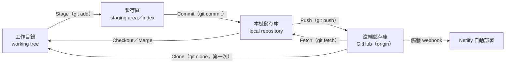
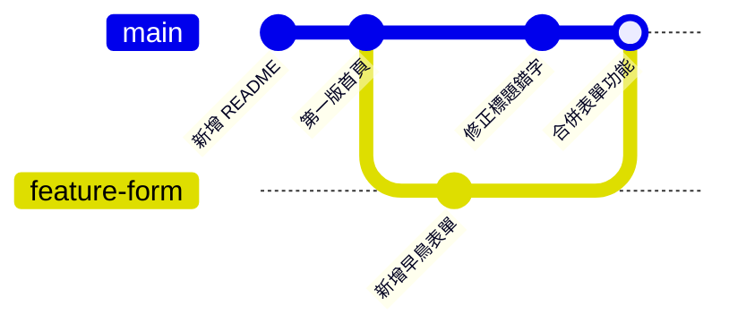
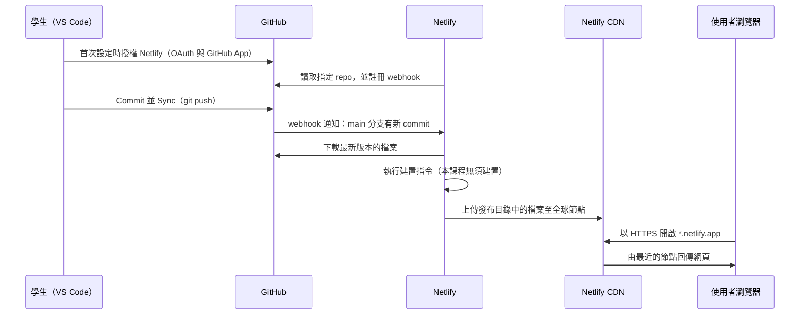
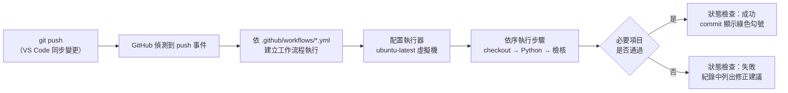

# Git、Copilot 與部署機制（深入）

> **選讀、課堂不要求。** 本篇收錄操作教學背後的原理。上課只需照著 [教學目錄](../tutorials/README.md) 中的步驟操作即可完成作業；想知道「為什麼這樣做」時再回來閱讀。

[← 回教學目錄](../tutorials/README.md)　｜　[選讀索引](README.md)　｜　[名詞解釋](../glossary.md)

對應的操作教學：[VS Code 與 GitHub Copilot 入門](../tutorials/vscode_copilot_starter.md)、[Git 與 GitHub 入門](../tutorials/git_intro.md)、[GitHub 與 Netlify 部署](../tutorials/github_netlify_deploy.md)、[以 GitHub Actions 自動檢核網站](../tutorials/vibe_check_ci.md)。

---

## 1. 編輯器、IDE 與 VS Code

### 1.1 三種工具的差別

- **文字編輯器（text editor）**：用來開啟與修改純文字檔案的軟體，例如 Windows 記事本。網頁的原始碼（HTML、CSS、JavaScript）本質上就是純文字檔。
- **程式碼編輯器（code editor）**：專為程式碼設計的編輯器，提供語法上色、自動縮排、錯誤提示、搜尋取代等功能。
- **整合開發環境（Integrated Development Environment, IDE）**：將編輯器、除錯器、終端機、版本控制、建置工具整合在同一個應用程式中的開發環境。

**Visual Studio Code（VS Code）** 是 Microsoft 開發的免費、開放原始碼程式碼編輯器，本身輕量，但可透過延伸模組（extension）擴充成接近 IDE 的功能。它在多項開發者調查中長期是使用率最高的編輯器之一。本課程選用 VS Code 的原因是：(1) 免費且跨平台；(2) 內建 Git 圖形介面，不需輸入指令即可完成版本控制；(3) GitHub Copilot 以 VS Code 為主要整合環境。

### 1.2 工作區與資料夾（Workspace／Folder）

VS Code 以「**資料夾**」為工作單位，而不是單一檔案。當你以「檔案 → 開啟資料夾」開啟一個資料夾時，該資料夾就成為目前的**工作區（workspace）**：

- 左側「檔案總管」顯示的是這個資料夾內的所有檔案。
- 「原始檔控制」面板偵測的是這個資料夾是否為 Git 儲存庫。
- Copilot 在 Agent 模式下建立或修改的檔案，會放在這個資料夾中；它能參考的專案內容，也以這個資料夾為範圍。

因此，**開錯資料夾或沒有開啟任何資料夾，是初學者最常見的問題來源**：Copilot 不知道檔案該放在哪裡，原始檔控制也找不到儲存庫。

**工作區信任（Workspace Trust）**：首次開啟資料夾時，VS Code 會詢問「是否信任此資料夾的作者」。這是安全機制：來源不明的專案可能包含會自動執行的設定或腳本。自己建立的資料夾與自己 clone 的 repo 可選擇信任；來源不明的下載檔案則應謹慎。

### 1.3 VS Code 登入 GitHub 的 OAuth 流程

在 VS Code 按「使用 GitHub 登入」時，採用的是 OAuth 授權流程：你在 GitHub 網站上確認授權，GitHub 發給 VS Code 一組存取權杖（token），VS Code 之後以此代表你存取 Copilot 與 repo，而不需要知道你的密碼。

### 1.4 Live Preview 的運作

Live Preview 會在本機啟動一個小型網頁伺服器（網址類似 `http://127.0.0.1:3000`），只有你的電腦能存取。未安裝時，直接在檔案總管雙擊 `index.html` 也能以瀏覽器開啟，網址會以 `file:///` 開頭；兩者都只有你自己看得到，要讓別人看到必須部署。

---

## 2. Git 與 GitHub 的資料模型

### 2.1 為什麼需要版本控制

沒有版本控制時，常見的做法是複製檔案並改名：`index_v2.html`、`index_最終版.html`、`index_最終版_真的final.html`。這種做法有幾個根本問題：無法得知兩個版本之間究竟改了什麼、多人同時修改時難以合併、檔案一多就無法管理，也無法可靠地回到某個「確定可以運作」的狀態。

**版本控制系統（Version Control System, VCS）** 以系統化的方式記錄檔案的每一次變更：誰、在什麼時間、改了什麼、為什麼改。

| | Git | GitHub |
| --- | --- | --- |
| 性質 | 安裝在本機的版本控制軟體 | 以 Git 為基礎的雲端代管平台（網站與服務） |
| 開發者 | 2005 年由 Linus Torvalds 為管理 Linux 核心開發而建立，開放原始碼 | GitHub 公司，2018 年起為 Microsoft 所有 |
| 儲存位置 | 你電腦中專案資料夾內的隱藏資料夾 `.git` | GitHub 的伺服器 |
| 是否需要網路 | 否，可離線 commit | 是，同步時需要 |
| 誰看得到 | 只有能存取你電腦的人 | Public repo：所有人；Private repo：你授權的人 |
| 在本課程中的用途 | 記錄每一版網頁 | 保存程式碼，並在收到新 commit 時通知 Netlify 部署 |

Git 是工具，GitHub 是使用 Git 的服務之一（其他類似服務還有 GitLab、Bitbucket）。

### 2.2 四個區域：工作目錄、暫存區、本機儲存庫、遠端儲存庫

Git 將檔案的狀態分為四個區域，每個操作都是在區域之間搬移變更：

| 區域 | 英文 | 位置 | 內容 |
| --- | --- | --- | --- |
| 工作目錄 | working tree／working directory | 你在檔案總管看到的專案資料夾 | 你目前正在編輯的檔案 |
| 暫存區 | staging area／index | `.git` 內部 | 你選定「要放進下一個 commit」的變更 |
| 本機儲存庫 | local repository | `.git` 內部 | 所有已 commit 的歷史 |
| 遠端儲存庫 | remote repository | GitHub 上 | 與他人共享、供 Netlify 讀取的歷史副本 |



**為什麼需要暫存區**：暫存區讓你可以從一堆修改中，挑選「屬於同一件事」的部分組成一個 commit。例如你同時改了標題文字與表單功能，可以分兩次 stage、兩次 commit，讓歷史紀錄更清楚。初學階段一次全部暫存也無妨，VS Code 在未暫存時按提交會詢問是否全部暫存。

VS Code 檔案旁的狀態字母：

| 標記 | 狀態 | 意義 |
| --- | --- | --- |
| **U** | Untracked | 新檔案，Git 尚未追蹤 |
| **M** | Modified | 已追蹤的檔案被修改 |
| **D** | Deleted | 已追蹤的檔案被刪除 |
| **A** | Added | 新檔案已加入暫存區 |

### 2.3 Commit：專案的快照

**commit** 是某個時間點整個專案的**快照（snapshot）**，而不只是「差異」的紀錄。每個 commit 包含：

| 組成 | 說明 |
| --- | --- |
| 快照 | 該時間點所有被追蹤檔案的內容 |
| 雜湊值（hash） | 由 commit 內容計算出的唯一識別碼，例如 `3f9a2c1e...`，通常只顯示前 7 碼。內容只要有任何不同，雜湊值就不同，因此可用來偵測竄改 |
| 作者與時間 | 來自你設定的 `user.name`、`user.email` 與 commit 當下的時間 |
| 訊息（message） | 你對這次變更的說明 |
| 父節點（parent） | 前一個 commit 的雜湊值 |

由於每個 commit 都指向它的父節點，所有 commit 串成一條歷史鏈。當有分支與合併時，一個 commit 可能有兩個父節點，整體結構在資訊科學上稱為**有向無環圖（Directed Acyclic Graph, DAG）**：箭頭只指向過去，不會形成循環。

Git 的設計哲學是**歷史只增不減**：修正錯誤的標準做法是新增一個修正的 commit（`git revert`），而不是抹除舊紀錄。因此你可以放心嘗試，先前的版本都還在。

### 2.4 分支：可移動的指標

**分支（branch）** 不是檔案的複本，而是一個**指向某個 commit 的名稱標籤**。每次在該分支上 commit，標籤就自動往前移到最新的 commit。

- 在 GitHub 建立新 repo 時，預設分支名稱通常是 **`main`**（較舊的專案常用 `master`，本課程的課程 repo 即為 `master`）。
- `HEAD` 表示「你目前所在的位置」，通常指向目前的分支。
- 本課程只使用單一分支 `main`。在實務上，團隊會為每項功能開新分支，開發完成後再透過 Pull Request 審查並合併回 `main`。



上圖示意實務上的分支與合併流程：`feature-form` 分支開發表單的同時，`main` 仍可修正錯字，之後再合併。合併產生的 commit 有兩個父節點。

### 2.5 遠端、origin 與遠端追蹤分支

- **遠端（remote）**：另一個位置的同一個 repo，本課程中就是 GitHub 上的 repo。從 GitHub clone 下來時，Git 自動將它命名為 **`origin`**。
- **遠端追蹤分支（remote-tracking branch）**：例如 `origin/main`，是本機記錄的「上次與 GitHub 溝通時，GitHub 上 `main` 的位置」。它只在與遠端通訊時更新。
- VS Code 狀態列與「同步變更」按鈕上的 **↑1 ↓0** 就是比較本機 `main` 與 `origin/main` 的結果：↑ 表示本機有、GitHub 還沒有的 commit 數；↓ 表示 GitHub 有、本機還沒有的 commit 數。

### 2.6 Push、Fetch、Pull 與 Sync

| 操作 | 方向 | 語意 |
| --- | --- | --- |
| **Clone** | GitHub → 本機（第一次） | 下載完整 repo 與歷史，並自動設定 `origin` |
| **Push（推送）** | 本機 → GitHub | 將本機新的 commit 上傳。若 GitHub 上有你本機沒有的 commit，push 會被拒絕（rejected），必須先整合對方的變更 |
| **Fetch（擷取）** | GitHub → 本機儲存庫 | 下載 GitHub 上的新 commit 並更新 `origin/main`，但**不改動**你的工作目錄 |
| **Pull（提取）** | GitHub → 本機並整合 | 等於 fetch 之後再合併（merge）或重定基底（rebase）到目前分支，工作目錄會隨之更新 |
| **Sync（同步變更）** | 雙向 | VS Code 的便利按鈕：先 pull，再 push |

**最常見的誤解**：Commit 只存在你的電腦中，GitHub 與網站都不會更新。必須完成 Push（在 VS Code 中按「同步變更」），GitHub 才會收到新 commit，Netlify 才會重新部署。

### 2.7 合併衝突（merge conflict）

**成因**：當本機與 GitHub 上各自有新的 commit，且**兩邊修改了同一個檔案的同一段內容**時，Git 無法自動判斷該保留哪一版，就會產生合併衝突。若兩邊修改的是不同檔案或同一檔案的不同段落，Git 通常能自動合併。

在本課程中，最常見的情境是：在 GitHub 網頁上直接編輯了 `README.md`，同時在本機也修改了同一檔案，然後按同步變更。

**衝突的樣貌**：Git 會在檔案中插入標記：

```
<<<<<<< HEAD
這是你本機的版本
=======
這是 GitHub 上的版本
>>>>>>> origin/main
```

**處理步驟**：

1. 不要慌張，也不要重複按同步。衝突只是 Git 請你做決定，資料沒有遺失。
2. 在原始檔控制面板的「合併變更」區找到有衝突的檔案並開啟。VS Code 會在衝突區塊上方提供 **接受目前的變更／接受傳入的變更／接受兩者** 等選項，或提供合併編輯器。
3. 決定最終內容，刪除所有 `<<<<<<<`、`=======`、`>>>>>>>` 標記並存檔。
4. 將檔案 stage（按 **＋**），再按提交完成合併，最後按同步變更。
5. 若不確定如何選擇，請停下來求助助教。

**預防方法**：開始工作前先按一次同步變更；避免在 GitHub 網頁與本機同時修改同一檔案；一個 repo 盡量只在一台電腦上編輯。

### 2.8 好的 commit：單一目的、描述清楚

**單一目的（atomic）**：一個 commit 只做一件事。好處是歷史容易閱讀，出問題時也容易找出、還原是哪一次修改造成的。

**訊息撰寫原則**：

- 第一行為**摘要行**，簡短（中文約 25 字以內、英文約 50 字元以內）說明「做了什麼」。
- 使用**祈使句**描述變更：`新增早鳥名單表單`、`修正手機版導覽列跑版`；英文慣例為 `Add waitlist form`，而非 `Added...` 或 `Adding...`。
- 需要時，空一行後再補充「為什麼」這樣改。

| 不佳的訊息 | 問題 | 較佳的訊息 |
| --- | --- | --- |
| `update` | 沒有資訊量 | `將 CTA 按鈕改為橘色以提高對比` |
| `aaa` | 無意義 | `新增早鳥名單表單` |
| `改了一些東西` | 範圍不明 | `修正手機版導覽列跑版` |
| `修改標題、加表單、換顏色` | 一次做多件事 | 拆成三個 commit |

### 2.9 .gitignore：不該進入版本控制的檔案

`.gitignore` 是放在 repo 最外層的純文字檔，列出 Git 應忽略、不追蹤的檔案或資料夾樣式。常見項目包括：

```
# 作業系統自動產生的檔案
.DS_Store
Thumbs.db

# 含有機密的環境設定檔
.env

# 套件與建置產物（本課程不會用到，實務上很常見）
node_modules/
dist/
```

注意：`.gitignore` 只對**尚未被追蹤**的檔案有效。已經 commit 過的檔案，加入 `.gitignore` 並不會把它從歷史中移除。

### 2.10 公開 repo 的資安責任

本課程的 repo 設為 **Public**，因為 Netlify 免費部署與教師檢閱都需要。這代表：

- **任何被 commit 並 push 的內容，全世界都看得到**，包括完整的歷史紀錄。即使之後刪除檔案，舊的 commit 中仍然存在。
- **絕對不要 commit 機密資訊**：密碼、API 金鑰、存取權杖、含個資的資料檔。自動化程式會持續掃描公開 repo 中外洩的金鑰；GitHub 也提供秘密掃描（secret scanning）與推送保護（push protection）協助攔截，但不能依賴它作為唯一防線。
- **若不慎外洩**：刪除檔案並不足夠，應立即到該服務撤銷（revoke）並重新產生金鑰，再處理 repo 歷史。
- **commit 中的 Email 也會公開**。若不想公開真實 Email，可至 GitHub → **Settings → Emails**，勾選 **Keep my email addresses private**，GitHub 會提供一個 `數字+帳號@users.noreply.github.com` 形式的地址，將它填入 `git config --global user.email` 即可，GitHub 仍會將 commit 正確歸屬到你的帳號。參考：[設定 commit 的 Email 地址](https://docs.github.com/zh/account-and-profile/setting-up-and-managing-your-personal-account-on-github/managing-email-preferences/setting-your-commit-email-address)。

### 2.11 還原的各種層次

| 情境 | 做法 | 說明 |
| --- | --- | --- |
| Copilot 剛修改、尚未按保留 | 在 Chat 中按 **復原（Undo）** | 變更尚未確定寫入 |
| 已保留，但尚未提交 | 原始檔控制 → **捨棄變更（Discard Changes）** | 對應 `git restore`，將工作目錄還原為最後一個 commit。無法復原 |
| 已提交 | 找到舊版內容改回來，再提交一次 | 對應 `git revert`，以新增 commit 的方式修正，歷史保持完整 |
| 網站已部署錯誤版本 | 在 Netlify 的 **Deploys** 頁面選擇先前的部署並發布 | 網站立即回到舊版，但 repo 內容不變，之後仍應修正程式碼 |

### 2.12 延伸思考

1. Git 的歷史「只增不減」。這項設計對團隊協作與稽核有什麼好處？在什麼情況下，這項特性反而會造成困擾（提示：不慎 commit 的機密）？
2. 為什麼 Git 需要暫存區，而不是直接把所有修改存成 commit？請舉一個你的專案中可以拆成兩個 commit 的例子。
3. 若兩位組員同時修改 `index.html` 的同一段標題並各自推送，會發生什麼事？團隊可以用哪些工作方式降低衝突？

---

## 3. GitHub Copilot 與大型語言模型

### 3.1 運作原理（高層次）

**GitHub Copilot** 是 GitHub 推出的 AI 程式設計助理，在 VS Code 中以程式碼補全與對話（Copilot Chat）兩種形式提供協助。

1. **大型語言模型（Large Language Model, LLM）**：Copilot 背後是以大量文字與程式碼訓練的語言模型。模型的核心能力是「根據前文，預測接下來最可能出現的文字（token）」。產生程式碼時，它是在逐段預測「在這個上下文中，最合理的程式碼是什麼」。
2. **上下文（context）**：送給模型的內容不只是你輸入的一句話，還包括 Copilot 自動收集的資訊，例如目前開啟的檔案、游標附近的程式碼、你以 `#` 指定的檔案、工作區中相關的檔案，以及先前的對話內容。上下文越完整、越精確，產出通常越符合需求。
3. **提示詞（prompt）**：你以自然語言描述的需求。明確說明目標、限制與驗收條件（例如「手機寬度下三張卡片改為上下排列」），比模糊的描述（例如「弄好看一點」）更容易得到可用的結果。
4. **回應與套用**：模型產生文字回應或檔案變更，由 VS Code 顯示為差異（diff），等待你決定保留或復原。

### 3.2 限制：它為何可能出錯

語言模型產生的是「統計上合理」的內容，而非經過驗證的正確答案。因此它可能：

- 產生語法正確但邏輯錯誤的程式碼，或與需求不符的功能。
- 引用不存在的函式、套件或設定（常稱為「幻覺」，hallucination）。
- 採用過時的寫法，或忽略安全性（例如未處理使用者輸入）。
- 在同一個需求下，每次產生的結果都不同（輸出具有隨機性）。

所以，**AI 產出的程式碼必須經過人的檢查與測試**。在本課程中，最低限度的檢查是：預覽畫面是否如預期、在手機寬度下是否正常、功能實際操作是否可用。

### 3.3 模式比較

| 模式 | 行為 | 適用情境 | 風險 |
| --- | --- | --- | --- |
| **Ask（詢問）** | 只在聊天面板中回答問題或提供程式碼片段，不會修改檔案 | 理解概念、詢問錯誤原因、請它解釋某段程式碼 | 低 |
| **Edit（編輯）**（部分版本） | 可修改你指定的檔案，但不會自主執行指令 | 針對單一檔案的修改 | 中 |
| **Agent（代理）** | 自主規劃步驟，可**建立與修改多個檔案**，也可能**提議執行終端機指令** | 依需求建立或修改網頁 | 較高：可能一次改動多處，或提議執行你不了解的指令 |

本課程不讓 Copilot 執行終端機指令，原因是：提交與同步由你自己在原始檔控制面板完成，你才能清楚掌握哪些內容被上傳；而你不了解的指令可能安裝套件、修改設定或刪除檔案。

### 3.4 方案與使用額度

| 方案 | 費用 | 說明 |
| --- | --- | --- |
| **Copilot Free** | 免費 | 每月有程式碼補全與聊天請求的次數上限；可選用的模型較少。足以完成本課程 |
| **Copilot Pro** | 付費；**通過驗證的學生可免費使用** | 額度較高、可選模型較多。學生可透過 [GitHub Education](https://education.github.com/) 申請學生身分驗證，審核需數天 |

方案內容、額度與價格會隨時間調整，請以官方 [Copilot 方案頁面](https://github.com/features/copilot/plans) 為準。

### 3.5 隱私與資料安全

使用 Copilot 時，你的提示詞與相關的檔案內容會被傳送到雲端服務進行處理。GitHub 針對不同方案有不同的資料使用政策（例如是否保留提示詞、是否用於改進產品），個人帳號可在 GitHub 的 Copilot 設定頁面調整部分選項。無論政策如何，請遵守以下原則：

- **不要在提示詞或工作區檔案中放入個人資料**：例如自己或他人的身分證字號、電話、住址、學號與成績。
- **不要放入機密資訊（secrets）**：例如密碼、API 金鑰、存取權杖（token）。這些資訊一旦進入公開 repo 或被傳送到外部服務，就應視為已外洩。
- **測試用資料請使用虛構內容**：例如「王小明、test@example.com」。
- **留意工作區範圍**：Agent 模式可讀取工作區內的檔案。請只開啟本課程的專案資料夾，不要以整個「文件」或「桌面」資料夾作為工作區。

### 3.6 負責任使用

1. **你對提交的程式碼負責。** AI 產生的內容一旦由你提交，就是你的作品，你需要能說明它大致在做什麼。
2. **理解優先於產出。** 遇到看不懂的程式碼，請改用 Ask 模式請它逐段解釋，這是本課程重要的學習方式。
3. **注意授權與出處。** AI 可能產生與既有公開程式碼相似的內容；使用圖片、字型、文案時，也應確認授權。
4. **不要用於處理真實敏感資料的正式系統，除非經過專業審查。** Vibe coding 適合原型與最小可行產品（MVP）；涉及金流、個資的正式產品需要專業工程師檢視安全性。
5. **遵守課程的學術誠信規範。** 反思與心得等文字作業應反映你自己的思考。

### 3.7 延伸思考

1. 同一段提示詞送出兩次，Copilot 可能產生不同的程式碼。這對「驗收」有什麼影響？你會如何確認結果符合需求？
2. Agent 模式能自主修改多個檔案並提議執行指令。便利性與可控性之間，你會如何取捨？在什麼情況下你會選擇 Ask 模式？
3. 若你的創業產品未來要處理使用者個資，哪些部分你會交給 AI 產生，哪些部分你認為必須由專業人員審查？

---

## 4. Netlify 部署的內部機制

### 4.1 什麼是部署、靜態網站

**部署（deploy）** 是將軟體從開發環境搬到正式執行環境，使目標使用者能夠存取的過程。對網站而言，就是把檔案放到一台隨時連網、具有公開位址的伺服器上，並讓網域名稱指向它。

本課程的網站屬於**靜態網站（static site）**：伺服器只需將 HTML、CSS、JavaScript、圖片等檔案原封不動地傳給瀏覽器，所有互動都在使用者的瀏覽器中執行。與之相對的是**動態網站**，伺服器會在每次請求時執行程式、查詢資料庫、再產生網頁。靜態網站的優點是速度快、成本低、攻擊面小；限制是無法在伺服器端保存資料或執行商業邏輯，這正是第 2 週要以 Netlify Forms（後端即服務）與 LocalStorage 補足的部分。

### 4.2 Netlify 在匯入專案時做了什麼

**Netlify** 是提供網站託管與自動部署的雲端平台，屬於平台即服務（Platform as a Service, PaaS）的一種。



1. **授權連接 GitHub**：首次匯入時，你會經過兩道授權。其一是 **OAuth 授權**，讓 Netlify 以你的身分列出 repo；其二是安裝 **Netlify 的 GitHub App**，並選擇它可以存取哪些 repo。建議只授權需要部署的 repo，這符合**最小權限原則（principle of least privilege）**：系統只取得完成任務所需的最低權限，萬一被濫用，影響範圍也最小。
2. **註冊 webhook**：**webhook** 是一種「事件發生時主動通知」的機制。Netlify 在 GitHub 上登記一個接收網址，之後每當指定分支收到 push，GitHub 就會對該網址發送 HTTP 請求，通知 Netlify 有新版本。這比 Netlify 每隔幾分鐘去詢問「有沒有更新」更即時，也更節省資源。
3. **建置（build）**：許多現代網站需要先經過編譯、打包等步驟，才能產出瀏覽器可直接使用的檔案，此步驟稱為建置。本課程只有單一 HTML 檔，**不需要建置**，所以建置指令留空。
4. **上傳至內容傳遞網路（Content Delivery Network, CDN）**：Netlify 將發布目錄中的檔案複製到分布於世界各地的伺服器節點。使用者連線時，由地理位置較近的節點回應，降低延遲，也分散流量。
5. **指派子網域與 HTTPS**：Netlify 為專案指派 `專案名稱.netlify.app` 子網域，並自動提供 TLS 憑證，使網站可透過 **HTTPS** 加密連線存取。HTTPS 可防止傳輸內容被竊聽或竄改，也是現代瀏覽器許多功能的前提。
6. **原子化部署（atomic deploy）與歷史版本**：每次部署都是一份完整、獨立的快照，只有在全部檔案上傳完成後才切換為正式版本，使用者不會看到「一半新、一半舊」的網站。舊的部署會被保留，可一鍵回復。

### 4.3 發布目錄與 index.html

- **發布目錄（publish directory）**：Netlify 要把 repo 中的哪個資料夾當作網站根目錄對外發布。留空時代表 repo 的最外層。使用建置工具的專案通常會設為 `dist` 或 `build` 等輸出資料夾。
- **首頁檔名**：當使用者開啟 `https://xxx.netlify.app/`（網址結尾沒有檔名）時，網頁伺服器依慣例回傳該目錄下的 `index.html`。因此首頁必須命名為 `index.html`（全小寫），並放在發布目錄的最外層。
- **大小寫敏感**：Netlify 的伺服器區分檔名大小寫，`Index.html` 與 `index.html` 是不同的檔案。Windows 與 macOS 的檔案系統預設不區分大小寫，因此在本機預覽正常、部署後卻找不到頁面，是常見問題。

### 4.4 自訂網域與 DNS

若希望使用自己的網域（例如 `rentradar.tw`），需要：

1. 向網域註冊商（registrar）購買網域，通常以年計費。
2. 設定**網域名稱系統（Domain Name System, DNS）**：DNS 是將人類可讀的網域名稱轉換為伺服器位址的分散式系統。你需要在 DNS 中新增記錄（例如 CNAME 記錄），將網域指向 Netlify；或將網域的名稱伺服器（name server）改為 Netlify DNS。
3. 在 Netlify 的 **Domain management** 中新增自訂網域，Netlify 會自動為其申請 TLS 憑證。

DNS 記錄的變更需要時間在全球傳播，可能數分鐘到數小時才生效。官方說明：[Netlify：網域入門](https://docs.netlify.com/manage/domains/get-started-with-domains/)。

### 4.5 延伸思考

1. 本課程的網站由 Netlify 託管、GitHub 保存程式碼、使用者透過 CDN 存取。若 Netlify 停止服務或大幅調漲價格，你的產品會受到什麼影響？這種「平台依賴」風險應如何評估？
2. 安裝 Netlify App 時選擇 All repositories 與 Only select repositories，各有什麼便利性與風險？
3. 靜態網站無法在伺服器端保存資料。請列出你的創業題目中，哪些功能可以用靜態網站完成，哪些一定需要後端服務。

---

## 5. GitHub Actions 的組成

**持續整合（Continuous Integration, CI）** 的核心做法是：每次有人提交程式碼，就自動執行一系列檢查（編譯、測試、程式碼風格檢查等），盡早發現問題。在軟體公司中，CI 通常與程式碼審查結合：Pull Request 必須通過所有自動檢查，才允許合併進主分支。

**GitHub Actions** 是 GitHub 內建的自動化平台，公開 repo 可免費使用標準的執行器。

| 術語 | 英文 | 說明 | 在本課程範本中的對應 |
| --- | --- | --- | --- |
| 工作流程檔 | workflow file | 以 YAML 格式撰寫的設定檔，必須放在 repo 的 `.github/workflows/` 資料夾中 | `.github/workflows/vibe-check.yml` |
| 觸發條件 | trigger（`on:`） | 定義在什麼事件發生時執行，例如 push、Pull Request、排程或手動 | `push`（每次推送）與 `workflow_dispatch`（在 Actions 分頁手動執行） |
| 執行器 | runner | 實際執行工作的機器。GitHub 提供的執行器是每次全新建立的雲端虛擬機，執行完即銷毀 | `runs-on: ubuntu-latest`（Linux 虛擬機） |
| 工作 | job | 在同一個執行器上依序執行的一組步驟；一個工作流程可以有多個工作 | `vibe-check` |
| 步驟 | step | 工作中的單一動作：執行一行指令（`run:`），或使用他人寫好的動作（`uses:`） | 下載程式碼、安裝 Python、下載檢核腳本、產生報告、執行檢查 |
| 執行紀錄 | logs | 每個步驟的輸出內容，用於除錯 | 在 Actions 分頁點開每個步驟即可查看 |
| 狀態檢查 | status check | 工作流程的結果（成功、失敗、執行中）會標示在對應的 commit 上 | commit 旁顯示綠色勾號或紅色叉號 |



**範本的五個步驟**（[tools/ci/vibe-check.yml](../../tools/ci/vibe-check.yml)）：

1. **下載程式碼**（`actions/checkout`）：將你 repo 的檔案複製到執行器上。
2. **安裝 Python**（`actions/setup-python`）：檢核腳本以 Python 撰寫。
3. **下載檢核腳本**：從課程 repo 取得最新版的 [tools/ci/vibe_check.py](../../tools/ci/vibe_check.py)。
4. **產生報告**：將檢核結果寫入執行頁面的 Summary 區，此步驟不論結果都不會失敗。
5. **正式檢查**：依 `LEVEL` 執行檢查，必要項目未通過時此步驟失敗，整個工作流程標示為失敗。

**最小權限設定**：範本中宣告 `permissions: contents: read`，表示這個工作流程只能讀取 repo 內容，無法修改程式碼或其他設定。

**與 Netlify 的關係**：GitHub Actions 與 Netlify 部署是兩條獨立的流程，都由同一次 push 觸發。檢核失敗**不會**阻止 Netlify 部署；它的作用是提示你網頁尚未符合標準。在實務上，團隊可以設定「檢查通過才允許合併或部署」，形成品質閘門（quality gate）。

**延伸思考**：

1. 自動化檢查只能驗證「可被規則描述」的項目（例如是否有表單、是否宣告 viewport）。哪些品質面向無法以自動化檢查驗證，仍需要人工判斷？
2. 若將「檢查通過」設為部署的前提條件，對開發速度與網站穩定性各有什麼影響？
3. 範本在執行時從課程 repo 下載最新的檢核腳本。從資安角度來看，執行從外部下載的程式碼有什麼風險？實務上可以如何降低風險（提示：固定版本）？

---

## 6. 參考資料

- [VS Code：Copilot 總覽](https://code.visualstudio.com/docs/copilot/overview)｜[Copilot Chat](https://code.visualstudio.com/docs/copilot/chat/copilot-chat)｜[提示詞撰寫技巧](https://code.visualstudio.com/docs/copilot/chat/prompt-crafting)｜[Workspace Trust](https://code.visualstudio.com/docs/editing/workspaces/workspace-trust)
- [GitHub Copilot 文件](https://docs.github.com/zh/copilot)
- [Pro Git 電子書（繁體中文）](https://git-scm.com/book/zh-tw/v2)，特別是第 1–3 章；第 10 章說明 Git 的內部資料結構
- [GitHub Docs：關於合併衝突](https://docs.github.com/zh/pull-requests/collaborating-with-pull-requests/addressing-merge-conflicts/about-merge-conflicts)
- [Git 官方文件：gitignore](https://git-scm.com/docs/gitignore)
- [Learn Git Branching：視覺化練習分支操作](https://learngitbranching.js.org/?locale=zh_TW)
- [Netlify：從 Git 儲存庫部署](https://docs.netlify.com/start/quickstarts/deploy-from-repository/)｜[GitHub Docs：關於 webhook](https://docs.github.com/zh/webhooks/about-webhooks)｜[MDN：CDN](https://developer.mozilla.org/zh-TW/docs/Glossary/CDN)｜[MDN：HTTPS](https://developer.mozilla.org/en-US/docs/Glossary/HTTPS)
- [GitHub Actions 文件](https://docs.github.com/zh/actions)｜[Red Hat：什麼是 CI/CD](https://www.redhat.com/zh/topics/devops/what-is-ci-cd)
