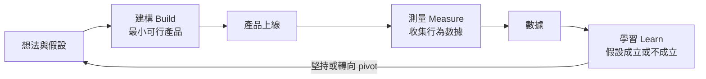

# 精實創業、MVP 與指標（深入閱讀）

選讀、課堂不要求。本頁收錄第 2 週原本放在講義中的觀念說明，適合想進一步了解「為什麼要先做早鳥名單」的同學。課堂操作請看 [第 2 週手把手實作](../../lectures/wk02_1014_baas-cicd/README.md)。

---

## 1. 前端與後端的分工

第 1 週以「美食街」比喻說明架構：前端是店面裝潢，後端是廚房與倉庫。以下改用精確的技術描述。

| 面向 | 前端（frontend） | 後端（backend） |
| --- | --- | --- |
| 執行位置 | 使用者的瀏覽器 | 服務提供者控制的伺服器 |
| 主要技術 | HTML（結構）、CSS（外觀）、JavaScript（互動） | 伺服器程式（如 Node.js、Python）、資料庫、應用程式介面（Application Programming Interface, API） |
| 主要責任 | 呈現畫面、接收輸入、基本的輸入格式檢查 | 接收並驗證資料、執行商業規則、永久保存資料、身分驗證與授權 |
| 可信任程度 | **不可信任**：程式碼完全公開，使用者可以用開發者工具任意修改 | 可信任：程式碼與資料由營運者控制 |
| 本課程對應 | 你用 Copilot 產生的 `index.html` | Netlify Forms（代管的後端） |

關鍵觀念是「前端不可信任」。瀏覽器裡的 JavaScript 可以被使用者檢視、修改或略過，因此凡是涉及金錢、權限或資料正確性的檢查，最終都必須在後端再做一次。前端的「必填」檢查只是改善使用體驗，不是安全機制。

## 2. 後端與資料庫實際做什麼

當使用者在一般網路服務按下「送出」時，後端大致依序完成下列工作：

1. **接收請求**：瀏覽器以 HTTP（HyperText Transfer Protocol）送出請求，後端在指定網址（端點，endpoint）等待。
2. **驗證**：檢查欄位是否齊全、格式是否正確、是否為機器人或惡意輸入。
3. **執行商業邏輯**：例如判斷是否重複報名、計算名次、寄送確認信。
4. **持久化（persistence）**：寫入資料庫，使資料在伺服器重啟、使用者關閉瀏覽器後依然存在，並可被多位使用者、多台裝置共同存取。
5. **回應**：告訴瀏覽器成功或失敗，前端再據此更新畫面。

資料庫除了「存起來」，還提供查詢（例如篩選出所有研究生）、並行控制（多人同時寫入時資料不錯亂）、備份與權限管理。自行建置這些能力需要的技術如下：

| 工作 | 需要的知識 | 持續成本 |
| --- | --- | --- |
| 租用與設定伺服器 | Linux、雲端主機、網路設定 | 主機費用、系統更新 |
| 撰寫接收資料的 API | 後端程式語言、HTTP | 功能變更時需維護 |
| 設計資料庫 | SQL、資料模型 | 備份、效能調校 |
| 資訊安全與個資保護 | 輸入驗證、加密、存取控制、法規 | 持續進行，沒有終點 |

對一個尚未證明有人需要的產品而言，這些投入的風險很高。這正是下一節精實創業要處理的問題。

## 3. 精實創業：先驗證需求，再投入建置

精實創業由 Eric Ries 在 2011 年出版的 *The Lean Startup* 中系統化提出，核心主張是：新創事業面對的最大風險通常不是「做不出來」，而是「做出來卻沒有人要」。因此應以最低成本、最短時間取得關於市場的可靠證據。

**核心術語：**

- **建構—測量—學習（Build–Measure–Learn）循環**：衡量進度的標準是跑完一圈所需的時間，而不是寫了多少程式。
- **經過驗證的學習（validated learning）**：以真實使用者的**行為**（而不是意見或讚美）證明某個假設成立或不成立。
- **可被否證的假設（falsifiable hypothesis）**：假設必須寫成「可能被數據推翻」的形式。
  - 不佳：「大學生會喜歡我的二手教科書平台。」（無法被推翻）
  - 較佳：「在分享給 30 位北大大一新生後的 7 天內，至少 20% 會留下 Email 加入候補名單。」（對象、行為、門檻、期限皆明確）
- **最小可行產品（Minimum Viable Product, MVP）**：能夠完成一次「建構—測量—學習」循環所需的最小產品，重點在「可學習」，而非「功能最少」。

### 3.1 常見的 MVP 類型

| 類型 | 做法 | 驗證的問題 | 限制 |
| --- | --- | --- | --- |
| 著陸頁煙霧測試（landing-page smoke test） | 產品尚未存在，只做一頁介紹與報名表單，觀察有多少人留下聯絡方式 | 需求是否存在、價值主張是否吸引人 | 留下 Email 的成本很低，不代表願意付費 |
| 禮賓式 MVP（concierge MVP） | 以人工方式、一對一為早期使用者提供服務，使用者知道是人工進行 | 解決方案是否真的解決問題、使用者在意哪些環節 | 無法規模化，樣本小 |
| 綠野仙蹤式 MVP（Wizard of Oz MVP） | 使用者看到的是看似自動化的產品，背後其實由人工完成 | 使用者是否會實際使用完整流程 | 需注意對使用者的透明度與倫理 |

### 3.2 案例（謹慎描述）

Ries 在書中描述，Dropbox 在產品尚未公開時，由創辦人 Drew Houston 製作一段示範影片說明產品概念，影片發布後，Beta 版候補名單據報導在一夜之間從約 5,000 人增加到約 75,000 人（參見 [TechCrunch 的報導](https://techcrunch.com/2011/10/19/dropbox-minimal-viable-product/)）。這個案例常被用來說明「以影片或著陸頁驗證需求」，但應注意兩點：其一，它是事後回顧的成功案例，存在倖存者偏差（survivorship bias），許多做了同樣測試卻失敗的案例不會被報導；其二，當時的目標受眾（技術社群）與產品高度吻合，並非任何產品都能得到類似結果。

第 2 週製作的「早鳥候補名單」正是著陸頁煙霧測試：以一個前端頁面加上 BaaS 表單，在幾乎沒有後端開發成本的情況下取得需求證據。

## 4. 為候補名單定義成功指標

在分享網址之前，就應先寫下成功的標準，否則容易在看到數據後才調整標準、自我說服。

| 指標 | 定義 | 取得方式與注意事項 |
| --- | --- | --- |
| 不重複訪客數（unique visitors） | 一段期間內造訪頁面的不同使用者數 | 需要網站分析工具，部分服務為付費功能；課堂上可暫以「分享給多少位目標使用者」作為近似分母，並在報告中註明是近似值 |
| 轉換率（conversion rate） | 報名人數 ÷ 不重複訪客數 | 例如 40 位訪客中有 6 位報名，轉換率為 15%；分母不準確時，轉換率也不準確 |
| 質性訊號（qualitative signals） | 「最期待的功能」欄位內容、使用者主動詢問、願意轉介他人 | 樣本小時，質性資料往往比數字更有資訊量 |

**需要警惕的陷阱：**

- **虛榮指標（vanity metrics）**：看起來很漂亮、卻無法支持決策的數字，例如累計瀏覽次數、按讚數。判斷方式是問：「這個數字變動時，我會做出不同的決定嗎？」
- **樣本偏差**：同學互填的資料只能證明表單**技術上可運作**，不能證明市場需求。同學出於禮貌而填寫、且多數不是目標使用者，這是典型的便利抽樣（convenience sampling）偏差。課後的延伸任務「市場驗證：5 位非同學的目標使用者」即是為了取得較有意義的訊號。
- **低承諾行為**：留下 Email 的成本很低。若要驗證付費意願，需要更高承諾的行為，例如預購、訂金或排定訪談。

### 4.1 練習：寫出自己的假設

1. 我的產品：＿＿＿＿＿＿＿＿＿＿
2. 將假設寫成可被否證的形式：「在分享給＿＿＿位〔目標使用者〕後的＿＿＿天內，至少＿＿＿％會〔具體行為〕。」
3. 若結果**低於**門檻，我會採取什麼行動（例如修改價值主張、換目標客群、放棄此方向）？
4. 我要如何估計不重複訪客數（分母）？這個估計有什麼誤差來源？
5. 下列哪些是虛榮指標？(a) 網頁累計瀏覽次數　(b) 目標使用者的報名轉換率　(c) 分享貼文的按讚數　(d) 「最期待功能」欄位中重複出現的需求

## 5. 後端即服務（BaaS）的取捨

BaaS（Backend as a Service，後端即服務）是指由雲端供應商代管後端的常用功能，例如資料儲存、表單收集、身分驗證、檔案儲存，開發者透過設定或 API 直接使用，不需自行維護伺服器。常見服務包括 Netlify Forms、Firebase、Supabase。

在本課程中，Netlify Forms 的做法是：在 HTML 表單加上 `data-netlify="true"` 屬性，Netlify 在部署時偵測到這個表單，並自動建立接收端點與後台。機制細節見 [表單、儲存與 CI/CD 深入閱讀](forms_storage_cicd.md)。

| 面向 | 好處 | 代價與風險 |
| --- | --- | --- |
| 開發速度 | 從數週縮短為數分鐘，適合驗證階段 | 功能受限於供應商提供的範圍，難以客製商業邏輯 |
| 營運成本 | 免費或低價方案即可起步，不需自行維運 | 用量超過免費額度（quota）後的費用，需事先查閱 [Netlify 價格頁面](https://www.netlify.com/pricing/) |
| 供應商鎖定（vendor lock-in） | — | 表單語法、資料格式與特定平台綁定，日後遷移需改寫 |
| 資料所有權與匯出 | 供應商負責備份與可用性 | 資料存放在第三方伺服器（可能位於境外）；應確認能否完整匯出（Netlify Forms 可匯出 CSV）與刪除 |
| 資訊安全 | 由專業團隊維護基礎設施 | 帳號安全仍是你的責任；個資保護的法律義務不會因使用第三方服務而移轉 |

合理的策略是：驗證階段使用 BaaS 以求速度，當需求被證實、功能需求超出 BaaS 能力時，再評估遷移至可客製的後端（例如 Supabase 或自建 API）。

## 6. 討論與延伸思考

1. 你的候補名單若在一週內只有 2 筆來自目標使用者的報名，這代表「需求不存在」、「價值主張寫得不好」，還是「觸及的人太少」？你需要什麼額外資料才能區分這三種解釋？
2. 若將 Netlify Forms 換成自建後端，你會得到什麼、失去什麼？在產品生命週期的哪個時點值得做這個轉換？
3. 綠野仙蹤式 MVP 讓使用者以為是自動化服務。在什麼條件下這樣做是可以接受的？何時會構成誤導？
4. **前端不可信任**：某同學的表單在前端設定了「Email 必填」。為什麼這不足以保證後台每筆資料都有 Email？真正的保證應該放在哪裡？
5. **BaaS 的取捨**：假設你的產品驗證成功，三個月後有 5,000 位使用者。請列出兩個可能促使你離開 Netlify Forms 的理由，以及遷移時需要處理的資料問題。
6. **AI 生成程式碼的責任**：Copilot 產生的表單若漏掉 `name` 屬性，導致兩天的報名資料遺失，責任在誰？你可以建立什麼流程來預防？
7. **社會認同與誠信**：在頁面上顯示報名人數或推薦語會影響使用者判斷。課堂展示時使用示意內容須明確標示；對外公開時應使用真實數據與經同意的真實回饋，捏造人數或推薦語屬於誤導行為，也會污染你自己的驗證數據。

## 7. 延伸學習

- 比較 [Supabase](https://supabase.com/) 與 [Firebase](https://firebase.google.com/) 如何提供真正的會員系統，思考下一個需要加入的架構元件。
- 延伸任務「市場驗證：5 位非同學的目標使用者」：將網址分享給 5 位符合目標客群、非本課程同學的人，記錄報名數與質性回饋。

## 8. 參考資料

- Ries, E. (2011). *The Lean Startup*. Crown Business. 原則摘要：[The Lean Startup — Principles](https://theleanstartup.com/principles)
- Y Combinator：[How to Build an MVP](https://www.ycombinator.com/library/Io-how-to-build-an-mvp)
- Netlify Docs：[Forms setup](https://docs.netlify.com/manage/forms/setup/)
- 其他資源：[延伸學習資源](../resources.md)、[名詞解釋](../glossary.md)

---

相關選讀：[表單、儲存與 CI/CD 深入閱讀](forms_storage_cicd.md)
