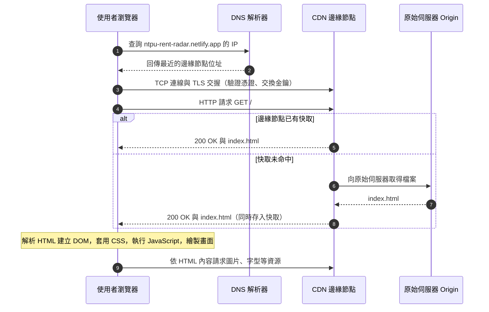
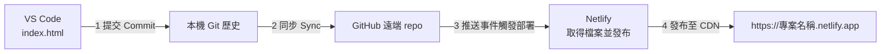

# SaaS 模式與網站運作（深入選讀）

> 選讀、課堂不要求。本篇收錄第 1 週原本的核心閱讀全文，以及課堂講義中移出的概念說明（Git、Copilot、Netlify、提示詞設計），供想了解原理的同學課後閱讀。
> 課堂用的簡明版：[自建或使用雲端服務：我們的網站由哪四塊組成](../../lectures/wk01_1007_saas-storefront/saas_architecture.md)　｜　大型平台的深入說明：[社群媒體系統設計深入](social_media_systems.md)　｜　[回第 1 週手把手實作](../../lectures/wk01_1007_saas-storefront/README.md)

---

## 學習目標

讀完本篇後，你應能：

1. **描述**軟體交付模式從套裝授權、應用服務供應商（ASP）到 SaaS 的演變，以及每次轉變背後的技術與商業原因。
2. **區分** IaaS、PaaS、SaaS 三種雲端服務模式，並以責任分擔表說明各層由誰管理。
3. **計算**一個簡化 SaaS 案例的 MRR、ARR、LTV 與 LTV/CAC，並解釋邊際成本為何偏低。
4. **說明**從在瀏覽器輸入網址到畫面出現之間，DNS、TCP／TLS、HTTP、CDN 與瀏覽器渲染各自扮演的角色。
5. **比較**靜態網站（Jamstack）與伺服器端動態網站的差異，並指出 Netlify 在其中的位置。
6. **評估**新創在「自建」與「購買服務」之間的取捨，並將本課程使用的工具對應到各架構層。

---

## 1. 軟體交付模式的演進

### 1.1 套裝軟體與本地部署（Packaged / On-premises）

1980 至 2000 年代，商用軟體主要以「授權（license）」形式販售：客戶購買光碟或下載安裝檔，取得在特定電腦上使用的權利。企業級軟體（例如會計、ERP 系統）則安裝在客戶自己的機房，稱為**本地部署（on-premises）**。

此模式的特徵：

- **收費**：一次性授權費，另加每年約定比例的維護費；大版本升級通常需要再付費。
- **維運責任**：安裝、更新、備份、硬體採購都由客戶負責，企業通常需要自己的 IT 部門。
- **版本分裂**：不同客戶停留在不同版本，軟體廠商必須同時支援多個舊版本。
- **資料位置**：資料存在客戶端，廠商無法直接觀察使用情形。

### 1.2 應用服務供應商（Application Service Provider, ASP）

1990 年代後期網際網路普及，出現了 ASP：由供應商代管軟體，客戶透過網路連線使用。然而當時多數 ASP 只是**替每位客戶各自架設一套傳統軟體**（single-tenant hosting），成本結構與本地部署差異不大；加上頻寬有限、網頁技術尚不成熟，許多 ASP 在 2000 年前後的網路泡沫破滅中退場。

### 1.3 軟體即服務（Software as a Service, SaaS）

2000 年代起，以瀏覽器為介面、從設計之初就讓**所有客戶共用同一套系統**的軟體逐漸成熟。常被引用的早期案例是 1999 年成立、以網頁提供客戶關係管理（CRM）服務的 Salesforce。2010 年代，連傳統套裝軟體廠商也陸續轉型，例如 Microsoft 推出 Office 365、Adobe 自 2013 年起將 Creative Suite 轉為訂閱制的 Creative Cloud。

SaaS 能取代 ASP，關鍵在於三項條件同時成熟：寬頻與行動網路普及、瀏覽器能執行複雜應用程式（JavaScript 與相關網頁標準），以及雲端運算讓供應商能按需租用運算資源。

| 面向 | 套裝／本地部署 | ASP | SaaS |
| --- | --- | --- | --- |
| 軟體在哪裡執行 | 客戶電腦或機房 | 供應商機房，每位客戶一套 | 供應商雲端，所有客戶共用一套 |
| 收費方式 | 一次性授權＋維護費 | 月費或年費 | 訂閱（按人數、用量或方案） |
| 更新 | 客戶自行安裝 | 供應商逐一更新 | 供應商持續部署，所有人同時更新 |
| 客戶端需求 | 安裝程式、相容硬體 | 專用客戶端或瀏覽器 | 瀏覽器或行動 App |
| 典型例子 | 早期的 Office 光碟版、單機遊戲 | 1990 年代末的代管 ERP | Google Workspace、Canva、Notion、Netflix |

---

## 2. SaaS 的定義性特徵

**SaaS** 指供應商在自己管理的基礎設施上執行軟體，使用者透過網路（瀏覽器或 App）存取；使用者不管理底層的伺服器、作業系統與儲存空間。美國國家標準暨技術研究院（NIST）對雲端運算的定義（SP 800-145）即以此描述 SaaS。實務上，SaaS 產品通常具有以下五項特徵：

1. **多租戶（multi-tenancy）**：所有客戶（租戶，tenant）共用同一套應用程式與基礎設施，彼此資料在邏輯上隔離。好處是維運一套系統就能服務大量客戶；代價是隔離設計若有瑕疵，可能造成跨租戶資料外洩，且單一故障會同時影響所有客戶。
2. **訂閱制定價（subscription pricing）**：以月或年為週期收費，常見形式包括按使用者人數（per seat）、按用量（usage-based），以及「免費增值（freemium）」：基本功能免費、進階功能付費。
3. **持續交付（continuous delivery）**：供應商可隨時更新伺服器上的程式，使用者重新整理頁面就取得新版本，不需要下載安裝。這使得「小步快跑、頻繁改版」成為可能，也是第 2 週持續部署（CI/CD）的基礎。
4. **資料集中（centralized data）**：資料存放在供應商端，使用者可在任何裝置上接續工作；供應商也能分析使用行為以改善產品。相對地，資料安全、隱私與法規遵循的責任也集中到供應商身上。
5. **透過瀏覽器或 App 存取**：客戶端只負責呈現與互動，運算與儲存大多在伺服器端完成。

---

## 3. 雲端服務模式：IaaS、PaaS、SaaS

雲端服務依「供應商代管到哪一層」分為三種模式：

- **基礎設施即服務（Infrastructure as a Service, IaaS）**：租用虛擬機器、儲存空間與網路。例：Amazon Web Services（AWS）EC2、Google Compute Engine、Microsoft Azure Virtual Machines。
- **平台即服務（Platform as a Service, PaaS）**：租用一個可以直接放程式的執行平台，作業系統、執行環境與擴充由供應商處理。例：Netlify、Vercel、Heroku、Google App Engine。
- **軟體即服務（SaaS）**：直接使用完整的應用程式。例：Gmail、Canva、Slack。

### 3.1 責任分擔表

雲端供應商普遍以「責任分擔模型（shared responsibility model）」說明各方的管理範圍。下表以「誰負責管理」區分（「客戶」指租用服務的企業或開發者）：

| 層級 | 本地部署 | IaaS | PaaS | SaaS |
| --- | --- | --- | --- | --- |
| 資料（Data） | 客戶 | 客戶 | 客戶 | 客戶（內容與存取權限） |
| 應用程式（Application） | 客戶 | 客戶 | 客戶 | 供應商 |
| 執行環境（Runtime） | 客戶 | 客戶 | 供應商 | 供應商 |
| 作業系統（OS） | 客戶 | 客戶 | 供應商 | 供應商 |
| 虛擬化與硬體（Hardware） | 客戶 | 供應商 | 供應商 | 供應商 |
| 實體機房、電力、網路 | 客戶 | 供應商 | 供應商 | 供應商 |

兩點值得注意：

- **資料責任永遠不會完全轉移。** 即使使用 SaaS，誰可以存取資料、是否上傳敏感資訊、帳號密碼是否外洩，仍是使用者的責任。
- **越往右，控制權越少、維運負擔也越少。** 選擇哪一種模式，本質上是在「控制權」與「專注於核心業務」之間取捨。

本課程中，Netlify 屬於 PaaS（對開發者而言它也以 SaaS 形式提供管理介面）；你的學生網站對最終使用者而言則是一個小型 SaaS 產品的前端。

---

## 4. SaaS 的單位經濟學（Unit Economics）

單位經濟學是以「一位客戶」為單位，分析取得與服務他的成本是否能被他帶來的收入回收。以下是 SaaS 最常見的指標，以白話說明：

| 指標 | 全名 | 意義 |
| --- | --- | --- |
| MRR | 月經常性收入（Monthly Recurring Revenue） | 每月可預期、會持續發生的訂閱收入總和，不含一次性收入 |
| ARR | 年經常性收入（Annual Recurring Revenue） | MRR × 12，常用於年約型企業客戶 |
| ARPU | 每用戶平均收入（Average Revenue Per User） | MRR ÷ 付費用戶數 |
| 流失率（Churn rate） | — | 某期間內取消訂閱的客戶比例；月流失率 3% 表示每月約有 3% 的客戶離開 |
| CAC | 客戶取得成本（Customer Acquisition Cost） | 行銷與業務總支出 ÷ 同期新增的付費客戶數 |
| 毛利率（Gross margin） | — | （收入 − 直接服務成本）÷ 收入；直接成本包括伺服器、第三方服務、客服 |
| LTV | 客戶終身價值（Customer Lifetime Value） | 一位客戶在整個訂閱期間帶來的毛利；簡化公式：ARPU × 毛利率 ÷ 月流失率 |
| LTV/CAC | — | 每花 1 元取得客戶能換回多少毛利；業界常以 3 以上作為健康的經驗法則 |

### 4.1 為什麼 SaaS 的邊際成本低

**邊際成本（marginal cost）**是「多服務一位客戶所增加的成本」。販賣便當時，每多賣一份就要多一份食材與人工；SaaS 的主要成本是**開發**（寫一次程式），而多一位使用者只增加少量的運算、儲存與頻寬費用。因此 SaaS 常見較高的毛利率。

但「邊際成本低」不等於「零」：影音串流的頻寬、AI 服務的運算、客服人力都會隨用戶增加；免費用戶也會產生成本。這也是許多 AI 產品的毛利率明顯低於傳統 SaaS 的原因之一。

### 4.2 計算範例（假設性數字，僅供練習）

> 以下數字為教學用的**假設情境**，不代表任何真實公司。

某校園租屋評價平台推出進階會員，月費 NT$99：

- 付費會員 1,000 人 → **MRR** = 99 × 1,000 = NT$99,000；**ARR** = NT$1,188,000。
- 伺服器、第三方服務與客服等直接成本占收入 20% → **毛利率** 80%；每位會員每月毛利 = 99 × 0.8 = NT$79.2。
- 每月有 3% 會員取消 → **平均訂閱期間** ≈ 1 ÷ 0.03 ≈ 33 個月。
- **LTV** ≈ 79.2 × 33.3 ≈ NT$2,640。
- 投放社群廣告，平均每取得 1 位付費會員花費 NT$600 → **CAC** = NT$600。
- **LTV/CAC** ≈ 2,640 ÷ 600 ≈ 4.4；**CAC 回收期** ≈ 600 ÷ 79.2 ≈ 7.6 個月。

解讀：若流失率升到 8%，平均訂閱期間降到約 12.5 個月，LTV 約 NT$990，LTV/CAC 降到約 1.65，同樣的廣告支出就難以回本。這說明為什麼 SaaS 公司非常重視**留存（retention）**：降低流失率往往比增加新客更有效。

---

## 5. 打開一個網址時發生了什麼

以在手機瀏覽器輸入 `https://ntpu-rent-radar.netlify.app` 為例，整個過程可分為五個階段：

1. **網域名稱解析（Domain Name System, DNS）**：瀏覽器先查詢本機快取，沒有結果時向 DNS 解析器詢問該網域對應的 IP 位址。DNS 的角色類似電話簿，把人記得住的名稱轉換成機器使用的位址。
2. **建立連線（TCP 與 TLS）**：瀏覽器與伺服器透過傳輸控制協定（Transmission Control Protocol, TCP）建立可靠連線，再以傳輸層安全協定（Transport Layer Security, TLS）交換金鑰並驗證憑證。網址開頭的 `https` 即表示連線經過 TLS 加密，第三方無法讀取或竄改傳輸內容。（較新的 HTTP/3 改用基於 UDP 的 QUIC，但概念相同。）
3. **HTTP 請求與回應**：瀏覽器送出超文本傳輸協定（Hypertext Transfer Protocol, HTTP）請求，例如 `GET /`；伺服器回傳狀態碼（`200 OK`、`404 Not Found` 等）與內容。
4. **內容傳遞網路（Content Delivery Network, CDN）**：Netlify 等託管服務會把網站檔案複製到分布在世界各地的邊緣節點（edge）。DNS 通常會把使用者導向較近的節點；若該節點已有快取（cache hit），便直接回應，不必回到原始伺服器（origin），因此延遲較低，也能分散流量。
5. **瀏覽器解析與渲染**：瀏覽器解析 HTML 建立文件物件模型（Document Object Model, DOM），下載並套用 CSS 計算版面，執行 JavaScript 加入互動，最後把像素繪製到螢幕。HTML 中引用的每張圖片、字型與腳本，都會再觸發額外的請求。

這個流程說明了第 3 週之後常見的幾個現象：第一次開啟較慢、重新整理較快（快取）；網站更新後部分使用者仍看到舊版（快取尚未失效）；網址拼錯時出現 DNS 錯誤而非 404。

---

## 6. 靜態網站、Jamstack 與動態網站

### 6.1 兩種產生網頁的方式

- **伺服器端動態網站（server-rendered）**：每次請求時，伺服器執行程式（例如 PHP、Python、Node.js），查詢資料庫後組合出 HTML 再回傳。傳統的部落格系統、電商網站多採此方式。優點是內容可即時依使用者變化；缺點是每次請求都需要運算，必須維護伺服器與資料庫，流量暴增時需要擴充。
- **靜態網站（static site）**：HTML、CSS、JavaScript 事先準備好，伺服器只負責把檔案原樣送出。因為不需要即時運算，檔案可以被 CDN 大量快取，速度快、成本低，也減少了可被攻擊的伺服器程式。

### 6.2 Jamstack

**Jamstack**（JavaScript、API、Markup）是以靜態網站為核心的架構思路：頁面在部署前預先建置（pre-render）成靜態檔案並放上 CDN，需要動態功能時，由瀏覽器端的 JavaScript 呼叫外部 API 或無伺服器函式（serverless function）完成。其取捨是：內容頻繁變動或高度個人化的頁面，較難完全以預先建置處理。

| 面向 | 靜態網站／Jamstack | 伺服器端動態網站 |
| --- | --- | --- |
| 回應方式 | 送出預先建置的檔案 | 每次請求即時產生 HTML |
| 速度與擴充 | 由 CDN 服務，天然易擴充 | 取決於伺服器效能與擴充設計 |
| 維運 | 幾乎不需管理伺服器 | 需要維護伺服器、資料庫、安全更新 |
| 動態功能 | 透過 API、BaaS、serverless 函式 | 直接在伺服器程式中實作 |
| 適合情境 | 形象網站、文件、MVP、行銷頁 | 大量個人化內容、複雜交易流程 |

### 6.3 Netlify 的角色

Netlify 是以 Jamstack 為核心的託管平台，本課程會用到的功能包括：

1. **靜態託管＋CDN**：把 repo 中的檔案發布到全球邊緣節點，並自動配發 HTTPS 憑證。
2. **從 Git 建置與部署**：連結 GitHub repo 後，每次有新的 commit 推送到指定分支，Netlify 會自動取得程式碼、執行建置指令（本課程為純 HTML，不需建置）並發布新版本；每次部署都保留紀錄，可以回溯。
3. **無伺服器附加功能**：Netlify Forms（收集表單資料，第 2 週使用）、Netlify Functions（執行小段後端程式）等，讓靜態網站也能擁有部分後端能力。這類「租用現成後端」的做法稱為**後端即服務（Backend as a Service, BaaS）**。

---

## 7. 自建或購買：新創的技術決策

### 7.1 一個類比

傳統創業有如在深山買地蓋餐廳：水電、保全、廚房都要自己建，開幕前就投入大量成本與時間。現代 SaaS 創業則比較像進駐百貨公司美食街：水電、清潔、保全由百貨公司提供，店家專心在菜單與服務。

這個類比對應的是真實的技術決策：**自建（build）** 意指自行架設伺服器、資料庫、登入系統與部署流程；**購買（buy）** 意指使用 PaaS、BaaS 與各種 SaaS 服務組合出產品。

### 7.2 專業比較

| 評估面向 | 自建（自有主機或 IaaS 上自行架設） | 購買（PaaS、BaaS、SaaS 組合） |
| --- | --- | --- |
| 前期成本 | 高：硬體或雲端主機、工程人力 | 低：多數服務有免費方案，按用量付費 |
| 上市時間（time to market） | 數週到數月 | 數小時到數天 |
| 維運負擔 | 需自行處理更新、備份、監控、資安、值班 | 大多由供應商處理 |
| 擴充性 | 可高度客製，但需自行設計與投資 | 由平台自動擴充，但受方案額度限制 |
| 供應商鎖定（vendor lock-in） | 低 | 較高：資料格式、API 與設定綁定特定平台，遷移有成本 |
| 控制權與客製化 | 完整 | 受限於平台提供的功能與政策 |
| 長期成本 | 規模大時單位成本可能較低 | 用量大時帳單可能快速成長 |

一般原則是：**在尚未驗證市場需求之前，優先購買；當某項能力成為核心競爭力，或規模大到自建明顯更划算時，再考慮自建。** Instagram 早期架設在 AWS，2014 年前後遷入 Facebook 的資料中心，即是規模擴大後調整的例子（詳見〈[社群媒體平台的系統架構](social_media_systems.md#7-雲端服務層級大型平台如何選擇)〉）。

---

## 8. 本課程工具與架構層的對應

| 架構層 | 在本課程中的角色 | 使用工具 | 服務模式 | 週次 |
| --- | --- | --- | --- | --- |
| 前端（Frontend） | 使用者看到並互動的頁面 | `index.html`（HTML、CSS、JavaScript），以 GitHub Copilot 協助撰寫 | — | 第 1 週 |
| 開發環境 | 編輯、預覽、提交程式碼 | VS Code、GitHub Copilot | Copilot 本身是 SaaS | 第 1 週 |
| 版本控制與協作 | 保存每個版本、作為部署來源 | Git（本機）、GitHub（雲端） | GitHub 為 SaaS | 第 1 週 |
| 託管與 CDN | 將檔案發布到全球、提供 HTTPS 網址 | Netlify | PaaS | 第 1 週 |
| 持續部署（CI/CD） | 推送 commit 後自動重新部署 | GitHub ＋ Netlify | PaaS | 第 2 週 |
| 後端資料收集 | 接收使用者提交的表單 | Netlify Forms | BaaS | 第 2 週 |
| 用戶端狀態 | 在瀏覽器保存偏好或模擬登入狀態 | LocalStorage | 瀏覽器內建 | 第 2 週 |

常見的替代選項（延伸探索，非課程要求）：

| 需求 | 本課程 | 其他選擇 |
| --- | --- | --- |
| 託管 | Netlify | [Vercel](https://vercel.com/)、[GitHub Pages](https://pages.github.com/)、[Cloudflare Pages](https://pages.cloudflare.com/) |
| 表單 | Netlify Forms | [Google 表單](https://www.google.com/forms/about/)、[Formspree](https://formspree.io/) |
| 會員與資料庫 | LocalStorage（僅供示範） | [Supabase](https://supabase.com/)、[Firebase](https://firebase.google.com/) |
| 金流 | — | [Stripe](https://stripe.com/)、[綠界 ECPay](https://www.ecpay.com.tw/) |

---

## 9. 討論題

1. 一套會計軟體從「買斷授權」改為「月訂閱」，對軟體公司的現金流、產品開發節奏與客戶關係分別有什麼影響？對客戶又有哪些好處與風險？
2. 多租戶設計讓 SaaS 降低成本，但也讓一次故障影響所有客戶。若你是一家醫院的資訊主管，你會要求 SaaS 供應商提供哪些保證？
3. 依照第 4.2 節的假設數字，若你只能選擇「CAC 降低 30%」或「月流失率從 3% 降到 2%」其中一項，哪一項對 LTV/CAC 的改善較大？請計算後說明。
4. 使用者抱怨「網站已經更新了，但我看到的還是舊版」。請根據第 5 節的流程，列出兩個可能原因。
5. 你的創業題目若要從 MVP 發展為正式產品，哪一個元件最可能需要從「購買」改為「自建」？判斷依據是什麼？
6. 使用免費服務託管網站時，有哪些你無法控制的風險（例如服務條款變更、額度調整、停止服務）？可以如何降低影響？

---

## 10. 參考資料

- Mell, P., & Grance, T. (2011). *The NIST Definition of Cloud Computing* (NIST SP 800-145). <https://csrc.nist.gov/pubs/sp/800/145/final>
- Microsoft Azure：〈什麼是 SaaS？〉 <https://azure.microsoft.com/zh-tw/resources/cloud-computing-dictionary/what-is-saas>
- Red Hat：〈IaaS、PaaS、SaaS 有什麼不同？〉 <https://www.redhat.com/zh/topics/cloud-computing/iaas-vs-paas-vs-saas>
- Amazon Web Services：Shared Responsibility Model <https://aws.amazon.com/compliance/shared-responsibility-model/>
- MDN Web Docs：How does the Internet work? <https://developer.mozilla.org/en-US/docs/Learn_web_development/Howto/Web_mechanics/How_does_the_Internet_work>
- MDN Web Docs 詞彙表：[DNS](https://developer.mozilla.org/en-US/docs/Glossary/DNS)、[TLS](https://developer.mozilla.org/en-US/docs/Glossary/TLS)、[HTTP](https://developer.mozilla.org/en-US/docs/Glossary/HTTP)、[CDN](https://developer.mozilla.org/en-US/docs/Glossary/CDN)、[DOM](https://developer.mozilla.org/en-US/docs/Glossary/DOM)
- Jamstack <https://jamstack.org/>
- Netlify 官方文件 <https://docs.netlify.com/>
- 維基百科：〈軟體即服務〉 <https://zh.wikipedia.org/zh-tw/%E8%BD%AF%E4%BB%B6%E5%8D%B3%E6%9C%8D%E5%8A%A1>

---

## 附錄 A：課堂工具的概念筆記

以下內容原本放在第 1 週講義的「概念說明」段落，現移至此處。

### A.1 SaaS 的經濟特性（原講義段落 1）

SaaS 的經濟特性在於**高固定成本、低邊際成本**：軟體開發一次後，每多服務一位使用者只增加少量運算與頻寬費用；訂閱制則帶來可預測的經常性收入（MRR）。但低邊際成本並非零成本，客戶流失率（churn）與客戶取得成本（CAC）決定了一家 SaaS 公司能否獲利。完整說明與計算範例見[第 4 節](#4-saas-的單位經濟學unit-economics)。

| 面向 | 套裝軟體（買斷授權） | SaaS（軟體即服務） |
| --- | --- | --- |
| 例子 | 光碟版 Office、單機遊戲 | Google Workspace、Canva、Netflix |
| 取得方式 | 下載或安裝光碟 | 開啟瀏覽器或 App |
| 軟體與資料位置 | 使用者的電腦 | 供應商的雲端 |
| 更新方式 | 使用者自行安裝 | 供應商持續部署 |
| 收入模式 | 一次性授權費 | 訂閱、廣告、交易抽成 |

自建與購買的差異在於前期成本、上市時間、維運負擔、擴充性、供應商鎖定與控制權。一般原則是「在驗證市場需求之前優先購買」，比較表見[第 7 節](#7-自建或購買新創的技術決策)。本課程不直接操作 IaaS（例如 GCP、AWS 的虛擬機器），因為對早期新創而言，維運伺服器的成本遠高於其帶來的控制權。

微服務架構與外部 SaaS（例如推播）的說明，見[社群媒體系統設計深入](social_media_systems.md)。

### A.2 Git 與 GitHub（原講義段落 2）

- **Git 與 GitHub**：Git 是在本機電腦上執行的**分散式版本控制系統（distributed version control system）**；GitHub 是代管 Git 儲存庫的雲端服務（SaaS），另提供協作、議題追蹤與自動化功能。
- **儲存庫（repo）**：一個由 Git 追蹤的專案資料夾。除了你看得到的檔案之外，其中隱藏的 `.git` 資料夾保存了這個專案**完整的歷史紀錄**。
- **提交（commit）**：專案在某一時間點的**完整快照**，並附帶作者、時間、說明訊息，以及一個由內容計算出的唯一識別碼（雜湊值，hash）。每個 commit 都記錄其前一個 commit，因此所有 commit 串成一條可追溯的歷史；任何時候都能比較兩個版本的差異，或回到過去的版本。
- **暫存（stage）**：選擇哪些變更要納入下一個 commit 的步驟，讓一次 commit 只包含相關的修改。
- **複製（clone）**：把遠端儲存庫連同全部歷史下載到本機，並記住它的來源位址（稱為 `origin`）。
- **同步（sync）**：VS Code 的「同步變更」會依序執行 pull（取得遠端的新 commit）與 push（上傳本機的新 commit）。

最重要的一點：**commit 只存在你的電腦上；執行 sync（push）之後，GitHub 與 Netlify 才看得到。** 本課程中，GitHub 上的 repo 同時是 Netlify 的部署來源，因此「推送到 GitHub」就等於「送出部署」。

| 動作 | 意義 | VS Code 操作位置 |
| --- | --- | --- |
| Clone | 將遠端 repo 與歷史複製到本機 | 原始檔控制 → 複製存放庫 |
| Commit | 在本機建立一個具說明的版本快照 | 訊息框 → 提交 |
| Sync（pull ＋ push） | 與 GitHub 交換 commit | 同步變更 ↑1 |

選擇 Public 是因為 Netlify 免費方案與同儕檢視都需要公開存取；請勿在 repo 中放入個人資料、密碼或 API 金鑰，因為 commit 歷史會永久保留這些內容。Git 的資料模型、分支與衝突，另見[Git 與 Copilot 深入](git_and_copilot.md)。

### A.3 前端、Vibe coding 與 Copilot 的模式（原講義段落 3）

- **前端**：使用者在瀏覽器中直接看到並互動的部分，由三種技術組成：HTML 定義內容結構、CSS 定義視覺呈現與版面、JavaScript 定義互動行為。本課程要求三者寫在同一個 `index.html`，以便 Netlify 直接託管、不需任何建置步驟。
- **Vibe coding**：以自然語言描述期望的結果，由 AI 產生程式碼，開發者負責檢視、測試並回饋修改。這個說法由 Andrej Karpathy 於 2025 年提出。它降低了撰寫程式的門檻，但**沒有降低對結果負責的要求**。
- **Ask 模式與 Agent 模式**：Ask 模式只回答問題、不修改檔案。Agent 模式會讀取工作區內容、自行規劃步驟、建立或修改多個檔案，必要時提議執行終端機指令；所有檔案變更以差異（diff）呈現，按下 **保留（Keep）** 才會保留，按 **復原（Undo）** 則還原。
- **Agent 模式的風險**：可能修改你未預期的檔案；可能提議執行 `git`、套件安裝等指令，若未看懂就允許，可能改變專案狀態；可能產生看似合理但錯誤的程式碼（常稱為幻覺，hallucination）。因此課堂規則是：**提議執行指令時一律選擇略過（Skip），Git 操作由自己在原始檔控制面板完成；接受變更前先閱讀差異。**

### A.4 Netlify 部署時做了什麼（原講義段落 4）

當你在 Netlify 選擇從 Git 匯入並連結 repo 後：

1. **授權與監聽**：Netlify 透過 GitHub 授權取得讀取 repo 的權限，並監聽指定分支（本課程為 `main` 或 `master`）的推送事件。
2. **取得程式碼**：每當有新的 commit 推送，Netlify 取得該版本的檔案。
3. **建置**：執行設定的建置指令。本課程是純 HTML，建置指令與發布目錄皆留空，Netlify 直接發布 repo 根目錄。
4. **原子化發布（atomic deploy）**：所有檔案上傳完成後才一次切換到新版本，使用者不會看到「一半新、一半舊」的網站。每次部署都保留紀錄與獨立網址，可隨時回復到先前版本。
5. **網址、HTTPS 與 CDN**：配發 `專案名稱.netlify.app` 子網域與 TLS 憑證，並將檔案分發到 CDN 邊緣節點。

這條「推送 commit → 自動部署」的流程，就是第 2 週的**持續部署（continuous deployment）**；理論見[表單、儲存與 CI/CD 深入](forms_storage_cicd.md)。

---

## 附錄 B：提示詞設計原則與 AI 生成程式碼的限制

以下內容原本放在第 1 週 `prompts.md`，現移至此處。課堂實際使用的提示詞見[第 1 週提示詞](../../lectures/wk01_1007_saas-storefront/prompts.md)。

### B.1 提示詞規格的原則

大型語言模型依據輸入的文字預測最可能的輸出。提示詞越模糊，模型就越依賴「最常見的平均答案」；提示詞越具體，輸出越接近你真正的需求。可以把提示詞視為一份給外包工程師的**需求規格書**。

| 要素 | 作用 | 範例 |
| --- | --- | --- |
| 角色（Role） | 設定專業標準與用語風格 | 「你是一位重視無障礙設計的前端工程師」 |
| 情境（Context） | 說明產品、目標使用者與期望的感受 | 「產品是北大學生的租屋評價平台，使用者多以手機瀏覽」 |
| 限制（Constraints） | 排除你無法處理或不符合部署環境的做法 | 「所有程式碼寫在單一 `index.html`，不使用任何框架」 |
| 驗收標準（Acceptance criteria） | 定義「完成」的可檢查條件 | 「在 375px 寬度下沒有水平捲軸；所有圖片有替代文字」 |
| 輸出格式（Output format） | 指定交付物與回報方式 | 「完成後列出新增的區塊，並說明如何預覽；不要執行 git 指令」 |

### B.2 為什麼需要這些技術限制

- **單一 `index.html` 檔案**：Netlify 在不設定建置指令時，會直接發布 repo 根目錄；`index.html` 是網站根網址預設載入的檔案。單一檔案也讓你在檢視差異、除錯與請 AI 修改時，範圍清楚可控。
- **不使用框架（React、Vue 等）**：框架通常需要 Node.js 環境、套件安裝與建置步驟，會引入本課程不處理的工具鏈與錯誤來源；純 HTML、CSS、JavaScript 可以直接由瀏覽器執行。
- **不引用外部圖片檔**：AI 常會引用不存在的圖片路徑或網址（導致破圖），或使用授權不明的圖片。以**內嵌 SVG** 繪製圖示，可確保檔案自足、清晰且可縮放。
- **不使用 emoji 作為圖示**：emoji 在不同作業系統上的外觀不一致，螢幕報讀軟體會逐字念出其名稱，也較不符合正式產品的視覺風格。
- **不執行 git 指令**：Commit 與 Sync 是本課程要求你親自掌握的技能；交由 AI 執行，可能在你不清楚的情況下改變 repo 狀態。

### B.3 迭代修改的原則

1. **一次處理一組相關修改**：將兩到三項相關要求合併在一次提示詞中，既能節省免費方案的使用額度，也避免多次修改互相干擾。
2. **明確說明範圍**：例如「只修改價格方案區塊，其他部分維持不變」，避免 AI 重寫整個檔案。
3. **描述觀察到的問題，而非只說「不好看」**：例如「手機寬度下導覽列的選單項目換行並遮住標題」。
4. **提供視覺證據**：可將截圖（Windows：`Win+Shift+S`；macOS：`⌘⇧4`）貼入 Copilot Chat。
5. **每得到一個滿意的版本就 Commit 一次**：commit 是你的復原點，之後的修改若出錯，可以比較差異或回到此版本。
6. **以 `#` 指定檔案**：在 Copilot Chat 中輸入 `#index.html`，可明確指定 Copilot 要讀取與修改的檔案，降低它修改到其他檔案的機率。

### B.4 AI 生成程式碼的常見限制

| 限制 | 說明 | 因應方式 |
| --- | --- | --- |
| 幻覺（hallucination） | 產生看似合理但不存在的網址、套件、API，或錯誤的事實陳述 | 實際測試每個功能；事實與數據查證原始來源 |
| 無障礙（accessibility） | 常缺少圖片替代文字、顏色對比不足、未使用語意化標籤 | 在提示詞中明確要求，並以驗收標準檢查 |
| 資訊安全 | 可能將資料寫入公開位置、在前端存放敏感資訊，或使用不安全的寫法 | 不在前端放置任何密碼或金鑰；不理解的程式碼請 AI 以 Ask 模式解釋 |
| 授權與著作權 | 產出可能與既有程式碼相似；引用的圖片、字型可能有授權限制 | 避免外部素材；使用有明確授權的資源並註明來源 |
| 過度依賴 | 未理解就接受，導致無法除錯、無法說明自己的作品 | 要求自己能說明每個主要區塊的作用 |
| 一致性 | 同一提示詞每次產出不同，修改時可能改動未要求的部分 | 明確限定修改範圍；以 commit 保存可用版本 |

### B.5 課程 AI 使用規範（摘要）

完整規範見[課程計畫](../course_plan.md)，重點如下：

1. **揭露**：在學習歷程檔案的「AI 使用紀錄」記錄使用的工具、用途、主要提示詞與自己所做的修改。
2. **驗證**：AI 產生的程式碼須實際預覽與測試；發表時應能說明各主要區塊的作用。
3. **隱私**：不得將他人個人資料、密碼、存取權杖貼入 AI 對話或程式碼。
4. **誠信**：Commit 與 Sync 須自行操作；反思與市場驗證觀察須由本人撰寫；示範用的虛構資料須明確標示。

### B.6 延伸參考

- VS Code：[Prompt crafting for Copilot](https://code.visualstudio.com/docs/copilot/chat/prompt-crafting)
- VS Code：[Copilot Chat](https://code.visualstudio.com/docs/copilot/chat/copilot-chat)
- GitHub Docs：[Prompt engineering for GitHub Copilot](https://docs.github.com/zh/copilot/concepts/prompting/prompt-engineering)
- Anthropic：[Prompt engineering overview](https://docs.anthropic.com/en/docs/build-with-claude/prompt-engineering/overview)
- MDN：[Accessibility](https://developer.mozilla.org/en-US/docs/Web/Accessibility)
- W3C：[Web Content Accessibility Guidelines (WCAG) 概觀](https://www.w3.org/WAI/standards-guidelines/wcag/)
- [System Design Primer](https://github.com/donnemartin/system-design-primer)
- [VS Code：Git 版本控制入門](https://code.visualstudio.com/docs/sourcecontrol/intro-to-git)
- [Pro Git（線上免費書籍）](https://git-scm.com/book/zh-tw/v2)

---

[回第 1 週手把手實作](../../lectures/wk01_1007_saas-storefront/README.md)　｜　[社群媒體系統設計深入](social_media_systems.md)
