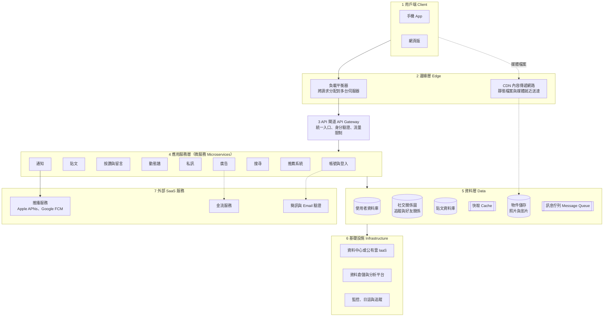
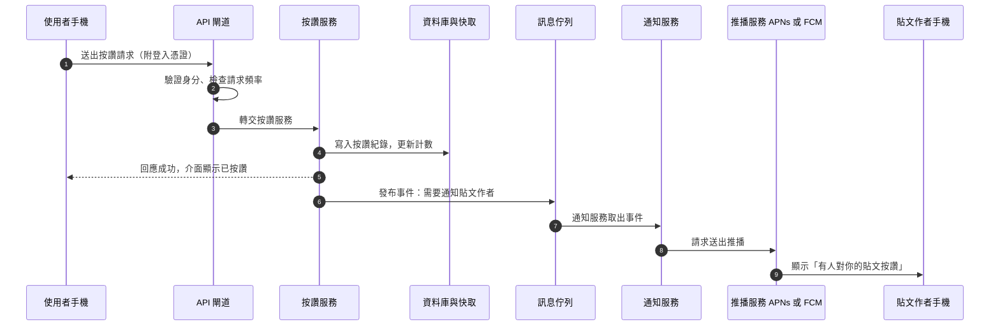
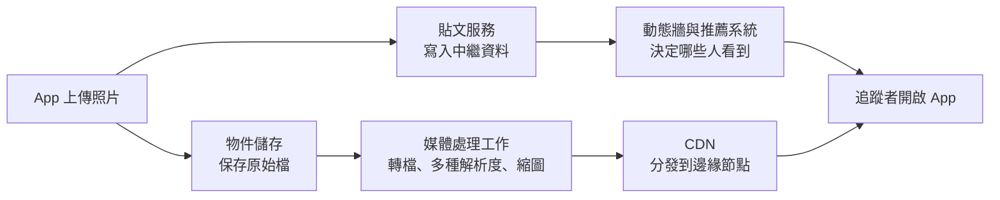
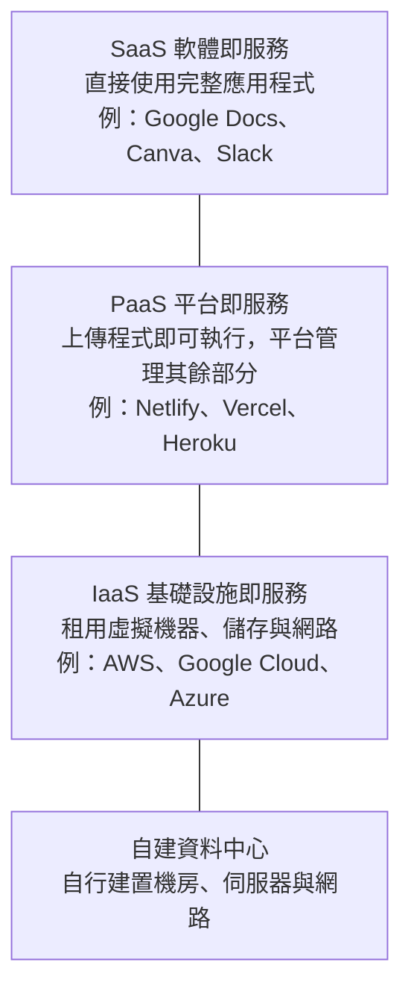
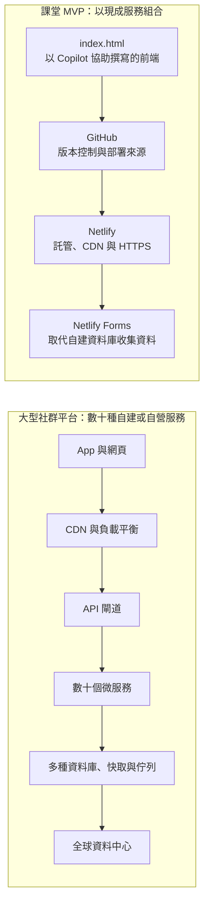

# 社群媒體系統設計深入

> 選讀、課堂不要求。本篇收錄第 1 週原本的社群平台架構全文，適合想進一步了解大型系統如何設計的同學。
> 課堂用的簡明版：[你每天用的 App 背後長怎樣](../../lectures/wk01_1007_saas-storefront/social_media_architecture.md)　｜　互動版（可點選元件、播放資料流動畫）：[social_saas.html](../../lectures/wk01_1007_saas-storefront/slides/social_saas.html)　｜　基礎概念：[SaaS 模式與網站運作（深入選讀）](saas_and_web.md)

> **說明**：各公司的實際架構並未完全公開，且持續演變。本篇描述的是業界廣泛討論的**通用設計模式**，並非任何特定公司的內部實作；提及特定公司時，只引用其公開發表的資訊。

---

## 學習目標

讀完本篇後，你應能：

1. **說明**大型社群平台由哪些架構層組成，以及每一層解決的問題。
2. **追蹤**「按讚」「發布限時動態」「開啟動態牆」三種操作在系統中的處理路徑。
3. **比較**動態牆的推送式（fan-out on write）與拉取式（fan-out on read）生成策略及其取捨。
4. **解釋**快取、分片、複寫與最終一致性，並以此說明為何不同裝置上的按讚數可能短暫不同。
5. **分析**推薦系統與廣告商業模式之間的關係，以及其隱私與資料治理意涵。
6. **對照**大型平台與課堂 MVP 的架構差異，說明新創為何應從最小架構開始。

---

## 1. 社群平台的商業模式

| 服務 | 使用者主要行為 | 使用者付費方式 | 主要收入來源 |
| --- | --- | --- | --- |
| Instagram／Threads／Facebook | 瀏覽動態、發布內容 | 免費 | 廣告 |
| YouTube | 觀看影片 | 免費，或 Premium 訂閱 | 廣告、訂閱 |
| LINE | 即時通訊 | 免費 | 官方帳號、貼圖、廣告等 |
| TikTok | 短影音 | 免費 | 廣告、電商 |
| Netflix | 串流影集 | 月訂閱 | 訂閱（另有含廣告方案） |

上述服務都符合 SaaS 的特徵：軟體在供應商端執行、使用者透過 App 或瀏覽器存取、更新由供應商持續部署、資料集中在雲端。差異在於**收費對象**：訂閱制向使用者收費；廣告制則是向廣告主出售使用者的注意力。後者的營收與「使用者停留時間」和「廣告投放精準度」高度相關，這直接決定了平台在推薦系統上的巨大投資（見第 8 節）。

---

## 2. 系統架構總覽

以下是大型社群平台常見的分層架構（簡化版）：

### 2.1 各層說明

1. **用戶端（Client）**：手機 App 與網頁負責呈現介面、收集操作，並透過 API 與伺服器交換資料（通常是 JSON 格式）。App 也會在本機快取部分內容，以便離線瀏覽或加快開啟速度。
2. **邊緣層（Edge）**
   - **內容傳遞網路（Content Delivery Network, CDN）**：在全球各地部署邊緣節點，快取照片、影片、JavaScript 等不常變動的檔案，讓使用者從最近的節點下載，降低延遲並減輕核心機房負擔。
   - **負載平衡器（Load Balancer）**：將大量請求分配給後端多台伺服器，並持續做健康檢查，自動避開故障的機器。它是系統能「水平擴充（加機器）」的前提。
3. **API 閘道（API Gateway）**：所有請求的單一入口，負責驗證登入憑證（例如 token）、限制單一來源的請求頻率（rate limiting，防止濫用與攻擊）、將請求路由到正確的後端服務，並記錄存取日誌。
4. **應用服務層（微服務，Microservices）**：將系統拆成許多功能單一、可獨立部署的小服務，例如按讚、私訊、搜尋各自獨立。優點是不同團隊能各自開發與擴充、單一服務故障不致拖垮全體；代價是服務之間的網路呼叫、資料一致性與監控變得複雜。
5. **資料層（Data）**：依資料特性選擇不同儲存技術，稱為「多語言持久化（polyglot persistence）」。使用者資料需要嚴格一致性，適合關聯式資料庫；社交關係適合以圖形結構儲存；照片影片適合物件儲存；熱門資料放在記憶體快取；非即時工作透過訊息佇列排程。
6. **基礎設施（Infrastructure）**：實體伺服器、網路、電力與冷卻，可以是自建資料中心或租用公有雲。資料倉儲收集使用紀錄供分析與模型訓練；監控系統負責偵測異常（見第 9 節）。
7. **外部 SaaS 服務**：即使是大型平台也不會自行建構所有元件。例如，iOS 與 Android 的推播通知必須經過 Apple Push Notification service（APNs）與 Firebase Cloud Messaging（FCM）送達裝置，這是作業系統層級的限制。

### 2.2 元件與使用者可觀察到的現象

| 元件 | 解決的問題 | 使用者可觀察到的現象 |
| --- | --- | --- |
| CDN | 跨洲傳輸延遲、核心機房頻寬 | 照片在滑動時幾乎立即出現 |
| 負載平衡器 | 單台伺服器容量有限 | 重大節日大量同時上線仍可使用 |
| API 閘道 | 身分驗證與濫用防護 | 登出後無法再執行操作；短時間大量操作會被限制 |
| 微服務 | 功能隔離與獨立擴充 | 私訊無法使用，但動態牆仍正常 |
| 快取 | 資料庫讀取壓力 | 熱門貼文開啟速度快 |
| 訊息佇列 | 尖峰流量與非即時工作 | 按讚後，對方的通知晚幾秒才收到 |
| 推薦系統 | 從海量內容中挑選個人化內容 | 探索頁面與短影音推薦 |

---

## 3. 典型操作的請求路徑

### 3.1 按下「讚」

第 5 步之後的工作稱為**非同步處理（asynchronous processing）**：使用者不需要等待通知送出就能繼續操作。多數 App 甚至在伺服器回應前就先把愛心變紅，稱為**樂觀更新（optimistic update）**；若請求失敗再還原，這是提升體感速度的常見技巧。

### 3.2 發布限時動態

照片本身（大型二進位檔）與貼文的中繼資料（作者、時間、文字、權限）分開儲存，是媒體平台的基本設計。

### 3.3 開啟動態牆

1. App 向 API 閘道請求「我的動態牆」。
2. 動態牆服務取得候選內容：追蹤對象的新貼文（依第 4 節的策略取得）與推薦系統提供的內容。
3. 排序模型為候選內容評分，廣告服務插入廣告版位。
4. 回傳內容清單（文字與媒體網址），結果寫入快取。
5. App 依媒體網址從最近的 CDN 節點下載照片與影片。

---

## 4. 動態牆生成策略

動態牆的核心問題是：「使用者 A 追蹤了 500 個帳號，如何在數百毫秒內組出依時間或相關性排序的貼文清單？」業界常討論以下三種策略（System Design Primer 等系統設計教材均以此為經典題目）。

### 4.1 推送式：Fan-out on write

當某人發文時，系統立即把這則貼文的 ID **寫入每一位追蹤者的預先計算時間軸**（通常放在快取中）。

- **優點**：讀取極快，開啟動態牆只需讀取自己的清單。
- **缺點**：寫入成本與追蹤者數量成正比。擁有數千萬追蹤者的帳號發一則文，就要寫入數千萬次，可能延遲數分鐘並消耗大量資源；也會替不常上線的使用者做許多白工。

### 4.2 拉取式：Fan-out on read

發文時只寫入作者自己的貼文清單；當使用者開啟動態牆時，才**即時向所有追蹤對象拉取最新貼文並合併排序**。

- **優點**：寫入成本低，不浪費資源在不上線的使用者。
- **缺點**：讀取成本高，追蹤帳號越多，組合時間越長，難以維持穩定的回應速度。

### 4.3 混合式

多數大型系統採取混合策略：**一般帳號採推送式；追蹤者極多的帳號（常被稱為名人帳號）改在讀取時拉取**，再與預先計算的時間軸合併。Twitter 工程團隊曾在公開技術演講中描述過類似的做法。此外，當動態牆改以推薦排序為主時，「預先計算」的對象也從最終清單轉為候選內容池。

| 策略 | 寫入成本 | 讀取速度 | 適用情境 |
| --- | --- | --- | --- |
| Fan-out on write | 高（與追蹤者數成正比） | 快 | 一般使用者、讀多寫少 |
| Fan-out on read | 低 | 較慢且不穩定 | 追蹤者極多的帳號、不常上線的使用者 |
| 混合式 | 中 | 快 | 大型平台的實際做法 |

---

## 5. 資料層：快取、分片、複寫與一致性

### 5.1 快取（Cache）

快取是把常用資料複製到速度更快的儲存位置。記憶體讀取比資料庫查詢快上數個數量級，因此熱門貼文、使用者資料、時間軸等常放在 Memcached、Redis 這類記憶體快取中。快取分布在多個層次：App 本機、CDN、應用伺服器、資料庫前端。

快取的主要難題是**失效（invalidation）**：原始資料改變後，快取中的舊資料何時更新？設定過期時間（TTL）越長，效能越好，但使用者看到舊資料的機會也越高。

### 5.2 分片（Sharding）

當單一資料庫無法容納所有資料或承受所有流量時，會依某個鍵（例如使用者 ID）把資料**水平切分**到多台資料庫，每一台稱為一個分片（shard）。分片讓容量可以隨機器數量成長，代價是跨分片查詢與交易變得困難，重新分配資料（rebalancing）也很複雜。

### 5.3 複寫（Replication）

同一份資料保存多個副本，常見形式是一台主要節點（leader）負責寫入，多台副本（follower 或 read replica）負責讀取；副本也可放在不同地區的資料中心。複寫提供兩項好處：**讀取擴充**與**容錯**（主節點故障時可由副本接手）。

### 5.4 最終一致性：為什麼按讚數在不同裝置上可能不同

副本之間的同步通常是**非同步**的，存在短暫延遲。此外，按讚數這類高頻寫入的計數器，常以分散的方式累加、定期彙總，再經由快取提供讀取。因此，你的手機與朋友的電腦可能在幾秒內看到不同的數字（例如 1,203 與 1,201），隨後才趨於一致。這種「不保證立即一致，但在沒有新寫入時最終會一致」的特性，稱為**最終一致性（eventual consistency）**。

分散式系統理論中的 CAP 定理指出，在網路分區（部分節點彼此無法通訊）發生時，系統必須在「一致性」與「可用性」之間取捨。社群平台對按讚數選擇可用性：數字短暫不準確，遠比按讚功能無法使用更可接受。相對地，金流與帳號密碼變更則需要強一致性。**依資料的重要程度選擇一致性等級**，是系統設計的核心判斷之一。

---

## 6. 媒體儲存與非同步處理

### 6.1 物件儲存與 CDN

照片與影片以**物件儲存（object storage）**保存，例如 Amazon S3 或同類系統。物件儲存以「鍵—值」方式存放大型檔案，容量幾乎可無限擴充、成本低，並內建多副本以防資料遺失，但不適合頻繁修改。上傳後的媒體通常會被轉檔成多種解析度與格式，以適應不同裝置與網路速度；影片更會切成小片段，依網速動態切換畫質（adaptive bitrate streaming）。最後由 CDN 將熱門內容快取到邊緣節點。

### 6.2 訊息佇列（Message Queue）

訊息佇列是一種「生產者放入工作、消費者依序取出處理」的中介系統，常見實作包括 Apache Kafka、RabbitMQ 等。它在社群平台中的用途包括：

- **解耦（decoupling）**：按讚服務只需發布事件，不需知道後續有哪些服務（通知、推薦、分析）要處理。
- **削峰（load leveling）**：尖峰時段的大量工作先排隊，由後端依自身能力逐步消化，避免系統被瞬間流量壓垮。
- **重試與可靠性**：處理失敗的工作可以重新排入佇列，不會遺失。

代價是**延遲**與**處理順序、重複處理**等問題：同一事件可能被處理兩次，因此消費者需要設計成重複執行也不會出錯（冪等性，idempotency）。

---

## 7. 雲端服務層級：大型平台如何選擇

大型平台同樣面對「自建或租用」的選擇，只是選擇的層級不同：

| 做法 | 控制權與維運負擔 | 公開案例 |
| --- | --- | --- |
| 自建資料中心 | 最高 | Meta、Google 營運自有的大型資料中心 |
| 租用 IaaS | 高 | Netflix 的串流服務主要運行在 AWS 上；Instagram 早期架設在 AWS，2014 年遷移至 Facebook 的資料中心 |
| 使用 PaaS | 中低 | 本課程的 MVP 使用 Netlify |
| 使用 SaaS 元件 | 低 | 大型公司也使用第三方服務，例如推播經由 APNs 與 FCM |

要點：沒有任何公司所有元件都自行建構。差別只在於**哪些能力值得自建**（通常是核心競爭力或規模經濟明顯的部分），**哪些適合租用**。對早期新創而言，時間與人力遠比伺服器費用稀缺，因此應盡量租用。

---

## 8. 推薦系統與注意力經濟

### 8.1 推薦管線

平台上每天新增的內容遠超過任何人能瀏覽的數量，推薦系統的任務是在極短時間內，從數十億則內容中挑出最可能讓你感興趣的數十則。典型的推薦管線分為三個階段：

1. **候選生成（candidate generation）**：以計算成本低的方法，從海量內容中快速篩選出數百到數千則候選，來源包括追蹤對象的貼文、相似使用者喜歡的內容、與你過去互動主題相近的內容。
2. **排序（ranking）**：以較複雜的機器學習模型，預測你對每則候選內容的互動機率（點擊、按讚、分享、觀看時長），並據此評分排序。
3. **重新排序與政策（re-ranking and policies）**：在最終呈現前套用商業與治理規則，例如增加內容多樣性、避免同一作者連續出現、過濾違反社群守則的內容、降低疑似錯誤資訊的曝光、插入廣告版位。

模型所需的訊號來自使用行為：停留時間、滑過速度、是否看完影片、按讚與分享等，這些資料經由訊息佇列與資料倉儲持續回流，用於訓練下一版模型。

### 8.2 以注意力為基礎的廣告模式

廣告制平台出售的是廣告版位與精準的受眾觸及。廣告系統通常以**即時競價（auction）**決定每個版位顯示哪則廣告，綜合考量廣告主出價、預測的點擊或轉換機率，以及廣告品質。

這產生了一個結構性的誘因：**使用者停留越久、平台對使用者了解越多，可賣出的廣告與精準度就越高。** 常被引用的說法「如果你沒有付費，你就是被販售的商品」即指此現象。它也引發持續的社會討論，包括成癮性設計、同溫層效應、青少年心理健康與演算法透明度。推薦系統的第三階段（政策）正是平台回應這些問題的主要介入點之一。

---

## 9. 可觀測性與可靠性

### 9.1 可觀測性（Observability）

大型系統由數千個服務組成，任何一處都可能出錯。工程團隊透過三類資料掌握系統狀態：

- **指標（metrics）**：請求數、錯誤率、延遲等數值的時間序列，用於儀表板與自動告警。
- **日誌（logs）**：每個事件的文字紀錄，用於事後追查。
- **分散式追蹤（distributed tracing）**：記錄一個請求經過哪些服務、各花多少時間，用於定位瓶頸。

團隊通常會設定服務水準目標（Service Level Objective, SLO），例如「99.9% 的請求在 300 毫秒內回應」，並以此決定何時需要介入。

### 9.2 可靠性設計

- **冗餘（redundancy）**：每個元件都有多個副本，分布在不同機器、機房與地區，避免單點故障。
- **隔離（isolation）**：各服務擁有獨立的資源與資料儲存，一個服務的故障不會耗盡其他服務的資源（常以船艙隔板 bulkhead 比喻）。
- **斷路器（circuit breaker）**：當下游服務持續失敗時，暫時停止呼叫並回傳預設結果，避免連鎖故障。
- **優雅降級（graceful degradation）**：非核心功能失效時，系統以縮減的功能繼續運作。例如推薦服務暫時失效時，改以時間順序顯示追蹤對象的貼文。

這解釋了為什麼**私訊可能無法使用，而動態牆仍然正常**：兩者是不同的服務，使用不同的資料儲存與運算資源，且系統被刻意設計成彼此隔離。

然而，共用的底層基礎設施仍可能成為單點。2021 年 10 月，Facebook、Instagram 與 WhatsApp 曾同時中斷數小時；Meta 其後在工程部落格說明，事故起因於骨幹網路的設定變更。可靠性工程的目標不是「永不故障」，而是降低故障的機率、範圍與復原時間。

---

## 10. 隱私與資料治理

資料集中是 SaaS 的特徵之一，也帶來相應的責任：

- **資料蒐集範圍**：推薦與廣告系統依賴大量行為資料。**資料最小化（data minimization）**原則要求只蒐集達成目的所需的資料。
- **法規遵循**：歐盟《一般資料保護規則》（GDPR）、我國《個人資料保護法》等規範個人資料的蒐集、處理與利用，包括告知義務、當事人查閱與刪除的權利、跨境傳輸限制。
- **保存與刪除**：使用者刪除貼文後，資料是否也從備份、快取、資料倉儲與模型訓練資料中移除，在分散式系統中是技術上困難的問題。
- **存取控制與稽核**：內部員工能否查看使用者資料、是否留有紀錄，是資料治理的重要一環。
- **演算法透明度**：使用者是否能理解「為什麼我看到這則內容」，並調整或關閉個人化推薦。

這些議題同樣適用於你的 MVP：第 2 週使用 Netlify Forms 收集的姓名與 Email 即屬個人資料，你應在頁面上說明蒐集目的，只蒐集必要欄位，並妥善管理後台存取權限。

---

## 11. 對照：社群巨頭與我們的 MVP

| 需求 | 大型社群平台 | 課堂 MVP |
| --- | --- | --- |
| 前端介面 | 大型團隊開發原生 App 與網頁 | 單一 `index.html`，以 GitHub Copilot 協助撰寫 |
| 託管與全球加速 | 自建或自營 CDN、負載平衡、資料中心 | Netlify（內建 CDN） |
| 版本管理與部署 | 內部大型 CI/CD 系統 | GitHub ＋ Netlify 自動部署 |
| 資料收集 | 分片、複寫的資料庫叢集 | Netlify Forms（BaaS） |
| 登入狀態 | 帳號服務與加密憑證 | LocalStorage 模擬（僅供示範，不具安全性） |
| 推薦、廣告、私訊 | 大型專責團隊 | 不需要：MVP 的目的在驗證需求 |
| 團隊規模 | 數千至數萬名工程師 | 個人或小組，搭配 AI 工具 |
| 開發時間 | 多年持續演進 | 兩次課程、約 4 小時 |
| 基礎設施費用 | 極為龐大 | 在免費方案額度內為 0 元 |

MVP 的目的是以最低成本驗證「是否有人需要這個產品」。當產品獲得真實使用者、出現明確的功能需求後，再逐步替換或擴充元件，例如以 [Supabase](https://supabase.com/) 或 [Firebase](https://firebase.google.com/) 建立真正的會員系統。本篇所介紹的快取、分片、佇列等技術，都是在規模增長後才需要面對的問題；在只有數十位使用者時就預先設計，屬於過早最佳化。

---

## 12. 討論題

1. 若你負責設計校園二手交易平台的動態牆，使用者約 5,000 人，最多追蹤者的帳號約 800 人，你會選擇推送式、拉取式還是混合式？理由是什麼？
2. 按讚數可以接受最終一致性，哪些社群平台的功能**不能**接受？請舉出兩例並說明後果。
3. 推薦系統的「重新排序與政策」階段可以降低有害內容的曝光，但也可能被批評為審查。你認為平台應如何在兩者之間取得平衡？誰應該參與制定規則？
4. 某次事故中，私訊中斷兩小時，但動態牆正常運作。請從隔離與優雅降級的角度，說明工程師事前做了哪些設計；如果動態牆也同時中斷，可能的原因有哪些？
5. 若平台改為純訂閱制、不再販售廣告，推薦系統的優化目標可能如何改變？對使用者是好是壞？
6. 你的 MVP 將收集使用者的 Email。請列出你應在頁面上告知的事項，以及你會採取的資料保護措施。

---

## 13. 參考資料

| 資源 | 說明 |
| --- | --- |
| [Meta Engineering](https://engineering.fb.com/) | Meta（Facebook、Instagram、WhatsApp）工程團隊的技術文章 |
| [Instagram Engineering](https://instagram-engineering.com/) | Instagram 工程團隊的技術文章 |
| [Netflix TechBlog](https://netflixtechblog.com/) | Netflix 在雲端架構、串流與可靠性工程方面的分享 |
| [System Design Primer](https://github.com/donnemartin/system-design-primer) | 系統設計入門教材，含快取、分片、複寫、訊息佇列與動態牆設計題 |
| [MDN 詞彙表：CDN](https://developer.mozilla.org/en-US/docs/Glossary/CDN) | 內容傳遞網路 |
| [MDN 詞彙表：API](https://developer.mozilla.org/en-US/docs/Glossary/API) | 應用程式介面 |
| [MDN 詞彙表：Cache](https://developer.mozilla.org/en-US/docs/Glossary/Cache) | 快取 |
| [MDN 詞彙表：Latency](https://developer.mozilla.org/en-US/docs/Glossary/Latency) | 延遲 |
| [Red Hat：IaaS、PaaS、SaaS 的差異](https://www.redhat.com/zh/topics/cloud-computing/iaas-vs-paas-vs-saas) | 雲端服務模式 |
| [Red Hat：什麼是微服務？](https://www.redhat.com/zh/topics/microservices/what-are-microservices) | 微服務架構 |
| Kleppmann, M. (2017). *Designing Data-Intensive Applications*. O'Reilly Media. | 複寫、分片、一致性與串流處理的經典教材 |

---

[回第 1 週手把手實作](../../lectures/wk01_1007_saas-storefront/README.md)　｜　[SaaS 模式與網站運作（深入選讀）](saas_and_web.md)
