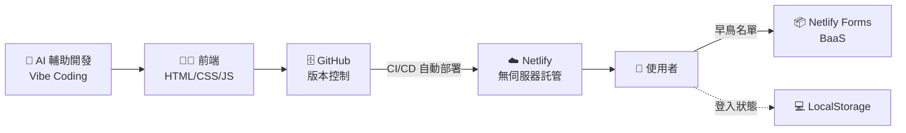

# 🎤 期末 Pitch 模板：讓資工系都佩服的架構說明

> 透過這堂課的「架構觀念」洗禮，你在期末發表時就不會只說「我做了一個網頁」。

[← 回課程首頁](../README.md)

---

## 🌟 示範講稿（30 秒版）

> 「我們團隊運用了 **AI 輔助開發（Vibe Coding）** 產出前端介面，並採用了現代的 **SaaS 網路架構**，將網站**無伺服器部署**在 **Netlify** 雲端上。針對初期的 **MVP** 測試，我們捨棄了繁重的資料庫開發，改用輕量級的 **BaaS** 雲端表單服務來收集第一批早鳥用戶名單，大幅降低了創業的**試錯成本**！」

---

## 📋 完整 Pitch 結構（3～5 分鐘）

| 段落 | 時間 | 要回答的問題 | 填空範本 |
| --- | --- | --- | --- |
| 1. 痛點 | 30 秒 | 誰有什麼困擾？ | 「每學期有 ___ 位北大學生在找房子，但 ___。」 |
| 2. 解方 | 30 秒 | 你的產品怎麼解決？ | 「___ 是一個 ___ 的 SaaS 服務，讓 ___ 可以 ___。」 |
| 3. Demo | 60 秒 | 產品長什麼樣子？ | **現場用手機打開網址、填寫表單、展示會員儀表板** |
| 4. 技術架構 | 45 秒 | 你怎麼做出來的？ | 使用上方示範講稿＋架構圖 |
| 5. 市場驗證 | 30 秒 | 有人要嗎？ | 「上線 ___ 天，已收到 ___ 筆早鳥名單，其中 ___% 是目標客群。」 |
| 6. 商業模式 | 30 秒 | 怎麼賺錢？ | 「免費版提供 ___，進階版每月 ___ 元，提供 ___。」 |
| 7. 下一步 | 15 秒 | 接下來要做什麼？ | 「下一階段我們會接上 ___（例如 Supabase）實作真正的會員系統。」 |

---

## 🏗️ 技術架構投影片範本

可以直接把這張圖放進你的簡報（在 GitHub 上會自動畫成圖，也可以截圖）：

### 架構亮點說明句型（挑 2～3 句用）

- 💰 **成本**：「整套架構的月成本是 **0 元**，不需要租用任何伺服器。」
- ⚡ **速度**：「從想法到上線只花了 **2 週**，傳統開發至少需要 2～3 個月。」
- 🔄 **迭代**：「透過 CI/CD 自動部署，我們每次修改後**幾十秒內**就能上線，可以根據用戶回饋快速調整。」
- 📈 **擴展**：「Netlify 使用全球 CDN，即使流量暴增也不用擔心網站掛掉。」
- 🧪 **精實**：「我們遵循精實創業的 MVP 原則，先驗證需求，再投入資源開發後端。」

---

## ✅ 發表前檢查清單

- [ ] 網址可以用手機正常打開（**Demo 前一天再確認一次！**）
- [ ] 表單可以正常送出，後台看得到資料
- [ ] 準備好 Netlify 後台名單的截圖（**遮蔽他人的 Email 等個資**）
- [ ] 網址做成 QR Code 放在簡報上，讓評審可以現場掃描體驗（可用 Chrome 內建的「分享 → QR 圖碼」功能產生）
- [ ] 準備好網路斷線時的備案（錄一段操作影片）

## 📚 延伸學習：怎麼做好一場 Pitch？

- [Y Combinator：How to Pitch Your Startup](https://www.ycombinator.com/library/4b-how-to-pitch-your-startup)
- [Y Combinator：How to Design a Better Pitch Deck](https://www.ycombinator.com/library/2u-how-to-build-your-seed-round-pitch-deck)
- [Sequoia Capital：Writing a Business Plan](https://sequoiacap.com/article/writing-a-business-plan/)
- [Guy Kawasaki：The 10/20/30 Rule of PowerPoint](https://guykawasaki.com/the_102030_rule/)
