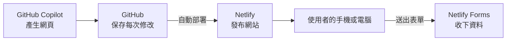

# MVP 發表模板

[← 回課程首頁](../README.md)

這份文件幫你準備兩種發表：第 2 週課堂的 **1 分鐘發表**（檢核點 7），和期末的 **3 分鐘發表**。照著填空，把【】換成你的內容，再計時練習幾次就可以了。評分依 [課程規劃](course_plan.md) 的評分規準。

發表只要讓聽眾相信三件事：**這個問題真的存在、你的產品能解決、你有證據**。

---

## 1. 1 分鐘講稿（課堂，檢核點 7）

準備時間約 15 分鐘。每段約 15 秒。

> **問題**：大家好，我是【名字】。【誰】在【什麼情境】時，常常遇到【什麼困擾】。
>
> **解方**：所以我做了【產品名稱】，它讓【誰】可以【做到什麼】，不用再【原本麻煩的做法】。
>
> **展示**：（用手機打開網址）這是我的網站，使用者可以在這裡【填表單／看資訊】，送出後會看到【會員畫面】。
>
> **架構**：網頁是我用 GitHub Copilot 產生後再檢查修改的，存在 GitHub，透過 Netlify 發布，每次修改會自動更新；報名資料由 Netlify Forms 收集。謝謝大家。

## 2. 3 分鐘講稿（期末）

準備時間約 30 分鐘。

| 段落 | 時間 | 填空講稿 |
| --- | --- | --- |
| 1. 問題 | 30 秒 | 「【誰】在【什麼情境】時，常遇到【困擾】。現在大家只能【現有做法】，但【為什麼不夠好】。」 |
| 2. 解方 | 30 秒 | 「【產品名稱】是一個【一句話介紹】的服務。和【現有做法】比，最大的不同是【差別】。」 |
| 3. 展示 | 45 秒 | 用手機打開網址 → 填寫表單 → 顯示會員畫面 → 顯示後台收到資料（先遮住個資）。 |
| 4. 架構 | 30 秒 | 念下面第 3 節的架構講稿。 |
| 5. 證據 | 30 秒 | 「上線【幾】天，有【幾】人填寫，其中【幾】位不是同學。他們最常提到【回饋】。」 |
| 6. 下一步 | 15 秒 | 「接下來我想確認【想驗證的事】，方法是【怎麼做】。」 |

## 3. 架構講稿（可直接念）

> 「我的網頁是用 GitHub Copilot 產生，再由我逐段檢查和修改的。程式存在 GitHub，會記住每一次修改。網站由 Netlify 發布，只要我把修改同步到 GitHub，Netlify 約一分鐘內就會自動更新，這叫做持續部署。報名資料由 Netlify Forms 這個現成的後端服務收下，會員狀態暫存在使用者的瀏覽器裡。這樣做幾乎不花錢，可以先確認有沒有人需要；缺點是還沒有真正的登入系統，下一步會改用有登入功能的後端服務。」

簡報可以放這張圖（GitHub 會自動畫出來，也可以截圖使用）：

## 4. 常被問的問題

事先想好這幾題的答案：

| 問題 | 回答方向 |
| --- | --- |
| 你怎麼知道有人需要？ | 引用非同學使用者說過的具體回饋 |
| 已經有類似的東西了，為什麼要用你的？ | 說出 1–2 個現有做法，以及你的不同之處 |
| 會員資料安全嗎？ | 目前存在使用者瀏覽器，只是示範，不存敏感資料；下一步會換成有登入的後端 |
| 程式是 AI 寫的，怎麼確定正確？ | 說明你怎麼預覽、測試和修改（看學習歷程檔案的 AI 使用紀錄） |
| 誰會付錢？ | 分清楚「使用者」和「付錢的人」，說出你的定價想法 |

## 5. 發表前檢查清單

- [ ] 前一天和當天各用手機打開網址一次，確認正常
- [ ] 表單可以送出，後台看得到資料
- [ ] 後台截圖已遮住 Email 和姓名
- [ ] 簡報放上網址的 QR Code（Chrome 的「分享 → QR 圖碼」可以產生）
- [ ] 準備網路斷線時的備案（操作錄影或截圖）
- [ ] 計時練習過，沒有超時
- [ ] 數據說得出來源；只有少數回應時，說「初步發現」而不是「需求很大」

## 6. 參考資料

- Y Combinator. *Startup Library*. <https://www.ycombinator.com/library>
- Ries, E. (2011). *The Lean Startup*. Crown Business.
- 更多資源見 [延伸學習資源](resources.md)；精實創業與指標的原理見 [深入原理（選讀）](deep_dive/README.md)。
