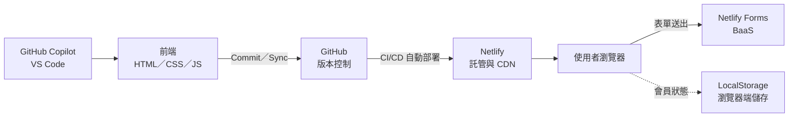

# MVP 發表模板

[← 回課程首頁](../README.md)

本文件提供第 2 週 1 分鐘 MVP 發表（檢核點 7）與期末 3–5 分鐘創業計畫發表的結構、架構說明講稿、常見問題與問答準備。評分依 [課程規劃](course_plan.md#4-分析式評分規準) 的分析式評分規準進行。

---

## 1. 發表的目的

創業發表（pitch）的目的不是展示「做了多少功能」，而是在有限時間內讓聽眾相信三件事：**問題真實存在、你的解方可行、你有證據支持下一步**。對本課程而言，發表同時是評量學生能否以正確術語說明架構與取捨（LO2、LO8）。

一份清楚的發表通常依循「問題 → 解方 → 證據 → 請求」的邏輯。Y Combinator、Sequoia Capital 等機構公開的簡報建議雖細節不同，但都強調：先說清楚問題與目標客群，再談產品；以數據而非形容詞說服聽眾。

## 2. 發表結構

### 2.1 期末完整版（3–5 分鐘）

| 段落 | 建議時間 | 要回答的問題 | 句型範例 | 常見錯誤 |
| --- | --- | --- | --- | --- |
| 1. 問題 | 30 秒 | 誰、在什麼情境下、遇到什麼困擾？目前如何解決，為何不夠好？ | 「北大學生每學期開學前找租屋時，常遇到＿＿；目前只能透過＿＿，但＿＿。」 | 問題過於籠統（「大家都很忙」）；未說明現有替代方案 |
| 2. 目標客群 | 20 秒 | 最早會使用產品的是哪一群人？規模大約多少？ | 「我們的第一批使用者是＿＿，估計約＿＿人（依據：＿＿）。」 | 目標客群設定為「所有人」；規模數字無出處 |
| 3. 解方與價值主張 | 30 秒 | 產品如何解決問題？與替代方案相比的關鍵差異？ | 「＿＿是一個＿＿的服務，讓＿＿能夠＿＿，而不必＿＿。」 | 列舉功能而未連結到問題 |
| 4. Demo | 60 秒 | 產品實際如何運作？ | 以手機開啟網址 → 填寫表單 → 展示會員畫面 → 展示後台收件（遮蔽個資） | 未事先測試；網路中斷時沒有備案 |
| 5. 技術架構 | 45 秒 | 如何建構？為何這樣選擇？有哪些限制？ | 見第 3 節講稿 | 只列工具名稱，未說明取捨 |
| 6. 驗證證據 | 30 秒 | 有人需要嗎？證據是什麼？ | 「上線＿＿天，＿＿人造訪、＿＿人填寫，轉換率約＿＿%；其中＿＿位為非同學的目標使用者，他們提到＿＿。」 | 以同學的測試資料充當市場需求；只報數字不報觀察 |
| 7. 商業模式 | 30 秒 | 誰付費？如何定價？ | 「基本功能免費，進階版每月＿＿元，提供＿＿；另可向＿＿收取＿＿。」 | 定價無依據；忽略獲客成本 |
| 8. 下一步 | 15 秒 | 接下來要驗證什麼、建構什麼？需要什麼資源？ | 「下一階段將以＿＿驗證＿＿，並導入＿＿實作真正的會員系統。」 | 下一步是「做更多功能」而非「驗證關鍵假設」 |

### 2.2 課堂精簡版（1 分鐘，檢核點 7）

時間有限時，保留段落 1、3、4、5 各約 15 秒：一句話說明問題、一句話說明解方、以手機展示網站、一句話說明架構。

## 3. 架構說明講稿

### 3.1 30 秒標準版

> 「本產品的前端介面由我們以 GitHub Copilot 輔助產生，並逐段檢查與修改；原始碼以 Git 進行版本控制，託管於 GitHub。網站部署在 Netlify，每次將修改同步到 GitHub，Netlify 即自動重新建置與發布，這就是持續部署。在 MVP 階段，我們沒有自建伺服器與資料庫，而是以 Netlify Forms 這項後端即服務收集早鳥名單，並以瀏覽器的 LocalStorage 暫存會員狀態。這個架構的月成本接近零，讓我們能以最低成本先驗證需求；其限制是尚無真正的身分驗證，因此下一階段會導入具備驗證功能的後端服務。」

### 3.2 架構圖

以下圖可直接放入簡報（GitHub 會自動繪製，也可截圖使用）：

### 3.3 可選用的架構論點

依產品特性挑選 2–3 項，並確保每一項都能回答追問：

| 論點 | 講稿範例 | 可能的追問與回答方向 |
| --- | --- | --- |
| 對照大型平台 | 「大型社群平台背後有 CDN、API 閘道、數十個微服務與全球資料中心；我們在 MVP 階段以 Netlify 與 Netlify Forms 取得全球託管與資料收集能力。」（參考 [社群媒體架構講義](../lectures/wk01_1007_saas-storefront/social_media_architecture.md)） | 「那你們缺了什麼？」→ 身分驗證、資料庫查詢、推薦與通知等服務 |
| 成本 | 「目前使用各平台的免費方案，不需租用伺服器。」 | 「流量變大之後呢？」→ 說明免費額度上限與升級成本 |
| 速度 | 「從構想到上線約兩週，其中網站實作只花了數小時。」 | 「品質如何保證？」→ 說明人工檢查、自我檢核與實際測試 |
| 迭代 | 「透過持續部署，每次修改同步後約一分鐘內即可上線，可依使用者回饋快速調整。」 | 「改壞了怎麼辦？」→ Git 可回復至先前版本；Netlify 可回溯部署 |
| 精實 | 「我們依精實創業的原則，先以最小成本驗證需求，再決定是否投資後端開發。」 | 「驗證了什麼？」→ 回到第 6 段的數據 |
| 資料倫理 | 「表單旁說明資料用途，僅收集必要欄位，並於展示時遮蔽個資。」 | 「LocalStorage 安全嗎？」→ 不安全，僅作示範，不存敏感資料 |

**注意**：避免使用無法證明的誇大說法，例如「流量暴增也不會有問題」「完全免費」。應說明條件與限制，例如「在免費方案額度內」。

## 4. 常見問題

1. **把 Demo 當成發表的全部**：Demo 應服務於論點，而非取代論點。
2. **數據與結論不相符**：例如 5 筆回應即宣稱「市場需求強烈」。小樣本只能說明「初步訊號」，應坦白說明限制。
3. **以同學測試資料作為驗證證據**：同學的填寫只能證明表單可運作，不能證明需求存在。
4. **架構說明流於工具清單**：聽眾關心的是「為什麼選這個」與「限制是什麼」。
5. **截圖洩漏個資**：後台收件列表須遮蔽 Email、姓名等欄位。
6. **超時**：事先計時演練，準備可刪減的段落。

## 5. 問答準備

發表後常見的提問類型與準備方向：

| 提問類型 | 範例 | 準備方向 |
| --- | --- | --- |
| 需求 | 「你怎麼知道使用者真的需要？」 | 引用訪談或非同學使用者的具體回饋 |
| 競爭 | 「現在已經有＿＿了，為什麼要用你的？」 | 事先列出 2–3 個替代方案，說明差異與取捨 |
| 技術 | 「會員資料存在哪裡？安全嗎？」 | 說明 LocalStorage 的特性與限制，以及下一階段的後端規劃 |
| 營運 | 「如果使用者變多，成本會怎麼變化？」 | 查閱 Netlify 與 Netlify Forms 的免費額度與付費方案 |
| 商業模式 | 「誰會付錢？為什麼？」 | 區分使用者與付費者；說明定價依據 |
| AI 使用 | 「程式是 AI 寫的，你怎麼確定它正確？」 | 說明檢查、測試與修改的過程，引用學習歷程檔案的 AI 使用紀錄 |

## 6. 發表前檢查清單

- [ ] 前一天與當天各以手機開啟網址一次，確認可正常顯示
- [ ] 表單可送出，後台可看到資料
- [ ] 已準備遮蔽個資的後台截圖
- [ ] 簡報放上網址的 QR Code（Chrome 的「分享 → QR 圖碼」功能可產生）
- [ ] 已準備網路中斷時的備案（操作錄影或截圖）
- [ ] 已計時演練，時間在限制內
- [ ] 驗證數據有明確來源，並能說明樣本限制
- [ ] 能回答第 5 節中至少三類問題

## 7. 參考資料

- Y Combinator. *Startup Library*. <https://www.ycombinator.com/library>（可搜尋 pitch、pitch deck 相關文章）
- Sequoia Capital. *Writing a Business Plan*. <https://sequoiacap.com/article/writing-a-business-plan/>
- Kawasaki, G. *The 10/20/30 Rule of PowerPoint*. <https://guykawasaki.com/the_102030_rule/>
- Ries, E. (2011). *The Lean Startup*. Crown Business.
- 其他簡報與創業資源見 [延伸學習資源](resources.md)。
