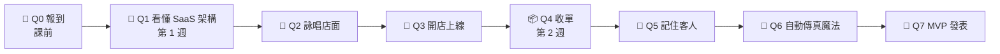

# 🗺️ 冒險地圖：從實習生到連續創業家

> 這門課是一場 4 小時的冒險。每完成一個關卡就拿到經驗值（XP）和徽章。
> 把進度記在你自己的 [冒險護照](../templates/passport_README.md) 上，用 [Vibe 健檢站](../tools/vibe_check.html) 驗收！

[← 回課程首頁](../README.md)

---

## 🧭 冒險路線

## ⭐ 等級

| 等級 | 需要 XP | 稱號 | 你現在能做到的事 |
| --- | --- | --- | --- |
| Lv.0 | 0 | 🥚 **實習生** | 準備好了，冒險開始！ |
| Lv.1 | 100 | 🐣 **見習創辦人** | 看得懂社群媒體的 SaaS 架構，手上有一個 Copilot 做的網頁 |
| Lv.2 | 250 | 🐥 **創辦人** | 網站已經上線，全世界都能逛 |
| Lv.3 | 400 | 🦅 **連續創業家** | 有會收名單、會記住客人、能自動更新的 MVP |
| Lv.4 | 500+ | 🦄 **獨角獸** | 主線全破＋5 個以上支線，你已經可以教別人了 |

---

## 🗡️ 主線任務（必做）

| 關卡 | 任務 | 完成條件（怎樣算過關） | XP | 徽章 | 教材 |
| --- | --- | --- | --- | --- | --- |
| **Q0** | 🥚 報到 | 有 GitHub、Netlify 帳號，裝好 VS Code＋Git＋Copilot，並請 Copilot 做出「Hello NTPU」網頁 | 20 | 🎫 報到徽章 | [課前準備](tutorials/before_class.md) |
| **Q1** | 🧠 看懂 SaaS 架構 | [社群媒體架構](../lectures/wk01_1007_saas-storefront/slides/social_saas.html) 或 [美食街](../lectures/wk01_1007_saas-storefront/slides/foodcourt.html) 小測驗答對 4 題以上 | 30 | 🧠 架構師徽章 | [第 1 週](../lectures/wk01_1007_saas-storefront/README.md) |
| **Q2** | 🎨 詠唱店面 | 建好 GitHub repo 並 clone 到 VS Code，用 Copilot 做出能預覽的 `index.html` | 50 | 🎨 設計師徽章 | [咒語集](../lectures/wk01_1007_saas-storefront/prompts.md) |
| **Q3** | 🏪 開店上線 | Commit ＋ Sync 到 GitHub，網站部署在 Netlify，手機打得開；健檢站 Level 1 全亮 | 60 | 🏪 開店徽章 | [部署教學](tutorials/github_netlify_deploy.md) |
| **Q4** | 📦 收單 | Netlify 後台收到 3 筆以上名單；健檢站 Level 2 全亮 | 60 | 📦 收單徽章 | [第 2 週](../lectures/wk02_1014_baas-cicd/README.md) |
| **Q5** | 💾 記住客人 | 送出後顯示「歡迎回來，[名字]」，重新整理還在；健檢站 Level 3 全亮 | 50 | 💾 記憶徽章 | [LocalStorage](tutorials/localstorage.md) |
| **Q6** | 🔄 自動傳真魔法 | 改版後 Commit ＋ Sync，沒進 Netlify 就在手機看到更新 | 50 | 🔄 魔法師徽章 | [CI/CD](tutorials/cicd.md) |
| **Q7** | 🎤 MVP 發表 | 用 1 分鐘向同學介紹你的產品與架構 | 80 | 🎤 說書人徽章 | [Pitch 模板](pitch_template.md) |
| | | | **400** | | |

## 🧩 支線任務（自選，每個 +20 XP）

挑你有興趣的做，**沒有必做**。完成的人可以在冒險護照打勾。

| 支線 | 任務 | 適合誰 |
| --- | --- | --- |
| 🏷️ **門牌大師** | 把 Netlify 網址改成好記的名字（例如 `ntpu-rent-radar`） | 所有人（超簡單！） |
| 📱 **手機美容師** | 用手機檢查網站，請 AI 修好至少 2 個跑版的地方 | 在意細節的人 |
| 🔔 **小鈴鐺** | 設定 [表單 Email 通知](tutorials/netlify_forms.md#進階設定email-通知)，有人填表時收到信 | 想要即時回饋的人 |
| 🎯 **市場獵人** | 讓 5 位**不是同學**的目標客群填寫你的早鳥名單 | 想真的創業的人 |
| 🤖 **機器人助教** | 在自己的 repo 裝上 [自動健檢](tutorials/vibe_check_ci.md)，拿到綠色勾勾 ✅ | 喜歡挑戰的人 |
| 🤝 **社群之星** | 在作品巡禮中給 3 位同學「我喜歡／我希望／如果」回饋 | 喜歡交朋友的人 |
| 📖 **研究員** | 從 [延伸學習資源](resources.md) 讀一篇，在護照寫 3 句心得 | 喜歡閱讀的人 |
| 🧪 **實驗家** | 請 AI 做一個 A/B 版本（兩種標題），比較哪個名單比較多 | 喜歡數據的人 |
| 🌏 **雙語店長** | 請 AI 幫網站加上「中文／English」切換按鈕 | 想做國際市場的人 |
| 🖼️ **作品牆明星** | 把你的網站登記到 [作品牆](../showcase/README.md) | 所有人 |
| 🌳 **Git 達人** | 累積 10 個以上「一看就懂」的 commit 訊息（到 GitHub 的 Commits 頁面檢查） | 喜歡整理的人 |
| 🏛️ **架構偵探** | 挑一個你常用的 App（Uber Eats、Spotify、Dcard…），參考 [社群媒體架構圖](../lectures/wk01_1007_saas-storefront/social_media_architecture.md) 畫出它的 SaaS 架構 | 好奇心旺盛的人 |

---

## 🏅 徽章一覽

| 徽章 | 名稱 | 代表你 |
| --- | --- | --- |
| 🎫 | 報到徽章 | 準備好了 |
| 🧠 | 架構師徽章 | 看得懂社群媒體與現代 SaaS 的架構 |
| 🎨 | 設計師徽章 | 會用 GitHub 與 Copilot 做出產品門面 |
| 🏪 | 開店徽章 | 網站已經面向全世界 |
| 📦 | 收單徽章 | 會串接 BaaS 收集客戶資料 |
| 💾 | 記憶徽章 | 懂得前端怎麼「記住」使用者 |
| 🔄 | 魔法師徽章 | 體驗過科技公司的敏捷開發 |
| 🎤 | 說書人徽章 | 能用專業語言說明自己的產品 |
| 🎓 | 完課證書 | 全部主線通關！到 [健檢站](../tools/vibe_check.html) 列印你的證書 |

> 💡 **給同學的話**：徽章是用來「看見自己的進步」，不是拿來跟別人比的。
> 每個人的起點不同，今天比昨天的自己多會一件事，就是勝利。🌱
