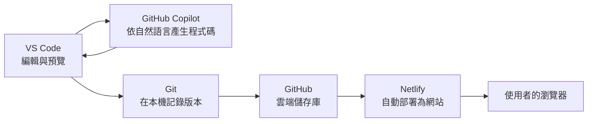

# 課前準備清單（檢核點 0）

> **完成期限**：2026/10/7 第一次上課前
> **預估時間**：40–60 分鐘（其中大部分為下載、安裝與等待驗證信；GitHub 學生方案審核另需數天）
> **完成條件**：GitHub 與 Netlify 帳號可登入；VS Code、Git、GitHub Copilot 可正常使用；已以 Copilot 產生「Hello NTPU」頁面。

[← 回課程首頁](../../README.md)　｜　[教學目錄](README.md)　｜　[學習檢核點](../checkpoints.md)

---

## 1. 學習目標

完成本清單後，你應能：

1. 說明本課程每一項帳號與工具在整體開發流程中的角色。
2. 在自己的電腦上建立可運作的開發環境（編輯器、版本控制、AI 程式設計助理）。
3. 以 AI 程式設計助理產生第一個網頁，並在本機預覽。

請務必在課前完成。課堂上數十人同時下載安裝程式、等待驗證信，會大幅壓縮實作時間；此外，帳號的雙重驗證與學生身分審核都需要時間，無法在課堂上即時完成。

## 2. 為什麼需要這些工具：開發流程總覽

本課程的所有工具構成一條完整的軟體交付流程：在本機撰寫與修改 → 記錄版本 → 上傳至雲端儲存庫 → 自動部署為公開網站。

| 項目 | 類型 | 在流程中的角色 | 若缺少會怎樣 | 預估時間 |
| --- | --- | --- | --- | --- |
| 筆記型電腦 | 硬體 | 執行開發工具的本機環境 | 無法安裝 VS Code 與 Git | — |
| GitHub 帳號 | 雲端服務帳號 | 存放程式碼的雲端儲存庫；同時是 Copilot 與 Netlify 的登入身分 | Copilot 無法啟用、Netlify 無法連接程式碼 | 5–10 分鐘 |
| VS Code | 本機軟體 | 程式碼編輯器，也是 Copilot 與 Git 的操作介面 | 沒有可編輯與預覽檔案的工作環境 | 5–10 分鐘 |
| Git | 本機軟體 | 版本控制系統，記錄每次修改並與 GitHub 同步 | VS Code 的「原始檔控制」功能無法使用 | 5–10 分鐘 |
| GitHub Copilot | AI 服務（綁定 GitHub 帳號） | 依自然語言指示產生與修改程式碼 | 需要自行撰寫全部程式碼 | 5 分鐘 |
| Netlify 帳號 | 雲端服務帳號 | 從 GitHub 讀取程式碼並部署為公開網站，並提供表單收集服務 | 網站無法對外公開 | 3–5 分鐘 |

課堂中常以「美食街」比喻：GitHub 是集團總部保存設計圖的保險庫，Netlify 是提供攤位與水電的商場，VS Code 是廚房工作台。比喻僅用於建立直覺，各工具的精確定義請見 [名詞解釋](../glossary.md)。

## 3. 系統需求

| 項目 | 需求 | 說明 |
| --- | --- | --- |
| 作業系統 | Windows 10／11，或 macOS 近兩年內的版本 | VS Code 亦支援 Linux。Chromebook 與平板電腦無法安裝桌面版 VS Code 與 Git，不適用 |
| 儲存空間 | 至少 2 GB 可用空間 | VS Code、Git 與延伸模組合計約數百 MB，另需保留專案與暫存空間 |
| 網路 | 可連線至 github.com、netlify.com、code.visualstudio.com | 校園網路一般可正常使用；若使用公司或特殊網路，可能被防火牆阻擋 |
| 瀏覽器 | Chrome、Edge、Firefox 或 Safari 的新版 | 用於 GitHub、Netlify 操作與網站測試 |
| 權限 | 可安裝軟體的使用者帳號 | 學校電腦教室的公用電腦多半會在重新開機後還原，且可能禁止安裝，請事先與教師確認 |
| 手機 | 可上網的智慧型手機 | 用於雙重驗證 App，以及在行動裝置上驗收網站排版 |

## 4. 操作步驟

### 4.1 申請 GitHub 帳號

**用途**：GitHub 是全球最大的程式碼代管平台。本課程中，它同時扮演三個角色：(1) 存放你網站原始碼的雲端儲存庫；(2) GitHub Copilot 的授權身分；(3) Netlify 讀取程式碼時的來源。

1. 前往 <https://github.com/signup>。
2. 填寫 Email、密碼與使用者名稱（Username）。
   - 使用者名稱會出現在網址中（例如 `https://github.com/amy-ntpu-2026`），也會出現在你的公開作品上。建議使用英文與數字，避免使用真實全名或學號，以降低個人資料曝光。
3. 至信箱收取驗證碼完成註冊。
4. 啟用 [雙重驗證（Two-Factor Authentication, 2FA）](https://docs.github.com/zh/authentication/securing-your-account-with-two-factor-authentication-2fa/configuring-two-factor-authentication)。GitHub 要求所有提交程式碼的帳號啟用 2FA。建議在手機安裝驗證 App（例如 Google Authenticator 或 Microsoft Authenticator），並**將復原碼（recovery codes）另外保存**；手機遺失時，復原碼是取回帳號的主要途徑。
5. （強烈建議）以學校信箱申請 [GitHub Education 學生方案](https://education.github.com/pack)。通過學生身分驗證後，可免費使用 GitHub Copilot Pro，使用額度高於免費版。審核通常需要數天，請盡早申請；未通過也不影響上課，Copilot Free 足以完成本課程。

官方說明：[建立 GitHub 帳號](https://docs.github.com/zh/account-and-profile/how-tos/account-management/creating-an-account-on-github)

### 4.2 安裝 VS Code、Git 並啟用 Copilot

**用途**：VS Code 是本課程的主要工作環境；Git 負責在本機記錄版本；Copilot 是在 VS Code 中運作的 AI 程式設計助理。三者的詳細說明與安裝步驟見 [VS Code 與 GitHub Copilot 入門](vscode_copilot_starter.md)，請依序完成：

- [ ] 安裝 VS Code
- [ ] 安裝 Git，並設定 `user.name` 與 `user.email`
- [ ] 在 VS Code 以 GitHub 帳號登入
- [ ] 啟用 GitHub Copilot（Free 方案即可）
- [ ] 安裝 Microsoft 出品的 Live Preview 延伸模組
- [ ] 以 Copilot 產生「Hello NTPU」網頁並預覽

**為何要求課前完成 Hello NTPU**：這個練習同時驗證了整條本機工具鏈（VS Code 開啟資料夾、Copilot 已授權並可寫入檔案、預覽功能可用）。若任何一環有問題，會在課前就被發現，而不是在課堂實作時才出現。

### 4.3 申請 Netlify 帳號

**用途**：Netlify 是網站託管與部署平台。它會從你的 GitHub 儲存庫讀取檔案，並將網站發布到網際網路上；第 2 週也會使用它提供的表單收集服務（Netlify Forms）。

1. 前往 <https://app.netlify.com/signup>。
2. 選擇 **Sign up with GitHub**。以 GitHub 帳號登入可簡化後續授權流程，Netlify 需要取得讀取你指定儲存庫的權限才能自動部署。
3. 依畫面回答用途問題（選擇個人／學習用途即可）。免費方案**不需要綁定信用卡**。

方案說明：[Netlify Pricing](https://www.netlify.com/pricing/)。本課程只使用免費方案；免費方案有頻寬、建置時間與表單提交數等額度限制，課程作業的用量遠低於上限。

### 4.4 （選做）預覽互動教材

- [社群媒體的 SaaS 架構](../../lectures/wk01_1007_saas-storefront/slides/social_saas.html)：一則貼文從發布到出現在他人動態，背後經過哪些系統元件。
- [Git 流程模擬器](../../lectures/wk01_1007_saas-storefront/slides/git_flow.html)：在瀏覽器中模擬 Commit 與 Sync。

在 GitHub 網頁上點開 `.html` 只會顯示原始碼。若要看到互動畫面，請將課程 repo 下載到電腦：

- **建議做法（同時練習 clone）**：VS Code → 原始檔控制 → **複製存放庫（Clone Repository）** → 貼上 `https://github.com/cychiang-ntpu/VibeNTPU` → 選擇存放位置。日後教材更新時，只要按 **同步變更（Sync Changes）** 即可取得最新版本。
- **替代做法**：在 GitHub 頁面按綠色 **Code** 按鈕 → **Download ZIP**，解壓縮。

之後在檔案總管（Finder）中雙擊 `.html` 檔，即可用瀏覽器開啟。

### 4.5 初步構想創業題目

第 1 週將以你的題目製作產品形象首頁（landing page）。課前請先準備 1–2 個方向，並試著回答三個問題：**目標使用者是誰？他們目前如何解決這個問題？為什麼現有做法不夠好？** 例如：

| 題目 | 目標使用者 | 待解決的問題 |
| --- | --- | --- |
| 大學生租屋評價平台 | 三峽地區在外租屋的學生 | 房東資訊不透明，租屋糾紛難以事先避免 |
| 二手教科書交換平台 | 修習相同課程的學生 | 教科書價格高、使用期短，學期末缺乏交易管道 |
| 校園周邊餐飲地圖 | 新生與交換生 | 資訊散落於社群貼文，難以依價格與距離篩選 |
| 寵物短期照顧媒合 | 假期返鄉的學生飼主 | 缺乏可信任、價格透明的短期照顧者 |

更多依學院分類的題目見 [第 1 週講義](../../lectures/wk01_1007_saas-storefront/README.md)。

## 5. 課前自我檢核

- [ ] GitHub 帳號可以登入，且已啟用雙重驗證並保存復原碼
- [ ] VS Code 左下角的帳戶圖示顯示我的 GitHub 帳號
- [ ] 在 VS Code 終端機輸入 `git --version` 可看到版本號
- [ ] `git config --global user.name` 與 `user.email` 已設定
- [ ] Copilot Chat 面板可以開啟並回應
- [ ] 已以 Copilot 產生「Hello NTPU」網頁並成功預覽
- [ ] Netlify 帳號已透過 GitHub 登入建立
- [ ] 已構想 1–2 個創業題目，並能說明目標使用者與待解決問題

全部完成後，請在 [學習歷程檔案](../../templates/portfolio_README.md) 勾選檢核點 0（第 1 週課堂會說明如何將它放到自己的 GitHub repo）。

## 6. 遇到問題時

請先查閱 [疑難排解手冊](error_guide.md#3-vs-codegitcopilot)，其中涵蓋登入、Copilot 啟用、Git 安裝與設定等常見狀況。若仍無法解決，請將錯誤畫面截圖並說明你執行了哪些步驟，貼到課程群組。課前未能完成屬常見情況，教師與助教會在上課前 10 分鐘協助處理。
