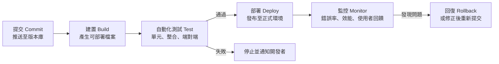

# CI/CD：持續整合與持續部署

[← 回第 2 週講義](../../lectures/wk02_1014_baas-cicd/README.md)

---

## 1. 學習目標

1. 區分持續整合、持續交付與持續部署三個概念。
2. 描述典型的部署管線（pipeline）及每個階段的目的。
3. 說明 Netlify 的 Git 整合如何運作，包括原子式部署、不可變部署與即時回復。
4. 解釋小而頻繁的發布為何能降低風險，並指出本課程流程的不足之處。

## 2. 核心概念

### 2.1 引入

第 1 週以美食街比喻：總部（GitHub）的設計圖一更新，自動傳真機就把新圖送到分店（Netlify），分店隨即換上新裝潢而不需停業。以下說明這台「傳真機」背後的精確定義與機制。

### 2.2 三個定義

| 名詞 | 定義 | 關鍵特徵 |
| --- | --- | --- |
| 持續整合（Continuous Integration, CI） | 團隊成員頻繁（通常每天至少一次）將修改合併到共同的主線（mainline），每次合併都自動執行建置與測試，以儘早發現整合錯誤 | 重點在**自動驗證**：每次變更都經過自動化測試 |
| 持續交付（Continuous Delivery） | 在 CI 的基礎上，確保軟體隨時處於可發布狀態；是否、何時發布到正式環境，由人以一個按鈕決定 | 可發布，但**發布由人決定** |
| 持續部署（Continuous Deployment） | 通過管線所有檢查的變更，**自動**發布到正式環境，無需人工介入 | 全自動，對自動化測試的依賴最高 |

縮寫 CI/CD 中的 CD 可能指持續交付或持續部署，閱讀文獻時須依上下文判斷。

### 2.3 典型的部署管線

1. **提交**：開發者將變更推送到版本庫（本課程為 GitHub）。
2. **建置**：將原始碼轉成可部署的檔案，例如編譯、打包、壓縮。純 HTML 網站幾乎不需建置。
3. **自動化測試**：以程式驗證功能是否正確。這是 CI 的核心；缺少這一步，管線只是在「自動地把可能有錯的東西送上線」。
4. **部署**：將產出發布到使用者可存取的環境。
5. **監控**：觀察上線後的錯誤率與效能，發現問題時回復或修正。

### 2.4 Netlify 的 Git 整合如何運作

第 1 週以「Import from Git」建立網站時，Netlify 已完成以下設定：

1. **Webhook 通知**：Netlify 在 GitHub 上登記通知機制（透過 GitHub App 或 Webhook）。每當你推送到指定分支（本課程為 `master` 或 `main`），GitHub 便向 Netlify 發出一個 HTTP 請求，告知有新的提交。
2. **建置**：Netlify 取得該版本的程式碼，執行設定中的建置指令（本課程沒有建置指令，直接使用資料夾中的檔案），並在此階段解析 HTML 表單。
3. **上傳與發布**：將產出檔案上傳到 Netlify 的內容傳遞網路（Content Delivery Network, CDN），並發布為正式版本。

此機制的三個重要性質：

- **原子式部署（atomic deploy）**：新版本的所有檔案全部上傳完成後，才一次切換為正式版本。使用者不會看到「一半新、一半舊」的網站；若部署失敗，正式網站維持原版本不受影響。
- **不可變部署（immutable deploy）**：每次部署都是一份不會再被修改的完整快照，並擁有自己的專屬網址（在 Deploys 頁面點選任一筆即可看到）。可以用這個網址比對不同版本。
- **即時回復（instant rollback）**：由於舊版本的快照都還保留著，回到舊版只需在 Deploys 頁面選擇先前的某一筆部署並按 **Publish deploy**，Netlify 直接把正式網址指向那份快照，不需重新建置，通常數秒內生效。官方說明：[Netlify：Rollbacks](https://docs.netlify.com/deploy/manage-deploys/manage-deploys-overview/#rollbacks)

**延伸主題：部署預覽（Deploy Previews）**。在團隊協作中，修改通常先放在分支並開啟拉取請求（pull request），Netlify 可以為每個拉取請求自動產生一個預覽網址，讓團隊在合併前實際檢視變更。本課程只使用單一分支，未涉及此流程。

以上一節的定義來看，本課程的設定屬於**持續部署**：推送即自動上線。但由於沒有自動化測試，它並不具備完整的持續整合。Netlify 也提供停止自動發布的選項，改為在 Deploys 頁面手動發布，即接近持續交付的做法。

官方說明：[Netlify：Deploy with Git](https://docs.netlify.com/deploy/create-deploys/#deploy-with-git)

### 2.5 為何小而頻繁的發布風險較低

傳統做法是累積數週或數月的修改，一次大規模上線，常需要停機維護。持續部署鼓勵相反的做法：

- **變更越小，問題越容易定位**：若上線後出錯，只需檢查最近一次的少量修改。
- **回復成本低**：搭配不可變部署，回到上一版幾乎沒有成本，使團隊敢於發布。
- **回饋更快**：修改在數分鐘內就能被使用者看到，與精實創業的「建構—測量—學習」循環相輔相成。

DORA（DevOps Research and Assessment）研究計畫長期調查軟體團隊的交付表現，以部署頻率、變更前置時間、變更失敗率與失敗後的復原時間等指標衡量，其研究指出交付速度與穩定性並非必然互相牴觸。延伸閱讀：[dora.dev](https://dora.dev/)

### 2.6 本課程設定的限制

- **沒有自動化測試**：任何推送都會直接上線，包括壞掉的版本。目前唯一的防線是你在按 Keep 與 Commit 前的人工檢查。
- **直接推送到正式分支**：沒有分支與審查流程，錯誤會立即影響所有訪客。
- **沒有監控**：網站出錯時不會有人收到通知，只能靠自己或使用者發現。

第一步改善：延伸任務「GitHub Actions 自動檢核」（見 [自動檢核教學](vibe_check_ci.md)）會在每次推送時自動執行檢查腳本，這就是持續整合中「自動驗證」的雛形。注意該檢查與 Netlify 部署是平行進行的，它會標示問題，但不會阻止部署。

## 3. 操作步驟（約 10 分鐘）

### 步驟 1：記下目前的狀態
以手機開啟你的網站，記下按鈕顏色或標題文字等明顯特徵。

### 步驟 2：請 Copilot 做一項明顯的修改
使用 [第 2 週提示詞 3](../../lectures/wk02_1014_baas-cicd/prompts.md)，例如將按鈕改為亮橘色。檢視差異後按 **Keep**。

### 步驟 3：Commit＋Sync
1. VS Code 左側 **原始檔控制**（`Ctrl+Shift+G`／`⌃⇧G`）。
2. 訊息輸入 `改按鈕顏色` → **提交（Commit）**。
3. 按 **同步變更（Sync Changes）**。

### 步驟 4：不操作 Netlify，直接觀察
- **不要**進入 Netlify 按任何按鈕。
- 約 10–30 秒後，以手機重新整理網頁，確認已更新。這即完成**檢核點 6**。

若想觀察幕後過程，可開啟 Netlify → 你的專案 → **Deploys**，會看到一筆新的部署紀錄，並顯示你剛才的 Commit 訊息與建置日誌。

手機未更新時，可能是瀏覽器快取，可嘗試下拉重新整理或以無痕模式開啟；若 Deploys 頁面顯示失敗，請查閱 [疑難排解手冊](error_guide.md)。

### 步驟 5（選做）：練習回復
1. 在 Deploys 頁面點選上一筆成功的部署 → **Publish deploy**，確認網站回到舊版。
2. 注意：此時 GitHub 上的程式碼仍是新版。下一次推送時，Netlify 會部署新推送的版本。若要讓程式碼也回到舊版，應在 Git 中處理（見 [Git 入門](git_intro.md)）。
3. 練習完成後，選回最新一筆部署並發布，或推送一次新修改。

查看歷史的其他方式：GitHub repo 頁面的 **Commits**；VS Code 原始檔控制面板的 **圖表（Graph）** 或檔案總管的 **時間軸（Timeline）**。

## 4. 討論與延伸思考

1. 為什麼說「沒有自動化測試的持續部署」可能比手動部署更危險？在什麼條件下，它仍然是合理的選擇？
2. Netlify 的回復不需要重新建置。這個性質來自哪一項設計？若網站每次部署都直接覆蓋伺服器上的舊檔案，回復會變得多困難？
3. 在 Netlify 回復到舊版之後，GitHub 上的程式碼與正式網站暫時不一致。這可能造成什麼混淆？團隊應如何處理？
4. 對你的產品而言，哪一種錯誤上線後代價最高（例如表單失效導致名單遺失）？你會為它設計什麼自動檢查？

## 5. 參考資料

- Fowler, M.：[Continuous Integration](https://martinfowler.com/articles/continuousIntegration.html)
- Humble, J.：[Continuous Delivery](https://continuousdelivery.com/)
- DORA：[dora.dev](https://dora.dev/)
- Netlify Docs：[Deploy with Git](https://docs.netlify.com/deploy/create-deploys/#deploy-with-git)、[Rollbacks](https://docs.netlify.com/deploy/manage-deploys/manage-deploys-overview/#rollbacks)
- GitHub：[What is CI/CD?](https://github.com/resources/articles/devops/ci-cd)、[GitHub Actions 文件](https://docs.github.com/zh/actions)
- Red Hat：[什麼是 CI/CD？](https://www.redhat.com/zh/topics/devops/what-is-ci-cd)
- [敏捷軟體開發宣言](https://agilemanifesto.org/iso/zhcht/manifesto.html)

---

下一步：準備 MVP 發表，參考 [期末 Pitch 模板](../pitch_template.md)。
