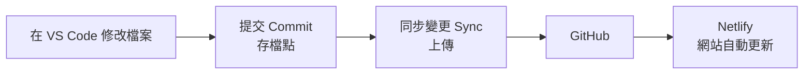

# Git 與 GitHub 入門

> **對應檢核點**：檢核點 2（建立 repo 並複製到電腦）、檢核點 3（提交並同步到 GitHub）
> **預估時間**：約 30 分鐘
> **操作方式**：全部在 VS Code 與 GitHub 網頁上按按鈕完成，不需要輸入指令。
> **先備條件**：已完成 [課前準備清單](before_class.md)（VS Code、Git、GitHub 登入都已設定）。

[← 回教學目錄](README.md)　｜　互動版：[Git 流程模擬器](../../lectures/wk01_1007_saas-storefront/slides/git_flow.html)

---

## 先懂三件事

1. **repo（儲存庫）** 是放在 GitHub 上的專案資料夾，會記住每一次修改。你的網站就是一個 repo。
2. **提交（Commit）** 就像遊戲的存檔點：把目前的檔案狀態存成一個版本，改壞了可以回來。
3. **同步變更（Sync Changes）** 是把電腦上的存檔點上傳到 GitHub。**只按提交，GitHub 和網站都不會更新**，一定要再按同步變更。

整個流程只有一條路：

想了解原理（暫存區、commit 雜湊值、分支、合併衝突）：見 [Git、Copilot 與部署機制（選讀）](../deep_dive/git_and_copilot.md)。

---

## 步驟 1：在 GitHub 建立 repo（約 3 分鐘）

這一步在 GitHub 上建立一個新的專案資料夾，之後你的網站檔案都放在這裡。

1. 打開瀏覽器，前往 <https://github.com/new>（需先登入 GitHub）。
2. 在 **Repository name** 欄位輸入 `rent-radar`（換成你的題目；只能用英文小寫、數字和 `-`）。
3. 在 **Description** 欄位輸入一句話介紹你的產品（可不填）。
4. 選擇 **Public**。
5. 找到 **Add README** 或 **Add a README file** 選項，把它打開（勾選）。
6. 按頁面最下方綠色的 **Create repository** 按鈕。

**完成後你應該看到：** 網址變成 `github.com/你的帳號/rent-radar`，頁面中間有一個 `README.md` 檔案。

**如果不一樣：** 顯示「name already exists」→ 換一個名字，例如加上學號末三碼。

---

## 步驟 2：把 repo 複製到電腦（Clone）（約 5 分鐘）

複製（Clone）＝把 GitHub 上的 repo 下載到電腦，並保持連線，之後才能上傳修改。

1. 打開 VS Code。若已開啟其他資料夾，先點選上方選單 **檔案 > 關閉資料夾（File > Close Folder）**。
2. 在 VS Code 最左邊那一排圖示中，點選形狀像樹枝分岔的圖示（**原始檔控制，Source Control**），或按 `Ctrl+Shift+G`（Mac：`⌃⇧G`）。
3. 按藍色的 **複製存放庫（Clone Repository）** 按鈕。
4. 畫面上方會出現輸入框，點選 **從 GitHub 複製（Clone from GitHub）**。
5. 若瀏覽器跳出授權頁面，按 **Authorize**，再按 **開啟** 回到 VS Code。
6. 在清單中點選 `你的帳號/rent-radar`。
7. 在跳出的視窗中選擇存放位置，例如「文件」資料夾，按 **選取為存放庫目的地（Select as Repository Destination）**。
8. 右下角詢問「是否要開啟複製的存放庫？」時，按 **開啟（Open）**。
9. 若詢問是否信任作者，按 **是，我信任作者**。

**完成後你應該看到：** VS Code 左側檔案總管出現 `README.md`，最上方顯示 `RENT-RADAR`。

**如果不一樣：** 清單中找不到你的 repo → 確認步驟 1 已完成，並確認 VS Code 左下角登入的是同一個 GitHub 帳號。

---

## 步驟 3：修改檔案，看懂變更標記（約 5 分鐘）

這一步讓 Copilot 建立網頁，並學會看 VS Code 如何標示「有哪些檔案改過」。

1. 按 `Ctrl+Alt+I`（Mac：`⌃⌘I`）打開 Copilot 聊天面板，模式選 **Agent**。
2. 依 [第 1 週提示詞集](../../lectures/wk01_1007_saas-storefront/prompts.md) 請 Copilot 建立 `index.html`。
3. 看過預覽後，按 **保留（Keep）**。
4. 點選左側的 **原始檔控制** 圖示（樹枝分岔的圖示）。

**完成後你應該看到：** 原始檔控制圖示上出現一個數字（例如 `1`），面板的「變更（Changes）」底下列出 `index.html`，檔名右邊有一個字母：

| 字母 | 意思 |
| --- | --- |
| **U** | 新檔案，還沒存過檔點（Untracked） |
| **M** | 已存過檔點的檔案被修改了（Modified） |
| **D** | 檔案被刪除了（Deleted） |

點一下檔名，可以看到修改前（左）與修改後（右）的比較，綠色是新增、紅色是刪除。

**如果不一樣：** 面板顯示「目前開啟的資料夾沒有 Git 存放庫」→ 你開的不是步驟 2 複製下來的資料夾，用 **檔案 > 開啟資料夾** 重新選擇 `rent-radar`。

---

## 步驟 4：提交（Commit）（約 2 分鐘）

這一步把目前的檔案存成一個存檔點。

1. 在 **原始檔控制** 面板最上方的訊息框，輸入這次做了什麼，例如 `新增第一版首頁`。
2. 按藍色的 **提交（Commit）** 按鈕。
3. 若跳出「沒有暫存的變更，是否要暫存所有變更並直接提交？」，按 **是（Yes）**。若有「一律（Always）」選項，也可以選它，之後就不會再問。

**完成後你應該看到：** 「變更」清單清空，藍色按鈕變成 **同步變更 ↑1（Sync Changes ↑1）**。`↑1` 表示有 1 個存檔點還沒上傳。

**如果不一樣：** 跳出「請設定 user.name 和 user.email」→ 回到 [課前準備清單](before_class.md) 步驟 5 設定後，再按一次提交（也可看 [疑難排解手冊](error_guide.md) Q6）。

---

## 步驟 5：同步變更（Sync）（約 1 分鐘）

這一步把存檔點上傳到 GitHub。**沒有這一步，GitHub 和網站都不會更新。**

1. 按 **同步變更 ↑1（Sync Changes ↑1）** 按鈕。
2. 第一次使用時會跳出說明視窗，按 **確定（OK）**（或 **確定，不要再顯示（OK, Don't Show Again）**）。
3. 等待幾秒鐘。

**完成後你應該看到：** 同步變更按鈕消失，原始檔控制圖示上的數字不見了。

**如果不一樣：** 出現 `rejected` 或登入失敗 → 見 [疑難排解手冊](error_guide.md) Q8。找不到同步變更按鈕 → 見 Q7。

**這一步在架構中的位置：** 你剛剛把網頁存進了 GitHub，也就是課程架構中的「版本控制」。之後連上 Netlify，每次同步變更網站就會自動更新。

---

## 步驟 6：在 GitHub 網頁確認（約 1 分鐘）

1. 回到瀏覽器中你的 repo 頁面（`github.com/你的帳號/rent-radar`）。
2. 按 `F5`（Mac：`⌘R`）重新整理。

**完成後你應該看到：** 檔案清單中出現 `index.html`，旁邊顯示你剛才寫的訊息 `新增第一版首頁`。

**如果不一樣：** 看不到 `index.html` → 回 VS Code 確認步驟 5 的同步變更按鈕已經消失；若還在，再按一次。

---

## 步驟 7：查看歷史紀錄（約 3 分鐘）

每一次提交都會留下紀錄。你可以在 VS Code 或 GitHub 查看。

### 在 VS Code 看單一檔案的歷史

1. 點選左側最上面的 **檔案總管（Explorer）** 圖示（兩張紙重疊的圖示）。
2. 在檔案清單中點選 `index.html`。
3. 在檔案總管面板最下方，找到並展開 **時間軸（Timeline）**。

**完成後你應該看到：** 時間軸列出這個檔案的每一次提交，例如 `新增第一版首頁`。點一下可以看到當時改了什麼。

### 在 GitHub 看整個專案的歷史

1. 在 GitHub repo 頁面，找到檔案清單右上方的 **Commits**（前面有時鐘圖示和數字）。
2. 點進去。

**完成後你應該看到：** 所有提交紀錄由新到舊排列。點任一筆可以看到修改內容，綠色是新增，紅色是刪除。

**如果不一樣：** 找不到時間軸 → 在檔案總管面板任一標題上按右鍵，確認 **時間軸（Timeline）** 有打勾。

---

## 步驟 8：還原還沒提交的修改（捨棄變更）（約 2 分鐘）

改壞了、而且還沒按提交時，可以一鍵回到上一個存檔點。

1. 點選左側的 **原始檔控制** 圖示。
2. 在「變更」清單中，把滑鼠移到改壞的檔案（例如 `index.html`）上。
3. 檔名右邊會出現幾個小圖示，按彎曲箭頭形狀的 **捨棄變更（Discard Changes）**。
4. 跳出確認視窗時，按 **捨棄檔案（Discard File）**。

**完成後你應該看到：** 檔案從「變更」清單消失，內容回到最後一次提交時的樣子。

**如果不一樣：** 這個動作無法復原，按之前請確定。

**其他情況：**

- Copilot 剛改完、還沒按保留 → 直接在聊天面板按 **復原（Undo）** 即可。
- 已經提交過 → 請參考 [疑難排解手冊](error_guide.md) Q4，或求助助教。

---

## 步驟 9：在 GitHub 網頁改過檔案後，回 VS Code 先按同步變更（約 1 分鐘）

有時你會直接在 GitHub 網頁上修改檔案（例如編輯 `README.md` 學習歷程）。這時 GitHub 上的版本比你電腦上的新，回到 VS Code 要先把新版本拿回來。

1. 回到 VS Code，點選左側的 **原始檔控制** 圖示。
2. 若看到 **同步變更 ↓1（Sync Changes ↓1）**，按下它。`↓1` 表示 GitHub 上有 1 個新存檔點要下載。
3. 若沒有看到按鈕，點面板上方的 **...（更多動作）** → **提取（Pull）**。

**完成後你應該看到：** 你在 GitHub 網頁上做的修改，出現在 VS Code 的檔案中。

**如果不一樣：** 跳出「合併衝突（Merge Conflict）」→ 先不要再按任何按鈕，截圖後求助助教。預防方法：**每次開始工作前，先按一次同步變更**；同一個檔案不要同時在網頁和 VS Code 上修改。

---

## 附錄 A：把課程教材複製到電腦（選做）

課程的互動教材（例如 [Git 流程模擬器](../../lectures/wk01_1007_saas-storefront/slides/git_flow.html)）在 GitHub 網頁上點開只會看到原始碼，要下載到電腦才能操作。

1. 在 VS Code 點選 **檔案 > 關閉資料夾**。
2. 點選 **原始檔控制** 圖示 → **複製存放庫（Clone Repository）**。
3. 在上方輸入框貼上 `https://github.com/cychiang-ntpu/VibeNTPU`，按 Enter。
4. 選擇存放位置，按 **選取為存放庫目的地**，再按 **開啟**。
5. 到檔案總管（Mac：Finder）找到該資料夾中的 `.html` 檔，雙擊即可用瀏覽器開啟。

**完成後你應該看到：** 瀏覽器中顯示可以操作的互動畫面。教材更新時，回 VS Code 按 **同步變更** 即可取得最新版本。

---

## 附錄 B：按鈕與指令對照表（參考）

本課程不需要輸入指令。這張表只是讓你知道每個按鈕背後在做什麼，看官方文件或錯誤訊息時比較看得懂。

| VS Code 操作 | 對應指令 |
| --- | --- |
| 複製存放庫（Clone Repository） | `git clone <網址>` |
| 原始檔控制面板的檔案清單 | `git status` |
| 檔案旁的 ＋（暫存變更） | `git add <檔案>` |
| 提交（Commit） | `git commit -m "訊息"` |
| 同步變更（上傳的部分） | `git push` |
| 同步變更（下載的部分）、提取（Pull） | `git pull` |
| 時間軸、GitHub Commits | `git log` |
| 捨棄變更（Discard Changes） | `git restore <檔案>` |

---

## 完成檢查

- [ ] GitHub 上有我的 repo，裡面有 `README.md`
- [ ] repo 已複製到電腦，VS Code 可以看到檔案
- [ ] 已提交並同步變更，GitHub 網頁上看得到 `index.html` 和我的提交訊息
- [ ] 會用時間軸或 GitHub Commits 查看歷史
- [ ] 知道還沒提交時，可以用捨棄變更回到上一版

更多問題見 [疑難排解手冊](error_guide.md)。下一步：[將網站部署到 Netlify](github_netlify_deploy.md)。
