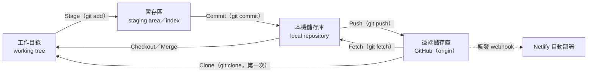
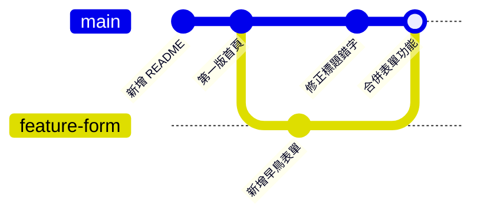

# Git 與 GitHub 入門

> **對應檢核點**：檢核點 2（建立 repo 並 clone）、檢核點 3（Commit＋Sync）
> **操作方式**：本篇的操作全部使用 VS Code 的「原始檔控制」面板完成，不需要輸入指令；文末附指令對照表供參考。
> **先備條件**：已依 [VS Code 與 GitHub Copilot 入門](vscode_copilot_starter.md) 安裝 VS Code 與 Git，並設定使用者資訊。

[← 回教學目錄](README.md)　｜　互動版：[Git 流程模擬器](../../lectures/wk01_1007_saas-storefront/slides/git_flow.html)

---

## 1. 學習目標

1. 說明版本控制要解決的問題，以及 Git 與 GitHub 的分工。
2. 以「工作目錄、暫存區、本機儲存庫、遠端儲存庫」四個區域描述 Git 的資料流。
3. 說明 commit 的組成（快照、雜湊值、作者、時間、訊息、父節點），以及分支（branch）作為指標的意義。
4. 區分 push、pull、fetch 與 VS Code「同步變更」的語意，並理解合併衝突的成因。
5. 以 VS Code 完成 clone、stage、commit、sync，並能查看歷史、還原修改。
6. 撰寫品質良好的 commit 訊息，並了解公開 repo 的資安責任。

## 2. 為什麼需要版本控制

沒有版本控制時，常見的做法是複製檔案並改名：`index_v2.html`、`index_最終版.html`、`index_最終版_真的final.html`。這種做法有幾個根本問題：無法得知兩個版本之間究竟改了什麼、多人同時修改時難以合併、檔案一多就無法管理，也無法可靠地回到某個「確定可以運作」的狀態。

**版本控制系統（Version Control System, VCS）** 以系統化的方式記錄檔案的每一次變更：誰、在什麼時間、改了什麼、為什麼改。**Git** 是目前最廣泛使用的分散式版本控制系統；**GitHub** 則是以 Git 為基礎的雲端代管平台。

| | Git | GitHub |
| --- | --- | --- |
| 性質 | 安裝在本機的版本控制軟體 | 雲端代管平台（網站與服務） |
| 儲存位置 | 你電腦中專案資料夾內的隱藏資料夾 `.git` | GitHub 的伺服器 |
| 是否需要網路 | 否，可離線 commit | 是，同步時需要 |
| 誰看得到 | 只有能存取你電腦的人 | Public repo：所有人；Private repo：你授權的人 |
| 在本課程中的用途 | 記錄每一版網頁 | 保存程式碼，並在收到新 commit 時通知 Netlify 部署 |

**儲存庫（repository，簡稱 repo）**：一個專案的所有檔案，加上它完整的版本歷史。在本機，repo 就是一個含有 `.git` 子資料夾的普通資料夾；你的網站就是一個 repo。

課堂上常以「遊戲存檔點」比喻 commit：每完成一小步就存檔，改壞了可以讀檔回到先前狀態。這個比喻有助於入門，但 Git 的實際機制比存檔點更豐富，以下說明其概念模型。

## 3. 核心概念

### 3.1 四個區域：工作目錄、暫存區、本機儲存庫、遠端儲存庫

Git 將檔案的狀態分為四個區域，每個操作都是在區域之間搬移變更：

| 區域 | 英文 | 位置 | 內容 |
| --- | --- | --- | --- |
| 工作目錄 | working tree／working directory | 你在檔案總管看到的專案資料夾 | 你目前正在編輯的檔案 |
| 暫存區 | staging area／index | `.git` 內部 | 你選定「要放進下一個 commit」的變更 |
| 本機儲存庫 | local repository | `.git` 內部 | 所有已 commit 的歷史 |
| 遠端儲存庫 | remote repository | GitHub 上 | 與他人共享、供 Netlify 讀取的歷史副本 |



**為什麼需要暫存區**：暫存區讓你可以從一堆修改中，挑選「屬於同一件事」的部分組成一個 commit。例如你同時改了標題文字與表單功能，可以分兩次 stage、兩次 commit，讓歷史紀錄更清楚。初學階段若一次全部暫存也無妨，VS Code 在未暫存時按 Commit 會詢問是否全部暫存。

### 3.2 Commit：專案的快照

**commit** 是某個時間點整個專案的**快照（snapshot）**，而不只是「差異」的紀錄。每個 commit 包含：

| 組成 | 說明 |
| --- | --- |
| 快照 | 該時間點所有被追蹤檔案的內容 |
| 雜湊值（hash） | 由 commit 內容計算出的唯一識別碼，例如 `3f9a2c1e...`，通常只顯示前 7 碼。內容只要有任何不同，雜湊值就不同，因此可用來偵測竄改 |
| 作者與時間 | 來自你設定的 `user.name`、`user.email` 與 commit 當下的時間 |
| 訊息（message） | 你對這次變更的說明 |
| 父節點（parent） | 前一個 commit 的雜湊值 |

由於每個 commit 都指向它的父節點，所有 commit 串成一條歷史鏈。當有分支與合併時，一個 commit 可能有兩個父節點，整體結構在資訊科學上稱為**有向無環圖（Directed Acyclic Graph, DAG）**：箭頭只指向過去，不會形成循環。

Git 的設計哲學是**歷史只增不減**：修正錯誤的標準做法是新增一個修正的 commit，而不是抹除舊紀錄。因此你可以放心嘗試，先前的版本都還在。

### 3.3 分支：可移動的指標

**分支（branch）** 不是檔案的複本，而是一個**指向某個 commit 的名稱標籤**。每次在該分支上 commit，標籤就自動往前移到最新的 commit。

- 在 GitHub 建立新 repo 時，預設分支名稱通常是 **`main`**（較舊的專案常用 `master`，本課程的課程 repo 即為 `master`）。
- `HEAD` 表示「你目前所在的位置」，通常指向目前的分支。
- 本課程只使用單一分支 `main`。在實務上，團隊會為每項功能開新分支，開發完成後再透過 Pull Request 審查並合併回 `main`。



上圖示意實務上的分支與合併流程：`feature-form` 分支開發表單的同時，`main` 仍可修正錯字，之後再合併。合併產生的 commit 有兩個父節點。

### 3.4 遠端、origin 與遠端追蹤分支

- **遠端（remote）**：另一個位置的同一個 repo，本課程中就是 GitHub 上的 repo。從 GitHub clone 下來時，Git 自動將它命名為 **`origin`**。
- **遠端追蹤分支（remote-tracking branch）**：例如 `origin/main`，是本機記錄的「上次與 GitHub 溝通時，GitHub 上 `main` 的位置」。它只在與遠端通訊時更新。
- VS Code 狀態列與「同步變更」按鈕上的 **↑1 ↓0** 就是比較本機 `main` 與 `origin/main` 的結果：↑ 表示本機有、GitHub 還沒有的 commit 數；↓ 表示 GitHub 有、本機還沒有的 commit 數。

### 3.5 Push、Fetch、Pull 與 Sync

| 操作 | 方向 | 語意 |
| --- | --- | --- |
| **Clone** | GitHub → 本機（第一次） | 下載完整 repo 與歷史，並自動設定 `origin` |
| **Push（推送）** | 本機 → GitHub | 將本機新的 commit 上傳。若 GitHub 上有你本機沒有的 commit，push 會被拒絕（rejected），必須先整合對方的變更 |
| **Fetch（擷取）** | GitHub → 本機儲存庫 | 下載 GitHub 上的新 commit 並更新 `origin/main`，但**不改動**你的工作目錄 |
| **Pull（提取）** | GitHub → 本機並整合 | 等於 fetch 之後再合併（merge）或重定基底（rebase）到目前分支，工作目錄會隨之更新 |
| **Sync（同步變更）** | 雙向 | VS Code 的便利按鈕：先 pull，再 push |

**最常見的誤解**：Commit 只存在你的電腦中，GitHub 與網站都不會更新。必須完成 Push（在 VS Code 中按「同步變更」），GitHub 才會收到新 commit，Netlify 才會重新部署。

### 3.6 合併衝突（merge conflict）

**成因**：當本機與 GitHub 上各自有新的 commit，且**兩邊修改了同一個檔案的同一段內容**時，Git 無法自動判斷該保留哪一版，就會產生合併衝突。若兩邊修改的是不同檔案或同一檔案的不同段落，Git 通常能自動合併。

在本課程中，最常見的情境是：在 GitHub 網頁上直接編輯了 `README.md`，同時在本機也修改了同一檔案，然後按同步變更。

**衝突的樣貌**：Git 會在檔案中插入標記：

```
<<<<<<< HEAD
這是你本機的版本
=======
這是 GitHub 上的版本
>>>>>>> origin/main
```

**處理步驟**：

1. 不要慌張，也不要重複按同步。衝突只是 Git 請你做決定，資料沒有遺失。
2. 在原始檔控制面板的「合併變更」區找到有衝突的檔案並開啟。VS Code 會在衝突區塊上方提供 **接受目前的變更／接受傳入的變更／接受兩者** 等選項，或提供合併編輯器。
3. 決定最終內容，刪除所有 `<<<<<<<`、`=======`、`>>>>>>>` 標記並存檔。
4. 將檔案 stage（按 **＋**），再按 Commit 完成合併，最後按同步變更。
5. 若不確定如何選擇，請停下來求助助教。

**預防方法**：開始工作前先按一次同步變更；避免在 GitHub 網頁與本機同時修改同一檔案；一個 repo 盡量只在一台電腦上編輯。

### 3.7 好的 commit：單一目的、描述清楚

**單一目的（atomic）**：一個 commit 只做一件事。好處是歷史容易閱讀，出問題時也容易找出、還原是哪一次修改造成的。

**訊息撰寫原則**：

- 第一行為**摘要行**，簡短（中文約 25 字以內、英文約 50 字元以內）說明「做了什麼」。
- 使用**祈使句**描述變更，如同下達指令：`新增早鳥名單表單`、`修正手機版導覽列跑版`；英文慣例為 `Add waitlist form`，而非 `Added...` 或 `Adding...`。
- 需要時，空一行後再補充「為什麼」這樣改。

| 不佳的訊息 | 問題 | 較佳的訊息 |
| --- | --- | --- |
| `update` | 沒有資訊量 | `將 CTA 按鈕改為橘色以提高對比` |
| `aaa` | 無意義 | `新增早鳥名單表單` |
| `改了一些東西` | 範圍不明 | `修正手機版導覽列跑版` |
| `修改標題、加表單、換顏色` | 一次做多件事 | 拆成三個 commit |

### 3.8 .gitignore：不該進入版本控制的檔案

`.gitignore` 是放在 repo 最外層的純文字檔，列出 Git 應忽略、不追蹤的檔案或資料夾樣式。常見項目包括：

```
# 作業系統自動產生的檔案
.DS_Store
Thumbs.db

# 含有機密的環境設定檔
.env

# 套件與建置產物（本課程不會用到，實務上很常見）
node_modules/
dist/
```

注意：`.gitignore` 只對**尚未被追蹤**的檔案有效。已經 commit 過的檔案，加入 `.gitignore` 並不會把它從歷史中移除。

### 3.9 公開 repo 的資安責任

本課程的 repo 設為 **Public**，因為 Netlify 免費部署與教師檢閱都需要。這代表：

- **任何被 commit 並 push 的內容，全世界都看得到**，包括完整的歷史紀錄。即使之後刪除檔案，舊的 commit 中仍然存在。
- **絕對不要 commit 機密資訊**：密碼、API 金鑰、存取權杖、含個資的資料檔。自動化程式會持續掃描公開 repo 中外洩的金鑰；GitHub 也提供秘密掃描（secret scanning）與推送保護（push protection）協助攔截，但不能依賴它作為唯一防線。
- **若不慎外洩**：刪除檔案並不足夠，應立即到該服務撤銷（revoke）並重新產生金鑰，再處理 repo 歷史。
- commit 中的 Email 也會公開，如有顧慮可使用 GitHub 提供的 noreply 地址（見 [VS Code 與 GitHub Copilot 入門](vscode_copilot_starter.md#33-設定-git-使用者資訊只需一次)）。

## 4. 操作步驟

### 4.1 在 GitHub 建立 repo

1. 登入 <https://github.com/>，點右上角 **＋** → **New repository**（或直接開啟 <https://github.com/new>）。
2. 填寫：
   - **Repository name**：英文小寫加連字號，例如 `rent-radar`。名稱會出現在網址中。
   - **Description**（選填）：一句話說明你的產品。
   - 選擇 **Public**。
   - 勾選 **Add a README file**。這會產生第一個 commit，使 repo 不是空的，後續 clone 較順利。
3. 按 **Create repository**。

官方說明：[建立新的儲存庫](https://docs.github.com/zh/repositories/creating-and-managing-repositories/creating-a-new-repository)

### 4.2 將 repo 複製到電腦（Clone）

1. 開啟 VS Code，按左側 **原始檔控制** 圖示（分岔的線條圖示；快捷鍵 `Ctrl+Shift+G`，Mac：`⌃⇧G`）。
   - 或：先關閉目前資料夾（檔案 → 關閉資料夾），歡迎畫面上會有 **複製 Git 存放庫（Clone Git Repository）**。
2. 按 **複製存放庫（Clone Repository）** → 選擇 **從 GitHub 複製（Clone from GitHub）**。
3. 首次使用需授權 VS Code 存取 GitHub，依瀏覽器指示按 **Authorize**。
4. 從清單中選擇 `你的帳號/rent-radar`。
5. 選擇存放位置（建議建立專用資料夾，例如 `文件/vibentpu`）→ **選取為存放庫目的地**。
6. VS Code 詢問是否開啟複製的存放庫時，按 **開啟（Open）**。

左側檔案總管出現 `README.md` 即表示完成。此時本機資料夾已是一個 Git repo，且 `origin` 已指向 GitHub 上的 repo。

官方說明：[VS Code：在本機複製存放庫](https://code.visualstudio.com/docs/sourcecontrol/intro-to-git#_clone-a-repository-locally)

### 4.3 修改檔案

依 [第 1 週提示詞集](../../lectures/wk01_1007_saas-storefront/prompts.md) 請 Copilot 在此資料夾建立 `index.html`，檢視差異後按 **Keep**。此時原始檔控制圖示上會出現數字，表示工作目錄中有尚未 commit 的變更。檔案旁的字母代表狀態：

| 標記 | 狀態 | 意義 |
| --- | --- | --- |
| **U** | Untracked | 新檔案，Git 尚未追蹤 |
| **M** | Modified | 已追蹤的檔案被修改 |
| **D** | Deleted | 已追蹤的檔案被刪除 |
| **A** | Added | 新檔案已加入暫存區 |

點選檔案可開啟差異檢視，左側為上一個 commit 的內容，右側為目前內容。

### 4.4 暫存與提交（Stage＋Commit）

1. 開啟 **原始檔控制** 面板。
2. 在 `index.html` 旁按 **＋**（暫存變更），檔案會移到「暫存的變更」區。要全部暫存，按「變更」標題列上的 **＋**。
3. 在上方訊息框輸入 commit 訊息，例如 `新增第一版首頁`。
4. 按 **提交（Commit）** 按鈕。

若未暫存就直接按提交，VS Code 會詢問是否將所有變更暫存後提交，按 **是（Yes）** 即可。

### 4.5 推送到 GitHub（Sync）

1. Commit 後，面板會出現 **同步變更（Sync Changes）↑1** 按鈕，表示本機有 1 個 commit 尚未推送。
2. 按下按鈕。首次使用時 VS Code 會說明此動作將 pull 與 push，按 **確定（OK）**。
3. 在瀏覽器重新整理你的 GitHub repo 頁面，應可看到 `index.html` 與你的 commit 訊息。

當 repo 連接 Netlify 之後，每次推送都會觸發自動部署，這就是持續部署（Continuous Deployment）的基礎，詳見 [CI/CD 教學](cicd.md)。

## 5. 查看歷史與還原修改

### 5.1 查看歷史

- **VS Code**：檔案總管下方的 **時間軸（Timeline）** 顯示單一檔案的歷史；原始檔控制面板的 **圖表（Graph）** 區顯示整個 repo 的 commit 歷史。
- **GitHub 網頁**：repo 首頁點 **Commits**，點任一 commit 可查看差異（綠色為新增，紅色為刪除），每個 commit 旁會顯示其雜湊值前 7 碼。

### 5.2 依情境還原

| 情境 | 做法 | 說明 |
| --- | --- | --- |
| Copilot 剛修改、尚未按 Keep | 在 Chat 中按 **Undo（復原）** | 變更尚未寫入工作目錄 |
| 已 Keep，但尚未 Commit | 原始檔控制 → 檔案旁的 **↶ 捨棄變更（Discard Changes）** | 將工作目錄的檔案還原為最後一個 commit 的內容。此操作無法復原，請確認後再執行 |
| 已 Commit | 在時間軸或 GitHub 上找到舊版內容，比對後修改回來，再 Commit 一次；或請 Copilot「將 index.html 恢復為上一個 commit 的內容」並審查差異 | 以新增 commit 的方式修正，歷史保持完整。對應的 Git 指令為 `git revert` |
| 網站已部署錯誤版本 | 在 Netlify 的 **Deploys** 頁面選擇先前的部署並發布 | 網站立即回到舊版，但 repo 內容不變，之後仍應修正程式碼，詳見 [CI/CD 教學](cicd.md) |

## 6. GitHub 網頁的其他功能

| 功能 | 用途 | 本課程中的使用 |
| --- | --- | --- |
| 線上編輯檔案 | 點檔案 → 鉛筆圖示，修改後直接 commit | 可用於編輯 README（學習歷程檔案）。編輯後回到 VS Code 須先按同步變更 |
| Commits | 瀏覽完整歷史 | 教師會檢視你的 commit 紀錄 |
| Issues | 問題回報與討論 | 課程的 [求助單](https://github.com/cychiang-ntpu/VibeNTPU/issues/new?template=help_request.yml) 與作品牆登記 |
| Star | 收藏 repo | 選用 |
| Fork | 將他人的 repo 複製到自己的帳號 | 進階 |
| Actions | 自動化工作流程 | 延伸任務（選做）：[GitHub Actions 自動檢核](vibe_check_ci.md) |

## 7. 指令對照表（參考）

VS Code 的按鈕背後執行的就是以下 Git 指令。本課程不要求使用指令，但了解對應關係有助於閱讀官方文件與錯誤訊息。

| VS Code 操作 | 對應指令 | 說明 |
| --- | --- | --- |
| 複製存放庫 | `git clone <網址>` | 下載 repo 並設定 `origin` |
| （面板上的檔案清單） | `git status` | 顯示工作目錄與暫存區的狀態 |
| 檔案旁的 ＋ | `git add <檔案>` | 將變更加入暫存區 |
| 提交 | `git commit -m "訊息"` | 以暫存區內容建立 commit |
| 同步變更（上傳部分） | `git push` | 將本機 commit 推送到 `origin` |
| 同步變更（下載部分） | `git pull` | 擷取並整合遠端的新 commit |
| 擷取（Fetch） | `git fetch` | 只下載、不整合 |
| 圖表、時間軸 | `git log --oneline --graph` | 顯示 commit 歷史 |
| 捨棄變更 | `git restore <檔案>` | 還原工作目錄中的修改 |

## 8. 常見問題

| 狀況 | 原因與處理 |
| --- | --- |
| Commit 時出現「請設定 user.name 和 user.email」 | 尚未設定使用者資訊，見 [VS Code 與 GitHub Copilot 入門](vscode_copilot_starter.md#33-設定-git-使用者資訊只需一次) |
| 找不到「同步變更」，只看到「發佈分支（Publish Branch）」 | 此資料夾是本機建立的 repo，尚未連接遠端。可按「發佈分支」並選擇 Public 建立新 GitHub repo，或依 4.1、4.2 重新 clone |
| Sync 時出現 rejected | GitHub 上有本機沒有的 commit（例如曾在網頁上編輯）。再按一次同步變更，讓 VS Code 先 pull 再 push；若出現衝突，依 3.6 處理 |
| 面板顯示「目前開啟的資料夾沒有 Git 存放庫」 | 開啟的不是 clone 下來的資料夾。以「檔案 → 開啟資料夾」選擇正確資料夾 |

更多問題見 [疑難排解手冊](error_guide.md#3-vs-codegitcopilot)。

## 9. 討論與延伸思考

1. Git 的歷史「只增不減」。這項設計對團隊協作與稽核有什麼好處？在什麼情況下，這項特性反而會造成困擾（提示：不慎 commit 的機密）？
2. 為什麼 Git 需要暫存區，而不是直接把所有修改存成 commit？請舉一個你的專案中可以拆成兩個 commit 的例子。
3. 若兩位組員同時修改 `index.html` 的同一段標題並各自推送，會發生什麼事？團隊可以用哪些工作方式降低衝突？

## 10. 參考資料

- [VS Code：Git 入門](https://code.visualstudio.com/docs/sourcecontrol/intro-to-git)
- [VS Code：原始檔控制總覽](https://code.visualstudio.com/docs/sourcecontrol/overview)
- [GitHub Docs：Hello World](https://docs.github.com/zh/get-started/start-your-journey/hello-world)
- [GitHub Docs：關於合併衝突](https://docs.github.com/zh/pull-requests/collaborating-with-pull-requests/addressing-merge-conflicts/about-merge-conflicts)
- [Git 官方文件：gitignore](https://git-scm.com/docs/gitignore)
- [Pro Git 電子書（繁體中文）](https://git-scm.com/book/zh-tw/v2)，特別是第 1–3 章
- [GitHub Skills：互動式課程](https://skills.github.com/)
- [Learn Git Branching：視覺化練習分支操作](https://learngitbranching.js.org/?locale=zh_TW)

下一步：[將網站部署到 Netlify](github_netlify_deploy.md)。
