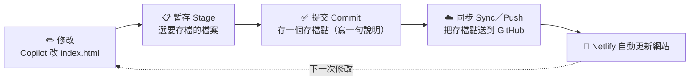

# 💾 Git 與 GitHub 入門：幫你的網站設「存檔點」

> 玩遊戲打王之前會先存檔，死了可以讀檔重來。
> **Git 就是程式碼的存檔系統**：每完成一小步就存一個「存檔點（commit）」，改壞了隨時可以回到上一個能動的版本，
> 再也不用把檔案取名成 `index_最終版2_真的final.html`。
> **GitHub 則是放存檔的雲端總部**，而且它一收到新存檔，就會自動通知 Netlify 更新你的網站。

[← 回教學目錄](README.md)　｜　🎮 互動版：[Git 存檔點模擬器](../../lectures/wk01_1007_saas-storefront/slides/git_flow.html)

> 📌 這一篇**全部用 VS Code 的按鈕操作，不用打指令**。還沒裝好 VS Code 和 Git？先看 [VS Code ＋ Copilot 入門](vscode_copilot_starter.md)。

---

## 🍱 Git 和 GitHub 有什麼不一樣？

| | 💾 Git | ☁️ GitHub |
| --- | --- | --- |
| 是什麼 | 裝在**你電腦**上的存檔程式 | 放在**雲端**的存檔總部（一個網站） |
| 美食街比喻 | 你工作台上的存檔機 | 集團總部的保險箱＋自動傳真機 |
| 沒網路能用嗎 | ✅ 可以存檔 | ❌ 要上網才能同步 |
| 誰看得到 | 只有你 | 公開的 repo 全世界都看得到 |

**Repository（簡稱 repo，儲存庫）**＝一個專案的資料夾，加上它所有的存檔紀錄。你的網站就是一個 repo。

---

## 🔁 核心觀念：一個循環，四個動作

| 動作 | 遊戲比喻 | VS Code 裡怎麼做 |
| --- | --- | --- |
| **Clone（複製）** | 把總部的存檔下載到你的電腦 | 原始檔控制 → **複製存放庫（Clone Repository）** |
| **Stage（暫存）** | 選好要存進這個存檔點的東西 | 檔案旁的 **＋** |
| **Commit（提交）** | 按下「存檔」並取個名字 | 輸入訊息 → **✓ 提交（Commit）** |
| **Push／Sync（推送／同步）** | 把存檔上傳到雲端 | **同步變更（Sync Changes）** 按鈕 |
| **Pull（拉取）** | 把雲端上別人改的存檔下載回來 | 同步變更（會一起做）|

> ⚠️ **最常見的誤會**：Commit 只是存在**你的電腦**裡，網站**不會**更新。要按 **同步變更（Sync）** 送到 GitHub，Netlify 才會更新！

---

## 步驟 1：在 GitHub 建立你的 repo ☁️

1. 登入 <https://github.com/>，點右上角 **＋** → **New repository**（或直接打開 <https://github.com/new>）。
2. 填寫：
   - **Repository name**：英文小寫＋連字號，例如 `rent-radar`。
   - **Description**（選填）：一句話介紹你的產品。
   - 選 **Public（公開）**。
   - ✅ 勾選 **Add a README file**（這樣 repo 一建立就不是空的，等一下 clone 比較順）。
3. 按綠色 **Create repository**。

📖 [GitHub：建立新的儲存庫](https://docs.github.com/zh/repositories/creating-and-managing-repositories/creating-a-new-repository)

## 步驟 2：把 repo 複製到你的電腦（Clone）💻

1. 打開 VS Code，按左側的 **原始檔控制** 圖示（像樹枝分岔的形狀，快捷鍵 `Ctrl+Shift+G`，Mac：`⌃⇧G`）。
   - 或者：關閉目前資料夾（檔案 → 關閉資料夾），歡迎畫面上會有 **複製 Git 存放庫（Clone Git Repository）**。
2. 按 **複製存放庫（Clone Repository）** → 選 **從 GitHub 複製（Clone from GitHub）**。
3. 第一次會要求授權 GitHub，照著瀏覽器指示按 **Authorize**。
4. 上方會列出你的 repo，選 `你的帳號/rent-radar`。
5. 選一個放檔案的地方（建議建一個 `文件/vibentpu` 資料夾）→ **選取為存放庫目的地**。
6. 右下角問「要開啟複製的存放庫嗎？」→ 按 **開啟（Open）**。

✅ VS Code 左側檔案總管看到 `README.md` 就成功了。**這個資料夾現在跟 GitHub 上的 repo 連在一起了。**

📖 [VS Code：複製存放庫](https://code.visualstudio.com/docs/sourcecontrol/intro-to-git#_clone-a-repository-locally)

## 步驟 3：請 Copilot 做網頁（修改）🤖

照 [第 1 週咒語集](../../lectures/wk01_1007_saas-storefront/prompts.md) 請 Copilot 在這個資料夾建立 `index.html`，按 **Keep** 接受。
這時左側 **原始檔控制** 圖示會出現一個數字 **1**，代表「有 1 個檔案改變了、還沒存檔」。檔案旁邊的字母：

| 標記 | 意思 |
| --- | --- |
| **U**（Untracked） | 新檔案，Git 還沒看過 |
| **M**（Modified） | 改過的檔案 |
| **D**（Deleted） | 刪掉的檔案 |

## 步驟 4：存檔點（Stage ＋ Commit）✅

1. 打開 **原始檔控制** 面板。
2. 在 `index.html` 旁按 **＋**（暫存變更）。想全部存：按「變更」那一行的 **＋**。
3. 在上方的**訊息框**寫一句話說明你做了什麼，例如：`第一版首頁`。
4. 按 **✓ 提交（Commit）**。

> 💡 忘了按 ＋ 直接 Commit？VS Code 會問「沒有暫存的變更，要全部暫存並直接提交嗎？」→ 按 **是（Yes）** 就好。

### ✍️ 好的 commit 訊息長怎樣？

| 😵 不好 | 😊 好 |
| --- | --- |
| `update` | `把 CTA 按鈕改成橘色` |
| `aaa` | `新增早鳥名單表單` |
| `改了一些東西` | `修正手機版導覽列跑版` |

一個月後回頭看，你會感謝現在寫清楚的自己 🙏

## 步驟 5：送到 GitHub（Sync／Push）☁️

1. Commit 之後，原始檔控制面板會出現藍色的 **同步變更（Sync Changes）↑1** 按鈕（↑1 代表有 1 個存檔點還沒上傳）。
2. 按下去。第一次可能會問「此動作會推送和提取…」→ 按 **確定（OK）**（可以選「不要再顯示」）。
3. 到 GitHub 網頁重新整理你的 repo：看到 `index.html` 和你的 commit 訊息了！🎉

> 🏗️ **架構呼應**：你剛剛把「裝潢設計圖」存進了總部保險箱。等你把 repo 接上 Netlify 之後，**每按一次 Sync，網站就會自動更新**，這就是 CI/CD。

---

## 🕰️ 時光機：查看歷史、救回改壞的版本

### 看歷史
- **VS Code**：在檔案總管下方打開 **時間軸（Timeline）**，或在原始檔控制面板下方的 **圖表（Graph）** 看每一個存檔點。
- **GitHub 網頁**：repo 首頁點 **Commits**（時鐘圖示 🕐），點任一個存檔點可以看到改了哪些字（綠色＝新增，紅色＝刪除）。

### 還沒 Commit 前改壞了
原始檔控制 → 在檔案旁按 **↶ 捨棄變更（Discard Changes）**，檔案會回到上一個存檔點的樣子。
（Copilot 剛改的東西不滿意，也可以直接在 Chat 按 **Undo**。）

### 已經 Commit 了才發現改壞
最簡單的方法：跟 Copilot 說「請把 index.html 恢復成上一個版本的樣子」，或在 **時間軸** 點舊版本比對後手動修回來，再 Commit 一次。
網站也可以在 Netlify 的 **Deploys** 頁面一鍵回到舊版（見 [CI/CD 教學](cicd.md#-加碼時光機功能改壞了怎麼辦)）。

> 💡 Git 的哲學是「**歷史不刪除，只往前加**」，所以大膽嘗試吧，永遠有退路。

---

## 🌐 GitHub 網頁上還能做什麼？

| 功能 | 用途 | 這門課會用到嗎 |
| --- | --- | --- |
| ✏️ 直接編輯檔案 | 點檔案 → 鉛筆圖示，改完 Commit | 可以用來改 README（冒險護照） |
| 🕐 Commits | 看所有存檔點 | ✅ 老師會看你的 commit 紀錄 |
| 🐛 Issues | 回報問題、討論 | ✅ 課程的 [求救單](https://github.com/cychiang-ntpu/VibeNTPU/issues/new?template=help_request.yml) 和作品牆登記 |
| ⭐ Star | 收藏喜歡的 repo | 幫課程 repo 按個星星吧 😆 |
| 🍴 Fork | 複製別人的 repo 到你的帳號 | 進階 |
| ⚙️ Actions | 自動化機器人 | 支線 [🤖 機器人助教](vibe_check_ci.md) |

> ⚠️ **在 GitHub 網頁上改了檔案之後**，回到 VS Code 要先按 **同步變更**（它會先 Pull 下載網頁上的修改），不然兩邊會不一致。

---

## ❓ 常見問題

| 狀況 | 解法 |
| --- | --- |
| Commit 時跳出「請設定 user.name 和 user.email」 | 回到 [VS Code 入門的步驟 2](vscode_copilot_starter.md#第一次使用跟-git-自我介紹只需做一次) 設定 |
| 找不到「同步變更」按鈕，只看到「發佈分支（Publish Branch）」 | 你的資料夾不是從 GitHub clone 下來的。按「發佈分支」→ 選 Public 也可以，或重新照步驟 1、2 做一次 |
| Sync 時說「被拒絕（rejected）」 | GitHub 上有你電腦沒有的修改（例如在網頁上改過）。按 **同步變更** 它會先下載再上傳；還是不行就請助教 |
| 原始檔控制面板說「目前開啟的資料夾沒有 Git 存放庫」 | 你打開的不是 clone 下來的資料夾。檔案 → 開啟資料夾，選正確的那一個 |

更多 👉 [卡關急救手冊](error_guide.md#-vs-code--git--copilot)

## 📚 延伸學習

- [VS Code：Git 入門（官方）](https://code.visualstudio.com/docs/sourcecontrol/intro-to-git)
- [VS Code：原始檔控制總覽](https://code.visualstudio.com/docs/sourcecontrol/overview)
- [GitHub Docs：Hello World（繁中）](https://docs.github.com/zh/get-started/start-your-journey/hello-world)
- [GitHub Skills：互動式入門課程](https://skills.github.com/)
- [Pro Git 電子書（繁中）](https://git-scm.com/book/zh-tw/v2)
- [Learn Git Branching：視覺化學 Git（有繁中）](https://learngitbranching.js.org/?locale=zh_TW)

---

下一步 👉 [把網站接上 Netlify](github_netlify_deploy.md)
