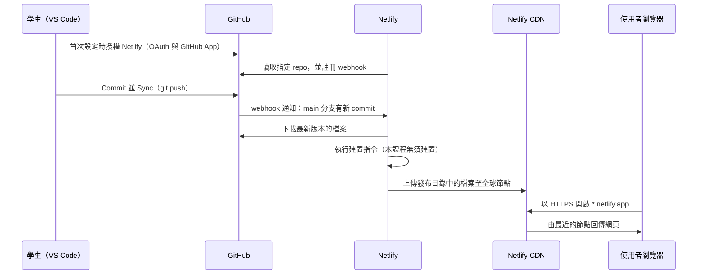

# GitHub 與 Netlify 部署

> **對應檢核點**：檢核點 3（Commit＋Sync 至 GitHub；Netlify 部署成功；網站自我檢核工具 Level 1 通過）
> **本篇目標**：將 VS Code 中的 `index.html` 發布為任何人都能以網址開啟的網站，並理解發布過程中每個系統在做什麼。

[← 回第 1 週](../../lectures/wk01_1007_saas-storefront/README.md)　｜　[教學目錄](README.md)

> GitHub、VS Code 與 Netlify 的介面會不定期改版，按鈕名稱與位置可能與本文略有差異。找不到按鈕時，請以官方文件為準：
> [VS Code：Git 入門](https://code.visualstudio.com/docs/sourcecontrol/intro-to-git)｜[Netlify：從 Git 儲存庫部署](https://docs.netlify.com/start/quickstarts/deploy-from-repository/)

---

## 1. 學習目標

1. 說明「部署」的意義，以及靜態網站與需要伺服器運算的網站之差異。
2. 描述 Netlify 從 GitHub 匯入專案時發生的事：授權、webhook、建置、上傳至內容傳遞網路、指派網域與 HTTPS。
3. 理解發布目錄（publish directory）與首頁檔名 `index.html` 的規則。
4. 完成從 GitHub 到 Netlify 的部署，並能排除常見問題。

## 2. 核心概念

### 2.1 什麼是部署

**部署（deploy）** 是將軟體從開發環境搬到正式執行環境，使目標使用者能夠存取的過程。對網站而言，就是把檔案放到一台隨時連網、具有公開位址的伺服器上，並讓網域名稱指向它。

在你的電腦上預覽時，網址是 `file:///...` 或 `http://127.0.0.1:...`，只有你自己的電腦能開啟。部署之後，網址變成 `https://你的名稱.netlify.app`，任何人在任何地方都能存取。

本課程的網站屬於**靜態網站（static site）**：伺服器只需將 HTML、CSS、JavaScript、圖片等檔案原封不動地傳給瀏覽器，所有互動都在使用者的瀏覽器中執行。與之相對的是**動態網站**，伺服器會在每次請求時執行程式、查詢資料庫、再產生網頁。靜態網站的優點是速度快、成本低、攻擊面小；限制是無法在伺服器端保存資料或執行商業邏輯，這正是第 2 週要以 Netlify Forms（後端即服務）與 LocalStorage 補足的部分。

### 2.2 Netlify 在匯入專案時做了什麼

**Netlify** 是提供網站託管與自動部署的雲端平台，屬於平台即服務（Platform as a Service, PaaS）的一種。課堂上以「商場提供攤位、水電與保全」比喻：你只需準備店面內容，基礎設施由平台負責。實際的技術流程如下：

1. **授權連接 GitHub**：首次匯入時，你會經過兩道授權。其一是 **OAuth 授權**，讓 Netlify 以你的身分列出 repo；其二是安裝 **Netlify 的 GitHub App**，並選擇它可以存取哪些 repo。建議只授權需要部署的 repo，這符合**最小權限原則（principle of least privilege）**：系統只取得完成任務所需的最低權限，萬一被濫用，影響範圍也最小。
2. **註冊 webhook**：**webhook** 是一種「事件發生時主動通知」的機制。Netlify 在 GitHub 上登記一個接收網址，之後每當指定分支收到 push，GitHub 就會對該網址發送 HTTP 請求，通知 Netlify 有新版本。這比 Netlify 每隔幾分鐘去詢問「有沒有更新」更即時，也更節省資源。
3. **建置（build）**：許多現代網站需要先經過編譯、打包等步驟，才能產出瀏覽器可直接使用的檔案，此步驟稱為建置。本課程只有單一 HTML 檔，**不需要建置**，所以建置指令留空。
4. **上傳至內容傳遞網路（Content Delivery Network, CDN）**：Netlify 將發布目錄中的檔案複製到分布於世界各地的伺服器節點。使用者連線時，由地理位置較近的節點回應，降低延遲，也分散流量。
5. **指派子網域與 HTTPS**：Netlify 為專案指派 `專案名稱.netlify.app` 子網域，並自動提供 TLS 憑證，使網站可透過 **HTTPS** 加密連線存取。HTTPS 可防止傳輸內容被竊聽或竄改，也是現代瀏覽器許多功能的前提。
6. **原子化部署（atomic deploy）與歷史版本**：每次部署都是一份完整、獨立的快照，只有在全部檔案上傳完成後才切換為正式版本，使用者不會看到「一半新、一半舊」的網站。舊的部署會被保留，可一鍵回復。

### 2.3 發布目錄與 index.html

- **發布目錄（publish directory）**：Netlify 要把 repo 中的哪個資料夾當作網站根目錄對外發布。留空時代表 repo 的最外層。使用建置工具的專案通常會設為 `dist` 或 `build` 等輸出資料夾。
- **首頁檔名**：當使用者開啟 `https://xxx.netlify.app/`（網址結尾沒有檔名）時，網頁伺服器依慣例回傳該目錄下的 `index.html`。因此首頁必須命名為 `index.html`（全小寫），並放在發布目錄的最外層。
- **大小寫敏感**：Netlify 的伺服器區分檔名大小寫，`Index.html` 與 `index.html` 是不同的檔案。Windows 與 macOS 的檔案系統預設不區分大小寫，因此在本機預覽正常、部署後卻找不到頁面，是常見問題。

## 3. 操作步驟

### 3.1 Part A：將程式碼推送到 GitHub

詳細說明見 [Git 與 GitHub 入門](git_intro.md)，以下為摘要：

1. **建立 repo**：至 <https://github.com/new>，名稱如 `rent-radar`，選擇 **Public**，勾選 **Add a README file** → **Create repository**。
2. **Clone**：VS Code → 左側 **原始檔控制**（`Ctrl+Shift+G`／`⌃⇧G`）→ **複製存放庫** → **從 GitHub 複製** → 選擇 repo → 選擇資料夾 → **開啟**。
3. **產生網頁**：請 Copilot 在此資料夾建立 `index.html`，檢視後按 **Keep**。
4. **Commit**：原始檔控制面板 → 訊息框輸入 `新增第一版首頁` → **提交（Commit）**（詢問是否全部暫存時按 **是**）。
5. **Sync**：按 **同步變更（Sync Changes）↑1**。
6. **確認**：在瀏覽器重新整理 GitHub repo 頁面，確認 `index.html` 位於 repo 最外層。

### 3.2 Part B：在 Netlify 匯入並部署

#### B1. 從 GitHub 匯入專案

1. 登入 <https://app.netlify.com/>（選擇 **Log in with GitHub**）。
2. 在首頁找到 **Add new project**（舊版介面為 Add new site）→ **Import an existing project**。
3. 選擇 **GitHub**。
4. 首次使用時會出現 GitHub 授權視窗：
   - 按 **Authorize Netlify**（OAuth 授權）。
   - 接著安裝 Netlify App：建議選擇 **Only select repositories** 並勾選剛建立的 repo，而非 All repositories（最小權限原則）。
5. 在清單中點選你的 repo（例如 `rent-radar`）。

#### B2. 設定並部署

1. 部署設定欄位**全部維持預設或空白**：

   | 欄位 | 設定值 | 原因 |
   | --- | --- | --- |
   | Branch to deploy | `main` | 以 `main` 分支的最新 commit 作為正式版本 |
   | Base directory | 留空 | 專案位於 repo 最外層 |
   | Build command | 留空 | 純 HTML 無須建置 |
   | Publish directory | 留空 | 以 repo 最外層作為網站根目錄 |

2. 設定專案名稱（Project name），它會成為網址的一部分。例如輸入 `ntpu-rent-radar`，網址即為 `https://ntpu-rent-radar.netlify.app`。
   - 名稱在所有 Netlify 使用者之間必須唯一，只能使用英文小寫、數字與連字號。若已被使用，可加上學號末三碼等。
3. 按 **Deploy**。
4. 約 10–30 秒後，部署狀態變為 **Published** 即完成。

#### B3. 修改網址名稱（若先前未設定）

未設定名稱時，Netlify 會指派隨機名稱，例如 `https://jolly-pony-123abc.netlify.app`。可在專案首頁（Project overview）點 **Customize** → **Manage project name and cover image**；或至 **Project configuration** → **General** → **Project details** → **Manage project name and cover image** 修改。修改後舊網址即失效，請更新你分享過的連結。

官方說明：[變更專案名稱](https://docs.netlify.com/manage/projects/customize-project-name-and-cover-image/)

### 3.3 Part C：驗收

1. 點擊 Netlify 顯示的網址，確認網站可正常開啟，瀏覽器網址列顯示為 HTTPS 連線。
2. **以手機開啟同一網址**，確認行動裝置排版正常。
3. 以 [網站自我檢核工具](../../tools/vibe_check.html) 進行 Level 1 檢核。
4. 在 Netlify 的 **Deploys** 頁面點開最新一筆部署，閱讀部署紀錄（deploy log），觀察 Netlify 實際執行的步驟。
5. 將網址分享至課程群組。

至此，你沒有租用或設定任何實體伺服器，也沒有綁定信用卡，就透過雲端託管服務將網站發布到網際網路。由於 GitHub 與 Netlify 已經透過 webhook 連接，之後每次在 VS Code 完成 Commit＋Sync，網站都會自動更新，這就是持續部署（詳見 [CI/CD 教學](cicd.md)）。

## 4. 疑難排解

| 症狀 | 可能原因 | 處理步驟 |
| --- | --- | --- |
| 網站顯示 `Page not found` | 首頁檔名不是全小寫的 `index.html`，或檔案位於子資料夾中；或 Publish directory 設定錯誤 | 在 GitHub 網頁確認檔名與位置；於 VS Code 更名或移到最外層後 Commit＋Sync；檢查 Netlify 的 Publish directory 是否為空 |
| Netlify 清單中找不到 repo | 安裝 Netlify App 時未勾選該 repo | 在清單下方點 **Configure the Netlify app on GitHub**，將 repo 加入授權範圍 |
| 中文顯示為亂碼 | 網頁未宣告 UTF-8 編碼，或檔案以其他編碼儲存 | 確認 `<head>` 中有 `<meta charset="UTF-8">`；VS Code 右下角狀態列應顯示 `UTF-8` |
| 部署狀態為 Failed | 設定了不需要的建置指令，或 Publish directory 指向不存在的資料夾 | 點開失敗的部署閱讀 log 的最後幾行錯誤訊息；將 Build command 與 Publish directory 清空後重新部署 |
| GitHub 已更新，網站未變 | 只按了 Commit 未按 Sync；專案不是從 Git 匯入；瀏覽器快取 | 在 GitHub 確認最新 commit 是否存在；在 Netlify 的 Deploys 確認是否有新部署；以無痕模式或強制重新整理開啟 |
| 樣式或圖片在本機正常、線上消失 | 檔案路徑使用了本機絕對路徑（如 `C:\Users\...`），或大小寫不一致，或圖片未 commit | 改用相對路徑（如 `images/logo.png`）；確認檔名大小寫一致；確認圖片已出現在 GitHub repo 中 |
| 想先快速試用、不經過 GitHub | — | 可用 [Netlify Drop](https://app.netlify.com/drop) 直接拖曳資料夾上線，但沒有與 GitHub 連接，不會自動更新。課堂作業請使用 GitHub 匯入方式 |

更多問題見 [疑難排解手冊](error_guide.md#4-netlify-部署)。

## 5. 延伸閱讀：自訂網域與 DNS

若希望使用自己的網域（例如 `rentradar.tw`），需要：

1. 向網域註冊商（registrar）購買網域，通常以年計費。
2. 設定**網域名稱系統（Domain Name System, DNS）**：DNS 是將人類可讀的網域名稱轉換為伺服器位址的分散式系統。你需要在 DNS 中新增記錄（例如 CNAME 記錄），將網域指向 Netlify；或將網域的名稱伺服器（name server）改為 Netlify DNS。
3. 在 Netlify 的 **Domain management** 中新增自訂網域，Netlify 會自動為其申請 TLS 憑證。

DNS 記錄的變更需要時間在全球傳播，可能數分鐘到數小時才生效。此為延伸內容，課程不要求完成。

官方說明：[Netlify：網域入門](https://docs.netlify.com/manage/domains/get-started-with-domains/)｜[MDN：什麼是網域名稱](https://developer.mozilla.org/en-US/docs/Learn_web_development/Howto/Web_mechanics/What_is_a_domain_name)

## 6. 討論與延伸思考

1. 本課程的網站由 Netlify 託管、GitHub 保存程式碼、使用者透過 CDN 存取。若 Netlify 停止服務或大幅調漲價格，你的產品會受到什麼影響？這種「平台依賴」風險應如何評估？
2. 安裝 Netlify App 時選擇 All repositories 與 Only select repositories，各有什麼便利性與風險？
3. 靜態網站無法在伺服器端保存資料。請列出你的創業題目中，哪些功能可以用靜態網站完成，哪些一定需要後端服務。

## 7. 參考資料

- [Netlify Docs](https://docs.netlify.com/)
- [Netlify：從 Git 儲存庫部署](https://docs.netlify.com/start/quickstarts/deploy-from-repository/)
- [MDN：什麼是 CDN](https://developer.mozilla.org/zh-TW/docs/Glossary/CDN)
- [MDN：HTTPS](https://developer.mozilla.org/en-US/docs/Glossary/HTTPS)
- [GitHub Docs：關於 webhook](https://docs.github.com/zh/webhooks/about-webhooks)
- [MDN：網際網路如何運作](https://developer.mozilla.org/en-US/docs/Learn_web_development/Howto/Web_mechanics/How_does_the_Internet_work)

完成後請回到 [第 1 週步驟卡](../../lectures/wk01_1007_saas-storefront/steps.md)。
