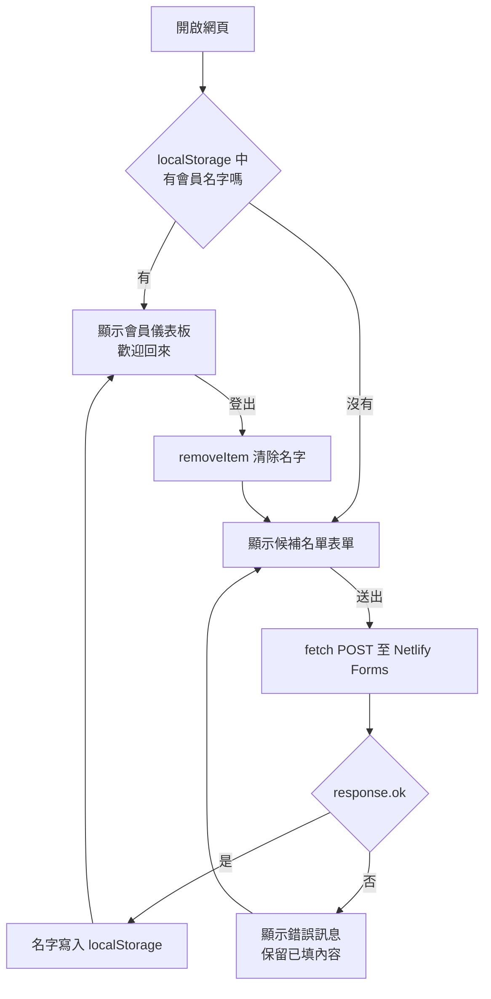

# LocalStorage：瀏覽器端的狀態保存

[← 回第 2 週講義](../../lectures/wk02_1014_baas-cicd/README.md)　｜　官方文件：[MDN：Window.localStorage](https://developer.mozilla.org/zh-TW/docs/Web/API/Window/localStorage)

---

## 1. 學習目標

1. 說明 Web Storage API 的兩種形式（localStorage 與 sessionStorage）及其差異。
2. 解釋同源政策如何決定哪些網頁能讀取同一份資料。
3. 正確地以 JSON 儲存與讀取結構化資料，並了解容量、同步執行與持久性的限制。
4. 比較 LocalStorage、Cookie 與伺服器端工作階段（session）的特性。
5. 說明 LocalStorage 的安全風險，以及本課程的「登入」為何只是介面模擬、真正的身分驗證需要什麼。

## 2. 核心概念

### 2.1 引入：伺服器端記錄與瀏覽器端記錄

以餐廳比喻，伺服器端資料庫如同櫃檯的會員登記簿，由店家保管、任何分店都查得到；LocalStorage 則像店家發給顧客帶回家的集點卡，只存在顧客身上。以下說明其精確的技術定義。

### 2.2 Web Storage API：localStorage 與 sessionStorage

Web Storage API 是瀏覽器提供給網頁 JavaScript 使用的鍵值（key–value）儲存機制，資料存放在使用者裝置上，**不會**自動傳送給伺服器。它有兩種形式：

| 面向 | `localStorage` | `sessionStorage` |
| --- | --- | --- |
| 保存期間 | 沒有到期時間；關閉瀏覽器後仍保留，直到被程式或使用者刪除 | 僅在該分頁（tab）存續期間有效；關閉分頁即清除 |
| 共享範圍 | 同一來源的所有分頁與視窗共用 | 每個分頁各自獨立，即使是同一網址 |
| 典型用途 | 偏好設定、「已填過表單」標記 | 多步驟表單的暫存、單次操作狀態 |

本課程使用 `localStorage`，使重新整理或隔天再開啟時仍能顯示會員儀表板。

### 2.3 同源政策：資料屬於哪個網站

瀏覽器依據**來源（origin）**區隔儲存資料。來源由三個部分共同決定：**通訊協定（scheme）＋主機名稱（host）＋連接埠（port）**。三者完全相同才算同源（same-origin），這項規則稱為同源政策（same-origin policy）。

| 網址 | 與 `https://ntpu-demo.netlify.app` 是否同源 | 原因 |
| --- | --- | --- |
| `https://ntpu-demo.netlify.app/about.html` | 是 | 僅路徑不同 |
| `http://ntpu-demo.netlify.app` | 否 | 通訊協定不同 |
| `https://other-demo.netlify.app` | 否 | 主機名稱不同 |
| `https://ntpu-demo.netlify.app:8080` | 否 | 連接埠不同 |

因此，你的網站讀不到其他網站存的資料，反之亦然。這也解釋了常見現象：以本機 `file:///` 開啟與以 Netlify 網址開啟時，兩者的 LocalStorage 互不相通；更換自訂網址後，舊網址下存的資料也不會跟著移過去。

### 2.4 只能存字串：JSON 序列化

Web Storage 的鍵與值**都只能是字串**。若直接存入物件，瀏覽器會把它轉成字串 `"[object Object]"`，原本的資料便遺失。儲存結構化資料的標準做法是以 JSON（JavaScript Object Notation）序列化：

```javascript
// 存：物件 → JSON 字串
const member = { name: '小明', joinedAt: new Date().toISOString() };
localStorage.setItem('vibe_member', JSON.stringify(member));

// 讀：JSON 字串 → 物件；不存在時 getItem 會回傳 null
const raw = localStorage.getItem('vibe_member');
let saved = null;
try {
  saved = raw ? JSON.parse(raw) : null;
} catch (e) {
  localStorage.removeItem('vibe_member');   // 內容損毀時清除，避免頁面出錯
}

// 刪：登出時移除單一項目
localStorage.removeItem('vibe_member');
```

其他常用方法：`localStorage.clear()` 清除此來源的所有項目；`localStorage.key(i)` 與 `localStorage.length` 可列舉所有鍵。

### 2.5 容量、同步執行與持久性

- **容量**：各瀏覽器對每個來源的 Web Storage 容量大約為數 MB（多數主流瀏覽器約 5 MB 左右），實際數值依瀏覽器而異。超過時 `setItem` 會拋出例外（`QuotaExceededError`）。它適合存小量文字，不適合存圖片或大量資料。
- **同步執行（synchronous）**：`getItem`、`setItem` 會暫停其他 JavaScript 直到完成。少量讀寫感覺不到，但若頻繁存取大量資料，可能造成頁面卡頓。需要大量或結構化儲存時，瀏覽器另有非同步的 IndexedDB。
- **持久性與清除時機**：LocalStorage 雖沒有到期時間，但並非永久可靠。下列情況資料會消失或不可用：
  - 使用者在瀏覽器設定中清除網站資料或瀏覽紀錄。
  - 使用無痕／私密瀏覽模式：資料只在該次私密工作階段中有效，關閉視窗即清除。
  - 更換裝置或瀏覽器（資料從未存在於其他裝置）。
  - 部分瀏覽器的隱私保護機制可能在網站長時間未被造訪後清除其儲存資料，或在裝置儲存空間不足時清除。

結論：LocalStorage 只能用來存「遺失了也無妨」的資料。

### 2.6 與 Cookie、伺服器端工作階段的比較

| 面向 | LocalStorage | Cookie | 伺服器端工作階段（server-side session） |
| --- | --- | --- | --- |
| 資料存放位置 | 瀏覽器 | 瀏覽器 | 伺服器（瀏覽器通常只持有一個工作階段識別碼，多以 Cookie 保存） |
| 是否隨每次請求送到伺服器 | 否，須由程式自行送出 | 是，瀏覽器自動附加於符合條件的請求 | 只送識別碼，資料本身留在伺服器 |
| 容量 | 每個來源約數 MB | 每個 Cookie 約 4 KB，數量亦有上限 | 由伺服器決定 |
| JavaScript 可否讀取 | 可以，同源的任何腳本皆可 | 可以；但設定 `HttpOnly` 屬性的 Cookie 無法被 JavaScript 讀取 | 瀏覽器端無法讀取資料本身 |
| 到期方式 | 不會自動到期 | 以 `Expires`／`Max-Age` 設定，未設定則關閉瀏覽器時失效 | 由伺服器設定逾時或登出時銷毀 |
| 典型用途 | 介面偏好、非敏感暫存 | 登入狀態識別、追蹤、偏好 | 登入後的使用者身分與權限 |

## 3. 操作：查看你的網站存了什麼

1. 以 Netlify 網址開啟你的網站（或 [範例網站](../../samples/HIGH/index.html)），填寫並送出表單。
2. 按 `F12`（Mac：`⌘⌥I`）開啟開發者工具。
3. 選擇 **Application**（應用程式）分頁。
4. 左側展開 **Storage → Local storage**，點選你的網址。
5. 可看到網頁存入的鍵與值，例如鍵 `vibe_member`、值 `{"name":"小明", ...}`。

試著刪除該項目後重新整理，會員儀表板即消失；也可以手動新增一個同名項目，不需填表就能「登入」。這個實驗直接說明了第 6 節的重點。參考：[Chrome DevTools：查看與編輯 Local Storage](https://developer.chrome.com/docs/devtools/storage/localstorage)

## 4. 模擬登入的流程



## 5. 使用情境判斷

| 情境 | 伺服器端 | LocalStorage | 理由 |
| --- | --- | --- | --- |
| 收集候補名單 | 適用 | | 營運者需要集中讀取 |
| 記住訪客已填過表單 | | 適用 | 只影響該裝置的顯示 |
| 深色模式、語言偏好 | | 適用 | 非敏感，遺失無妨 |
| 未結帳的購物車 | 視需求 | 適用 | 需跨裝置同步時改存伺服器端 |
| 會員的訂單紀錄 | 適用 | | 需長期、跨裝置保存 |
| 密碼、存取權杖、身分證字號 | 以適當方式保存 | 不適用 | 見第 6 節 |

## 6. 安全性與模擬登入的限制

### 6.1 LocalStorage 的安全風險

- **任何頁面上的腳本都能讀取**：同一來源下執行的所有 JavaScript，包括你引用的第三方套件、分析工具，都能讀寫 LocalStorage。若網站存在跨站腳本（Cross-Site Scripting, XSS）漏洞，例如以 `innerHTML` 顯示使用者輸入，攻擊者注入的腳本即可讀出所有內容並傳送出去。
- **未加密**：資料以明文存在裝置上，能使用這台電腦的人都能在開發者工具中看到。
- **使用者可任意修改**：資料完全在使用者控制之下，不能作為任何權限判斷的依據。

因此，**不要在 LocalStorage 存放密碼、存取權杖（access token）、信用卡號或其他個人資料**。本課程的提示詞刻意只存名字、不存 Email，並以 `textContent` 而非 `innerHTML` 顯示，即是依據這些原則。延伸閱讀：[OWASP HTML5 Security Cheat Sheet](https://cheatsheetseries.owasp.org/cheatsheets/HTML5_Security_Cheat_Sheet.html)

### 6.2 為什麼本課程的「登入」只是介面模擬

本週的會員儀表板只檢查「LocalStorage 中是否有名字」。它沒有確認「你是誰」，任何人都能手動寫入一個值而進入儀表板；它也沒有任何受保護的資料可以存取。它的價值在於讓展示對象體驗產品流程，而非提供安全性。

真正的身分驗證（authentication）至少包括：

1. **伺服器端的身分紀錄**：使用者帳號存於伺服器端資料庫。
2. **密碼的雜湊保存**：伺服器不保存密碼原文，而是以專門設計的慢速雜湊演算法（例如 bcrypt、Argon2）加鹽（salt）後保存；登入時比對雜湊值。參考：[OWASP Password Storage Cheat Sheet](https://cheatsheetseries.owasp.org/cheatsheets/Password_Storage_Cheat_Sheet.html)
3. **工作階段或權杖**：驗證成功後，伺服器發給瀏覽器一個難以偽造的憑證，例如存於 `HttpOnly`、`Secure` Cookie 中的工作階段識別碼，或經簽章的權杖（如 JSON Web Token, JWT）；之後每次請求由伺服器驗證此憑證。
4. **授權（authorization）**：在伺服器端檢查「此使用者可以存取哪些資料」。
5. **附帶機制**：密碼重設、Email 驗證、登入嘗試次數限制、雙因素驗證等。

這些功能自行實作的門檻與風險都很高，因此實務上常使用代管服務，例如 [Supabase Auth](https://supabase.com/docs/guides/auth) 或 [Firebase Authentication](https://firebase.google.com/docs/auth)。它們本身也是 BaaS 的一種，是本課程架構的自然延伸。

## 7. 討論與延伸思考

1. 某同學把使用者的 Email 存進 LocalStorage，理由是「只有使用者自己的電腦看得到」。這個說法哪裡不完整？
2. 若你的網站改用自訂網域，舊網址的使用者再造訪時會看到表單還是儀表板？為什麼？
3. 許多網站仍以 LocalStorage 保存登入權杖，也有人主張改用 `HttpOnly` Cookie。兩種做法分別在防範哪一類攻擊上較有優勢？（提示：XSS 與跨站請求偽造 CSRF）
4. 若要讓「已加入候補名單」的狀態在使用者換手機後仍能保留，架構上需要增加什麼？

## 8. 參考資料

- MDN Web Docs：[Web Storage API](https://developer.mozilla.org/zh-TW/docs/Web/API/Web_Storage_API)、[Window.localStorage](https://developer.mozilla.org/zh-TW/docs/Web/API/Window/localStorage)
- MDN Web Docs：[Same-origin policy](https://developer.mozilla.org/en-US/docs/Web/Security/Same-origin_policy)
- MDN Web Docs：[Storage quotas and eviction criteria](https://developer.mozilla.org/en-US/docs/Web/API/Storage_API/Storage_quotas_and_eviction_criteria)
- MDN Web Docs：[HTTP Cookie](https://developer.mozilla.org/zh-TW/docs/Web/HTTP/Guides/Cookies)
- OWASP：[HTML5 Security Cheat Sheet](https://cheatsheetseries.owasp.org/cheatsheets/HTML5_Security_Cheat_Sheet.html)、[Password Storage Cheat Sheet](https://cheatsheetseries.owasp.org/cheatsheets/Password_Storage_Cheat_Sheet.html)
- Supabase：[Auth](https://supabase.com/docs/guides/auth)；Firebase：[Authentication](https://firebase.google.com/docs/auth)
- 常見問題：[疑難排解手冊](error_guide.md)

---

下一份講義：[CI/CD：持續整合與持續部署](cicd.md)
