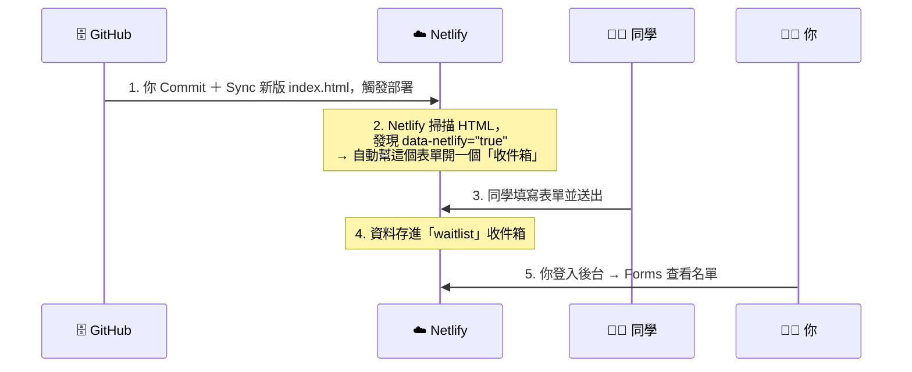

# 📦 Netlify Forms：零後端名單收集系統

> 只要在 HTML 表單加一行 `data-netlify="true"`，Netlify 就會幫你收資料、存後台、寄通知。
> 這就是 **BaaS（Backend as a Service，後端即服務）**。

[← 回第 2 週](../../lectures/wk02_1014_baas-cicd/README.md)　｜　📖 官方文件：[Netlify Forms setup](https://docs.netlify.com/manage/forms/setup/)

---

## 🧠 它是怎麼運作的？



> 重點：Netlify 是在**部署的時候**掃描你的 HTML 找表單。所以開啟偵測之後，一定要**重新部署一次**。

---

## 步驟 1：確認表單程式碼正確

用 [咒語 1](../../lectures/wk02_1014_baas-cicd/prompts.md#咒語-1加入早鳥候補名單waitlist表單) 產生表單後，檢查你的 `<form>` 是否長得像這樣：

```html
<form name="waitlist" method="POST" data-netlify="true" netlify-honeypot="bot-field">
  <!-- ① 告訴 Netlify 這是哪一個表單（AJAX 送出時必備） -->
  <input type="hidden" name="form-name" value="waitlist" />

  <!-- ② 防機器人陷阱：真人看不到，機器人會亂填 → 被過濾掉 -->
  <p hidden><label>請勿填寫：<input name="bot-field" /></label></p>

  <!-- ③ 每個欄位都要有 name，後台才會顯示這一欄 -->
  <label>姓名 <input type="text" name="name" required /></label>
  <label>Email <input type="email" name="email" required /></label>

  <button type="submit">加入早鳥名單</button>
</form>
```

| 檢查項目 | 為什麼重要 |
| --- | --- |
| `<form>` 有 `name="waitlist"` | 後台會用這個名字建立收件箱 |
| `<form>` 有 `data-netlify="true"` | **關鍵魔法**，沒有這行 Netlify 就不會收 |
| 有 `<input type="hidden" name="form-name" ...>` | 用 JavaScript（AJAX）送出時，Netlify 靠它辨認表單 |
| 每個輸入欄位都有 `name` 屬性 | 沒有 `name` 的欄位，資料會被丟掉 |

---

## 步驟 2：在 Netlify 開啟表單偵測（Form detection）

> ⚠️ **最多人卡在這一步！** 自 2023 年 4 月起，新建立的 Netlify 專案表單偵測功能**預設是關閉的**（[官方公告](https://answers.netlify.com/t/forms-detection-now-off-by-default/90414)）。

1. 登入 <https://app.netlify.com/>，點進你的專案。
2. 左側選單點 **「Forms」**。
3. 如果看到 **「Enable form detection」** 按鈕，按下去。
   - （找不到的話，也可以到 **Project configuration → Forms → Form detection** 開啟。）
4. 畫面會提示你需要**重新部署**，才會開始偵測表單。

📖 官方說明：[Netlify：Form detection](https://docs.netlify.com/manage/forms/setup/#enable-form-detection)

---

## 步驟 3：Commit ＋ Sync 觸發部署

1. Copilot 改完 `index.html` 後按 **Keep**。
2. VS Code 左側 **原始檔控制** → 訊息框寫 `新增早鳥名單表單` → **✓ 提交（Commit）**。
3. 按 **同步變更（Sync Changes）**。
4. 回到 Netlify 的 **Deploys** 頁面，會看到一筆新的部署正在跑，等它變成 **Published**。

> 💡 如果你是「先 Sync、後開啟偵測」，到 Netlify 的 **Deploys** 頁面按 **Trigger deploy → Deploy site（或 Deploy project）** 手動重新部署一次即可。

---

## 步驟 4：到後台查看收集到的名單

1. 請同學用手機打開你的網址，填寫表單並送出（你自己也填一筆測試）。
2. 回到 Netlify → 你的專案 → **Forms**。
3. 在「Active forms」下會看到 **waitlist**，點進去。
4. 🎉 所有送出的名單都在這裡！包含姓名、Email、送出時間。

> ⚠️ 注意：**直接在電腦上雙擊打開的 `index.html`（網址是 `file:///...`）送出表單是不會被收到的**，一定要用 Netlify 的網址（`https://xxx.netlify.app`）測試。

> 🏗️ **架構呼應**：只要加一行字，Netlify 這個房東就會變成你的警衛，免費幫你把客人的資料收好放在雲端後台。這就是串接 BaaS 的威力！

---

## 進階設定：Email 通知

有人填表時自動寄信給你：

1. Netlify → 你的專案 → 左側 **Forms**。
2. 找到 **Submission notifications** → **Add notification** → 選 **Email notification**。
3. 事件選 **New form submission**，填入你的 Email，表單選 `waitlist`，儲存。

📖 官方說明：[Netlify：Form notifications](https://docs.netlify.com/manage/forms/notifications/)

## 進階設定：匯出名單

在 Forms → waitlist 的頁面，可以把名單**下載成 CSV**，用 Excel / Google 試算表打開做分析。

---

## 🔐 個資保護小提醒

收集 Email 就是在收集**個人資料**，真正對外營運時請注意：

- 在表單旁清楚說明「收集資料的目的」（例如：產品上線時通知您）。
- 只收必要的欄位，不要要求身分證字號、生日等敏感資料。
- 不要把名單公開分享或轉賣。
- 📖 延伸閱讀：[全國法規資料庫：個人資料保護法](https://law.moj.gov.tw/LawClass/LawAll.aspx?pcode=I0050021)

---

## 💰 免費方案的限制

Netlify 免費方案的表單送出次數有上限，對課堂練習和早期 MVP 來說非常足夠。實際額度會隨方案調整，請以官方頁面為準：[Netlify Pricing](https://www.netlify.com/pricing/)。

如果將來名單量變大，可以換成其他積木：[Google 表單](https://www.google.com/forms/about/)、[Tally](https://tally.so/)、[Formspree](https://formspree.io/)、[Supabase](https://supabase.com/)。

---

下一步 👉 [打造無縫體驗：LocalStorage](localstorage.md)
