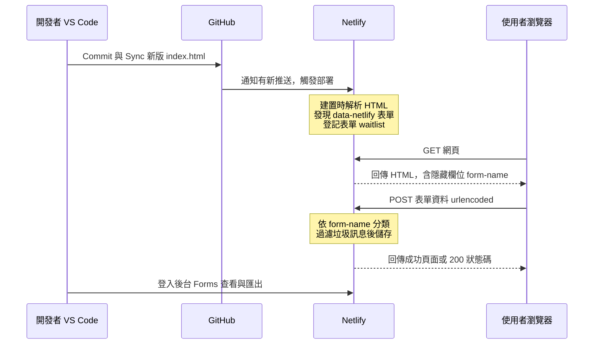

# Netlify Forms：以 BaaS 收集候補名單

[← 回第 2 週講義](../../lectures/wk02_1014_baas-cicd/README.md)　｜　官方文件：[Netlify Forms setup](https://docs.netlify.com/manage/forms/setup/)

---

## 1. 學習目標

1. 說明 Netlify Forms 從「部署」到「收到資料」的完整機制，包括建置時的 HTML 解析與瀏覽器送出的 HTTP 請求。
2. 正確撰寫可被 Netlify 偵測的表單，並解釋每個必要屬性的作用。
3. 理解以 JavaScript（AJAX）送出與以 JavaScript 產生表單時的差異與限制。
4. 設定垃圾訊息防護、查看與匯出資料、設定通知。
5. 說明免費方案的額度限制，以及依臺灣《個人資料保護法》蒐集個資時應負的基本義務。

## 2. 核心概念：它如何運作

Netlify Forms 是一種後端即服務（Backend as a Service, BaaS）：Netlify 代為提供「接收表單資料的端點、儲存、後台介面與通知」，開發者不需要撰寫任何伺服器程式。其運作分為兩個階段。

### 2.1 部署階段：建置時解析 HTML

每次部署時，Netlify 的建置系統會讀取網站的靜態 HTML 檔案，尋找帶有 `data-netlify="true"`（或 `netlify`）屬性的 `<form>`。找到後，Netlify 會：

1. 以 `<form>` 的 `name` 屬性登記一個表單（本課程為 `waitlist`），並記下其中各欄位的 `name`。
2. 在處理後的 HTML 中自動加入一個隱藏欄位 `form-name`，使一般的表單送出能被辨識。
3. 為該網站啟用表單接收：之後送到這個網站的相符 POST 請求，會被 Netlify 攔截並儲存。

兩個直接推論：

- **表單偵測必須開啟**：自 2023 年 4 月起，新建立的網站預設關閉表單偵測（[Netlify 公告](https://answers.netlify.com/t/forms-detection-now-off-by-default/90414)）。關閉時，建置系統不會解析表單。
- **開啟後必須重新部署**：解析只發生在部署時。先推送程式碼、後開啟偵測，必須再觸發一次部署。

### 2.2 送出階段：瀏覽器發出 HTTP POST

使用者按下送出時，瀏覽器依 `<form>` 的設定發出一個 HTTP 請求：

- **方法**：`POST`，資料放在請求本文（body）中。
- **編碼**：預設為 `application/x-www-form-urlencoded`，也就是把每個具 `name` 的欄位編成 `name=值`，以 `&` 連接，非英數字元以百分比編碼（percent-encoding）表示。例如：

```text
form-name=waitlist&name=%E5%B0%8F%E6%98%8E&email=ming%40example.com&role=%E5%A4%A7%E5%AD%B8%E7%94%9F
```

Netlify 收到後，依 `form-name` 的值找出對應表單，依欄位名稱存入後台，並回傳一個成功頁面（若 `<form>` 設有 `action="/thanks"` 等路徑，則導向該頁）。



### 2.3 以 AJAX 送出：為什麼一定要帶 form-name

第 2 週提示詞 2 改用 JavaScript 的 `fetch()` 在背景送出，以便頁面不跳轉。此時請求由我們的程式組成，因此必須自行滿足上述格式：

```javascript
const form = document.querySelector('form[name="waitlist"]');
form.addEventListener('submit', async (event) => {
  event.preventDefault();                       // 取消瀏覽器預設的整頁送出
  const body = new URLSearchParams(new FormData(form)).toString();
  const response = await fetch('/', {
    method: 'POST',
    headers: { 'Content-Type': 'application/x-www-form-urlencoded' },
    body,                                        // 必須包含 form-name=waitlist
  });
  if (!response.ok) throw new Error('送出失敗：' + response.status);
});
```

- `FormData` 會讀取表單內所有具 `name` 的欄位。若 HTML 原始碼中沒有 `form-name` 隱藏欄位，請求中就不會有它，Netlify 無法判斷資料屬於哪個表單，資料會被忽略。
- 本文必須是 urlencoded 字串，不能是 `JSON.stringify(...)` 產生的 JSON。
- 自己寫的隱藏欄位與 Netlify 自動加入的欄位內容相同，不會衝突。

### 2.4 以 JavaScript 產生的表單

若表單是由 JavaScript 在瀏覽器中動態產生（例如以 React、Vue 等框架渲染，或以 `innerHTML` 插入），建置系統讀取的靜態 HTML 中並沒有這個表單，因此偵測不到。官方建議的做法是在靜態 HTML 中另放一個具相同 `name` 與欄位的隱藏表單，供建置系統偵測。本課程的做法更簡單：要求 Copilot 將表單直接寫在 `index.html` 中。

## 3. 操作步驟

### 步驟 1：確認表單程式碼正確

以 [第 2 週提示詞 1](../../lectures/wk02_1014_baas-cicd/prompts.md) 產生表單後，檢查 `<form>` 是否具備以下結構：

```html
<form name="waitlist" method="POST" data-netlify="true" netlify-honeypot="bot-field">
  <!-- 表單名稱：AJAX 送出時必須由 HTML 帶上 -->
  <input type="hidden" name="form-name" value="waitlist" />

  <!-- honeypot：真人看不到，自動化程式填寫後會被過濾 -->
  <p hidden><label>請勿填寫：<input name="bot-field" /></label></p>

  <!-- 每個欄位都要有 name，後台才會出現該欄 -->
  <label>姓名 <input type="text" name="name" required /></label>
  <label>Email <input type="email" name="email" required /></label>

  <p>您的資料僅用於產品上線通知，不會提供給第三方。</p>
  <button type="submit">加入早鳥名單</button>
</form>
```

| 檢查項目 | 作用 |
| --- | --- |
| `name="waitlist"` | 後台以此名稱建立表單；須與 `form-name` 的 `value` 完全相同 |
| `method="POST"` | 資料放在請求本文；預設的 GET 會把資料附在網址上，Netlify 不會接收 |
| `data-netlify="true"` | 讓建置系統偵測並登記此表單 |
| 隱藏欄位 `form-name` | 讓 AJAX 請求可被正確歸類 |
| 每個欄位都有 `name` | 瀏覽器只送出具 `name` 的欄位 |
| `netlify-honeypot` 與 `bot-field` | 垃圾訊息防護（見第 4.1 節） |
| 蒐集目的說明 | 個資告知（見第 5 節） |

### 步驟 2：在 Netlify 開啟表單偵測（Form detection）

1. 登入 <https://app.netlify.com/>，進入你的專案。
2. 左側選單點選 **Forms**。
3. 按下 **Enable form detection**。
   - 若介面不同，可至專案設定（Project configuration）中的 **Forms → Form detection** 開啟。
4. 畫面會提示需要重新部署，偵測才會生效。

### 步驟 3：Commit＋Sync 觸發部署

1. Copilot 修改 `index.html` 後，檢視差異並按 **Keep**。
2. VS Code 左側 **原始檔控制** → 訊息輸入 `新增早鳥名單表單` → **提交（Commit）**。
3. 按 **同步變更（Sync Changes）**。
4. 至 Netlify **Deploys** 頁面，等待最新一筆部署變為 **Published**。

若先 Sync、後開啟偵測，請於 **Deploys** 頁面按 **Trigger deploy** 手動重新部署一次。

### 步驟 4：到後台查看收集到的名單

1. 以 Netlify 網址（`https://…netlify.app`）開啟網站，送出一筆測試資料；並請同學以手機填寫。
2. 回到 Netlify → 你的專案 → **Forms**。
3. 在已啟用的表單清單中點選 **waitlist**，即可看到每筆資料的欄位內容與送出時間。

**注意**：在電腦上直接開啟的 `index.html`（網址為 `file:///…`）沒有經過 Netlify，送出的資料不會被接收。

## 4. 進階設定

### 4.1 垃圾訊息防護

公開的表單很快會收到自動化程式送出的垃圾資料。Netlify 提供多層防護：

- **自動過濾**：Netlify 會對送出內容進行垃圾訊息判斷，被判定為垃圾的資料會另列於垃圾訊息清單，不會觸發通知。
- **honeypot 欄位**：在 `<form>` 加上 `netlify-honeypot="bot-field"`，並放一個隱藏的 `bot-field` 欄位。真人看不到而不會填寫；自動化程式傾向填寫所有欄位，一旦此欄有值，該筆即被捨棄。優點是對使用者零干擾，缺點是較進階的機器人可以避開。
- **reCAPTCHA（選用）**：在 `<form>` 加上 `data-netlify-recaptcha="true"`，並在表單中放置 `<div data-netlify-recaptcha="true"></div>`，Netlify 會插入 Google reCAPTCHA 驗證。防護較強，但會增加使用者操作步驟、可能降低轉換率，且涉及將使用者行為資料提供給第三方。

官方說明：[Netlify Forms spam filters](https://docs.netlify.com/manage/forms/spam-filters/)

### 4.2 查看、匯出與刪除資料

在 **Forms → waitlist** 頁面可以：

- 逐筆檢視資料，並分別查看已驗證（verified）與垃圾訊息（spam）清單。
- 將資料下載為 CSV 檔，以 Excel 或 Google 試算表開啟分析（例如依「身分」欄計算各族群報名數）。
- 刪除個別資料。當填寫者要求刪除，或資料不再需要時，應實際執行刪除。

官方說明：[Netlify Forms submissions](https://docs.netlify.com/manage/forms/submissions/)

### 4.3 送出通知（延伸任務：表單通知設定）

1. Netlify → 你的專案 → 左側 **Forms**。
2. 找到 **Submission notifications** → **Add notification** → 選擇 **Email notification**。
3. 事件選 **New form submission**，填入 Email，表單選 `waitlist`，儲存。

除 Email 外，Netlify 也支援以 Webhook 等方式將新資料轉送至其他服務。官方說明：[Netlify Forms notifications](https://docs.netlify.com/manage/forms/notifications/)

### 4.4 免費方案的額度

Netlify 免費方案對表單送出次數設有上限，對課堂練習與早期驗證通常足夠。額度與超額後的處理方式會隨方案調整，請以 [Netlify 價格頁面](https://www.netlify.com/pricing/) 為準，不要依賴講義或網路文章中的數字。若將來資料量或功能需求超出範圍，可評估其他服務，例如 [Google 表單](https://www.google.com/forms/about/)、[Tally](https://tally.so/)、[Formspree](https://formspree.io/) 或 [Supabase](https://supabase.com/)；遷移前應先匯出既有資料。

## 5. 個人資料保護

姓名與 Email 屬於可直接或間接識別特定個人的資料，受臺灣《[個人資料保護法](https://law.moj.gov.tw/LawClass/LawAll.aspx?pcode=I0050021)》規範。以下為原則性說明，不構成法律意見；課堂練習是否適用該法須視具體情境判斷，但當網站對外公開、向一般大眾蒐集資料時，應以符合法規的標準處理。

| 原則 | 法條要旨 | 對候補名單的具體做法 |
| --- | --- | --- |
| 告知義務 | 第 8 條：向當事人直接蒐集個資時，應明確告知蒐集者名稱、蒐集目的、個資類別、利用之期間、地區、對象及方式、當事人得行使之權利及方式，以及不提供時對其權益的影響 | 在表單旁以簡短文字說明：誰在蒐集、用途（例如產品上線通知）、保存到何時、如何要求查詢或刪除 |
| 目的限制 | 第 5 條：蒐集、處理或利用應尊重當事人權益，不得逾越特定目的之必要範圍，並應與蒐集目的具有正當合理之關聯 | 為「上線通知」蒐集的 Email，不應轉作其他行銷或提供他人 |
| 資料最小化 | 同上，以必要範圍為限 | 只蒐集驗證假設所必需的欄位；不要求身分證字號、生日、電話等非必要資料 |
| 當事人權利 | 第 3 條：當事人得請求查詢、閱覽、製給複製本、補充或更正、停止蒐集處理利用、刪除 | 提供聯絡方式，收到請求時在 Netlify 後台實際處理 |
| 安全維護 | 第 27 條：非公務機關保有個資檔案者，應採行適當之安全措施 | 為 Netlify 帳號設定強密碼與雙因素驗證；匯出的 CSV 不上傳至公開位置、不傳至群組 |

另需注意：資料實際存放於 Netlify 的伺服器，可能位於境外。在告知內容中說明使用第三方服務處理資料，是較透明的做法。

## 6. 討論與延伸思考

1. Netlify 選擇在「部署時」而非「送出時」偵測表單。這個設計帶來什麼好處？又造成哪些初學者常見的錯誤？
2. honeypot 與 reCAPTCHA 在防護強度、使用者體驗與隱私上各有取捨。對一個以轉換率為核心指標的候補名單頁面，你會選擇哪一種？為什麼？
3. 若同一頁面上有兩個表單（例如候補名單與意見回饋），需要做哪些調整才能在後台分開收集？
4. 你的表單告知文字是否涵蓋第 8 條所列的事項？哪些項目在一行文字中難以完整說明，可以如何處理（例如連到一頁隱私權說明）？

## 7. 參考資料

- Netlify Docs：[Forms setup](https://docs.netlify.com/manage/forms/setup/)、[Spam filters](https://docs.netlify.com/manage/forms/spam-filters/)、[Submissions](https://docs.netlify.com/manage/forms/submissions/)、[Notifications](https://docs.netlify.com/manage/forms/notifications/)
- Netlify Support Forums：[Forms detection now off by default](https://answers.netlify.com/t/forms-detection-now-off-by-default/90414)
- MDN Web Docs：[POST 方法](https://developer.mozilla.org/en-US/docs/Web/HTTP/Methods/POST)、[FormData](https://developer.mozilla.org/en-US/docs/Web/API/FormData)
- 全國法規資料庫：[個人資料保護法](https://law.moj.gov.tw/LawClass/LawAll.aspx?pcode=I0050021)
- 常見問題：[疑難排解手冊](error_guide.md)

---

下一份講義：[LocalStorage：瀏覽器端的狀態保存](localstorage.md)
