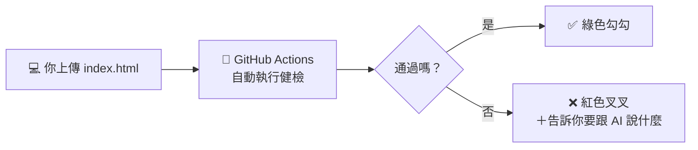

# 🤖 支線任務：請機器人助教幫你自動健檢

> 🟡 **挑戰任務**（+20 XP，支線 🤖 機器人助教）。不做也完全沒關係！
> 完成後，你每次上傳 `index.html` 到 GitHub，機器人就會自動檢查，並在 repo 上顯示 ✅ 或 ❌。

[← 回教學目錄](README.md)

---

## 🧠 這是什麼？

還記得第 2 週的 **CI/CD** 嗎？「CI（持續整合）」的意思是：**每次修改程式，都自動檢查有沒有壞掉**。
真實的科技公司，每次工程師上傳程式碼，都會有機器人自動跑幾百個測試。
今天，你也可以擁有一個自己的機器人助教！它用的是 GitHub 內建的免費服務 **[GitHub Actions](https://docs.github.com/zh/actions)**。



---

## 🛠️ 安裝步驟（約 5 分鐘）

1. 打開 [tools/ci/vibe-check.yml](../../tools/ci/vibe-check.yml)，點右上角的 **複製圖示（Copy raw file）** 📋。
2. 到**你自己的** GitHub repo（放 `index.html` 的那個），點 **Add file** → **Create new file**。
3. 檔名欄位輸入（**一字不差**，斜線會自動變成資料夾）：
   ```
   .github/workflows/vibe-check.yml
   ```
4. 在下方大框框貼上剛剛複製的內容。
5. 按 **Commit changes**。
6. 點 repo 上方的 **Actions** 分頁，會看到機器人正在執行（黃色圓圈 🟡）。
7. 等 30 秒左右，變成 ✅ 綠色勾勾就成功了！點進去可以看到完整的健檢報告。

## 🔧 第 2 週：提高檢查等級

打開你 repo 裡的 `.github/workflows/vibe-check.yml`，按鉛筆圖示 ✏️ 編輯，找到這一行：

```yaml
  LEVEL: "1"
```

- 加了早鳥表單後 → 改成 `"2"`
- 加了會員儀表板後 → 改成 `"3"`

Commit 之後機器人會用新標準重新檢查。

## ❓ 常見狀況

| 狀況 | 解法 |
| --- | --- |
| Actions 分頁看不到任何東西 | 確認檔名是 `.github/workflows/vibe-check.yml`（開頭有一個點，`workflows` 有 s） |
| ❌ 紅色叉叉 | 很正常！點進去看報告，照「請跟 AI 說」的提示修改，再上傳一次 |
| 「下載健檢腳本」這一步失敗 | 可能是網路暫時問題，到 Actions 頁面按 **Re-run jobs** 重跑一次 |
| 我的 repo 裡找不到 `index.html` | 檔案要放在 repo 最外層，不是資料夾裡 |

> 💡 你也可以不用 GitHub Actions，直接用瀏覽器版的 [Vibe 健檢站](../../tools/vibe_check.html)，檢查項目完全一樣。

📖 延伸學習：[GitHub Actions 官方文件（繁中）](https://docs.github.com/zh/actions)｜[GitHub：什麼是 CI/CD？](https://github.com/resources/articles/devops/ci-cd)
