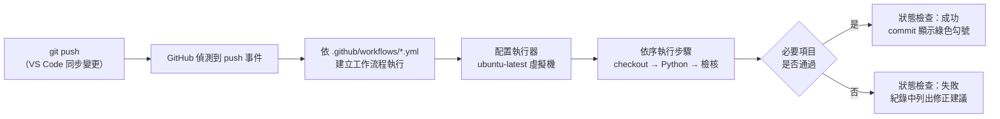

# 以 GitHub Actions 自動檢核網站

> **性質**：延伸任務（選做）：GitHub Actions 自動檢核
> **先備條件**：已完成檢核點 3（repo 中已有 `index.html` 並成功部署）
> **預估時間**：安裝約 10 分鐘，閱讀概念約 15 分鐘
> **完成後**：每次將 `index.html` 推送到 GitHub，雲端的自動化流程都會依課程標準檢查網頁，並在 repo 上顯示通過或失敗的狀態。

[← 回教學目錄](README.md)

---

## 1. 學習目標

1. 說明持續整合（Continuous Integration, CI）的目的，以及自動化檢查在軟體團隊中的角色。
2. 理解 GitHub Actions 的組成：工作流程檔、觸發條件、執行器、工作、步驟、執行紀錄與狀態檢查。
3. 以 VS Code 在自己的 repo 中安裝課程提供的工作流程範本，並依進度調整檢核等級。
4. 能閱讀執行紀錄，依失敗訊息修正網頁。

## 2. 核心概念

### 2.1 為什麼需要自動化檢查

**持續整合（CI）** 的核心做法是：每次有人提交程式碼，就自動執行一系列檢查（編譯、測試、程式碼風格檢查等），盡早發現問題。問題越早被發現，修正成本越低；若等到產品上線、使用者回報才發現，影響範圍與修正成本都會大幅增加。

在軟體公司中，CI 通常與程式碼審查（code review）結合：Pull Request 必須通過所有自動檢查，才允許合併進主分支。這讓團隊可以頻繁地整合變更，而不必擔心有人不小心把網站弄壞。

本課程的 [網站自我檢核工具](../../tools/vibe_check.html) 是讓你手動在瀏覽器中檢查；本篇則把相同的檢查搬到雲端，讓它在每次推送時自動執行。

### 2.2 GitHub Actions 的組成

**GitHub Actions** 是 GitHub 內建的自動化平台，公開 repo 可免費使用標準的執行器。其主要組成如下：

| 術語 | 英文 | 說明 | 在本課程範本中的對應 |
| --- | --- | --- | --- |
| 工作流程檔 | workflow file | 以 YAML 格式撰寫的設定檔，必須放在 repo 的 `.github/workflows/` 資料夾中 | `.github/workflows/vibe-check.yml` |
| 觸發條件 | trigger（`on:`） | 定義在什麼事件發生時執行，例如 push、Pull Request、排程或手動 | `push`（每次推送）與 `workflow_dispatch`（在 Actions 分頁手動執行） |
| 執行器 | runner | 實際執行工作的機器。GitHub 提供的執行器是每次全新建立的雲端虛擬機，執行完即銷毀 | `runs-on: ubuntu-latest`（Linux 虛擬機） |
| 工作 | job | 在同一個執行器上依序執行的一組步驟；一個工作流程可以有多個工作 | `vibe-check` |
| 步驟 | step | 工作中的單一動作：執行一行指令（`run:`），或使用他人寫好的動作（`uses:`） | 下載程式碼、安裝 Python、下載檢核腳本、產生報告、執行檢查 |
| 執行紀錄 | logs | 每個步驟的輸出內容，用於除錯 | 在 Actions 分頁點開每個步驟即可查看 |
| 狀態檢查 | status check | 工作流程的結果（成功、失敗、執行中）會標示在對應的 commit 上 | commit 旁顯示綠色勾號或紅色叉號 |



**最小權限設定**：範本中宣告 `permissions: contents: read`，表示這個工作流程只能讀取 repo 內容，無法修改程式碼或其他設定。這是撰寫工作流程時的良好安全習慣。

**與 Netlify 的關係**：GitHub Actions 與 Netlify 部署是兩條獨立的流程，都由同一次 push 觸發。檢核失敗**不會**阻止 Netlify 部署；它的作用是提示你網頁尚未符合標準。在實務上，團隊可以設定「檢查通過才允許合併或部署」，形成品質閘門（quality gate）。

### 2.3 範本做了什麼

課程提供的範本 [tools/ci/vibe-check.yml](../../tools/ci/vibe-check.yml) 包含五個步驟：

1. **下載程式碼**（`actions/checkout`）：將你 repo 的檔案複製到執行器上。
2. **安裝 Python**（`actions/setup-python`）：檢核腳本以 Python 撰寫。
3. **下載檢核腳本**：從課程 repo 取得最新版的 [tools/ci/vibe_check.py](../../tools/ci/vibe_check.py)。
4. **產生報告**：將檢核結果寫入執行頁面的 Summary 區，此步驟不論結果都不會失敗。
5. **正式檢查**：依 `LEVEL` 執行檢查，必要項目未通過時此步驟失敗，整個工作流程標示為失敗。

## 3. 安裝步驟

1. 開啟課程 repo 的 [tools/ci/vibe-check.yml](../../tools/ci/vibe-check.yml)，點右上角的 **Copy raw file** 圖示複製全文。
2. 在 VS Code 開啟**你自己的** repo 資料夾。在左側檔案總管按 **新增檔案** 圖示，輸入以下路徑（須完全相同；輸入斜線時 VS Code 會自動建立資料夾）：
   ```
   .github/workflows/vibe-check.yml
   ```
   注意：`.github` 開頭有一個半形句點；`workflows` 結尾有 `s`。GitHub 只會執行放在此路徑下的工作流程檔。
3. 貼上剛才複製的內容，按 `Ctrl+S`（Mac：`⌘S`）存檔。YAML 以縮排表示層級，請勿修改縮排。
4. 原始檔控制 → 訊息輸入 `新增 GitHub Actions 自動檢核` → **提交（Commit）** → **同步變更**。
5. 替代做法：也可以在 GitHub 網頁上按 **Add file → Create new file** 建立同名檔案並 commit，之後回到 VS Code 先按一次同步變更，以取得這個新 commit。
6. 在 GitHub repo 頁面點上方的 **Actions** 分頁，會看到一筆執行中的工作流程（黃色圓點）。
7. 約 30 秒至 1 分鐘後，狀態變為成功（綠色勾號）或失敗（紅色叉號）。點進去可查看 Summary 報告與每個步驟的執行紀錄。

## 4. 調整檢核等級（LEVEL 變數）

工作流程檔中的 `env:` 區塊定義了環境變數 `LEVEL`，它決定檢查的範圍：

```yaml
env:
  LEVEL: "1"
```

| LEVEL | 對應進度 | 檢查範圍 |
| --- | --- | --- |
| `"1"` | 第 1 週，檢核點 3 | 產品形象首頁的基本要素 |
| `"2"` | 第 2 週，檢核點 4 | 另加 Netlify Forms 表單 |
| `"3"` | 第 2 週，檢核點 5 | 另加 LocalStorage 會員狀態與 AJAX 送出 |

完成表單後將 `"1"` 改為 `"2"`；完成會員儀表板後改為 `"3"`。存檔後 Commit＋Sync，工作流程會以新的標準重新執行。請保留引號，並維持 `LEVEL` 前方的兩個空格縮排。

各等級的詳細檢查項目與 [網站自我檢核工具](../../tools/vibe_check.html) 相同，兩者使用同一套標準。

## 5. 閱讀結果與疑難排解

**失敗時的處理方式**：點開失敗的工作流程執行 → 閱讀 Summary 報告，或展開最後一個步驟的紀錄 → 找出未通過的項目及其修正建議（每項附有可直接交給 AI 的提示） → 將提示交給 Copilot 修改 → 檢視差異並在本機預覽 → Commit＋Sync，工作流程會自動重新執行。紅色叉號是檢查機制正常運作的結果，不代表操作錯誤。

| 症狀 | 可能原因 | 處理步驟 |
| --- | --- | --- |
| Actions 分頁沒有任何執行紀錄 | 檔案路徑或檔名錯誤，或檔案尚未推送 | 在 GitHub 網頁確認檔案位於 `.github/workflows/vibe-check.yml`（開頭有句點，`workflows` 有 s）；確認已按同步變更 |
| 工作流程出現 YAML 語法錯誤 | 貼上時縮排被改動，或內容不完整 | 刪除檔案內容，重新複製範本全文貼上，不要手動調整縮排 |
| 「下載檢核腳本」步驟失敗 | 執行器暫時無法連線 | 在該次執行頁面按 **Re-run jobs** 重新執行 |
| 報告顯示找不到 `index.html` | 檔案不在 repo 最外層，或檔名大小寫不符 | 將檔案移到最外層並命名為全小寫的 `index.html` |
| 修改 LEVEL 後仍以舊等級檢查 | 修改未存檔或未推送 | 確認已存檔、Commit 並同步變更，並查看最新一次的執行紀錄 |

## 6. 討論與延伸思考

1. 自動化檢查只能驗證「可被規則描述」的項目（例如是否有表單、是否宣告 viewport）。哪些品質面向無法以自動化檢查驗證，仍需要人工判斷？
2. 若將「檢查通過」設為部署的前提條件，對開發速度與網站穩定性各有什麼影響？
3. 範本在執行時從課程 repo 下載最新的檢核腳本。從資安角度來看，執行從外部下載的程式碼有什麼風險？實務上可以如何降低風險（提示：固定版本）？

## 7. 參考資料

- [GitHub Actions 文件](https://docs.github.com/zh/actions)
- [GitHub：什麼是 CI/CD](https://github.com/resources/articles/devops/ci-cd)
- [Red Hat：什麼是 CI/CD](https://www.redhat.com/zh/topics/devops/what-is-ci-cd)
- 本課程：[CI/CD 教學](cicd.md)
