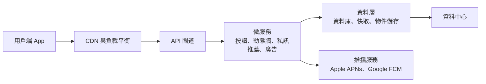
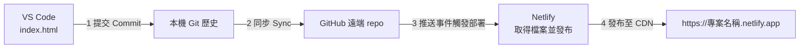

# 第 1 週（2026/10/7）：SaaS 商業模式與數位店面建置

[上課操作步驟卡](steps.md)　｜　[核心閱讀：現代網路服務與 SaaS 架構](saas_architecture.md)　｜　[下一週](../wk02_1014_baas-cicd/README.md)

---

## 1. 單元概要

| 項目 | 內容 |
| --- | --- |
| 日期與時數 | 2026 年 10 月 7 日，2 小時（兩節） |
| 對應檢核點 | 檢核點 1 架構理解、檢核點 2 前端原型、檢核點 3 部署上線（定義見 [學習檢核點](../../docs/checkpoints.md)） |
| 使用工具 | VS Code、GitHub Copilot（Agent／Ask 模式）、Git 與 GitHub、Netlify |
| 單元成果 | 每位學生擁有一個 GitHub repo、一份以 AI 協助完成的產品形象首頁，以及一個可公開存取的 Netlify 網址 |
| 核心閱讀 | [現代網路服務與 SaaS 架構](saas_architecture.md)、[社群媒體平台的系統架構](social_media_architecture.md) |

本單元以「使用 SaaS 服務打造自己的 SaaS 產品」為主軸：前半段建立理解現代網路服務的概念框架，後半段實際使用業界通用的開發工具，完成從撰寫、版本控制到部署上線的完整流程。

---

## 2. 學習目標

完成本單元後，學生應能：

1. **說明**大型社群平台的分層架構，並追蹤「按讚」操作在各服務之間的處理路徑。（理解）
2. **比較**套裝軟體、ASP 與 SaaS 的交付模式，以及 IaaS、PaaS、SaaS 三種雲端服務模式的責任分擔。（理解、分析）
3. **解釋** repo、commit、clone、sync 的意義，並區分本機儲存庫與 GitHub 遠端儲存庫。（理解）
4. **建立** GitHub repo，並以 VS Code 複製（clone）到本機。（應用）
5. **撰寫**結構完整的提示，運用 GitHub Copilot 產生符合自身創業題目的形象首頁，並在接受變更前審查差異。（應用、評鑑）
6. **部署**網站至 Netlify，取得公開網址，並說明 Netlify 在部署過程中執行的工作。（應用）
7. **評估**新創在自建與購買雲端服務之間的取捨。（評鑑）

---

## 3. 先備條件：檢核點 0（課前準備）

請於上課前完成 [課前準備清單](../../docs/tutorials/before_class.md)，安裝與設定步驟見 [VS Code 與 Copilot 入門](../../docs/tutorials/vscode_copilot_starter.md)：

- [ ] 已註冊 GitHub 帳號並完成雙重驗證（two-factor authentication）設定。
- [ ] 已安裝 VS Code 與 Git，並在 VS Code 中登入 GitHub、啟用 GitHub Copilot。
- [ ] 已安裝 Live Preview 擴充功能。
- [ ] 已使用 GitHub 帳號登入 Netlify。
- [ ] 已以 Copilot 產生一個「Hello NTPU」頁面並成功預覽。

尚未完成者，請於上課前 10 分鐘到教室，由助教協助。環境問題初學者常遇到，屬正常現象；請勿等到實作段落才提出。

---

## 4. 課堂進行方式

- **配對程式設計（pair programming）**：兩人一組，一人擔任**駕駛（driver）**操作電腦，另一人擔任**導航員（navigator）**對照 [步驟卡](steps.md) 確認步驟、檢查畫面與錯誤訊息。每個段落結束後交換角色。兩人都必須在自己的電腦上完成所有步驟與成果。
- **課堂即時回饋卡（紅綠便利貼）**：綠色表示已完成該段落；紅色表示需要協助，助教將依序巡視。
- **15 分鐘求助原則**：同一個問題自行排除超過 15 分鐘仍無進展時，應先查閱 [疑難排解手冊](../../docs/tutorials/error_guide.md)，再貼紅色便利貼請求協助。
- **預測—觀察—解釋（Predict–Observe–Explain, POE）**：開場請學生先預測，課程結束時對照觀察結果並解釋差異，以促進概念改變。

---

## 5. 時程

| 段落 | 時間 | 主題 | 核心概念 | 主要教材 |
| --- | --- | --- | --- | --- |
| 0 | 0:00–0:05 | 開場示範：從一句提示到網站上線 | 本單元的終點成果 | 教師現場示範 |
| 1 | 0:05–0:35 | 現代網路服務與 SaaS 架構 | 交付模式、雲端服務模式、分層架構 | [social_saas.html](slides/social_saas.html)、[foodcourt.html](slides/foodcourt.html) |
| 2 | 0:35–0:55 | 以 GitHub 建立專案儲存庫 | repo、commit、clone | [git_flow.html](slides/git_flow.html)、[Git 與 GitHub 入門](../../docs/tutorials/git_intro.md) |
| 3 | 0:55–1:30 | 以 GitHub Copilot 建立產品前端 | 前端、提示設計、AI 輸出審查 | [prompt_builder.html](slides/prompt_builder.html)、[prompts.md](prompts.md) |
| 4 | 1:30–1:55 | 提交、同步與 Netlify 部署 | commit／sync、靜態託管、CDN | [steps.md](steps.md)、[部署教學](../../docs/tutorials/github_netlify_deploy.md) |
| 5 | 1:55–2:00 | 作品巡禮與出場券 | 反思與同儕回饋 | [worksheet.md](worksheet.md) |

---

## 6. 段落 0：開場示範（5 分鐘）

**教師示範**：不先講解理論，直接在 VS Code 以一句提示請 Copilot 建立「三峽美食地圖」頁面，接受變更後執行 Commit 與 Sync；Netlify 偵測到新的 commit 後自動部署。完成後將網址轉為 QR Code，學生以手機開啟。（教師事先建好 repo 並連結 Netlify，現場只展示「提示 → 提交 → 自動更新」三個動作。）

**學生活動（POE 預測）**：在 [學習單](worksheet.md) 第 1 題寫下預測：若在十年前委外製作一個相同的網站並公開上線，需要多少費用、時間與哪些專業人員？此題沒有標準答案，目的在於事後對照。

---

## 7. 段落 1：現代網路服務與 SaaS 架構（30 分鐘）

**核心概念**：軟體交付模式、SaaS 的定義性特徵、IaaS／PaaS／SaaS、大型平台的分層架構、自建與購買的取捨。

### 7.1 從買斷到訂閱（5 分鐘）

**課堂調查**：請學生舉手回答每天使用 Instagram 或 LINE、每月訂閱 Netflix、Spotify 或 ChatGPT 的情形，引出「訂閱」與「免費但有廣告」兩種模式。

| 面向 | 套裝軟體（買斷授權） | SaaS（軟體即服務） |
| --- | --- | --- |
| 例子 | 光碟版 Office、單機遊戲 | Google Workspace、Canva、Netflix |
| 取得方式 | 下載或安裝光碟 | 開啟瀏覽器或 App |
| 軟體與資料位置 | 使用者的電腦 | 供應商的雲端 |
| 更新方式 | 使用者自行安裝 | 供應商持續部署 |
| 收入模式 | 一次性授權費 | 訂閱、廣告、交易抽成 |

**概念說明**：SaaS 的經濟特性在於**高固定成本、低邊際成本**：軟體開發一次後，每多服務一位使用者只增加少量運算與頻寬費用；訂閱制則帶來可預測的經常性收入（MRR）。但低邊際成本並非零成本，客戶流失率（churn）與客戶取得成本（CAC）決定了一家 SaaS 公司能否獲利。完整說明與計算範例見 [核心閱讀第 4 節](saas_architecture.md#4-saas-的單位經濟學unit-economics)。

### 7.2 大型社群平台的系統架構（12 分鐘）

**教師示範**：開啟 [slides/social_saas.html](slides/social_saas.html)。

1. **架構圖分頁**：由上而下說明用戶端、邊緣層（CDN、負載平衡）、API 閘道、微服務、資料層、基礎設施與外部 SaaS 服務，並點選 CDN、推薦系統、推播三個元件。
2. **操作流程分頁**：播放「按讚」動畫，提問：「介面上的愛心變色之後，還有哪些服務在工作？」引出訊息佇列與非同步處理；再播放「發布限時動態」與「傳送訊息」。
3. **商業模式分頁**：廣告、訂閱與電商抽成。



**概念說明**：一個 App 背後由數十個獨立服務組成，稱為**微服務架構**。這種拆分讓各團隊能獨立開發與擴充，也讓單一功能故障（例如私訊）不致影響其他功能（例如動態牆）。此外，即使是大型平台也會使用外部 SaaS：iOS 與 Android 的推播通知必須經由 Apple 與 Google 的推播服務送達。完整說明（含動態牆生成策略、最終一致性、推薦管線）見 [社群媒體平台的系統架構](social_media_architecture.md)。

### 7.3 自建或購買（5 分鐘）

**教師示範**：開啟 [slides/foodcourt.html](slides/foodcourt.html) 第一個分頁，拖動月數拉桿比較兩種方案的累積成本。

以一個類比引入：傳統創業像在深山買地蓋餐廳，水電、保全、廚房都要自己建；現代 SaaS 創業則像進駐百貨公司美食街，基礎設施由業者提供。對應到技術上，前者是自行架設伺服器、資料庫與部署流程（自建），後者是組合 PaaS、BaaS 與 SaaS 服務（購買）。

**概念說明**：兩者的差異在於前期成本、上市時間、維運負擔、擴充性、供應商鎖定與控制權。一般原則是「在驗證市場需求之前優先購買」。比較表見 [核心閱讀第 7 節](saas_architecture.md#7-自建或購買新創的技術決策)。

### 7.4 本課程的架構組成（3 分鐘）

切換到 foodcourt.html 第二個分頁播放資料流，並回到 social_saas.html 開啟 MVP 對照功能。

| 架構層 | 本課程使用的工具 | 服務模式 | 對應大型平台的元件 | 週次 |
| --- | --- | --- | --- | --- |
| 前端 | `index.html`（以 Copilot 協助撰寫） | — | App 與網頁介面 | 第 1 週 |
| 版本控制 | Git ＋ GitHub | SaaS | 內部版本控制與 CI/CD 系統 | 第 1 週 |
| 託管與 CDN | Netlify | PaaS | CDN、負載平衡、資料中心 | 第 1 週 |
| 後端資料收集 | Netlify Forms | 後端即服務（BaaS） | 資料庫與後端服務 | 第 2 週 |

本課程不直接操作 IaaS（例如 GCP、AWS 的虛擬機器），因為對早期新創而言，維運伺服器的成本遠高於其帶來的控制權。

### 7.5 形成性評量：檢核點 1（5 分鐘）

完成 [foodcourt.html](slides/foodcourt.html) 或 [social_saas.html](slides/social_saas.html) 的架構互動測驗，**答對 80% 以上**即達成檢核點 1。每題皆附解說，未達標準可重新作答；此即「提取練習（retrieval practice）」，回想本身有助於長期記憶。

---

## 8. 段落 2：以 GitHub 建立專案儲存庫（20 分鐘）

**核心概念**：儲存庫（repository, repo）、提交（commit）、暫存（stage）、複製（clone）、同步（sync：pull 與 push）。

### 8.1 概念說明

- **Git 與 GitHub**：Git 是在本機電腦上執行的**分散式版本控制系統（distributed version control system）**；GitHub 是代管 Git 儲存庫的雲端服務（SaaS），另提供協作、議題追蹤與自動化功能。
- **儲存庫（repo）**：一個由 Git 追蹤的專案資料夾。除了你看得到的檔案之外，其中隱藏的 `.git` 資料夾保存了這個專案**完整的歷史紀錄**。
- **提交（commit）**：專案在某一時間點的**完整快照**，並附帶作者、時間、說明訊息，以及一個由內容計算出的唯一識別碼（雜湊值，hash）。每個 commit 都記錄其前一個 commit，因此所有 commit 串成一條可追溯的歷史；任何時候都能比較兩個版本的差異，或回到過去的版本。
- **暫存（stage）**：選擇哪些變更要納入下一個 commit 的步驟，讓一次 commit 只包含相關的修改。
- **複製（clone）**：把遠端儲存庫連同全部歷史下載到本機，並記住它的來源位址（稱為 `origin`）。
- **同步（sync）**：VS Code 的「同步變更」會依序執行 pull（取得遠端的新 commit）與 push（上傳本機的新 commit）。

最重要的一點：**commit 只存在你的電腦上；執行 sync（push）之後，GitHub 與 Netlify 才看得到。** 本課程中，GitHub 上的 repo 同時是 Netlify 的部署來源，因此「推送到 GitHub」就等於「送出部署」。

### 8.2 模擬器練習（5 分鐘）

開啟 [slides/git_flow.html](slides/git_flow.html)，依序操作：請 Copilot 修改 → Stage → Commit（輸入說明）→ Sync，觀察網站如何更新。

| 動作 | 意義 | VS Code 操作位置 |
| --- | --- | --- |
| Clone | 將遠端 repo 與歷史複製到本機 | 原始檔控制 → 複製存放庫 |
| Commit | 在本機建立一個具說明的版本快照 | 訊息框 → 提交 |
| Sync（pull ＋ push） | 與 GitHub 交換 commit | 同步變更 ↑1 |

### 8.3 建立 repo 並複製到本機（15 分鐘）

**教師示範**後，學生依 [步驟卡第 2 節](steps.md#2-段落-2建立-repo-並複製到本機) 操作：

1. 於 <https://github.com/new> 建立 repo（名稱使用英文小寫與連字號，例如 `rent-radar`），選擇 **Public**，並勾選 **Add a README file**。
2. 在 VS Code 開啟**原始檔控制**（`Ctrl+Shift+G`／`⌃⇧G`）→ **複製存放庫** → **從 GitHub 複製** → 選擇剛建立的 repo → 選擇存放位置 → **開啟**。
3. 確認左側檔案總管顯示 `README.md`。

詳細說明見 [Git 與 GitHub 入門](../../docs/tutorials/git_intro.md)。選擇 Public 是因為 Netlify 免費方案與同儕檢視都需要公開存取；請勿在 repo 中放入個人資料、密碼或 API 金鑰，因為 commit 歷史會永久保留這些內容。

段落結束，駕駛與導航員交換角色。

---

## 9. 段落 3：以 GitHub Copilot 建立產品前端（35 分鐘）

**核心概念**：前端（frontend）、提示設計（prompt specification）、Agent 模式、AI 輸出審查。

### 9.1 選擇創業題目（5 分鐘）

請選擇一個你真正關心、能具體描述目標使用者與痛點的題目：

| 學院 | 題目參考 |
| --- | --- |
| 法律學院 | 租屋契約條款檢核工具、學生打工權益問答 |
| 商學院 | 學生記帳與訂閱管理、二手教科書交易平台 |
| 公共事務學院 | 三峽社區活動地圖、公共議題資訊整理 |
| 社會科學學院 | 心情紀錄與同儕支持、志工媒合平台 |
| 人文學院 | 三峽老街文史導覽、語言交換配對 |
| 電機資訊學院 | 課程作業互助、實驗室設備預約 |
| 不限學院 | 三峽學餐地圖、寵物照顧媒合、運動揪團 |

若尚無想法，可於 Copilot Chat 的 **Ask** 模式使用 [提示 0：創業題目發想](prompts.md#51-提示-0創業題目發想ask-模式)。

### 9.2 概念說明

- **前端**：使用者在瀏覽器中直接看到並互動的部分，由三種技術組成：HTML 定義內容結構、CSS 定義視覺呈現與版面、JavaScript 定義互動行為。本課程要求三者寫在同一個 `index.html`，以便 Netlify 直接託管、不需任何建置步驟。
- **Vibe coding**：以自然語言描述期望的結果，由 AI 產生程式碼，開發者負責檢視、測試並回饋修改。這個說法由 Andrej Karpathy 於 2025 年提出。它降低了撰寫程式的門檻，但**沒有降低對結果負責的要求**。
- **Ask 模式與 Agent 模式**：Ask 模式只回答問題、不修改檔案。Agent 模式會讀取工作區內容、自行規劃步驟、建立或修改多個檔案，必要時提議執行終端機指令；所有檔案變更以差異（diff）呈現，按下 **Keep** 才會保留，按 **Undo** 則還原。
- **Agent 模式的風險**：可能修改你未預期的檔案；可能提議執行 `git`、套件安裝等指令，若未看懂就允許，可能改變專案狀態；可能產生看似合理但錯誤的程式碼（常稱為幻覺，hallucination）。因此課堂規則是：**提議執行指令時一律選擇略過（Skip），Git 操作由自己在原始檔控制面板完成；接受變更前先閱讀差異。** 完整的審查清單與限制說明見 [prompts.md 的驗證清單](prompts.md#3-ai-輸出的驗證清單)。

### 9.3 教師示範（5 分鐘）

教師以「三峽租屋雷達」完整示範：在提示產生器填寫欄位 → 貼到 Copilot Chat（Agent 模式）→ 檢視 Copilot 建立的 `index.html` 差異 → Keep → 右鍵 **Show Preview** 預覽。此段學生只需觀察。

### 9.4 引導練習（15 分鐘）

1. 開啟 [slides/prompt_builder.html](slides/prompt_builder.html)（提示產生器），AI 工具選擇 **GitHub Copilot（VS Code）**。
2. 填寫產品名稱、一句話介紹、目標使用者、三項核心功能等欄位，直到完整度達 100%，按下複製。
3. 回到 VS Code，確認左側開啟的是剛才 clone 的 repo 資料夾。
4. 開啟 Copilot Chat（`Ctrl+Alt+I`／`⌃⌘I`），模式選擇 **Agent**，貼上提示並送出。
5. Copilot 完成後，檢視差異，確認只新增或修改了 `index.html`，再按 **Keep**。
6. 在 `index.html` 上按右鍵 → **Show Preview**，或以瀏覽器開啟檔案。

偏好自行撰寫提示者，可使用 [prompts.md 的提示 1](prompts.md#52-提示-1產生產品形象首頁agent-模式)。

### 9.5 自主修改（10 分鐘）

AI 的第一次產出通常不完全符合需求，這是正常的迭代過程。請在同一個對話中提出具體、可驗證的修改要求，例如：

```text
請將 #index.html 的主色調改為低彩度的藍灰色，並在功能介紹之後新增「使用者回饋」區塊（三則，內容請標示為示意）。其他部分維持不變。
```

更多範例見 [提示 2：迭代修改](prompts.md#53-提示-2迭代修改agent-模式)。Copilot 免費方案每月有使用額度限制，將兩到三項相關修改合併在一次提示中，比多次零碎修改更有效率。

完成後以手機寬度檢查版面（Live Preview 或瀏覽器開發者工具的裝置模式）。範例作品見 [samples](../../samples/README.md)。

**完成條件：檢核點 2**：已建立 GitHub repo 並在 VS Code clone，且 repo 資料夾中有一個由 Copilot 產生、可正常預覽的 `index.html`。

段落結束，駕駛與導航員交換角色。

---

## 10. 段落 4：提交、同步與 Netlify 部署（25 分鐘）

**核心概念**：commit 與 sync、持續部署的來源、靜態託管、CDN、HTTPS。

### 10.1 概念說明：Netlify 部署時做了什麼

當你在 Netlify 選擇「從 Git 匯入」並連結 repo 後：

1. **授權與監聽**：Netlify 透過 GitHub 授權取得讀取 repo 的權限，並監聽指定分支（本課程為 `main` 或 `master`）的推送事件。
2. **取得程式碼**：每當有新的 commit 推送，Netlify 取得該版本的檔案。
3. **建置**：執行設定的建置指令。本課程是純 HTML，建置指令與發布目錄皆留空，Netlify 直接發布 repo 根目錄。
4. **原子化發布（atomic deploy）**：所有檔案上傳完成後才一次切換到新版本，使用者不會看到「一半新、一半舊」的網站。每次部署都保留紀錄與獨立網址，可隨時回復到先前版本。
5. **網址、HTTPS 與 CDN**：配發 `專案名稱.netlify.app` 子網域與 TLS 憑證，並將檔案分發到 CDN 邊緣節點。

這條「推送 commit → 自動部署」的流程，就是第 2 週將深入討論的**持續部署（continuous deployment）**。



### 10.2 操作步驟

依 [步驟卡第 4 節](steps.md#4-段落-4提交同步與-netlify-部署檢核點-3) 操作，詳細說明見 [部署教學](../../docs/tutorials/github_netlify_deploy.md)。

| 步驟 | 操作 | 技術意義 |
| --- | --- | --- |
| 1 | 原始檔控制輸入訊息 `新增第一版首頁` → **提交** | 在本機建立第一個含 `index.html` 的 commit |
| 2 | **同步變更**，到 GitHub 網頁確認出現 `index.html` | 將 commit 推送到遠端 |
| 3 | Netlify：Add new project → Import an existing project → GitHub → 選擇 repo → Deploy | 建立部署來源與自動部署設定 |
| 4 | 設定易於辨識的專案名稱 | 決定 `*.netlify.app` 子網域 |
| 5 | 以手機開啟網址，並貼到課程群組 | 驗證公開存取與行動版版面 |

**常見問題**：首次提交時出現 Git 使用者名稱或 Email 未設定的錯誤；只提交而未同步，導致 GitHub 上看不到檔案；檔名不是小寫 `index.html`，導致網址顯示 404。處理方式見 [疑難排解手冊](../../docs/tutorials/error_guide.md)。

**完成條件：檢核點 3**：GitHub 上可見你的 commit；Netlify 部署成功並可從手機開啟；以 [網站自我檢核工具](../../tools/vibe_check.html) 檢查 `index.html`，Level 1 全部通過。

整個過程沒有購買或設定任何伺服器，也不需要信用卡；網站已由 Netlify 的 CDN 對全球提供服務，並以 HTTPS 加密。這正是本單元所說的「以 SaaS 服務建構自己的 SaaS 產品」。

---

## 11. 段落 5：作品巡禮與出場券（5 分鐘）

1. **作品巡禮（gallery walk）**：開啟課程群組中至少一組同學的網址，以「我喜歡／我希望／如果」的格式提供一則具體回饋（格式說明見 [作品牆說明](../../showcase/README.md)）。
2. **出場券（exit ticket）**：完成 [學習單](worksheet.md) 第 5 部分，並回頭對照段落 0 的預測，說明差異的原因（POE 的「解釋」階段）。
3. **學習歷程檔案**（可於課後完成）：在 VS Code 開啟 repo 中的 `README.md`，貼上 [學習歷程檔案範本](../../templates/portfolio_README.md)，勾選已完成的檢核點，再 Commit 與 Sync。這是你的第二個 commit，也會觸發 Netlify 再次部署。

---

## 12. 本週教材

| 檔案 | 用途 |
| --- | --- |
| [steps.md](steps.md) | 上課操作步驟卡（一頁清單） |
| [saas_architecture.md](saas_architecture.md) | 核心閱讀：軟體交付模式、雲端服務模式、單位經濟學、網址開啟流程、Jamstack、自建與購買 |
| [social_media_architecture.md](social_media_architecture.md) | 延伸閱讀：大型社群平台的分層架構、動態牆策略、一致性、推薦系統、可靠性與隱私 |
| [prompts.md](prompts.md) | Copilot 提示設計指南、驗證清單與 AI 使用規範 |
| [worksheet.md](worksheet.md) | 學習單：預測、觀察、題目規劃、出場券 |
| [slides/social_saas.html](slides/social_saas.html) | 互動教材：社群平台架構圖、操作流程動畫、商業模式、測驗 |
| [slides/foodcourt.html](slides/foodcourt.html) | 互動教材：自建與購買成本比較、課程架構資料流、測驗 |
| [slides/git_flow.html](slides/git_flow.html) | 互動教材：Git 流程模擬器、VS Code 原始檔控制介面導覽 |
| [slides/prompt_builder.html](slides/prompt_builder.html) | 提示產生器 |
| [slides/outline.md](slides/outline.md) | 教師授課大綱 |
| [announcement.md](announcement.md) | 課程公告文字（課前、當日、課後） |

---

## 13. 課後作業（第 2 週上課前）

**必做**

- [ ] 確認網站可用手機開啟，並已將網址張貼於課程群組。
- [ ] 將學習歷程檔案放入 repo 的 `README.md`，完成第 1 週的 3-2-1 反思（三項學到的概念、兩個疑問、一個想改進之處），Commit 並 Sync。
- [ ] 閱讀 [現代網路服務與 SaaS 架構](saas_architecture.md)，思考第 9 節討論題第 3 題與第 5 題。

**延伸任務（選做）**

- [ ] 行動版排版修正：以手機檢查版面，請 Copilot 修正問題後 Commit 並 Sync，觀察 Netlify 是否自動更新。
- [ ] 自訂網址名稱：在 Netlify 的專案設定中修改子網域名稱。
- [ ] 同儕回饋：瀏覽三位同學的網站並提供具體回饋。
- [ ] 產品架構分析：選擇一個常用服務（例如外送平台或音樂串流），依 [社群媒體平台的系統架構](social_media_architecture.md) 的分層方式繪製其可能的架構，並指出你推測其使用了哪些外部 SaaS。

**下週預告**：若訪客想留下聯絡方式，資料應該存到哪裡？靜態網站如何在沒有自建伺服器的情況下接收資料？

---

## 14. 延伸閱讀

- [Microsoft Azure：什麼是 SaaS？](https://azure.microsoft.com/zh-tw/resources/cloud-computing-dictionary/what-is-saas)
- [System Design Primer](https://github.com/donnemartin/system-design-primer)
- [VS Code：Git 版本控制入門](https://code.visualstudio.com/docs/sourcecontrol/intro-to-git)
- [VS Code：Copilot Chat](https://code.visualstudio.com/docs/copilot/chat/copilot-chat)
- [Pro Git（線上免費書籍）](https://git-scm.com/book/zh-tw/v2)
- [Netlify 官方文件](https://docs.netlify.com/)
- [延伸學習資源總整理](../../docs/resources.md)

---

下一週：[第 2 週：後端即服務與持續部署](../wk02_1014_baas-cicd/README.md)
