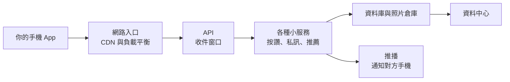

# 第 1 週手把手實作（2026/10/7）

[一頁版步驟清單](steps.md)　｜　[提示詞](prompts.md)　｜　[學習單](worksheet.md)　｜　[課後作業](homework.md)　｜　[下一週](../wk02_1014_baas-cicd/README.md)

> **本學期調整：** 課前沒有完成「課前準備清單」的班級，今天先在課堂上完成安裝、建立 repo、請 Copilot 做出網頁，並提交、同步到 GitHub。其餘步驟（架構互動網頁與測驗、修改網頁、Netlify 上線、雙重驗證等）改為 [課後作業](homework.md)，請在 **10/13（二）晚上前**完成。教師版時間表見 [調整版授課計畫](no_prep_plan.md)。

---

## 今天會做出什麼

今天你會從零開始，做出一個屬於自己的產品介紹網頁，並把它放上網路。你不需要會寫程式：網頁由 GitHub Copilot（寫在 VS Code 裡的 AI 助理）依照你的描述產生，你負責檢查、修改和上傳。

**最終成果：** 下課時，你會有

1. 一個 GitHub 上的 repo（儲存庫）：放在 GitHub 上的專案資料夾，會記住每一次修改。
2. 一個 `index.html` 網頁：介紹你的創業題目，有標題、功能介紹、價格方案，手機也能正常瀏覽。
3. 一個公開網址，例如 `https://ntpu-rent-radar-123.netlify.app`：任何人用手機都打得開。

| 時間 | 段落 | 你要做的事 |
| --- | --- | --- |
| 0:00 | Part 0 開場示範（5 分鐘） | 看老師示範，寫下一個預測 |
| 0:05 | Part 1 認識 SaaS 架構（30 分鐘） | 操作兩個互動網頁，完成小測驗（檢核點 1） |
| 0:35 | Part 2 GitHub 建 repo 並 clone（20 分鐘） | 在 GitHub 建立 repo，下載到 VS Code |
| 0:55 | Part 3 用 Copilot 做網頁（35 分鐘） | 用提示詞請 Copilot 做出網頁並修改（檢核點 2） |
| 1:30 | Part 4 提交、同步、Netlify 上線（25 分鐘） | 上傳到 GitHub，用 Netlify 發布網站（檢核點 3） |
| 1:55 | Part 5 收尾（5 分鐘） | 看同學作品，寫出場券 |

**上課方式：** 兩人一組。一人操作電腦（駕駛），一人照著本頁唸步驟、看畫面（導航員），每個 Part 結束後交換。兩個人都要在自己的電腦上完成。卡住 15 分鐘以上，先查 [疑難排解手冊](../../docs/tutorials/error_guide.md)，再舉手或貼紅色便利貼。

---

## 上課前確認清單（檢核點 0）

進教室前請逐項確認。任何一項沒完成，請提早 10 分鐘到教室找助教。詳細步驟見 [課前準備清單](../../docs/tutorials/before_class.md) 與 [VS Code 與 Copilot 入門](../../docs/tutorials/vscode_copilot_starter.md)。

- [ ] 我有 GitHub 帳號，而且登入時會用手機做雙重驗證。
- [ ] 我的電腦已安裝 VS Code 和 Git。
- [ ] VS Code 左下角的人像圖示（帳戶，Accounts）點開後，看得到我的 GitHub 帳號。
- [ ] VS Code 已啟用 GitHub Copilot，並安裝了 Live Preview 擴充功能。
- [ ] 我已經用 GitHub 帳號登入過 Netlify（<https://app.netlify.com/>）。
- [ ] 我曾經請 Copilot 做出一個「Hello NTPU」頁面，並成功預覽。
- [ ] 筆電有電，手機也帶在身上（最後要用手機檢查網站）。

---

## Part 0：開場示範（0:00–0:05，5 分鐘）

這一段你只要看和寫。老師會在 5 分鐘內，從一句話做出一個網站並讓大家用手機打開。

### 步驟 1：看老師示範（約 3 分鐘）

1. 看老師在 VS Code 輸入一句提示詞，請 Copilot 做出「三峽美食地圖」網頁。
2. 看老師按下 **提交（Commit）** 和 **同步變更（Sync Changes）**。
3. 用手機掃描投影幕上的 QR Code，打開老師的網站。

**完成後你應該看到：** 手機上出現「三峽美食地圖」網頁。

**如果不一樣：** 掃不到 QR Code → 請旁邊同學把網址傳給你，或手動輸入投影幕上的網址。

### 步驟 2：寫下你的預測（約 2 分鐘）

1. 打開 [學習單](worksheet.md) 第 1 題。
2. 寫下你的猜測：十年前請人做一個同樣的網站並放上網路，要花多少錢、多少時間。

**完成後你應該看到：** 學習單第 1 題已填好兩個數字。沒有標準答案，下課時會回頭對照。

---

## Part 1：認識 SaaS 架構（0:05–0:35，30 分鐘）

這一段用兩個互動網頁，看懂「你每天用的 App 背後長怎樣」，以及「我們今天要用哪四個雲端服務」。做完會通過一個小測驗，也就是檢核點 1。

SaaS（軟體即服務）＝ 不用安裝、打開瀏覽器或 App 就能用的軟體，例如 Instagram、Gmail、Canva。

### 步驟 3：打開互動網頁（約 2 分鐘）

1. 打開瀏覽器，前往 <https://github.com/cychiang-ntpu/VibeNTPU>。
2. 按綠色的 **Code** 按鈕，再按 **Download ZIP**。
3. 解壓縮下載的檔案。
4. 進入 `lectures/wk01_1007_saas-storefront/slides/` 資料夾。
5. 雙擊 `social_saas.html`，用瀏覽器開啟。

**完成後你應該看到：** 網頁上方有三個分頁：「1. 分層架構圖」「2. 請求流程演示」「3. 商業模式與測驗」。

**如果不一樣：** 在 GitHub 網頁上直接點 `.html` 只會看到一堆程式碼，這是正常的，請改用下載 ZIP 的方式。來不及下載的話，先看老師投影，下課再補。

### 步驟 4：點選架構圖上的元件（約 6 分鐘）

1. 確認目前在 **1. 分層架構圖** 分頁。
2. 點選最上面的 **手機 App**，閱讀右側說明。
3. 點選 **內容傳遞網路**（CDN），閱讀說明。
4. 點選中間的 **推薦系統**，閱讀說明。
5. 點選 **推播服務**，閱讀說明。
6. 按上方的 **對照 MVP 架構** 按鈕。

**完成後你應該看到：** 每點一個方塊，右側「元件說明」就換成那個元件的介紹；按下「對照 MVP 架構」後，畫面出現一段說明：新創只需要幾項現成服務就能運作。

**如果不一樣：** 右側沒有出現說明 → 把瀏覽器視窗拉寬；視窗太窄時，說明會出現在架構圖下方，請往下捲動。

### 步驟 5：播放「在 IG 按讚」（約 6 分鐘）

1. 點選 **2. 請求流程演示** 分頁。
2. 點選情境按鈕 **按讚**。
3. 按 **下一步 →**，一次看一步，唸出每一步的說明給組員聽。
4. 數一數從按讚到作者收到通知，一共經過幾步，寫在 [學習單](worksheet.md) 第 2 題。

**完成後你應該看到：** 每按一次「下一步」，架構圖上就有一個方塊亮起並標上號碼，最後一步是「作者的手機顯示通知」。

**如果不一樣：** 「下一步」按鈕是灰色的 → 先點選上方的情境按鈕 **按讚**。

### 步驟 6：看懂一張簡單的架構圖（約 4 分鐘）

1. 閱讀下面這張圖，由左往右看。
2. 對照剛剛的按讚動畫，找出你的手機、資料庫和推播各在哪一格。

**完成後你應該看到：** 你能用一句話說出按讚的路線：手機送出 → 入口 → 按讚服務 → 存進資料庫 → 推播通知作者。

想看每一格的白話說明：見 [你每天用的 App 背後長怎樣](social_media_architecture.md)。

### 步驟 7：比較「自建」和「使用雲端服務」（約 5 分鐘）

1. 回到 `slides` 資料夾，雙擊 `foodcourt.html`。
2. 在 **1. 自建與雲端服務** 分頁，拖動「驗證期間」拉桿，從 3 個月拉到 12 個月。
3. 觀察兩條成本長條的差距。
4. 點選 **2. 服務分工與資料流** 分頁，按 **播放資料流**。

**完成後你應該看到：** 自建的成本隨月數快速增加，雲端服務幾乎維持在 0 元；資料流動畫依序經過我們今天要用的幾個服務。

一句話說明：自建就像在深山自己蓋餐廳，水電廚房都要自己來；使用雲端服務就像進駐美食街，水電、清潔由業者負責，你只要專心做菜。對剛起步的新創來說，還不確定有沒有人要買之前，先租用現成服務，花費少、上線快，這也是本課程的做法。

我們今天的網站，就是由下面四塊組成：

| 我們的四塊 | 白話說明 | 今天用的工具 |
| --- | --- | --- |
| 前端 | 使用者看到的網頁畫面 | `index.html`（Copilot 幫忙寫） |
| 版本控制 | 存放網頁、記住每次修改的雲端資料夾 | GitHub |
| 託管與 CDN | 把網頁放上網路，讓全世界都打得開 | Netlify |
| 後端資料收集 | 收下訪客留下的資料（第 2 週才做） | Netlify Forms |

### 步驟 8：完成小測驗（約 7 分鐘）

1. 回到 `social_saas.html`，點選 **3. 商業模式與測驗** 分頁。
2. 往下捲到 **3.3 架構理解測驗**。
3. 逐題點選你認為正確的答案，閱讀每題下方的解說。
4. 答錯的題目，讀完解說後重新作答。

**完成後你應該看到：** 答對 80% 以上。

**如果不一樣：** 分數不到 80% → 重做一次；也可以改做 `foodcourt.html` 的 **3. 架構理解測驗** 分頁。

**檢核點 1（架構理解）完成：** 測驗答對 80% 以上。請把綠色便利貼貼在螢幕上。

**這一步在架構中的位置：** 你剛剛看懂了整張架構圖。接下來的 Part 2 到 Part 4，會依序做出其中的「版本控制」「前端」「託管與 CDN」三塊。

想了解原理（SaaS 的收費方式、打開網址時發生什麼事）：見 [SaaS 模式與網站運作（選讀）](../../docs/deep_dive/saas_and_web.md)。

---

## Part 2：GitHub 建 repo 並 clone（0:35–0:55，20 分鐘）

這一段先在 GitHub 網站上建立一個空的專案資料夾（repo），再把它下載到 VS Code。做完後，你的電腦和 GitHub 上各有一份同樣的資料夾。

clone（複製）＝ 把 GitHub 上的 repo 下載到自己電腦，而且兩邊之後可以同步。

### 步驟 9：在 GitHub 建立 repo（約 5 分鐘）

1. 打開瀏覽器，前往 <https://github.com/new>。
2. 確認右上角是你自己的 GitHub 帳號（大頭貼）。
3. 在 **Repository name** 欄位輸入你的 repo 名稱，例如 `rent-radar`（只能用英文小寫、數字和 -）。
4. 選擇 **Public**（公開）。
5. 找到 **Add README** 開關（或 **Add a README file** 勾選框），把它打開。
6. 按頁面最下方綠色的 **Create repository** 按鈕。

**完成後你應該看到：** 網址變成 `github.com/你的帳號/rent-radar`，頁面中間有一個 `README.md` 檔案。

**如果不一樣：**
- 顯示「name already exists」→ 換一個名字，例如加上學號末三碼：`rent-radar-123`。
- 頁面沒有 `README.md` → 你漏了第 5 步。在該頁面按 **Add a README**，再按綠色的 **Commit changes** 即可補上。

為什麼選 Public：Netlify 免費方案和同學互看作品都需要公開。因此 repo 裡絕對不要放個人資料、密碼。

### 步驟 10：在 VS Code 打開「原始檔控制」（約 2 分鐘）

1. 打開 VS Code。
2. 如果 VS Code 已經開著某個資料夾，先按上方選單 **檔案（File）** → **新增視窗（New Window）**，在新視窗操作。
3. 在 VS Code 左側最左邊那一排圖示中，點選形狀像樹枝分岔的圖示：**原始檔控制（Source Control）**。也可以按 `Ctrl+Shift+G`（macOS：`⌃⇧G`）。

**完成後你應該看到：** 左側面板出現兩個藍色按鈕：**開啟資料夾（Open Folder）** 和 **複製存放庫（Clone Repository）**。

**如果不一樣：** 沒有看到 **複製存放庫（Clone Repository）** 按鈕 → 表示 VS Code 找不到 Git，請回到 [VS Code 與 Copilot 入門](../../docs/tutorials/vscode_copilot_starter.md) 安裝 Git，並重新啟動 VS Code。

### 步驟 11：把 repo 複製到電腦（clone）（約 8 分鐘）

1. 按 **複製存放庫（Clone Repository）**。
2. VS Code 上方中間會跳出一個選單，點選 **從 GitHub 複製（Clone from GitHub）**。
3. 如果跳出「擴充功能 'GitHub' 想要使用 GitHub 登入」，按 **允許（Allow）**。
4. 瀏覽器打開 GitHub 授權頁面時，按 **Authorize Visual-Studio-Code**，然後切換回 VS Code。
5. 在上方的清單中，點選 `你的帳號/rent-radar`（可以直接輸入 `rent-radar` 搜尋）。
6. 在跳出的資料夾視窗中，選擇一個好找的位置，例如「文件」（Documents）。
7. 按 **選取為存放庫目的地（Select as Repository Destination）**。
8. 等右下角跳出「要開啟複製的存放庫嗎？（Would you like to open the cloned repository?）」，按 **開啟（Open）**。
9. 如果跳出「您信任此資料夾中檔案的作者嗎？」，按 **是，我信任作者（Yes, I trust the authors）**。

**完成後你應該看到：** VS Code 左側 **檔案總管（Explorer）**（最上面那個兩張紙的圖示）中出現資料夾名稱 `RENT-RADAR`，裡面有 `README.md`。視窗左下角顯示 `main`。

**如果不一樣：**
- 清單裡找不到你的 repo → 確認步驟 9 已按下 **Create repository**；或回到 GitHub 頁面，按綠色 **Code** 按鈕，複製 `https://...` 網址，貼到 VS Code 上方的輸入框後按 Enter。
- 不小心按掉右下角的通知 → 按 **檔案（File）** → **開啟資料夾（Open Folder）**，選擇剛才存放的 `rent-radar` 資料夾。

### 步驟 12：確認兩邊都有同樣的檔案（約 2 分鐘）

1. 在 VS Code 檔案總管中，點一下 `README.md`，看它的內容。
2. 回到瀏覽器的 GitHub repo 頁面，對照 `README.md` 的內容。

**完成後你應該看到：** 兩邊的 `README.md` 內容一樣，第一行都是 `# rent-radar`。

**這一步在架構中的位置：** 你剛剛建立了課程架構中的「版本控制」這一塊。GitHub 上的 repo 之後也會成為 Netlify 發布網站的來源。

請交換駕駛與導航員。

---

## Part 3：用 Copilot 做網頁（0:55–1:30，35 分鐘）

這一段先決定你的創業題目，再用提示詞產生器寫好要求，交給 Copilot 做出網頁。做完後，你的 repo 資料夾裡會多一個可以預覽的 `index.html`，也就是檢核點 2。

提示詞 ＝ 你交給 AI 的文字說明，寫得越具體，結果越接近你要的樣子。

### 步驟 13：決定創業題目（約 5 分鐘）

1. 從下表挑一個題目，或自己想一個你真的在意的問題。
2. 在 [學習單](worksheet.md) 第 3 題寫下：產品名稱、給誰用、解決什麼問題。

| 學院 | 題目參考 |
| --- | --- |
| 法律學院 | 租屋契約條款檢核、學生打工權益問答 |
| 商學院 | 學生記帳與訂閱管理、二手教科書交易 |
| 公共事務學院 | 三峽社區活動地圖、公共議題懶人包 |
| 社會科學學院 | 心情紀錄與同儕支持、志工媒合 |
| 人文學院 | 三峽老街文史導覽、語言交換配對 |
| 不限學院 | 三峽學餐地圖、寵物照顧媒合、運動揪團 |

**完成後你應該看到：** 你能用一句話說出「我的產品幫 ＿＿ 解決 ＿＿ 的問題」。

**如果不一樣：** 想不出來 → 使用 [提示詞 0：題目發想](prompts.md)，請 Copilot 給你幾個點子。

### 步驟 14：用提示詞產生器寫好提示詞（約 7 分鐘）

1. 回到下載的 `slides` 資料夾，雙擊 `prompt_builder.html`（提示詞產生器）。
2. 確認上方選的是 **第 1 週：產生首頁**。
3. 在「使用的 AI 助理」選擇 **GitHub Copilot（VS Code）**。
4. 依序填入 **產品名稱**、**一句話介紹**、**目標客群**、**三個核心功能**、**收費方式**。
5. 選一個 **視覺風格**，例如「沉穩專業」。
6. 確認「提示詞完整度」達到 100%。
7. 按 **複製提示詞**。

**完成後你應該看到：** 按下複製後，按鈕旁出現「已複製」之類的提示；右側「2. 產生的提示詞」區塊有一大段文字。

**如果不一樣：** 無法開啟提示詞產生器 → 改用 [prompts.md](prompts.md) 的「提示詞 1」，把 `【】` 裡的文字換成你的內容。

### 步驟 15：把提示詞交給 Copilot（約 8 分鐘）

1. 回到 VS Code，確認左側檔案總管最上方是你的 repo 名稱（例如 `RENT-RADAR`）。
2. 按 `Ctrl+Alt+I`（macOS：`⌃⌘I`）打開 Copilot Chat；或點選視窗最上方中間搜尋框旁的 Copilot 圖示。
3. 在右側 Chat 輸入框下方，找到模式選單（可能顯示 Ask），點開並選擇 **Agent**。
4. 在輸入框按 `Ctrl+V`（macOS：`⌘V`）貼上提示詞。
5. 按 Enter 送出。
6. 等待 Copilot 完成（約 1–3 分鐘），不要關閉視窗。
7. 如果 Copilot 要求執行終端機指令（出現 **允許（Allow）**／**繼續（Continue）** 按鈕），請選擇 **略過（Skip）**。

**完成後你應該看到：** Chat 中出現「已變更 1 個檔案」之類的訊息，檔案總管裡出現 `index.html`，旁邊有綠色的 **U**（代表新檔案）。

**如果不一樣：**
- 找不到 **Agent** 選項 → 先確認你已登入 Copilot（VS Code 左下角帳戶圖示）；仍找不到請舉手。
- Copilot 回答「已達使用上限」→ 改用 [prompts.md](prompts.md) 最後的「備案：使用網頁版 AI」。
- `index.html` 出現在別的資料夾 → 你開錯資料夾了。按 **檔案（File）** → **開啟資料夾（Open Folder）**，選擇 `rent-radar` 資料夾後，重做本步驟。

### 步驟 16：檢查後按「保留」（約 3 分鐘）

1. 在 Chat 中點選 `index.html`，看一下 Copilot 新增的內容（綠色底色的部分）。
2. 確認被修改的檔案只有 `index.html`。
3. 按 Chat 中的 **保留（Keep）** 按鈕。

**完成後你應該看到：** **保留（Keep）** 和 **復原（Undo）** 按鈕消失，`index.html` 被保存下來。

**如果不一樣：** 不小心按了 **復原（Undo）** → 在同一個 Chat 再貼一次提示詞送出。

### 步驟 17：預覽網頁（約 3 分鐘）

1. 在左側檔案總管中，對 `index.html` 按右鍵。
2. 點選 **顯示預覽（Show Preview）**。
3. 在右側預覽畫面上下捲動，看完每個區塊。

**完成後你應該看到：** 網頁出現你的產品名稱、功能介紹和價格方案。

**如果不一樣：**
- 右鍵選單沒有 **顯示預覽（Show Preview）** → 表示沒裝 Live Preview。改用：在 `index.html` 按右鍵 → **在檔案總管中顯示（Reveal in File Explorer）**（macOS：**在 Finder 中顯示（Reveal in Finder）**），再雙擊檔案用瀏覽器開啟。
- 畫面是空白的 → 使用 [prompts.md](prompts.md) 的修正提示詞，請 Copilot 修正。

### 步驟 18：請 Copilot 修改一次（約 7 分鐘）

1. 打開 [prompts.md](prompts.md) 的「現成的修改提示詞」。
2. 挑一則，複製後貼到同一個 Copilot Chat，把 `【】` 裡的文字換成你要的內容。
3. 按 Enter 送出。
4. 等 Copilot 完成後，重做步驟 16（檢查後按 **保留（Keep）**）。
5. 回到預覽畫面，確認修改生效。

**完成後你應該看到：** 網頁照你的要求改變了，例如主色換了、多了一個區塊。

**如果不一樣：** 改得不是你要的 → 按 **復原（Undo）**，把要求寫得更具體再送一次，例如「只修改價格方案區塊，其他部分維持不變」。

### 步驟 19：用手機寬度檢查（約 2 分鐘）

1. 用瀏覽器打開 `index.html`（步驟 17 的第二種方式）。
2. 按 `F12`（macOS：`⌥⌘I`）打開開發者工具。
3. 點選開發者工具左上角像手機與平板的圖示（切換裝置工具列）。
4. 在畫面上方選擇一個手機型號，例如 iPhone。

**完成後你應該看到：** 網頁縮成手機寬度，沒有左右捲動，文字沒有被切掉。

**如果不一樣：** 版面擠在一起或需要左右捲動 → 使用 [prompts.md](prompts.md) 中「手機版面」的修改提示詞。

**檢核點 2（前端原型）完成：** 你的 repo 資料夾裡有一個 Copilot 產生、可以正常預覽的 `index.html`。

**這一步在架構中的位置：** 你剛剛做出了架構中的「前端」，也就是使用者會看到的畫面。不過它現在只在你的電腦上，下一段要把它送上網路。

想了解原理（Copilot 的 Ask 與 Agent 模式、AI 的限制）：見 [SaaS 模式與網站運作（選讀）](../../docs/deep_dive/saas_and_web.md) 的附錄。

請交換駕駛與導航員。

---

## Part 4：提交、同步、Netlify 上線（1:30–1:55，25 分鐘）

這一段先把網頁存成一個版本（提交），再上傳到 GitHub（同步），最後讓 Netlify 把它變成公開網址。做完後，任何人用手機都能打開你的網站，也就是檢核點 3。

commit（提交）＝ 在你的電腦上存一個版本，並寫一句說明；sync（同步）＝ 把這些版本上傳到 GitHub。只提交不同步，GitHub 和 Netlify 都看不到。

### 步驟 20：提交（Commit）（約 3 分鐘）

1. 點選 VS Code 左側的 **原始檔控制（Source Control）** 圖示（上面有一個數字，代表有幾個檔案改過）。
2. 在面板最上方的訊息框輸入：`新增第一版首頁`。
3. 按下方藍色的 **提交（Commit）** 按鈕。
4. 如果跳出「沒有暫存的變更可提交，要自動暫存所有變更並直接提交嗎？」，按 **是（Yes）**。

**完成後你應該看到：** 面板中的檔案清單消失，藍色按鈕變成 **同步變更（Sync Changes）**，旁邊顯示 `1↑`。

**如果不一樣：** 出現「請確定您已設定 user.name 和 user.email」（Make sure you configure your "user.name" and "user.email" in git）→ 表示 Git 還不知道你是誰。請查 [疑難排解手冊](../../docs/tutorials/error_guide.md) 中 Git 使用者名稱的問題，設定後再按一次 **提交（Commit）**。

### 步驟 21：同步（Sync Changes）（約 3 分鐘）

1. 按藍色的 **同步變更（Sync Changes）** 按鈕。
2. 如果跳出「此動作會推送及提取認可…」的確認視窗，按 **確定（OK）**。
3. 回到瀏覽器的 GitHub repo 頁面，按 `F5` 重新整理。

**完成後你應該看到：** GitHub 頁面上出現 `index.html`，旁邊寫著「新增第一版首頁」。

**如果不一樣：** GitHub 上沒有 `index.html` → 回 VS Code 檢查：按鈕是否還顯示 `1↑`？若是，再按一次 **同步變更（Sync Changes）**。要求登入時，選擇用瀏覽器登入 GitHub 並授權。

### 步驟 22：在 Netlify 匯入 repo（約 6 分鐘）

1. 打開瀏覽器，前往 <https://app.netlify.com/>，用 GitHub 帳號登入。
2. 點選 **Add new project**。
3. 在跳出的選單中點選 **Import an existing project**。
4. 在「Connect to Git provider」下方點選 **GitHub**。
5. 如果跳出 GitHub 授權頁面，按 **Authorize Netlify**。
6. 在 repo 清單中點選你的 repo（例如 `rent-radar`）。

**完成後你應該看到：** 一個設定頁面，上方寫著你的 repo 名稱，下方有 **Branch to deploy**、**Build command**、**Publish directory** 等欄位。

**如果不一樣：** 清單中沒有你的 repo → 點選清單下方的 **Configure the Netlify app on GitHub**，在 GitHub 頁面選擇 **All repositories**（或勾選你的 repo），按 **Save**，再回到 Netlify。

### 步驟 23：部署（Deploy）（約 4 分鐘）

1. 確認 **Branch to deploy** 是 `main`。
2. **Build command** 保持空白，不要輸入任何東西。
3. **Publish directory** 保持空白。
4. 如果頁面上有 **Project name** 欄位，輸入好記的名字，例如 `ntpu-rent-radar-123`。
5. 按頁面最下方的 **Deploy**（按鈕上可能寫 **Deploy 你的 repo 名稱**）。
6. 等待約 30 秒到 1 分鐘。

**完成後你應該看到：** 專案頁面上的部署狀態顯示 **Published**，頁面上方出現一個 `https://....netlify.app` 網址。

**如果不一樣：**
- 狀態顯示 **Failed** → 確認 Build command 和 Publish directory 都是空白；查 [疑難排解手冊](../../docs/tutorials/error_guide.md) 的 Netlify 部署問題。
- 打開網址看到「Page not found」→ 檔名必須是全小寫的 `index.html`，而且放在 repo 最外層，不在任何子資料夾裡。

### 步驟 24：修改網址名稱（約 3 分鐘，網址已經好記可跳過）

1. 在 Netlify 專案頁面左側選單，點選 **Project configuration**。
2. 點選 **General** → **Project details**。
3. 按 **Change project name**（有些畫面顯示 **Manage project name**）。
4. 輸入新名稱，例如 `ntpu-rent-radar-123`（英文小寫、數字、-）。
5. 按 **Save**。

**完成後你應該看到：** 網址變成 `https://ntpu-rent-radar-123.netlify.app`。

**如果不一樣：** 顯示名稱已被使用 → 加上學號末三碼再試一次。注意：改名後舊網址就不能用了。

### 步驟 25：用手機打開並分享（約 4 分鐘）

1. 點選網址，在電腦上確認頁面正常。
2. 把網址傳到自己的手機（例如用 LINE 傳給自己）。
3. 用手機打開網址，上下捲動檢查。
4. 把網址貼到課程群組。
5. 打開 [網站自我檢核工具](../../tools/vibe_check.html)，選擇 repo 資料夾中的 `index.html`，確認 Level 1 全部通過。

**完成後你應該看到：** 手機上看得到你的網站；自我檢核工具的 Level 1 全部顯示通過。

**如果不一樣：** 自我檢核工具有項目沒通過 → 把未通過的項目名稱告訴 Copilot，請它修正，再重做步驟 20、21。Netlify 會自動更新網站。

**檢核點 3（部署上線）完成：** GitHub 上看得到你的 commit，Netlify 顯示 Published，手機能打開你的網址。

**這一步在架構中的位置：** 你剛剛用上了架構中的「託管與 CDN」。整個過程沒有買任何伺服器，也不用信用卡，網站已經用 HTTPS 對全世界公開。

想了解原理（Netlify 部署時做了什麼、commit 與 sync 的差別）：見 [SaaS 模式與網站運作（選讀）](../../docs/deep_dive/saas_and_web.md) 的附錄。

---

## Part 5：收尾（1:55–2:00，5 分鐘）

這一段看看同學的作品，並寫下今天的收穫。

### 步驟 26：看一位同學的網站（約 2 分鐘）

1. 在課程群組中點開一位同學的網址。
2. 用「我喜歡…／我希望…／如果…」的句型，在群組回覆一則具體回饋。格式見 [作品牆說明](../../showcase/README.md)。

**完成後你應該看到：** 群組裡有你寫的一則回饋。

### 步驟 27：寫出場券（約 3 分鐘）

1. 打開 [學習單](worksheet.md) 第 5 部分。
2. 對照 Part 0 你寫的預測，寫下今天實際花了多少時間和錢。
3. 寫一句今天最大的收穫或困難。

**完成後你應該看到：** 學習單第 5 部分已填好。

---

## 課後作業（第 2 週上課前）

完整的課後作業與步驟請見 **[homework.md](homework.md)**，分為 A 必做（10/13 晚上前完成）、B 建議、C 預習第 2 週。

**下週預告：** 訪客想在你的網站留下 Email，資料要存到哪裡？

---

## 本週教材

| 檔案 | 用途 |
| --- | --- |
| [steps.md](steps.md) | 一頁版步驟清單，上課邊做邊勾 |
| [prompts.md](prompts.md) | 本週提示詞與修改提示詞 |
| [worksheet.md](worksheet.md) | 學習單 |
| [saas_architecture.md](saas_architecture.md) | 講義：自建或使用雲端服務、我們的四塊 |
| [social_media_architecture.md](social_media_architecture.md) | 講義：你每天用的 App 背後長怎樣 |
| [slides/social_saas.html](slides/social_saas.html) | 互動網頁：社群平台架構圖、按讚流程、測驗 |
| [slides/foodcourt.html](slides/foodcourt.html) | 互動網頁：自建與雲端服務比較、測驗 |
| [slides/git_flow.html](slides/git_flow.html) | 互動網頁：提交與同步的練習模擬器 |
| [slides/prompt_builder.html](slides/prompt_builder.html) | 提示詞產生器 |
| [slides/outline.md](slides/outline.md) | 教師授課大綱 |
| [announcement.md](announcement.md) | 課程公告文字 |
| [homework.md](homework.md) | 第 1 週課後作業（步驟式） |
| [no_prep_plan.md](no_prep_plan.md) | 教師用：學生未做課前準備時的調整版時間表 |

選讀（課堂不要求）：[SaaS 模式與網站運作](../../docs/deep_dive/saas_and_web.md)、[社群媒體系統設計深入](../../docs/deep_dive/social_media_systems.md)。

---

下一週：[第 2 週：後端即服務與持續部署](../wk02_1014_baas-cicd/README.md)
