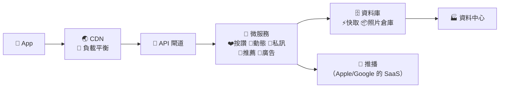
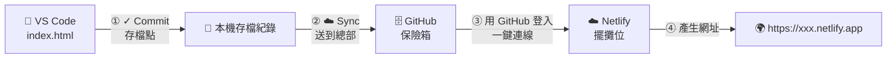

# 第 1 週（2026/10/7）｜看懂 SaaS 商業邏輯 ＆ 打造數位店面

對應關卡：🧠 Q1 看懂 SaaS → 🎨 Q2 詠唱店面 → 🏪 Q3 開店上線
時間：2 小時（兩節）
工具：🧰 VS Code ＋ 🤖 GitHub Copilot ＋ 💾 Git／GitHub ＋ ☁️ Netlify

> **課前準備（同學）**：完成 [🥚 Q0 報到](../../docs/tutorials/before_class.md)：GitHub 帳號、VS Code＋Git＋Copilot、Netlify 帳號，並請 Copilot 做出第一個「Hello NTPU」網頁。**你在上課前就已經成功一次了！** 🎉
> 還沒裝好？上課前 10 分鐘到教室，助教幫你。
>
> **上課請開著 👉 [steps.md（一頁版步驟卡）](steps.md)**：今天每一個要按的按鈕都依順序列在上面，照著打勾就好。
>
> **兩人一組**：一人當「🚗 駕駛」（操作電腦），一人當「🧭 領航員」（看步驟卡、提醒下一步）。每個段落結束交換角色，**兩個人都要在自己的電腦完成**。

---

## 🎯 本週目標

上完課你應該能：

1. 看著「社群媒體的 SaaS 架構圖」，**說明**你按下一個讚時，背後有哪些雲端服務在接力。
2. 用「美食街比喻」**解釋**傳統自建主機與現代 SaaS 創業的差別，並說出我們用的四塊積木。
3. 用 GitHub **建立** repo，並在 VS Code **clone** 到自己的電腦。
4. 在 VS Code 用 **GitHub Copilot** 做出符合自己創業題目的形象首頁 `index.html`。
5. 用 VS Code **Commit ＋ Sync** 把網站存進 GitHub，並部署到 Netlify，拿到一個全世界都能打開的網址。

## 💼 這跟我有什麼關係？

- 你每天用的 IG、YouTube、LINE、Netflix 全部都是 SaaS。**看懂它的架構，你就看懂了現代科技公司怎麼運作、怎麼賺錢。**
- VS Code、GitHub、Copilot 是全世界工程師**每天真正在用**的工具。今天你用的不是「教學玩具」，是業界標準。
- 不管你以後做行銷、法務、公職、研究還是自己創業，「用 AI＋雲端服務快速做出原型」都會是你的超能力。

## ⏱️ 時程

| 段落 | 時間 | 內容 | 🆕 本段唯一新概念 | 教材 |
| --- | --- | --- | --- | --- |
| 0 | 0:00–0:05 | 🎬 開場魔術：3 分鐘網站上線 | —（先看終點線） | 老師現場示範 |
| 1 | 0:05–0:35 | 🧠 觀念建立：現代網路服務大解密 | SaaS 架構 | [slides/social_saas.html](slides/social_saas.html)、[slides/foodcourt.html](slides/foodcourt.html) |
| 2 | 0:35–0:55 | 🗄️ 實戰一：打開總部保險箱（GitHub） | repo 與 clone | [slides/git_flow.html](slides/git_flow.html)、[Git 入門](../../docs/tutorials/git_intro.md) |
| 3 | 0:55–1:30 | 🎨 實戰二：用 Copilot 詠唱你的產品前端 | 前端 Frontend | [slides/prompt_builder.html](slides/prompt_builder.html)、[prompts.md](prompts.md) |
| 4 | 1:30–1:55 | 🏪 實戰三：存檔、上雲、開店 | Commit／Sync ＋ 部署 | [steps.md](steps.md)、[部署教學](../../docs/tutorials/github_netlify_deploy.md) |
| 5 | 1:55–2:00 | 🎉 收尾：作品巡禮＋出場券 | — | [worksheet.md](worksheet.md) |

---

## 段落 0｜🎬 開場魔術（5 分鐘）

老師不講任何理論，直接在 VS Code 示範：
1. 對 Copilot 說一句話：「幫我做一個三峽美食地圖的網站」。
2. 按 Commit、按 Sync，把網站送上 GitHub；Netlify 自動部署。
3. 3 分鐘後，投影幕上出現一個網址，全班用手機掃 QR Code 打開。

> 🤔 **先猜猜看**（寫在 [學習單](worksheet.md) 第 1 題）：如果 10 年前要做一樣的網站，你覺得要花多少錢、多少時間？
> 這一題沒有標準答案，猜錯完全沒關係。**先猜再學，會記得更牢**（這叫「預測—觀察—解釋」）。

---

## 段落 1｜🧠 觀念建立：現代網路服務大解密（30 分鐘）🔥【本次重點】

🆕 **本段唯一新概念**：SaaS 架構：一個網路服務是由很多塊「雲端積木」組起來的。

### 1.1 用「訂閱制」破冰（3 分鐘）

🙋 **舉手調查**：每個月有訂閱 Netflix／Spotify／YouTube Premium／ChatGPT 的人？每天都會打開 IG 或 LINE 的人？

| | 過去：買斷制 💿 | 現在：SaaS ☁️ |
| --- | --- | --- |
| 例子 | 買光碟灌遊戲、買 Office 光碟 | IG、LINE、Netflix、Canva |
| 怎麼用 | 下載、安裝、更新都自己來 | 打開 App／瀏覽器就能用 |
| 軟體和資料放哪 | 你的電腦 | 別人的雲端 |
| 怎麼賺錢 | 一次賣斷 | 訂閱、廣告、抽成 |

**創業視角**：SaaS 為什麼好賺？因為 **「程式寫一次，放在雲端，可以租給全世界」**。

### 1.2 📱 你每天滑的 IG，背後長什麼樣子？（12 分鐘）

打開 👉 **[slides/social_saas.html](slides/social_saas.html)**（社群媒體的 SaaS 架構）

1. **分頁①「架構圖」**：從上到下看一次：手機 App → CDN／負載平衡 → API 閘道 → 各種微服務 → 資料庫 → 資料中心 → 外部 SaaS。點任何一塊看說明。
2. **分頁②「按下去發生什麼事？」**：播放「❤️ 在 IG 按讚」，看看 0.5 秒內有多少服務在接力。再試「📸 發限動」「💬 傳 LINE」。
3. **分頁③「免費的社群怎麼賺錢？」**：廣告、訂閱、電商抽成。



> 💡 **重點一**：一個 App 背後是**幾十種服務**在分工合作，就像美食街裡分工的各個櫃位。
> 💡 **重點二**：連 IG 都在用別人的 SaaS 積木（例如推播一定要經過 Apple 和 Google）。**沒有公司什麼都自己做。**

📖 完整圖解講義（含按讚的時序圖、IaaS／PaaS／SaaS 三層蛋糕）：**[social_media_architecture.md](social_media_architecture.md)**

### 1.3 那我們呢？深山蓋餐廳 vs. 進駐美食街（5 分鐘）

社群巨頭有幾萬名工程師，可以自己蓋一整座百貨集團。**我們只有自己＋隊友＋Copilot，怎麼辦？**

打開 👉 **[slides/foodcourt.html](slides/foodcourt.html)** 分頁①，拉動月數拉桿：

- 🏚️ **傳統創業**＝自己去深山買荒地蓋餐廳：自己牽水電（伺服器）、請保全（資安）、蓋大廚房（後端資料庫）。初期幾十萬、好幾個月，沒客人就破產。
- 🏬 **現代 SaaS 創業**＝直接進駐百貨公司美食街：水電保全都幫你弄好了。

### 1.4 我們的四塊樂高積木（5 分鐘）

切到 foodcourt.html 分頁②，按 **▶ 播放資料流**。回頭對照 social_saas.html 的「🔍 對照我們的 MVP」開關：**大公司的幾十種服務，我們用 4 塊積木就搞定。**

| 積木 | 美食街比喻 | 真實技術 | 對應社群巨頭的… | 哪週用 |
| --- | --- | --- | --- | --- |
| 👨‍💻 前端 | 裝潢、菜單、點餐櫃檯 | `index.html`（Copilot 寫） | App／網頁 | 今天 |
| 🗄️ 版本控制 | 總部保險箱＋自動傳真機 | Git ＋ GitHub | 內部 CI/CD 系統 | 今天 |
| ☁️ 雲端託管 SaaS | 美食街免費攤位 | Netlify | CDN＋負載平衡＋資料中心 | 今天 |
| 📦 後端即服務 BaaS | 訂單代收中心 | Netlify Forms | 資料庫 | 下週 |

> 💡 **今天這堂課，我們完全不碰複雜的 GCP，因為聰明的現代創業者，是「用 SaaS 服務來打造自己的 SaaS 產品」！**

### 1.5 小測驗：你記住了嗎？（5 分鐘）→ 🧠 Q1 過關

完成 **foodcourt.html 分頁③** 或 **social_saas.html 分頁③** 的小測驗，**答對 4 題以上就拿到 🧠 架構師徽章（30 XP）**。
答錯沒關係，每一題都有解說，可以再玩一次。**「想起來」這個動作本身就在幫你記憶。**

---

## 段落 2｜🗄️ 實戰一：打開總部保險箱（GitHub）（20 分鐘）

🆕 **本段唯一新概念**：repo（儲存庫）＝專案資料夾＋它所有的存檔紀錄；clone＝把它複製到你的電腦。

### 2.1 🎮 先玩一次 Git 存檔點模擬器（5 分鐘）

打開 👉 **[slides/git_flow.html](slides/git_flow.html)**，照順序按：🤖 請 Copilot 修改 → ➕ Stage → ✅ Commit（寫一句話）→ ☁️ Sync，看網站自己更新。

| 動作 | 遊戲比喻 | 等一下在 VS Code 按哪裡 |
| --- | --- | --- |
| Clone | 把總部的存檔下載到你電腦 | 原始檔控制 → 複製存放庫 |
| Commit | 存檔並取名字 | 訊息框 → ✓ 提交 |
| Sync（Push） | 把存檔上傳到雲端總部 | 同步變更 ↑1 |

> ⚠️ 記住這句：**Commit 只存在你的電腦；按 Sync 才會送到 GitHub。**

### 2.2 👀 我做 → 🚀 你做：建 repo ＋ clone（15 分鐘）

老師先投影示範一次，再換你做（照 [steps.md 段落 2](steps.md#段落-2打開總部保險箱github)）：

1. 到 <https://github.com/new> 建立 repo（例如 `rent-radar`），選 **Public**，✅ **Add a README file**。
2. VS Code → **原始檔控制**（`Ctrl+Shift+G`／`⌃⇧G`）→ **複製存放庫** → **從 GitHub 複製** → 選你的 repo → 選資料夾 → **開啟**。
3. 左側檔案總管看到 `README.md` ✅

📖 每一步的詳細說明：[Git 與 GitHub 入門](../../docs/tutorials/git_intro.md)

> 🏗️ **架構呼應**：你剛剛在 GitHub 總部開了一個保險箱，並在自己的廚房工作台（VS Code）放了一份副本。接下來你在工作台做的任何設計，都可以一鍵存回總部。

🔄 **交換駕駛／領航員！**（領航員也要在自己電腦完成這一段）

---

## 段落 3｜🎨 實戰二：用 Copilot 詠唱你的 SaaS 產品前端（35 分鐘）

🆕 **本段唯一新概念**：前端（Frontend）＝客人看得到、摸得到的畫面。

> **什麼是 Vibe Coding？** 用自然語言描述你要的「感覺（vibe）」，讓 AI 幫你寫程式，你負責看結果、給回饋。
> 📖 [Vibe coding（維基百科）](https://en.wikipedia.org/wiki/Vibe_coding)

### 3.1 選一個你在乎的題目（5 分鐘）

**題目你自己決定**，選一個你真的覺得「如果有這個就好了」的點子：

| 你的學院 | 可以試試的點子 |
| --- | --- |
| ⚖️ 法律學院 | 租屋契約健檢小幫手、學生打工權益 Q&A |
| 💼 商學院 | 學生記帳訂閱、二手教科書交易平台 |
| 🏛️ 公共事務學院 | 三峽社區活動地圖、公共議題懶人包 |
| 👥 社會科學學院 | 心情日記與同儕支持、志工媒合平台 |
| 📚 人文學院 | 三峽老街文史導覽、語言交換配對 |
| 💻 電機資訊學院 | 課程作業互助、實驗室設備預約 |
| 💡 任何人 | 三峽學餐地圖、AI 塔羅牌、寵物保母、運動揪團 |

還是想不到？在 Copilot Chat（**Ask** 模式）使用 [咒語 0：腦力激盪](prompts.md#咒語-0腦力激盪創業題目)。

### 3.2 👀 我做：看老師示範一次（5 分鐘）

老師用「三峽租屋雷達」示範：咒語產生器 → 貼到 Copilot Chat（Agent 模式）→ 看 Copilot 建立 `index.html` → 按 **Keep** → 右鍵 **Show Preview** 預覽。
**這一段只要看，不用動手。**

### 3.3 🤝 我們做：咒語產生器 ＋ Copilot（15 分鐘）

1. 打開 👉 **[slides/prompt_builder.html](slides/prompt_builder.html)**（咒語產生器），AI 選 **GitHub Copilot（VS Code）**。
2. 填入產品名稱、一句話介紹、三個功能……（或先按 🎲 看範例），健康度到 100%，按 **📋 複製咒語**。
3. 回到 VS Code，確認**左側開著的是你剛 clone 的 repo 資料夾**。
4. 打開 Copilot Chat（`Ctrl+Alt+I`／`⌃⌘I`），模式選 **Agent**，貼上咒語送出。
5. Copilot 建立 `index.html` 後，看一下它做了什麼，按 **Keep（保留）**。
6. 在 `index.html` 上按右鍵 → **Show Preview**（或在檔案總管雙擊打開）。

> 喜歡自己寫咒語？也可以直接用 [prompts.md 的咒語 1](prompts.md#咒語-1產生-saas-形象首頁核心咒語)。

### 3.4 🚀 你做：改到你滿意為止（10 分鐘）

AI 第一次的結果通常不完美，**這完全正常**。在同一個 Copilot 對話繼續說：

```text
請把 #index.html 的主色調改成【莫蘭迪藍】，並在功能介紹後面加一個「學長姐推薦」區塊。
其他部分保持不變。
```

更多修改咒語 👉 [咒語 2](prompts.md#咒語-2改到你滿意為止)。

> 💡 **省次數小技巧**：Copilot 免費版每月次數有限，一次把想改的 2～3 件事說清楚，比一次改一點點省很多。

> 🏗️ **架構呼應**：你們現在請 Copilot 做出來的，就是 SaaS 架構中的 **「前端 (Frontend)」**，也就是這家雲端餐廳的 **裝潢與門面**，對應社群巨頭的「App 畫面」。
> 🎨 **Q2 過關**：repo 資料夾裡有一個 Copilot 做的、能預覽的 `index.html` → **設計師徽章（50 XP）**

📂 看看不同程度的示範作品：[samples/](../../samples/README.md)（🥉 入門／🥈 進階／🥇 卓越）

🔄 **交換駕駛／領航員！**

---

## 段落 4｜🏪 實戰三：存檔、上雲、開店（25 分鐘）

🆕 **本段唯一新概念**：Commit／Sync 把設計圖送回總部，Netlify 再把它變成全世界都能逛的店面。

👉 **照 [steps.md 的段落 4](steps.md#段落-4存檔上雲開店) 一步步打勾**；詳細說明看 [部署教學](../../docs/tutorials/github_netlify_deploy.md)。



| 步驟 | 動作 | 美食街比喻 |
| --- | --- | --- |
| 4.1 | VS Code 原始檔控制：寫訊息 `第一版首頁` → **✓ 提交** | 在工作台按下存檔 |
| 4.2 | 按 **同步變更（Sync）**，到 GitHub 網頁確認看到 `index.html` | 把設計圖傳真回總部保險箱 |
| 4.3 | Netlify「Import from Git」→ 選 repo → Deploy | 到美食街租一個攤位 |
| 4.4 | 改一個好記的專案名稱（支線 🏷️ 門牌大師） | 掛上招牌 |
| 4.5 | 用手機打開，把網址傳到課程群組 | 開幕營業！ |

> 🏗️ **架構呼應**：恭喜！你們剛剛 **沒有碰任何一台實體伺服器，沒有綁信用卡**，就利用 Netlify 這個「雲端託管 SaaS」把網站推向全世界了！而且 Netlify 背後也有 CDN，你的網站在世界各地都載得快，**跟 IG 用的是同一種技術**。**SaaS 創業的第一步，完成！** 🎉
> 🏪 **Q3 過關**：GitHub 上有你的 commit ＋ 網站上線 ＋ [Vibe 健檢站](../../tools/vibe_check.html) Level 1 全亮 → **開店徽章（60 XP）**

😵 **卡住了？** 這很正常！先看 [卡關急救手冊](../../docs/tutorials/error_guide.md)；15 分鐘沒進展就貼紅色便利貼。

---

## 段落 5｜🎉 收尾：作品巡禮＋出場券（5 分鐘）

1. **作品巡禮**：打開課程群組裡隔壁組的網址，用「💚 我喜歡／💛 我希望／💜 如果」給一句回饋（[格式說明](../../showcase/README.md#-作品巡禮回饋格式)）。
2. **出場券**：完成 [學習單](worksheet.md) 最後一題，回頭看看段落 0 你猜的答案，現在你會怎麼回答？
3. **冒險護照**（回家做也可以）：在 VS Code 打開 repo 裡的 `README.md`，貼上 [冒險護照](../../templates/passport_README.md)，勾選今天完成的關卡 → **Commit ＋ Sync**。（這就是你今天的第二個存檔點！）

---

## 📂 本週教材

| 檔案 | 用途 |
| --- | --- |
| [steps.md](steps.md) | 一頁版步驟卡，上課開著照做 |
| [social_media_architecture.md](social_media_architecture.md) | 📱 **社群媒體的 SaaS 架構圖**（總覽圖、按讚時序圖、三層蛋糕、巨頭 vs MVP 對照） |
| [slides/social_saas.html](slides/social_saas.html) | 互動教材：可點擊的社群媒體架構圖、按讚／發文／滑動態／傳訊息動畫、商業模式與小測驗 |
| [slides/foodcourt.html](slides/foodcourt.html) | 互動教材：深山 vs 美食街、四塊積木資料流、小測驗 |
| [slides/git_flow.html](slides/git_flow.html) | 互動教材：Git 存檔點模擬器、VS Code 原始檔控制畫面導覽 |
| [slides/prompt_builder.html](slides/prompt_builder.html) | 咒語產生器：填表就能產生給 Copilot 的咒語 |
| [slides/outline.md](slides/outline.md) | 老師上課大綱 |
| [prompts.md](prompts.md) | 本週咒語集 |
| [saas_architecture.md](saas_architecture.md) | 美食街比喻完整圖解 |
| [worksheet.md](worksheet.md) | 學習單：預測、回想、出場券 |
| [announcement.md](announcement.md) | 課前公告（老師貼到課程群組用） |

## 🏠 下週前要做的事

- [ ] 🟢 **必做**：確認網站用手機打得開，網址已傳到課程群組。
- [ ] 🟢 **必做**：冒險護照放進 repo 的 README.md，填好第 1 週的 3-2-1 反思，Commit ＋ Sync。
- [ ] 🟡 **挑戰**：用手機檢查排版，請 Copilot 修好跑版的地方，Commit ＋ Sync，看網站自己更新（支線 📱 手機美容師）。
- [ ] 🟡 **挑戰**：逛 3 位同學的網站並留下回饋（支線 🤝 社群之星）。
- [ ] 🔵 **延伸**：挑一個你常用的 App（例如 Uber Eats、Spotify），試著畫出它的 SaaS 架構圖。想一想：「如果客人想留下聯絡方式，我的網站要把資料存到哪裡？」下週揭曉！

## 📚 延伸學習

- [Microsoft Azure：什麼是 SaaS？（繁中）](https://azure.microsoft.com/zh-tw/resources/cloud-computing-dictionary/what-is-saas)
- [System Design Primer：大型網站架構入門](https://github.com/donnemartin/system-design-primer)
- [VS Code：Git 入門](https://code.visualstudio.com/docs/sourcecontrol/intro-to-git)
- [VS Code：Copilot Chat](https://code.visualstudio.com/docs/copilot/chat/copilot-chat)
- [GitHub Skills：互動式入門課程](https://skills.github.com/)
- 更多 👉 [延伸學習資源總整理](../../docs/resources.md)

---

下一週 👉 [第 2 週：SaaS 的靈魂 — 串接後端與體驗自動化迭代](../wk02_1014_baas-cicd/README.md)
