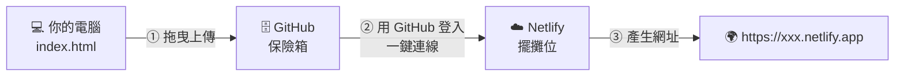

# 第 1 週（2026/10/7）｜看懂 SaaS 商業邏輯 ＆ 打造數位店面

對應關卡：🧠 Q1 看懂美食街 → 🎨 Q2 詠唱店面 → 🏪 Q3 開店上線
時間：2 小時（兩節）

> **課前準備（同學）**：完成 [🥚 Q0 報到](../../docs/tutorials/before_class.md)：GitHub 帳號、Netlify 帳號，並請 AI 做出第一個「Hello NTPU」網頁。**你在上課前就已經成功一次了！** 🎉
>
> **上課請開著 👉 [steps.md（一頁版步驟卡）](steps.md)**：今天每一個要點的按鈕都依順序列在上面，照著打勾就好。
>
> **兩人一組**：一人當「🚗 駕駛」（操作電腦），一人當「🧭 領航員」（看步驟卡、提醒下一步）。每個實作結束交換角色。

---

## 🎯 本週目標

上完課你應該能：

1. 用「美食街比喻」向朋友**解釋**什麼是 SaaS，以及它跟「買斷制」軟體的差別。
2. **說出**現代 SaaS 的四塊樂高積木：前端、GitHub、Netlify、BaaS，各自在比喻裡是什麼。
3. 用 AI 助理**做出**一個符合自己創業題目的形象首頁 `index.html`。
4. 把網站**部署**到 Netlify，拿到一個全世界都能打開的網址。

## 💼 這跟我有什麼關係？

- 你每天用的 Netflix、Spotify、Canva、Google Docs、IG，全部都是 SaaS。**看懂它，你就看懂了現代科技公司怎麼賺錢。**
- 不管你以後做行銷、法務、公職、研究還是自己創業，「用 AI＋雲端服務快速做出原型」都會是你的超能力。
- 今天結束時，你手機裡會有一個**你自己做的、真的在網路上的**網站。

## ⏱️ 時程

| 段落 | 時間 | 內容 | 🆕 本段唯一新概念 | 教材 |
| --- | --- | --- | --- | --- |
| 0 | 0:00–0:05 | 🎬 開場魔術：3 分鐘網站上線 | —（先看終點線） | 老師現場示範 |
| 1 | 0:05–0:30 | 🧠 觀念建立：現代網路服務大解密 | SaaS 與四塊積木 | [slides/foodcourt.html](slides/foodcourt.html)、[saas_architecture.md](saas_architecture.md) |
| 2 | 0:30–1:15 | 🎨 實戰一：Vibe Coding 詠唱你的產品前端 | 前端 Frontend | [slides/prompt_builder.html](slides/prompt_builder.html)、[prompts.md](prompts.md) |
| 3 | 1:15–1:55 | 🏪 實戰二：把店面放上雲端 | 版本控制＋雲端託管 | [steps.md](steps.md)、[部署圖文教學](../../docs/tutorials/github_netlify_deploy.md) |
| 4 | 1:55–2:00 | 🎉 收尾：作品巡禮＋出場券 | — | [worksheet.md](worksheet.md) |

---

## 段落 0｜🎬 開場魔術（5 分鐘）

老師不講任何理論，直接示範：
1. 對 AI 說一句話：「幫我做一個三峽美食地圖的網站」。
2. 把產生的檔案拖到 GitHub、連到 Netlify。
3. 3 分鐘後，投影幕上出現一個網址，全班用手機掃 QR Code 打開。

> 🤔 **先猜猜看**（寫在 [學習單](worksheet.md) 第 1 題）：如果 10 年前要做一樣的網站，你覺得要花多少錢、多少時間？
> 這一題沒有標準答案，猜錯完全沒關係。**先猜再學，會記得更牢**（這叫「預測—觀察—解釋」）。

---

## 段落 1｜🧠 觀念建立：現代網路服務大解密（25 分鐘）🔥【本次重點】

🆕 **本段唯一新概念**：SaaS，以及組成它的四塊積木。

### 1.1 用「訂閱制」破冰（5 分鐘）

🙋 **舉手調查**：每個月有訂閱 Netflix／Spotify／YouTube Premium／ChatGPT 的人？

| | 過去：買斷制 💿 | 現在：SaaS（訂閱制）☁️ |
| --- | --- | --- |
| 例子 | 買光碟灌遊戲、買 Office 光碟 | Netflix、Spotify、Canva |
| 怎麼用 | 下載、安裝、更新都自己來 | 打開瀏覽器就能用 |
| 軟體放哪 | 你的電腦 | 別人的雲端 |

**創業視角**：SaaS 為什麼好賺？因為 **「程式寫一次，放在雲端，可以租給全世界」**。

### 1.2 深山蓋餐廳 vs. 進駐美食街（8 分鐘）

打開 👉 **[slides/foodcourt.html](slides/foodcourt.html)** 第一個分頁「深山 vs 美食街」，拉動月數拉桿看看成本差多少。

- 🏚️ **傳統創業**＝自己去深山買荒地蓋餐廳：自己牽水電（伺服器）、請保全（資安）、蓋大廚房（後端資料庫）。初期幾十萬、好幾個月，沒客人就破產。
- 🏬 **現代 SaaS 創業**＝直接進駐百貨公司美食街：水電保全都幫你弄好了。

### 1.3 四塊樂高積木（7 分鐘）

切到第二個分頁「組裝樂高積木」，按 **▶ 播放資料流**。

| 積木 | 美食街比喻 | 真實技術 | 哪週用 |
| --- | --- | --- | --- |
| 👨‍💻 前端 | 裝潢、菜單、點餐櫃檯 | HTML／CSS／JS | 今天 |
| 🗄️ 版本控制 | 總部保險箱＋自動傳真機 | GitHub | 今天 |
| ☁️ 雲端託管 SaaS | 美食街免費攤位 | Netlify | 今天 |
| 📦 後端即服務 BaaS | 訂單代收中心 | Netlify Forms | 下週 |

> 💡 **今天這堂課，我們完全不碰複雜的 GCP，因為聰明的現代創業者，是「用 SaaS 服務來打造自己的 SaaS 產品」！**

📖 想看更完整的圖解：[saas_architecture.md](saas_architecture.md)

### 1.4 小測驗：你記住了嗎？（5 分鐘）→ 🧠 Q1 過關

切到第三個分頁「小測驗」，**答對 4 題以上就拿到 🧠 架構師徽章（30 XP）**。
答錯沒關係，每一題都有解說，可以再玩一次。**「想起來」這個動作本身就在幫你記憶。**

---

## 段落 2｜🎨 實戰一：Vibe Coding 詠唱你的 SaaS 產品前端（45 分鐘）

🆕 **本段唯一新概念**：前端（Frontend）＝客人看得到、摸得到的畫面。

> **什麼是 Vibe Coding？** 用自然語言描述你要的「感覺（vibe）」，讓 AI 幫你寫程式，你負責看結果、給回饋。
> 📖 [Vibe coding（維基百科）](https://en.wikipedia.org/wiki/Vibe_coding)

### 2.1 選一個你在乎的題目（10 分鐘）

**題目你自己決定**，選一個你真的覺得「如果有這個就好了」的點子。沒靈感？看看這些：

| 你的學院 | 可以試試的點子 |
| --- | --- |
| ⚖️ 法律學院 | 租屋契約健檢小幫手、學生打工權益 Q&A |
| 💼 商學院 | 學生記帳訂閱、二手教科書交易平台 |
| 🏛️ 公共事務學院 | 三峽社區活動地圖、公共議題懶人包 |
| 👥 社會科學學院 | 心情日記與同儕支持、志工媒合平台 |
| 📚 人文學院 | 三峽老街文史導覽、語言交換配對 |
| 💡 任何人 | 三峽學餐地圖、AI 塔羅牌、寵物保母、運動揪團 |

還是想不到？用 [咒語 0：腦力激盪](prompts.md#咒語-0腦力激盪創業題目) 請 AI 幫你想。

### 2.2 👀 我做：看老師示範一次（5 分鐘）

老師用「三峽租屋雷達」示範完整流程：填咒語 → 貼給 AI → 預覽 → 下載 `index.html` → 雙擊打開。
**這一段只要看，不用動手。** 先看過一次完整的樣子，等一下自己做會輕鬆很多。

### 2.3 🤝 我們做：用咒語產生器填空（15 分鐘）

打開 👉 **[slides/prompt_builder.html](slides/prompt_builder.html)**（咒語產生器）：

1. 填入你的產品名稱、一句話介紹、三個功能……（或先按 🎲 看範例）
2. 點選你喜歡的風格和顏色。
3. 看右邊的「咒語健康度」到 100%，按 **📋 複製咒語**。
4. 貼到你的 AI 助理（[Claude](https://claude.ai/)／[ChatGPT](https://chatgpt.com/)／[Gemini](https://gemini.google.com/)）。
5. 把結果存成 **`index.html`**（[存檔教學](prompts.md#-如何把-ai-給的程式碼存成-indexhtml)），雙擊用瀏覽器打開。

> 喜歡自己寫咒語？也可以直接用 [prompts.md 的咒語 1](prompts.md#咒語-1產生-saas-形象首頁核心咒語)。

### 2.4 🚀 你做：改到你滿意為止（15 分鐘）

AI 第一次的結果通常不完美，**這完全正常**。Vibe Coding 的精髓是「看結果 → 給回饋 → 再修改」：

```text
請把主色調改成【莫蘭迪藍】，並在功能介紹後面加一個「學長姐推薦」區塊。
其他部分保持不變，請給我完整的 index.html 程式碼。
```

更多修改咒語 👉 [咒語 2](prompts.md#咒語-2改到你滿意為止)。🔄 **做完記得跟隊友交換駕駛／領航員！**

> 🏗️ **架構呼應**：你們現在請 AI 做出來的，就是 SaaS 架構中的 **「前端 (Frontend)」**，也就是這家雲端餐廳的 **裝潢與門面**。
> 🎨 **Q2 過關**：手上有一個能在瀏覽器打開的 `index.html` → **設計師徽章（50 XP）**

📂 看看不同程度的示範作品：[samples/](../../samples/README.md)（🥉 入門／🥈 進階／🥇 卓越）

---

## 段落 3｜🏪 實戰二：組裝 SaaS 第一步，將店面放上雲端（40 分鐘）

🆕 **本段唯一新概念**：把檔案放到「別人的電腦（雲端）」上，讓全世界都能連到。

👉 **照 [steps.md](steps.md) 的「段落 3」一步步打勾**；想看每一步的詳細說明，看 [部署圖文教學](../../docs/tutorials/github_netlify_deploy.md)。



| 步驟 | 動作 | 美食街比喻 |
| --- | --- | --- |
| 3.1 | 在 GitHub 建立 repo，拖曳上傳 `index.html` | 把裝潢設計圖放進總部保險箱 |
| 3.2 | 在 Netlify「Import from Git」→ 選 repo → Deploy | 到美食街租一個攤位 |
| 3.3 | 改一個好記的專案名稱（支線 🏷️ 門牌大師） | 掛上招牌 |
| 3.4 | 用手機打開，把網址傳到課程群組 | 開幕營業！ |

> 🏗️ **架構呼應**：恭喜！你們剛剛 **沒有碰任何一台實體伺服器，沒有綁信用卡**，就利用 Netlify 這個「雲端託管 SaaS」把網站推向全世界了！**SaaS 創業的第一步，完成！** 🎉
> 🏪 **Q3 過關**：網站上線＋[Vibe 健檢站](../../tools/vibe_check.html) Level 1 全亮 → **開店徽章（60 XP）**

😵 **卡住了？** 這很正常！先看 [卡關急救手冊](../../docs/tutorials/error_guide.md)；15 分鐘沒進展就貼紅色便利貼。

---

## 段落 4｜🎉 收尾：作品巡禮＋出場券（5 分鐘）

1. **作品巡禮**：打開課程群組裡隔壁組的網址，用「💚 我喜歡／💛 我希望／💜 如果」給一句回饋（[格式說明](../../showcase/README.md#-作品巡禮回饋格式)）。
2. **出場券**：完成 [學習單](worksheet.md) 最後一題，回頭看看段落 0 你猜的答案，現在你會怎麼回答？
3. **冒險護照**：把 [冒險護照](../../templates/passport_README.md) 貼到你 repo 的 README.md，勾選今天完成的關卡（這也是在練習 Commit！）。

---

## 📂 本週教材

| 檔案 | 用途 |
| --- | --- |
| [steps.md](steps.md) | 一頁版步驟卡，上課開著照做 |
| [slides/foodcourt.html](slides/foodcourt.html) | 互動教材：深山 vs 美食街、四塊積木資料流、小測驗 |
| [slides/prompt_builder.html](slides/prompt_builder.html) | 咒語產生器：填表就能產生給 AI 的咒語 |
| [slides/outline.md](slides/outline.md) | 老師上課大綱 |
| [prompts.md](prompts.md) | 本週咒語集（腦力激盪、產生首頁、修改、急救） |
| [saas_architecture.md](saas_architecture.md) | 麻瓜版網路架構圖（完整圖解講義） |
| [worksheet.md](worksheet.md) | 學習單：預測、回想、出場券 |
| [announcement.md](announcement.md) | 課前公告（老師貼到課程群組用） |

## 🏠 下週前要做的事

- [ ] 🟢 **必做**：確認網站用手機打得開，網址已傳到課程群組。
- [ ] 🟢 **必做**：冒險護照填好第 1 週的 3-2-1 反思。
- [ ] 🟡 **挑戰**：用手機檢查排版，請 AI 修好跑版的地方（支線 📱 手機美容師）。
- [ ] 🟡 **挑戰**：逛 3 位同學的網站並留下回饋（支線 🤝 社群之星）。
- [ ] 🔵 **延伸**：想一想「如果客人想留下聯絡方式，資料要存到哪裡？」下週揭曉！

## 📚 延伸學習

- [Microsoft Azure：什麼是 SaaS？（繁中）](https://azure.microsoft.com/zh-tw/resources/cloud-computing-dictionary/what-is-saas)
- [MDN：Web 入門（繁中）](https://developer.mozilla.org/zh-TW/docs/Learn_web_development/Getting_started/Your_first_website)
- [GitHub Skills：互動式入門課程](https://skills.github.com/)
- [Netlify：從 Git 儲存庫部署](https://docs.netlify.com/start/quickstarts/deploy-from-repository/)
- 更多 👉 [延伸學習資源總整理](../../docs/resources.md)

---

下一週 👉 [第 2 週：SaaS 的靈魂 — 串接後端與體驗自動化迭代](../wk02_1014_baas-cicd/README.md)
