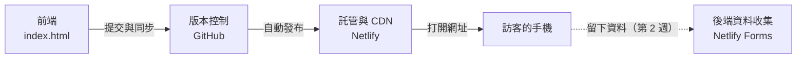

# 自建或使用雲端服務：我們的網站由哪四塊組成

第 1 週講義（約 5 分鐘讀完）。本頁用白話說明兩件事：新創為什麼先「使用雲端服務」而不是「自建」，以及我們今天做的網站由哪四塊組成。

[← 回第 1 週手把手實作](README.md)

---

## 1. 先認識一個詞：SaaS

SaaS（軟體即服務）＝ 不用安裝、打開瀏覽器或 App 就能用的軟體。你每天用的 Instagram、Gmail、Canva、Netflix 都是。

| | 以前的軟體 | SaaS |
| --- | --- | --- |
| 怎麼取得 | 買光碟、下載安裝 | 打開瀏覽器或 App |
| 資料放在哪 | 自己的電腦 | 廠商的雲端 |
| 怎麼更新 | 自己安裝新版 | 廠商更新，大家自動用到新版 |
| 怎麼付錢 | 一次買斷 | 月訂閱、免費加廣告、交易抽成 |

我們這兩週要做的，就是一個小型 SaaS 產品的第一版。

---

## 2. 自建，還是使用雲端服務？

想像你要開一家餐廳：

- **自建**：在深山買地蓋餐廳，水電、保全、廚房全部自己來。開幕前要花很多錢和時間。
- **使用雲端服務**：進駐百貨公司的美食街，水電、清潔、保全都由百貨公司負責，你只要專心做菜。

做網站也一樣：

| | 自建 | 使用雲端服務（本課程的做法） |
| --- | --- | --- |
| 要準備什麼 | 自己買主機、裝軟體、管資安 | 註冊帳號，用現成服務 |
| 開辦費用 | 高（主機、工程師薪水） | 多數有免費方案 |
| 多久能上線 | 幾週到幾個月 | 今天兩小時內 |
| 誰負責維修 | 自己 | 服務商 |
| 缺點 | 花錢、花時間 | 功能受服務商限制，換平台要花力氣 |

一句話原則：**還不確定有沒有人要用之前，先用現成的雲端服務，快速做出來給人試用。** 等產品真的長大，再考慮哪些部分值得自己做。

互動版可以拖動拉桿比較兩種做法的成本：[foodcourt.html](slides/foodcourt.html)。

---

## 3. 我們的網站由哪四塊組成

| 我們的四塊 | 白話說明 | 用的工具 | 哪一週做 |
| --- | --- | --- | --- |
| 前端 | 使用者看到的網頁畫面 | `index.html`（Copilot 幫忙寫） | 第 1 週 |
| 版本控制 | 存放網頁、記住每次修改的雲端資料夾 | GitHub | 第 1 週 |
| 託管與 CDN | 把網頁放上網路，讓全世界都打得開 | Netlify | 第 1 週 |
| 後端資料收集 | 收下訪客留下的 Email 等資料 | Netlify Forms | 第 2 週 |

用美食街來對照：前端是你的店面招牌和菜單；GitHub 是存放食譜的保險櫃；Netlify 是百貨公司提供的店面和出入口；Netlify Forms 是幫你收訂單的櫃台。

---

## 4. 今天整個流程走一次

1. 你在 VS Code 請 Copilot 寫好 `index.html`（前端）。
2. 你按 **提交（Commit）**，在自己電腦存一個版本。
3. 你按 **同步變更（Sync Changes）**，把版本上傳到 GitHub（版本控制）。
4. Netlify 發現 GitHub 有新版本，自動把網頁發布出去（託管與 CDN）。
5. 任何人打開 `https://你的名稱.netlify.app`，就看到你的網站。

整個過程不用買主機，也不用信用卡。

---

## 5. 想一想

1. 你的創業題目，哪一塊最可能在未來需要「自己做」？為什麼？
2. 使用免費的雲端服務，有什麼事情是你控制不了的？（提示：服務條款、免費額度）

---

想了解更多（軟體收費方式的演變、IaaS／PaaS／SaaS、打開網址時發生什麼事、訂閱制的算帳方法）：見 [SaaS 模式與網站運作（選讀）](../../docs/deep_dive/saas_and_web.md)。

下一篇：[你每天用的 App 背後長怎樣](social_media_architecture.md)　｜　[回第 1 週手把手實作](README.md)
