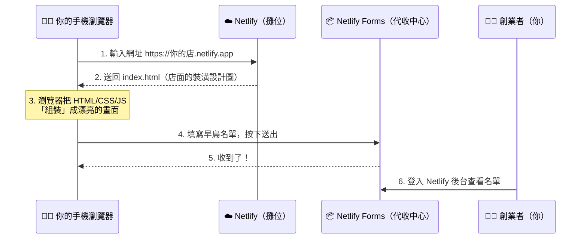

# 麻瓜版網路架構圖：現代網路服務大解密 🍱

> 第一週開場 20～30 分鐘的觀念課講義。**這一頁是整堂課的靈魂，請一定要看懂再動手。**

[← 回第 1 週](README.md)

---

## 1. 什麼是 SaaS？先從「訂閱制」說起

| | 過去：買斷制 💿 | 現在：SaaS（訂閱制）☁️ |
| --- | --- | --- |
| 例子 | 買實體光碟灌遊戲、買 Office 光碟裝在電腦裡 | Netflix 追劇、Spotify 聽歌、Canva 做簡報、Google Docs |
| 怎麼用 | 下載、安裝、更新都要自己來 | 打開瀏覽器就能用 |
| 付費方式 | 一次付清 | 每月／每年訂閱，或免費＋進階付費 |
| 軟體放哪 | 你的電腦裡 | 別人的雲端伺服器上 |

**SaaS = Software as a Service（軟體即服務）**：軟體不再是「賣給你一份」，而是「當作一種服務租給你用」。

### 🧠 創業視角：SaaS 為什麼好賺？

> **程式寫一次，放在雲端，就可以租給全世界。**

- 賣便當：多賣一個，就要多一份食材成本。
- 賣 SaaS：多一個用戶，成本幾乎不變（邊際成本趨近於零）。
- 用戶每個月付訂閱費 → 可預測的穩定收入（這叫 **MRR，月經常性收入**）。

📖 延伸閱讀：
- [什麼是 SaaS？（Microsoft Azure，繁中）](https://azure.microsoft.com/zh-tw/resources/cloud-computing-dictionary/what-is-saas)
- [軟體即服務（維基百科，中文）](https://zh.wikipedia.org/zh-tw/%E8%BD%AF%E4%BB%B6%E5%8D%B3%E6%9C%8D%E5%8A%A1)
- [IaaS、PaaS、SaaS 有什麼不同？（Red Hat，繁中）](https://www.redhat.com/zh/topics/cloud-computing/iaas-vs-paas-vs-saas)

---

## 2. 兩種創業方式：深山蓋餐廳 vs. 進駐美食街

### 🏚️ 傳統創業（自建主機 / 自己架設雲端主機）

> 就像「自己去深山買一塊荒地，從零蓋一間餐廳」。

| 餐廳比喻 | 真實世界要做的事 |
| --- | --- |
| 買荒地 | 買伺服器，或租一台雲端虛擬機器（如 GCP、AWS） |
| 牽水電 | 安裝作業系統、設定網路、申請網域 |
| 請保全防小偷 | 設定防火牆、SSL 憑證、處理資安漏洞 |
| 蓋大廚房 | 寫後端程式、設計資料庫、做 API |
| 請管理員 24 小時顧店 | 監控主機、半夜當機要爬起來修 |

👉 **結論：初期要花幾十萬、搞好幾個月，一旦沒客人就破產。對新手極度不友善！**

### 🏬 現代 SaaS 創業（樂高積木法）

> 我們不買荒地，我們直接「進駐高級百貨公司的美食街」！水電、保全，百貨公司都幫你弄好了。

現代創業者只需要專心做四件事：

```
┌─────────────────────── 🏬 雲端百貨公司 ───────────────────────┐
│                                                                │
│   👨‍💻 前端 Frontend           🗄️ 版本控制 GitHub               │
│   餐廳的裝潢、菜單、           總部的保險箱＋自動傳真機          │
│   點餐櫃檯                     設計圖一改，立刻傳真給分店         │
│   (HTML / CSS / JS)                     │                      │
│          │ 上傳                         │ 自動傳真 (CI/CD)      │
│          └──────────►  GitHub  ─────────┘                      │
│                                         ▼                      │
│   ☁️ 雲端託管 SaaS Netlify      📦 後端即服務 BaaS              │
│   美食街的免費攤位              Netlify Forms                   │
│   提供水電（網址與流量）        訂單代收中心                     │
│   把設計圖變成實體店面          幫你收集客戶名單                 │
│                                                                │
└────────────────────────────────────────────────────────────────┘
                       ▲
                       │ 打開網址逛店
                 👩‍🎓 全世界的客人
```

| 積木 | 美食街比喻 | 白話解釋 | 延伸學習 |
| --- | --- | --- | --- |
| 👨‍💻 **前端 (Frontend)** | 裝潢、菜單、點餐櫃檯 | 使用者看得到、摸得到的畫面。由 HTML（骨架）、CSS（化妝）、JavaScript（動作）組成 | [MDN：網頁入門（繁中）](https://developer.mozilla.org/zh-TW/docs/Learn_web_development/Getting_started/Your_first_website) |
| 🗄️ **版本控制 (GitHub)** | 總部保險箱＋自動傳真機 | 保存每一版程式碼，改壞了可以回到上一版；一更新就通知其他服務 | [GitHub Hello World 教學（繁中）](https://docs.github.com/zh/get-started/start-your-journey/hello-world) |
| ☁️ **雲端託管 SaaS (Netlify)** | 美食街的免費攤位 | 把你的檔案放到全世界都連得到的伺服器上，並給你一個網址 | [Netlify 官方文件](https://docs.netlify.com/) |
| 📦 **後端即服務 BaaS (Netlify Forms)** | 訂單代收中心 | 不自己寫資料庫，租用現成的服務幫你收資料 | [Netlify Forms 說明](https://docs.netlify.com/manage/forms/setup/) |

> 💡 **今天這堂課，我們完全不碰複雜的 GCP，因為聰明的現代創業者，是「用 SaaS 服務來打造自己的 SaaS 產品」！**

---

## 3. 一個網頁被打開時，到底發生了什麼事？



📖 延伸閱讀：[MDN：網際網路是如何運作的？（繁中）](https://developer.mozilla.org/en-US/docs/Learn_web_development/Howto/Web_mechanics/How_does_the_Internet_work)

---

## 4. 這些「樂高積木」在真實世界長什麼樣？

現代新創幾乎都是這樣「組裝」出來的，你之後可以依需求替換積木：

| 需求 | 本課用的積木 | 其他常見選擇（延伸探索） |
| --- | --- | --- |
| 寫前端 | AI 助理（Vibe Coding） | [v0](https://v0.dev/)、[Bolt](https://bolt.new/)、[Lovable](https://lovable.dev/) |
| 存程式碼 | GitHub | [GitLab](https://about.gitlab.com/) |
| 放網站 | Netlify | [Vercel](https://vercel.com/)、[GitHub Pages](https://pages.github.com/)、[Cloudflare Pages](https://pages.cloudflare.com/) |
| 收表單 | Netlify Forms | [Google 表單](https://www.google.com/forms/about/)、[Tally](https://tally.so/)、[Formspree](https://formspree.io/) |
| 會員與資料庫 | （本課用 LocalStorage 模擬） | [Supabase](https://supabase.com/)、[Firebase](https://firebase.google.com/) |
| 收款 | — | [Stripe](https://stripe.com/)、[綠界 ECPay](https://www.ecpay.com.tw/) |

---

## 5. 課堂小測驗 🙋

1. Spotify 屬於「買斷制」還是「SaaS」？為什麼？
2. 如果把網站比喻成美食街餐廳，「前端」是餐廳的哪個部分？
3. GitHub 在這個比喻裡扮演什麼角色？
4. 為什麼新創初期不建議「自己去深山蓋餐廳」？

<details>
<summary>點我看參考答案</summary>

1. SaaS。不用下載買斷，打開 App／瀏覽器就能用，按月訂閱。
2. 裝潢、菜單、點餐櫃檯，也就是客人看得到、能互動的部分。
3. 總部的保險箱（保存每一版設計圖）＋自動傳真機（一更新就通知 Netlify）。
4. 成本高、時間長、風險大；還不知道有沒有客人之前，就先砸大錢蓋廚房，很容易破產。

</details>

---

下一步 👉 [第一週實戰：Vibe Coding 詠唱你的 SaaS 產品前端](README.md)
