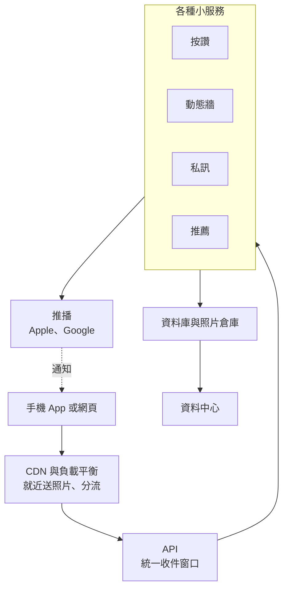
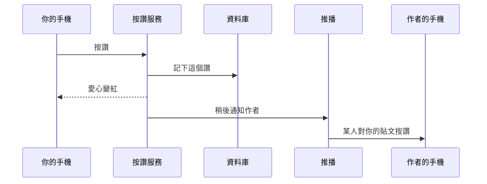

# 你每天用的 App 背後長怎樣

第 1 週講義（約 8 分鐘讀完）。你每天滑的 Instagram、YouTube、LINE，看起來只是手機上的一個 App，背後其實有一整套系統在運作。本頁用一張圖和一個「按讚」的例子，帶你看懂它。

互動版（可點選每一格、播放按讚動畫）：[slides/social_saas.html](slides/social_saas.html)。

[← 回第 1 週手把手實作](README.md)

---

## 1. 一張圖看懂

由上往下看，就是你的一個動作從手機出發、一路往後走的順序。

---

## 2. 每一格在做什麼

| 部分 | 一句話說明 | 生活中的例子 |
| --- | --- | --- |
| 手機 App 或網頁 | 你看得到、點得到的畫面，負責把你的動作送出去 | 你在 IG 雙擊照片按讚 |
| CDN（內容傳遞網路） | 把照片、影片先放在離你近的機房，打開時就近下載 | 國外網紅的照片，在臺灣滑起來也很快 |
| 負載平衡 | 把同時湧進來的大量請求，平均分給很多台伺服器 | 跨年夜大家同時發文，App 還是能用 |
| API | 所有請求的統一收件窗口，先確認你是誰，再轉給對的服務 | 登出後就不能再按讚 |
| 各種小服務 | 按讚、私訊、動態牆、推薦各自是獨立的小系統 | 私訊壞了，但動態牆還能滑 |
| 資料庫與照片倉庫 | 永久保存文字資料（誰按了讚）和照片影片 | 換一支手機登入，舊貼文都還在 |
| 資料中心 | 放滿伺服器的大機房，供電、冷卻、網路都在這裡 | 大公司在世界各地蓋的機房 |
| 推播 | 透過 Apple 或 Google 的服務，把通知送到手機鎖定畫面 | 「某人對你的貼文按讚」跳出來 |

值得注意的一點：就算是大公司，推播也必須透過 Apple 和 Google 的服務送出。也就是說，大公司同樣會使用別人的雲端服務。

---

## 3. 按讚時發生什麼事

整個過程大約 0.3 秒。

1. 你在 App 雙擊照片，App 把「我要按讚」送出去。
2. 負載平衡把這個請求交給一台目前比較空閒的伺服器。
3. API 確認你是已登入的本人，才放行。
4. 按讚服務記下「你對這張照片按了讚」。
5. 資料庫永久保存這筆紀錄，讚數立刻加一；你的畫面上愛心變成紅色。
6. 「通知作者」不急，先排進待辦佇列，稍後處理。
7. 通知服務輪到這筆工作，決定要不要通知作者。
8. 推播服務把通知送到作者手機，跳出「某人對你的貼文按讚」。

所以你會發現：愛心馬上變紅，但對方的通知可能晚幾秒才收到。

---

## 4. 大公司 vs 我們的 MVP

MVP（最小可行產品）＝ 先做出最簡單、可以給人試用的第一版。

| 比較 | 大型社群平台 | 我們的 MVP |
| --- | --- | --- |
| 使用者 | 全球數億人 | 同學、朋友，幾十到幾百人 |
| 工程師 | 數千到數萬人 | 你一個人，加上 Copilot |
| 伺服器 | 世界各地的資料中心 | Netlify 免費方案 |
| 服務數量 | 幾十到上百個小服務 | 3 個現成服務（GitHub、Netlify、Netlify Forms） |
| 上線時間 | 多年持續開發 | 兩次課程 |

以上是概略描述，不是精確數字。重點是：大公司也是從很小的第一版開始，使用者變多之後才一步步長成現在的樣子。

---

## 5. 討論題

1. 你最常用的 App 是哪一個？它有哪一次「部分功能壞了，但其他功能還能用」？
2. 為什麼按讚後，愛心立刻變紅，對方的通知卻可能晚一點才到？
3. 免費的社群 App 靠什麼賺錢？這跟它一直推薦你想看的內容有什麼關係？

---

想了解更多（動態牆怎麼排、資料怎麼分散存放、推薦系統、隱私）：見 [社群媒體系統設計深入（選讀）](../../docs/deep_dive/social_media_systems.md)。

上一篇：[自建或使用雲端服務](saas_architecture.md)　｜　[回第 1 週手把手實作](README.md)
