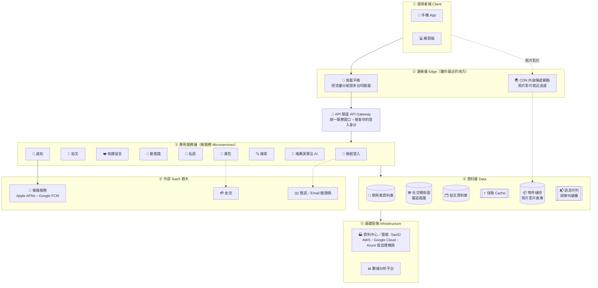
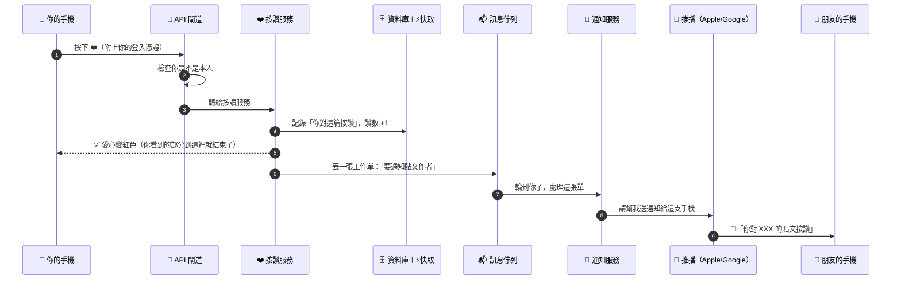
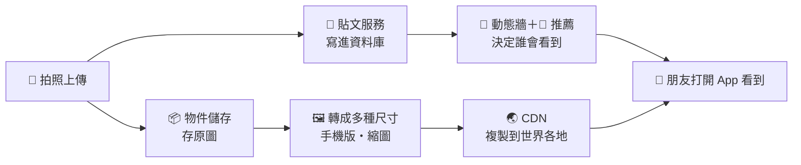
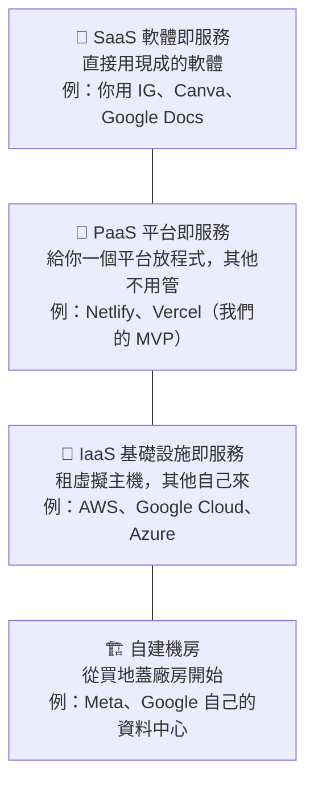
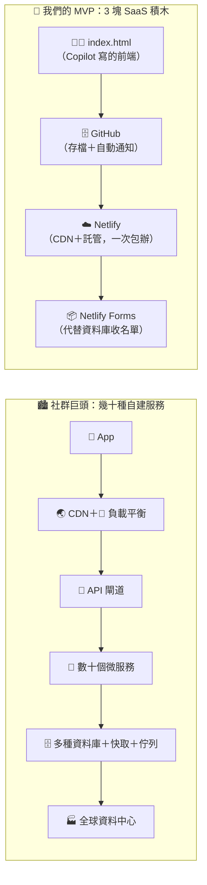

# 📱 你每天滑的社群媒體，背後長什麼樣子？——社群媒體的 SaaS 架構圖

> 第 1 週段落 1 的核心講義。🎮 互動版（可以點、可以播放）👉 [slides/social_saas.html](slides/social_saas.html)
>
> 🆕 **本篇唯一的大概念**：你按下的每一個「❤️」，背後都有幾十種雲端服務在接力。
> 看懂它，你就看懂了現代 SaaS 公司，也會明白為什麼我們的 MVP 只需要 3 塊積木。

[← 回第 1 週](README.md)

---

## 1. 你每天用的，全部都是 SaaS

| App | 你用它做什麼 | 你付錢嗎？ | 它怎麼賺錢 |
| --- | --- | --- | --- |
| 📸 Instagram／Threads／Facebook | 看動態、發限動 | 免費 | 📢 廣告 |
| ▶️ YouTube | 看影片 | 免費／Premium 訂閱 | 📢 廣告 ＋ ⭐ 訂閱 |
| 💬 LINE | 傳訊息 | 免費 | 🛍️ 貼圖、📢 官方帳號、廣告 |
| 🎵 TikTok | 看短影音 | 免費 | 📢 廣告 ＋ 🛍️ 電商抽成 |
| 🎬 Netflix | 追劇 | 月訂閱 | ⭐ 訂閱 |

共同點：**不用安裝光碟、不用自己更新、打開就能用、資料都在雲端** → 這就是 SaaS（Software as a Service）。

> 💡 **「如果你沒有付錢，那你就是商品。」** 免費社群媒體賺的是你的注意力：你滑越久，能賣的廣告越多。
> 所以它們投入大量工程師做「推薦演算法」，讓你停不下來。

---

## 2. 🗺️ 社群媒體的 SaaS 架構總覽圖

以「你在 IG 上按一個讚」為例，一個大型社群平台大致由這些層組成（各公司實際做法不同，這是**簡化的共通架構**）：

> 📱 在手機上看不清楚？打開 [互動版](slides/social_saas.html)，可以一個一個點開看說明，還能播放「按讚」時資料怎麼流動。

---

## 3. 🍱 用「美食街」比喻：社群巨頭是一整座連鎖百貨集團

我們的 MVP 是美食街裡的一個小攤位；IG、YouTube 則是**自己蓋了一整座全球連鎖百貨集團**：

| 元件 | 百貨集團比喻 | 它在做什麼 | 你在 IG 上什麼時候碰到它 |
| --- | --- | --- | --- |
| 📱 App／網頁 | 店面裝潢與點餐櫃檯 | 你看得到、摸得到的畫面（**前端**） | 打開 App 的每一秒 |
| 🌏 CDN | 開在全世界各城市的**分店倉庫** | 把照片影片複製到離你最近的機房，所以台灣也載得快 | 滑到一張照片，瞬間就出現 |
| 🚦 負載平衡 | 百貨門口的**引導員** | 把幾億人的請求平均分給幾萬台伺服器 | 跨年夜大家同時發文也不當機 |
| 🚪 API 閘道 | 百貨的**服務台** | 所有請求的統一入口，先檢查你的會員證（登入） | 每一個動作 |
| 🧩 微服務 | 美食街裡**分工的各櫃位** | 按讚、私訊、搜尋各自是獨立的小服務，一個壞了不會全倒 | 私訊掛了，但你還能滑動態 |
| 🤖 推薦演算法 | 最懂你的**店長** | 分析你停留、按讚的內容，決定下一個給你看什麼 | 「探索」頁面、Reels |
| 📢 廣告服務 | 百貨的**廣告看板部門** | 決定哪個廣告給哪個人看，這是主要營收 | 動態裡的「贊助」貼文 |
| 🗄️ 資料庫 | **倉庫與帳本** | 存會員資料、貼文、留言 | 登入、看舊貼文 |
| 🕸️ 社交關係圖 | **會員之間的人脈網** | 記錄誰追蹤誰、誰是好友 | 「你可能認識的人」 |
| ⚡ 快取 | **熱門菜先備好**放保溫台 | 常被看的資料放在超快的記憶體裡 | 熱門貼文秒開 |
| 📦 物件儲存 | **照片影片大倉庫** | 存放每天上億張照片與影片 | 你上傳的每一張照片 |
| 📬 訊息佇列 | **排隊叫號機** | 不急的工作先排隊，慢慢處理，避免塞車 | 按讚後，通知晚一兩秒才送達 |
| 📲 推播服務 | **外送平台**（別人的服務） | Apple／Google 提供，把通知送到你的手機 | 手機跳出「XXX 對你的貼文按讚」 |
| 🏭 資料中心 | **中央廚房與發電廠** | 數十萬台伺服器、電力、冷卻 | 你看不到，但一切都靠它 |

---

## 4. ▶️ 按下「❤️ 讚」的 0.5 秒內，發生了什麼事？

> 🤔 **發現了嗎？** 你看到愛心變紅之後，後面還有一大串工作「排隊」在做。這就是為什麼通知有時會晚幾秒才到。

### 📸 發一則限時動態

### 📰 打開 App 滑動態

1. App 向 API 閘道要「我的動態」。
2. 動態牆服務查 **社交關係圖**：你追蹤了誰？
3. **推薦 AI** 加入「你可能會喜歡」的內容，**廣告服務**插入贊助貼文。
4. 結果先放進 **快取**，下次更快。
5. 文字從伺服器來，**照片影片從離你最近的 CDN 節點**載入。

---

## 5. ☁️ 雲端的三層蛋糕：IaaS、PaaS、SaaS

社群巨頭自己也「租」別人的雲端服務，只是租的層次不同：

| 做法 | 美食街比喻 | 誰在這樣做（公開資訊） |
| --- | --- | --- |
| 🏗️ 自建資料中心 | 自己蓋整座百貨公司 | Meta（IG／FB）、Google（YouTube）都有自己的資料中心 |
| 🎂 租 IaaS | 租一塊空地，自己蓋店 | Netflix 的服務主要跑在 AWS 上；Instagram 早期也架在 AWS，後來搬進 Meta 自己的資料中心 |
| 🧁 用 PaaS | 進駐美食街攤位 | **我們的 MVP（Netlify）** |
| 🍰 用 SaaS 積木 | 直接叫外送 | 大公司也用：推播用 Apple／Google、金流用 Stripe、客服用 Zendesk… |

> 💡 **重點**：沒有一家公司所有東西都自己做。**連 IG 都在用別人的 SaaS 積木**（例如推播一定要經過 Apple 和 Google）。
> 差別只在「哪些自己蓋、哪些用租的」。**越早期的新創，越應該用租的。**

---

## 6. 🔍 對照：社群巨頭 vs. 我們的 MVP

| 需求 | 社群巨頭怎麼做 | 我們的 MVP 怎麼做 |
| --- | --- | --- |
| 畫面（前端） | 數百位工程師做 App 與網頁 | **Copilot** 幫你寫一個 `index.html` |
| 放網站、全球加速 | 自建 CDN、負載平衡、資料中心 | **Netlify** 一次包辦（它背後也有 CDN） |
| 版本管理與自動上線 | 內部的大型 CI/CD 系統 | **GitHub ＋ Netlify** 自動部署 |
| 收使用者資料 | 自建資料庫叢集 | **Netlify Forms**（BaaS） |
| 記住登入狀態 | 帳號服務＋加密的登入憑證 | **LocalStorage** 模擬（Demo 用） |
| 推薦演算法、廣告、私訊 | 數千位工程師 | **不需要！** MVP 只驗證「有沒有人想要」 |
| 工程師人數 | 數千～數萬人 | **你＋隊友＋Copilot** |
| 上線時間 | 好幾年 | **4 小時** |
| 月成本 | 非常龐大 | **0 元**（免費方案） |

> 🏗️ **架構呼應**：大公司要自己蓋幾十種服務；創業初期，我們用 3 塊 SaaS 積木就能跑起來。
> 等你的產品真的有人用、需要更多功能，再一塊一塊換成更大的積木（例如用 [Supabase](https://supabase.com/) 做真正的會員系統）。**IG 一開始也只是 2 個人做的小 App。**

---

## 7. 🙋 課堂小測驗（先自己想，再點開答案）

1. 為什麼 IG 的照片在台灣也能載得很快？
2. 你按讚之後，朋友手機跳出通知，是哪一個「外部 SaaS 積木」幫忙送的？
3. 私訊功能壞掉時，你還是能滑動態。這是因為大公司採用了什麼架構？
4. 我們的 MVP 用什麼取代了社群巨頭的「資料庫」？
5. 免費的社群媒體主要靠什麼賺錢？為什麼它們這麼重視推薦演算法？

點我看參考答案

1. **CDN**：照片被複製到離你最近的機房（分店倉庫），不用每次都從美國送過來。
2. **推播服務**（Apple APNs／Google FCM）：連 IG 都要借用別人的積木。
3. **微服務**：每個功能是獨立的小服務（美食街各櫃位），一個櫃位休息不影響其他櫃位。
4. **Netlify Forms**（BaaS，訂單代收中心）。
5. **廣告**。你停留越久、看的廣告越多，所以推薦演算法要讓你「停不下來」。

---

## 📚 延伸閱讀

| 資源 | 說明 | 難度 |
| --- | --- | --- |
| [MDN：CDN 是什麼（繁中）](https://developer.mozilla.org/zh-TW/docs/Glossary/CDN) | 名詞解釋 | 🟢 |
| [Red Hat：IaaS、PaaS、SaaS 的差異](https://www.redhat.com/zh/topics/cloud-computing/iaas-vs-paas-vs-saas) | 雲端三層蛋糕 | 🟢 |
| [Red Hat：什麼是微服務？](https://www.redhat.com/zh/topics/microservices/what-are-microservices) | 美食街櫃位分工 | 🟡 |
| [Meta Engineering 部落格](https://engineering.fb.com/) | IG／FB 工程師的真實分享 | 🔵 |
| [Instagram Engineering 部落格](https://instagram-engineering.com/) | Instagram 的技術故事 | 🔵 |
| [Netflix TechBlog](https://netflixtechblog.com/) | Netflix 怎麼服務全球上億會員 | 🔵 |
| [System Design Primer（GitHub）](https://github.com/donnemartin/system-design-primer) | 工程師面試必讀的系統設計入門，有很多架構圖 | 🔵 |

---

下一步 👉 [深山 vs 美食街：我們自己的創業要怎麼選？](saas_architecture.md)
