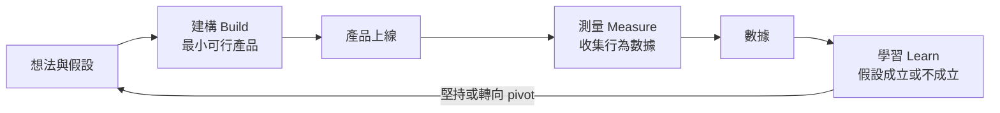

# 第 2 週（2026/10/14）｜串接後端服務與自動化部署

- 對應檢核點：檢核點 4 表單串接 → 檢核點 5 狀態保存 → 檢核點 6 持續部署 → 檢核點 7 成果發表（定義見 [學習檢核點](../../docs/checkpoints.md)）
- 時間：2 小時（兩節）
- 工具：VS Code、GitHub Copilot（Agent 模式）、Git／GitHub（VS Code 原始檔控制面板）、Netlify、Netlify Forms、瀏覽器 LocalStorage

> **課前準備**：確認第 1 週部署的網站可以用手機開啟；在 VS Code 以「檔案 → 開啟最近使用的項目」開啟上週 clone 的 repo 資料夾，並在原始檔控制面板按一次「同步變更」，確保本機與 GitHub 一致。第 1 週尚未完成者，請先依 [第 1 週步驟卡](../wk01_1007_saas-storefront/steps.md) 補齊檢核點 2、3。
>
> **上課請開啟 [steps.md（一頁版步驟卡）](steps.md)**，逐項勾選。
>
> **分組方式**：延續第 1 週的配對程式設計（pair programming），一人擔任駕駛（driver，操作電腦），一人擔任導航員（navigator，讀步驟、檢查結果）。本週由上週最後一段擔任導航員的同學先擔任駕駛，每個實作段落結束後交換。

---

## 1. 學習目標

完成本週課程後，學生應能：

1. **區分**前端（frontend）與後端（backend）的責任，並說明資料庫（database）在網路服務中解決什麼問題。
2. **說明**精實創業（Lean Startup）的「建構—測量—學習」循環，並為自己的產品寫出一個可被否證的假設與對應的成功指標。
3. **解釋**後端即服務（Backend as a Service, BaaS）的概念與取捨，並以 Netlify Forms 實際串接一個候補名單表單。
4. **比較**伺服器端資料儲存與瀏覽器 LocalStorage 的差異（儲存位置、可見範圍、持久性、安全性），並判斷各自適用的情境。
5. **描述**持續整合／持續部署（CI/CD）的運作機制，並在 Commit＋Sync 後觀察網站自動更新。
6. 以 1 分鐘向他人**說明**自己的最小可行產品（Minimum Viable Product, MVP）、其驗證假設與技術架構。

## 2. 時程

| 段落 | 時間 | 內容 | 本段新概念 | 教材 |
| --- | --- | --- | --- | --- |
| 0 | 0:00–0:05 | 暖身回想：上週的四個架構元件 | —（提取練習） | [worksheet.md](worksheet.md) |
| 1 | 0:05–0:20 | 觀念建立：前後端分工、精實創業、BaaS | BaaS | [slides/data_flow.html](slides/data_flow.html) 分頁 1 |
| 2 | 0:20–1:00 | 實作一：以 Netlify Forms 建立候補名單 | Netlify Forms | [prompts.md](prompts.md)、[Netlify Forms 講義](../../docs/tutorials/netlify_forms.md) |
| 3 | 1:00–1:35 | 實作二：以 LocalStorage 模擬會員狀態 | LocalStorage | [slides/data_flow.html](slides/data_flow.html) 分頁 1、2；[LocalStorage 講義](../../docs/tutorials/localstorage.md) |
| 4 | 1:35–1:50 | 實作三：觀察持續部署 | CI/CD | [slides/data_flow.html](slides/data_flow.html) 分頁 3；[CI/CD 講義](../../docs/tutorials/cicd.md) |
| 5 | 1:50–2:00 | MVP 發表與總結 | — | [Pitch 模板](../../docs/pitch_template.md) |

每個段落只引入一個新概念，以控制認知負荷；第 3 節的核心概念內容較多，課堂上講授重點，其餘作為課後閱讀。

---

## 3. 核心概念

### 3.1 前端與後端的分工

第 1 週以「美食街」比喻說明架構：前端是店面裝潢，後端是廚房與倉庫。以下改用精確的技術描述。

| 面向 | 前端（frontend） | 後端（backend） |
| --- | --- | --- |
| 執行位置 | 使用者的瀏覽器 | 服務提供者控制的伺服器 |
| 主要技術 | HTML（結構）、CSS（外觀）、JavaScript（互動） | 伺服器程式（如 Node.js、Python）、資料庫、應用程式介面（Application Programming Interface, API） |
| 主要責任 | 呈現畫面、接收輸入、基本的輸入格式檢查 | 接收並驗證資料、執行商業規則、永久保存資料、身分驗證與授權 |
| 可信任程度 | **不可信任**：程式碼完全公開，使用者可以用開發者工具任意修改 | 可信任：程式碼與資料由營運者控制 |
| 本課程對應 | 你用 Copilot 產生的 `index.html` | Netlify Forms（代管的後端） |

關鍵觀念是「前端不可信任」。瀏覽器裡的 JavaScript 可以被使用者檢視、修改或略過，因此凡是涉及金錢、權限或資料正確性的檢查，最終都必須在後端再做一次。前端的「必填」檢查只是改善使用體驗，不是安全機制。

### 3.2 後端與資料庫實際做什麼

當使用者在一般網路服務按下「送出」時，後端大致依序完成下列工作：

1. **接收請求**：瀏覽器以 HTTP（HyperText Transfer Protocol）送出請求，後端在指定網址（端點，endpoint）等待。
2. **驗證**：檢查欄位是否齊全、格式是否正確、是否為機器人或惡意輸入。
3. **執行商業邏輯**：例如判斷是否重複報名、計算名次、寄送確認信。
4. **持久化（persistence）**：寫入資料庫，使資料在伺服器重啟、使用者關閉瀏覽器後依然存在，並可被多位使用者、多台裝置共同存取。
5. **回應**：告訴瀏覽器成功或失敗，前端再據此更新畫面。

資料庫除了「存起來」，還提供查詢（例如篩選出所有研究生）、並行控制（多人同時寫入時資料不錯亂）、備份與權限管理。自行建置這些能力需要的技術如下：

| 工作 | 需要的知識 | 持續成本 |
| --- | --- | --- |
| 租用與設定伺服器 | Linux、雲端主機、網路設定 | 主機費用、系統更新 |
| 撰寫接收資料的 API | 後端程式語言、HTTP | 功能變更時需維護 |
| 設計資料庫 | SQL、資料模型 | 備份、效能調校 |
| 資訊安全與個資保護 | 輸入驗證、加密、存取控制、法規 | 持續進行，沒有終點 |

對一個尚未證明有人需要的產品而言，這些投入的風險很高。這正是下一節精實創業要處理的問題。

### 3.3 精實創業：先驗證需求，再投入建置

精實創業由 Eric Ries 在 2011 年出版的 *The Lean Startup* 中系統化提出，核心主張是：新創事業面對的最大風險通常不是「做不出來」，而是「做出來卻沒有人要」。因此應以最低成本、最短時間取得關於市場的可靠證據。

**核心術語：**

- **建構—測量—學習（Build–Measure–Learn）循環**：衡量進度的標準是跑完一圈所需的時間，而不是寫了多少程式。
- **經過驗證的學習（validated learning）**：以真實使用者的**行為**（而不是意見或讚美）證明某個假設成立或不成立。
- **可被否證的假設（falsifiable hypothesis）**：假設必須寫成「可能被數據推翻」的形式。
  - 不佳：「大學生會喜歡我的二手教科書平台。」（無法被推翻）
  - 較佳：「在分享給 30 位北大大一新生後的 7 天內，至少 20% 會留下 Email 加入候補名單。」（對象、行為、門檻、期限皆明確）
- **最小可行產品（MVP）**：能夠完成一次「建構—測量—學習」循環所需的最小產品，重點在「可學習」，而非「功能最少」。

**常見的 MVP 類型：**

| 類型 | 做法 | 驗證的問題 | 限制 |
| --- | --- | --- | --- |
| 著陸頁煙霧測試（landing-page smoke test） | 產品尚未存在，只做一頁介紹與報名表單，觀察有多少人留下聯絡方式 | 需求是否存在、價值主張是否吸引人 | 留下 Email 的成本很低，不代表願意付費 |
| 禮賓式 MVP（concierge MVP） | 以人工方式、一對一為早期使用者提供服務，使用者知道是人工進行 | 解決方案是否真的解決問題、使用者在意哪些環節 | 無法規模化，樣本小 |
| 綠野仙蹤式 MVP（Wizard of Oz MVP） | 使用者看到的是看似自動化的產品，背後其實由人工完成 | 使用者是否會實際使用完整流程 | 需注意對使用者的透明度與倫理 |

**案例（謹慎描述）**：Ries 在書中描述，Dropbox 在產品尚未公開時，由創辦人 Drew Houston 製作一段示範影片說明產品概念，影片發布後，Beta 版候補名單據報導在一夜之間從約 5,000 人增加到約 75,000 人（參見 [TechCrunch 的報導](https://techcrunch.com/2011/10/19/dropbox-minimal-viable-product/)）。這個案例常被用來說明「以影片或著陸頁驗證需求」，但應注意兩點：其一，它是事後回顧的成功案例，存在倖存者偏差（survivorship bias），許多做了同樣測試卻失敗的案例不會被報導；其二，當時的目標受眾（技術社群）與產品高度吻合，並非任何產品都能得到類似結果。

本週製作的「早鳥候補名單」正是著陸頁煙霧測試：以一個前端頁面加上 BaaS 表單，在幾乎沒有後端開發成本的情況下取得需求證據。

### 3.4 為候補名單定義成功指標

在分享網址之前，就應先寫下成功的標準，否則容易在看到數據後才調整標準、自我說服。

| 指標 | 定義 | 取得方式與注意事項 |
| --- | --- | --- |
| 不重複訪客數（unique visitors） | 一段期間內造訪頁面的不同使用者數 | 需要網站分析工具，部分服務為付費功能；課堂上可暫以「分享給多少位目標使用者」作為近似分母，並在報告中註明是近似值 |
| 轉換率（conversion rate） | 報名人數 ÷ 不重複訪客數 | 例如 40 位訪客中有 6 位報名，轉換率為 15%；分母不準確時，轉換率也不準確 |
| 質性訊號（qualitative signals） | 「最期待的功能」欄位內容、使用者主動詢問、願意轉介他人 | 樣本小時，質性資料往往比數字更有資訊量 |

**需要警惕的陷阱：**

- **虛榮指標（vanity metrics）**：看起來很漂亮、卻無法支持決策的數字，例如累計瀏覽次數、按讚數。判斷方式是問：「這個數字變動時，我會做出不同的決定嗎？」
- **樣本偏差**：同學互填的資料只能證明表單**技術上可運作**，不能證明市場需求。同學出於禮貌而填寫、且多數不是目標使用者，這是典型的便利抽樣（convenience sampling）偏差。課後的延伸任務「市場驗證：5 位非同學的目標使用者」即是為了取得較有意義的訊號。
- **低承諾行為**：留下 Email 的成本很低。若要驗證付費意願，需要更高承諾的行為，例如預購、訂金或排定訪談。

### 3.5 後端即服務（BaaS）

BaaS 是指由雲端供應商代管後端的常用功能，例如資料儲存、表單收集、身分驗證、檔案儲存，開發者透過設定或 API 直接使用，不需自行維護伺服器。常見服務包括 Netlify Forms、Firebase、Supabase。

在本課程中，Netlify Forms 的做法是：在 HTML 表單加上 `data-netlify="true"` 屬性，Netlify 在部署時偵測到這個表單，並自動建立接收端點與後台。機制細節見 [Netlify Forms 講義](../../docs/tutorials/netlify_forms.md)。

**取捨分析：**

| 面向 | 好處 | 代價與風險 |
| --- | --- | --- |
| 開發速度 | 從數週縮短為數分鐘，適合驗證階段 | 功能受限於供應商提供的範圍，難以客製商業邏輯 |
| 營運成本 | 免費或低價方案即可起步，不需自行維運 | 用量超過免費額度（quota）後的費用，需事先查閱 [Netlify 價格頁面](https://www.netlify.com/pricing/) |
| 供應商鎖定（vendor lock-in） | — | 表單語法、資料格式與特定平台綁定，日後遷移需改寫 |
| 資料所有權與匯出 | 供應商負責備份與可用性 | 資料存放在第三方伺服器（可能位於境外）；應確認能否完整匯出（Netlify Forms 可匯出 CSV）與刪除 |
| 資訊安全 | 由專業團隊維護基礎設施 | 帳號安全仍是你的責任；個資保護的法律義務不會因使用第三方服務而移轉 |

合理的策略是：驗證階段使用 BaaS 以求速度，當需求被證實、功能需求超出 BaaS 能力時，再評估遷移至可客製的後端（例如 Supabase 或自建 API）。

---

## 4. 課堂流程

### 段落 0｜暖身回想（5 分鐘）

**不看筆記**，與搭檔討論並寫在 [學習單](worksheet.md) 第 1 題：

1. SaaS 與買斷制軟體在交付方式與收費模式上有何不同？
2. 第 1 週介紹的四個架構元件分別是什麼？各自負責什麼？
3. 第 1 週已使用哪三個？尚缺哪一個？

間隔一週後的主動回想（提取練習，retrieval practice）比重讀筆記更能鞏固長期記憶；想不起來時的「努力回想」本身即具有學習效果。

參考答案

1. SaaS 將軟體部署在雲端，使用者透過瀏覽器使用，通常以訂閱方式收費，更新由供應商統一進行；買斷制由使用者安裝在自己的裝置，一次付費。
2. 前端（使用者看到的頁面）、GitHub（版本控制與程式碼儲存）、Netlify（託管與部署）、BaaS（代管的後端服務）。
3. 已使用前端、GitHub、Netlify；本週補上 BaaS。

### 段落 1｜觀念建立（15 分鐘）

本段新概念：BaaS。

1. 開啟 [slides/data_flow.html](slides/data_flow.html) 分頁 1「資料去哪了？」，選擇「沒有後端」模式，在模擬手機上送出表單。觀察：資料沒有被任何伺服器接收，重新整理後即消失。這對應第 1 週的網站現況：只有前端。
2. 講授第 3.1、3.2 節：前後端分工與後端的工作。
3. 講授第 3.3、3.4 節：精實創業與成功指標；請學生在學習單第 2 題寫下自己的可否證假設。
4. 切換為「有 BaaS」模式再送出一次，觀察資料進入 Netlify 後台；講授第 3.5 節 BaaS 的取捨。

### 段落 2｜實作一：以 Netlify Forms 建立候補名單（40 分鐘）

本段新概念：Netlify Forms。完成條件為**檢核點 4**：Netlify Forms 收到 3 筆以上資料，且 [網站自我檢核工具](../../tools/vibe_check.html) Level 2 通過。

| 步驟 | 動作 | 說明 |
| --- | --- | --- |
| 2.1 教師示範（5 分鐘） | Copilot 新增表單 → 開啟表單偵測 → Commit＋Sync → 填表 → 查看後台 | 完整走過一次，建立心智模型 |
| 2.2 產生表單 | 使用 [提示詞產生器](../wk01_1007_saas-storefront/slides/prompt_builder.html)（切換至「第 2 週」模式）或 [prompts.md 提示詞 1](prompts.md#31-提示詞-1加入早鳥候補名單表單)，在 Copilot Chat 的 **Agent 模式**中送出。提示詞含 `#index.html`，Copilot 會直接修改該檔案；檢視差異後按 **Keep** | 依 [prompts.md 的驗證清單](prompts.md#4-copilot-產出後的驗證清單) 檢查 |
| 2.3 自我檢查 | 在 `index.html` 以 `Ctrl+F`（Mac：`⌘F`）搜尋 `data-netlify`；或將檔案交給網站自我檢核工具檢查 Level 2 | 確認關鍵屬性存在 |
| 2.4 開啟表單偵測 | Netlify → 你的專案 → **Forms** → **Enable form detection** | 自 2023 年 4 月起，新建立的網站預設關閉表單偵測（[Netlify 公告](https://answers.netlify.com/t/forms-detection-now-off-by-default/90414)）；這是最常被遺漏的步驟 |
| 2.5 Commit＋Sync | 原始檔控制 → 訊息 `新增早鳥名單表單` → 提交（Commit）→ 同步變更（Sync） | 推送後觸發 Netlify 重新部署；Netlify 在部署時才會解析 HTML、偵測表單 |
| 2.6 取得資料 | 在 Netlify 網址（非本機 `file:///`）送出一筆測試資料，並與 3 位同學互相填寫 | 同學資料僅用於確認功能運作，不代表市場需求（見第 3.4 節） |
| 2.7 查看後台 | Netlify → **Forms** → **waitlist** | 可檢視每筆資料與送出時間，並可匯出 CSV |

段落結束，交換駕駛與導航員。

### 段落 3｜實作二：以 LocalStorage 模擬會員狀態（35 分鐘）

本段新概念：LocalStorage。完成條件為**檢核點 5**：以 LocalStorage 模擬會員狀態，且網站自我檢核工具 Level 3 通過。

**3.1 比較兩種儲存位置（10 分鐘）**

在 [data_flow.html](slides/data_flow.html) 分頁 1 送出表單後，分別按「重新整理網頁」與「換一台手機」。觀察：重新整理後歡迎畫面仍在；換裝置後歡迎畫面消失，但 Netlify 後台的資料仍在。

| 面向 | 伺服器端儲存（Netlify Forms） | 瀏覽器 LocalStorage |
| --- | --- | --- |
| 資料位置 | 服務供應商的伺服器 | 使用者裝置上的瀏覽器 |
| 誰能讀取 | 網站營運者（登入後台） | 僅該裝置、該瀏覽器、同一來源（origin）的網頁 |
| 換裝置或瀏覽器 | 資料仍在 | 資料不存在 |
| 使用者清除網站資料 | 不受影響 | 資料消失 |
| 適合用途 | 需要集中管理、跨裝置、長期保存的資料 | 偏好設定、介面狀態、非敏感的暫存資訊 |

接著完成分頁 2 的分類練習。機制與安全性說明見 [LocalStorage 講義](../../docs/tutorials/localstorage.md)。

**3.2 實作（25 分鐘）**

使用 [prompts.md 提示詞 2](prompts.md#32-提示詞-2送出後原地切換為會員儀表板)，達成下列行為：

1. 送出表單後頁面不跳轉，以 `fetch()` 在背景送出資料（AJAX），原地切換為「歡迎回來，〔姓名〕」的會員儀表板。
2. 重新整理後，儀表板仍然顯示。
3. 按「登出」後清除 LocalStorage，回到表單。
4. Keep → Commit（`新增會員儀表板`）＋ Sync → 以手機測試 → 以網站自我檢核工具檢查 Level 3。

可對照 [samples/HIGH](../../samples/HIGH/index.html) 的實作。

**重要限制**：這只是介面上的「模擬登入」，沒有任何身分驗證；任何人都能在開發者工具中自行寫入一個名字而「登入」。在展示階段，它足以呈現產品流程；正式產品必須使用伺服器端的身分驗證（見 [LocalStorage 講義](../../docs/tutorials/localstorage.md) 第 6 節）。

段落結束，交換駕駛與導航員。

### 段落 4｜實作三：觀察持續部署（15 分鐘）

本段新概念：CI/CD。完成條件為**檢核點 6**：修改後 Commit＋Sync，未操作 Netlify 即自動更新。

採用預測—觀察—解釋（Predict–Observe–Explain, POE）：

1. 在 [data_flow.html](slides/data_flow.html) 分頁 3「CI/CD」觀看一次模擬，並試用「回到上一版」。
2. **預測**：Commit＋Sync 之後，是否需要到 Netlify 手動操作才會更新？寫在學習單第 4 題。
3. 使用 [prompts.md 提示詞 3](prompts.md#33-提示詞-3快速改版以觀察持續部署) 請 Copilot 做一項明顯的修改（例如按鈕顏色）。
4. Keep → Commit（`改按鈕顏色`）→ 同步變更。
5. **觀察**：不開啟 Netlify，等待約 10–30 秒後以手機重新整理。
6. **解釋**：GitHub 在收到推送時通知 Netlify，Netlify 自動建置並以原子方式發布新版本。完整機制見 [CI/CD 講義](../../docs/tutorials/cicd.md)。

此流程讓修改的單位變小、發布頻率提高、出錯時可立即回復，這是業界能頻繁發布而不停機的基礎。需要注意的是，本課程的流程**沒有自動化測試**，嚴格而言只具備「自動部署」，尚未具備完整的持續整合。

### 段落 5｜MVP 發表與總結（10 分鐘）

**5.1 一分鐘 MVP 發表**（完成條件為**檢核點 7**）

與鄰組互相發表，教師抽 2–3 組上台。建議結構：

> 「我們的產品是〔名稱〕，為〔目標使用者〕解決〔問題〕。我們的核心假設是〔可否證假設〕，成功標準是〔指標與門檻〕。技術上，前端以 GitHub Copilot 輔助開發，部署於 Netlify，以 Netlify Forms 收集候補名單，目前收到〔N〕筆，其中〔M〕筆來自非同學的目標使用者。下一步要驗證的是〔…〕。」

期末完整版請見 [Pitch 模板](../../docs/pitch_template.md)。

**5.2 總結**

1. 完成 [學習單](worksheet.md) 第 6 題出場券（exit ticket）。
2. 在 [學習歷程檔案](../../templates/portfolio_README.md) 勾選本週檢核點，並寫下第 2 週的 3-2-1 反思。
3. 檢核點 0–7 全部完成者，可在 [網站自我檢核工具](../../tools/vibe_check.html) 產生完課證明。

---

## 5. 討論與延伸思考

1. 你的候補名單若在一週內只有 2 筆來自目標使用者的報名，這代表「需求不存在」、「價值主張寫得不好」，還是「觸及的人太少」？你需要什麼額外資料才能區分這三種解釋？
2. 若將 Netlify Forms 換成自建後端，你會得到什麼、失去什麼？在產品生命週期的哪個時點值得做這個轉換？
3. 綠野仙蹤式 MVP 讓使用者以為是自動化服務。在什麼條件下這樣做是可以接受的？何時會構成誤導？
4. 候補名單收集的是 Email。依個人資料保護法的精神，你的表單至少應該向填寫者說明哪些事項？
5. 自動部署讓「改一行、立即上線」成為可能。在沒有自動化測試的情況下，這種速度帶來什麼風險？你會如何降低？

## 6. 課後任務

- [ ] **必做**：在學習歷程檔案完成第 2 週反思與 AI 使用紀錄。
- [ ] **延伸任務（選做）市場驗證：5 位非同學的目標使用者**：將網址分享給 5 位符合目標客群、非本課程同學的人，記錄報名數與質性回饋。
- [ ] **延伸任務（選做）表單通知設定**：於 Netlify **Forms → Submission notifications** 設定 Email 通知（步驟見 [Netlify Forms 講義](../../docs/tutorials/netlify_forms.md)）。
- [ ] **延伸任務（選做）GitHub Actions 自動檢核**：依 [自動檢核教學](../../docs/tutorials/vibe_check_ci.md) 在自己的 repo 加入自動檢查，作為持續整合的第一步。
- [ ] **延伸閱讀**：比較 [Supabase](https://supabase.com/) 與 [Firebase](https://firebase.google.com/) 如何提供真正的會員系統，思考下一個需要加入的架構元件。
- [ ] **作品牆登記**：至 [作品牆](../../showcase/README.md) 登記作品網址。

## 7. 參考資料

- Ries, E. (2011). *The Lean Startup*. Crown Business. 原則摘要：[The Lean Startup — Principles](https://theleanstartup.com/principles)
- Y Combinator：[How to Build an MVP](https://www.ycombinator.com/library/Io-how-to-build-an-mvp)
- Netlify Docs：[Forms setup](https://docs.netlify.com/manage/forms/setup/)
- MDN Web Docs：[Web Storage API](https://developer.mozilla.org/zh-TW/docs/Web/API/Web_Storage_API)
- GitHub：[What is CI/CD?](https://github.com/resources/articles/devops/ci-cd)
- DORA（DevOps Research and Assessment）：[dora.dev](https://dora.dev/)
- 全國法規資料庫：[個人資料保護法](https://law.moj.gov.tw/LawClass/LawAll.aspx?pcode=I0050021)
- 其他資源：[延伸學習資源](../../docs/resources.md)、[名詞解釋](../../docs/glossary.md)

## 8. 本週教材

| 檔案 | 用途 |
| --- | --- |
| [steps.md](steps.md) | 一頁版步驟卡 |
| [slides/data_flow.html](slides/data_flow.html) | 互動教材：分頁 1 資料流向（有／無 BaaS、重新整理、換裝置）；分頁 2 儲存位置分類練習；分頁 3 CI/CD 部署流程模擬 |
| [slides/outline.md](slides/outline.md) | 教師授課大綱 |
| [prompts.md](prompts.md) | 本週提示詞、技術要求說明與驗證清單 |
| [worksheet.md](worksheet.md) | 學習單：回想、假設與指標、分類、POE、出場券 |
| [announcement.md](announcement.md) | 課前與課後公告 |
| [疑難排解手冊](../../docs/tutorials/error_guide.md) | 表單收不到資料、儀表板未出現等常見問題 |

---

上一週：[第 1 週](../wk01_1007_saas-storefront/README.md)　｜　期末準備：[Pitch 模板](../../docs/pitch_template.md)
