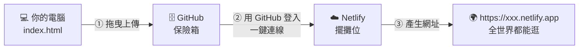

# 🗓️ 第一週（10/7）：看懂 SaaS 商業邏輯 ＆ 打造數位店面

> **🎯 本週目標：秒懂現代網路架構，並用 AI 產出前端畫面，放到雲端主機上。**
>
> ⏱️ 總時數：2 小時　｜　🧰 需要：筆電、GitHub 帳號、Netlify 帳號、AI 助理

[← 回課程首頁](../README.md)　｜　還沒申請帳號？👉 [課前準備](../docs/00-before-class.md)

---

## 📋 本週流程總覽

| 時間 | 單元 | 對應 SaaS 積木 | 教材 |
| --- | --- | --- | --- |
| 0:00–0:30 | 1. 觀念建立：現代網路服務大解密 🔥 | 全部四塊 | [SaaS 架構講義](../docs/01-saas-architecture.md) |
| 0:30–1:15 | 2. 實戰一：Vibe Coding 詠唱你的產品前端 | 👨‍💻 前端 | [咒語集](prompts.md) |
| 1:15–2:00 | 3. 實戰二：把店面放上雲端 | 🗄️ GitHub ＋ ☁️ Netlify | [部署圖文教學](deploy-github-netlify.md) |

---

## 1️⃣ 觀念建立：現代網路服務大解密（30 分鐘）🔥【本次重點】

請先閱讀 👉 **[麻瓜版網路架構圖](../docs/01-saas-architecture.md)**，你需要能回答：

- [ ] 什麼是 SaaS？舉出三個你每天在用的 SaaS。
- [ ] 為什麼 SaaS 好賺？（提示：程式寫一次，可以租給全世界）
- [ ] 美食街比喻中的四塊積木分別是什麼？

> 🧠 **想一想**：你手機裡的 App，有哪些是「買斷」、哪些是「訂閱」？訂閱制的 App 平均每月花你多少錢？

---

## 2️⃣ 實戰一：Vibe Coding 詠唱你的 SaaS 產品前端（45 分鐘）

### 什麼是 Vibe Coding？

2025 年初，前 OpenAI 共同創辦人 Andrej Karpathy 提出了 **「Vibe Coding」** 這個詞：
你不用一行一行寫程式，而是**用自然語言描述你要的「感覺（vibe）」，讓 AI 幫你寫程式**，你負責看結果、給回饋、再修改。

📖 延伸閱讀：[Vibe coding（維基百科）](https://en.wikipedia.org/wiki/Vibe_coding)｜[Karpathy 的原始貼文](https://x.com/karpathy/status/1886192184808149383)

### 步驟

1. **定題目（10 分鐘）**：想好你的創業題目。沒靈感？用 [咒語 0：腦力激盪](prompts.md#咒語-0腦力激盪創業題目)。
2. **詠唱咒語（15 分鐘）**：複製 [咒語 1：產生形象首頁](prompts.md#咒語-1產生-saas-形象首頁核心咒語)，把 `【】` 裡的內容換成你的題目，貼給 AI。
3. **預覽與存檔（10 分鐘）**：
   - 在 AI 的預覽畫面看看成果（Claude 的 Artifacts / ChatGPT、Gemini 的 Canvas）。
   - 把程式碼存成檔案，**檔名必須是 `index.html`**（全小寫）。存檔方式見 [咒語集的存檔教學](prompts.md#-如何把-ai-給的程式碼存成-indexhtml)。
   - 在電腦上雙擊 `index.html`，用瀏覽器打開確認沒問題。
4. **微調（10 分鐘）**：用 [咒語 2：改到你滿意為止](prompts.md#咒語-2改到你滿意為止) 調整顏色、文字、區塊。

> 🏗️ **架構呼應**：你們現在請 AI 做出來的，就是 SaaS 架構中的 **「前端 (Frontend)」**，也就是這家雲端餐廳的 **裝潢與門面**。

📂 參考完成品：[examples/week1-landing/index.html](../examples/week1-landing/index.html)

<details>
<summary>🔍 好奇 AI 寫的程式碼在做什麼？點開看 30 秒速成</summary>

打開 `index.html`，你會看到三種東西：

```html
<!-- ① HTML：骨架（有哪些東西）-->
<h1>三峽租屋雷達</h1>
<button>加入早鳥名單</button>

<!-- ② CSS：化妝（長什麼樣子）-->
<style>
  h1 { color: #0f766e; }
</style>

<!-- ③ JavaScript：動作（點了會發生什麼事）-->
<script>
  document.querySelector('button').onclick = () => alert('謝謝！');
</script>
```

想更深入？[MDN：HTML 基礎](https://developer.mozilla.org/zh-TW/docs/Learn_web_development/Getting_started/Your_first_website/Creating_the_content)｜[MDN：CSS 基礎](https://developer.mozilla.org/zh-TW/docs/Learn_web_development/Getting_started/Your_first_website/Styling_the_content)｜[MDN：JavaScript 基礎](https://developer.mozilla.org/zh-TW/docs/Learn_web_development/Getting_started/Your_first_website/Adding_interactivity)

</details>

---

## 3️⃣ 實戰二：組裝 SaaS 第一步，將店面放上雲端（45 分鐘）

👉 **完整圖文步驟請看：[deploy-github-netlify.md](deploy-github-netlify.md)**

簡易版流程：



1. **保險箱**：在 GitHub 建立新的 Repository，用滑鼠把 `index.html` 拖曳上傳。
2. **擺攤位**：在 Netlify 選擇「Import from Git」→ GitHub → 選你的 repo → Deploy。
3. **改門牌**：把預設的亂碼網址改成好記的名字，例如 `ntpu-rent-radar.netlify.app`。
4. **分享**：把網址傳到課程群組，用手機打開同學的網站！

> 🏗️ **架構呼應**：恭喜！你們剛剛 **沒有碰任何一台實體伺服器，沒有綁信用卡**，就利用 Netlify 這個「雲端託管 SaaS」把網站推向全世界了！**SaaS 創業的第一步，完成！** 🎉

---

## ✅ 本週驗收清單

- [ ] 我能用自己的話解釋 SaaS 和美食街比喻
- [ ] 我有一個用 AI 產生的 `index.html`
- [ ] 我的 `index.html` 已經上傳到 GitHub
- [ ] 我的網站已經部署到 Netlify，並有一個好記的網址
- [ ] 我已經把網址分享到課程群組

## 🏠 課後作業（選做）

1. 用手機打開你的網站，檢查在小螢幕上排版是否正常；不正常就請 AI 修改（「請優化手機版的排版」）。
2. 逛逛至少 3 位同學的網站，給他們一個具體的建議。
3. 想一想：如果客人想「註冊」或「留下聯絡方式」，資料要存到哪裡？（下週揭曉！）

## 📚 本週延伸學習

- [MDN：網頁開發入門（繁中）](https://developer.mozilla.org/zh-TW/docs/Learn_web_development/Getting_started)
- [GitHub Skills：互動式入門課程](https://skills.github.com/)
- [Netlify：部署你的第一個網站](https://docs.netlify.com/start/quickstarts/deploy-from-repository/)
- [W3Schools HTML 教學（可線上試玩）](https://www.w3schools.com/html/)
- 更多資源 👉 [docs/resources.md](../docs/resources.md)

---

卡關了？👉 [常見問題 FAQ](../docs/faq.md)　｜　下一週 👉 [第二週：串接後端與自動化迭代](../week2/README.md)
