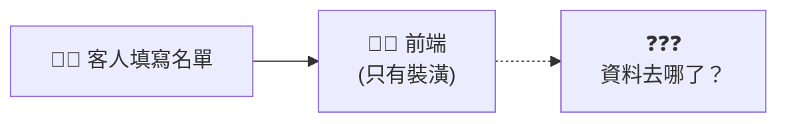
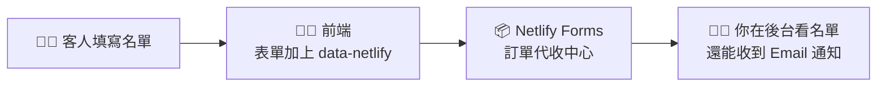

# 🗓️ 第二週（10/14）：SaaS 的靈魂 — 串接後端與體驗自動化迭代

> **🎯 本週目標：了解 SaaS 資料怎麼流動，用「駭客解法」完成會員註冊系統，體驗敏捷開發。**
>
> ⏱️ 總時數：2 小時　｜　🧰 需要：上週的 GitHub repo 與 Netlify 網站、AI 助理、手機

[← 回課程首頁](../README.md)　｜　上週還沒完成？👉 [第一週](../week1/README.md)

---

## 📋 本週流程總覽

| 時間 | 單元 | 對應 SaaS 積木 | 教材 |
| --- | --- | --- | --- |
| 0:00–0:20 | 1. 觀念建立：SaaS 怎麼記住使用者？🔥 | 📦 BaaS | 本頁 |
| 0:20–1:00 | 2. 實戰一：零後端名單收集系統 | 📦 Netlify Forms | [咒語集](prompts.md)・[Forms 教學](netlify-forms.md) |
| 1:00–1:40 | 3. 實戰二：打造無縫體驗（模擬登入狀態） | 👨‍💻 前端 ＋ LocalStorage | [LocalStorage 解說](localstorage.md) |
| 1:40–2:00 | 4. 實戰三：體驗 CI/CD 與 MVP 發表 | 🗄️ GitHub → ☁️ Netlify | [CI/CD 體驗](cicd.md) |

---

## 1️⃣ 觀念建立：SaaS 怎麼記住使用者？（20 分鐘）🔥【本次重點】

### 🤔 提問：客人按下「註冊」，資料去哪了？

上週我們有了漂亮的網頁，但如果客人點擊「註冊」或「加入早鳥名單」……**資料其實哪裡都沒去！**
因為我們的餐廳只有「裝潢（前端）」，**還沒有「廚房（後端）」和「倉庫（資料庫）」**。

### 🏗️ 真實後端要做什麼？

| 要做的事 | 需要學的技術 | 花費時間 |
| --- | --- | --- |
| 租一台伺服器 | Linux、雲端主機（GCP / AWS） | 數天 |
| 寫接收資料的程式 | 後端語言（Python / Node.js）、API | 數週 |
| 設計資料庫 | SQL、資料表設計 | 數週 |
| 顧好資安 | 防止駭客、個資保護 | 永無止境 |

👉 工程師至少要搞一個月。但創業初期，我們真的需要這些嗎？

### 🚀 精實創業思維（Lean Startup）

> **創業初期（MVP 階段），我們的目標只是「驗證有沒有人想用」。**

- **MVP（Minimum Viable Product，最小可行產品）**：用最少的成本，做出「剛好能測試市場反應」的產品。
- 經典例子：Dropbox 在產品還沒做好之前，只放了一支[示範影片](https://techcrunch.com/2011/10/19/dropbox-minimal-viable-product/)收集早鳥名單，一夜之間候補名單從 5,000 人暴增到 75,000 人，證明了市場需求。
- 流程：**建造（Build）→ 測量（Measure）→ 學習（Learn）**，越快跑完一圈越好。

📖 延伸閱讀：[The Lean Startup 官網：核心原則](https://theleanstartup.com/principles)｜[精實創業（維基百科，中文）](https://zh.wikipedia.org/zh-tw/%E7%B2%BE%E5%AE%9E%E5%88%9B%E4%B8%9A)｜[Y Combinator：How to Plan an MVP（影片）](https://www.ycombinator.com/library/6f-how-to-plan-an-mvp)

### 🦹 現代駭客解法：BaaS（Backend as a Service，後端即服務）

> **我們不自己蓋廚房，我們直接去「借」別人的資料庫！**

今天的主角是 **[Netlify Forms](https://docs.netlify.com/forms/setup/)**：
只要在表單上加一行 `data-netlify="true"`，Netlify 就會自動幫你收資料、存在雲端後台，還能寄 Email 通知你。

---

## 2️⃣ 實戰一：零後端名單收集系統（40 分鐘）

1. **詠唱咒語**：使用 [咒語 1：加入早鳥候補名單表單](prompts.md#咒語-1加入早鳥候補名單waitlist表單)，請 AI 在你上週的網頁上加表單。
   - 🔑 **關鍵魔法**：交代 AI「請務必在表單 `<form>` 標籤中加入 `data-netlify="true"` 屬性」。
2. **開啟表單偵測**：到 Netlify 後台開啟「Form detection」。👉 [詳細步驟](netlify-forms.md#步驟-2在-netlify-開啟表單偵測form-detection) ⚠️ **這步很多人漏掉！**
3. **上傳更新**：把新的 `index.html` 拖曳上傳到 GitHub，**覆蓋**舊檔案。
4. **互相填寫**：把網址丟到群組，請同學幫你填寫早鳥名單（也幫同學填！）。
5. **查看名單**：到 Netlify 後台 → **Forms**，看看收到哪些名單。👉 [詳細步驟](netlify-forms.md#步驟-4到後台查看收集到的名單)

> 🏗️ **架構呼應**：只要加一行字，Netlify 這個房東就會變成你的警衛，**免費幫你把客人的資料收好放在雲端後台**。這就是串接 BaaS 的威力！

---

## 3️⃣ 實戰二：打造 SaaS 的無縫體驗 — 模擬登入狀態（40 分鐘）

### 原理：SaaS 記住客人的兩種方式

| | ☁️ 雲端資料庫（剛剛做的） | 💻 瀏覽器 LocalStorage |
| --- | --- | --- |
| 比喻 | 餐廳櫃檯的「會員登記簿」 | 發給客人帶回家的「集點卡」 |
| 資料存在哪 | Netlify 的雲端伺服器 | 客人自己的瀏覽器裡 |
| 誰看得到 | 你（老闆）在後台看得到 | 只有客人自己那台電腦看得到 |
| 換台電腦還在嗎 | ✅ 在 | ❌ 不見了 |
| 用途 | 收集名單、正式的會員資料 | 記住登入狀態、偏好設定（如深色模式） |

👉 白話解說：[localstorage.md](localstorage.md)

### Vibe Coding 實作

1. 使用 [咒語 2：送出後變成會員儀表板](prompts.md#咒語-2送出後原地變成會員儀表板)。
2. 效果：送出表單後，網頁**不跳轉**，原地變成：
   > 🎉 歡迎回來，**小明**！這是您的會員儀表板，建置中……
3. 重新整理網頁，歡迎畫面**還在**（因為名字記在 LocalStorage 裡）。
4. 按「登出」按鈕，畫面回到表單。

📂 參考完成品：[examples/week2-waitlist/index.html](../examples/week2-waitlist/index.html)

> 🏗️ **架構呼應**：這雖然是前端的視覺魔法，換台電腦就不見了。但在創業初期的 Demo 時，**這樣就足以讓投資人完整體驗你的 SaaS 服務流程！**

---

## 4️⃣ 實戰三：體驗 CI/CD（持續整合／部署）與 MVP 發表（20 分鐘）

👉 **完整步驟：[cicd.md](cicd.md)**

1. 請 AI 修改網頁上的一段文字或按鈕顏色（[咒語 3](prompts.md#咒語-3快速改版體驗-cicd)）。
2. 把檔案**再次**拖曳上傳到 GitHub，覆蓋舊檔案。
3. **不用進 Netlify 點任何按鈕**，直接用手機重新整理你的網頁。
4. 🪄 網頁已經自動更新了！

> 🏗️ **架構呼應**：這叫做 **CI/CD 自動化部署**！這就是為什麼 IG、Netflix 每天都在更新，你卻不會遇到「維修中」。
> 只要架構對了（GitHub 串 Netlify），老闆一句話，AI 寫出 Code，上傳後幾十秒內全世界的用戶都會看到更新！**這就是科技公司的敏捷開發！**

### 🎤 MVP 小發表（每組 1 分鐘）

用手機展示你的網站，並試著用這個句型說明：

> 「我們的產品是 ______，解決 ______ 的問題。我們用 **AI 輔助開發** 做出前端，部署在 **Netlify** 上，用 **Netlify Forms** 收集早鳥名單，目前已經收到 ___ 筆！」

完整期末版本 👉 [期末 Pitch 模板](../docs/pitch-template.md)

---

## ✅ 本週驗收清單

- [ ] 我能解釋為什麼 MVP 階段不需要自己寫後端
- [ ] 我的網站有「早鳥候補名單」表單，並加上了 `data-netlify="true"`
- [ ] 我在 Netlify 後台看到至少 3 筆同學填寫的名單
- [ ] 送出表單後，網頁會顯示「歡迎回來，[名字]」的會員畫面
- [ ] 我修改了網頁並重新上傳到 GitHub，看到網站自動更新
- [ ] 我能用一分鐘說明我的 SaaS 架構

## 🏠 課後挑戰（選做）

- 🔔 設定 [表單 Email 通知](netlify-forms.md#進階設定email-通知)，有人填表時手機會收到通知。
- 📊 請 AI 幫你加一個「目前已有 N 人加入」的社會認同（Social Proof）區塊。
- 🔗 研究 [Supabase](https://supabase.com/) 或 [Firebase](https://firebase.google.com/)：如果要做「真的」會員登入系統，下一塊積木是什麼？
- 🧪 把網址分享給真實的目標客群（不是同學），看看一週能收到多少名單，這就是**市場驗證**！

## 📚 本週延伸學習

- [Netlify Forms 官方文件](https://docs.netlify.com/forms/setup/)
- [MDN：Window.localStorage（繁中）](https://developer.mozilla.org/zh-TW/docs/Web/API/Window/localStorage)
- [MDN：網頁表單入門（繁中）](https://developer.mozilla.org/zh-TW/docs/Learn_web_development/Extensions/Forms/Your_first_form)
- [Red Hat：什麼是 CI/CD？（繁中）](https://www.redhat.com/zh-tw/topics/devops/what-is-ci-cd)
- 更多資源 👉 [docs/resources.md](../docs/resources.md)

---

卡關了？👉 [常見問題 FAQ](../docs/faq.md)　｜　期末準備 👉 [Pitch 模板](../docs/pitch-template.md)
