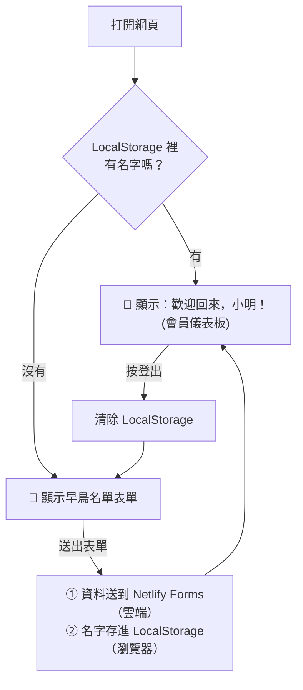

# 💻 LocalStorage 白話解說：讓網頁「記得」你

[← 回第二週](README.md)　｜　📖 官方文件：[MDN：Window.localStorage（繁中）](https://developer.mozilla.org/zh-TW/docs/Web/API/Window/localStorage)

---

## 🎫 比喻：餐廳發給你的「集點卡」

- **雲端資料庫** ＝ 餐廳櫃檯的「會員登記簿」：老闆看得到，換哪家分店都查得到。
- **LocalStorage** ＝ 餐廳發給你、讓你**帶回家的集點卡**：
  - 存在**你自己的瀏覽器**裡，老闆看不到。
  - 下次你再來（重新打開網頁），網頁看到集點卡就知道「喔，是你！」
  - 但如果你換一台電腦、換一個瀏覽器，或清除瀏覽紀錄，集點卡就**不見了**。

---

## 🔍 實際看看你的「集點卡」

1. 打開你的網站（或 [範例網站](../examples/week2-waitlist/index.html)），填寫表單送出。
2. 按 `F12`（Mac：`⌘ + ⌥ + I`）打開開發者工具。
3. 點上方的 **「Application（應用程式）」** 分頁。
4. 左側展開 **Storage → Local storage**，點你的網址。
5. 你會看到網頁存進去的資料，例如 `vibe_member`：`{"name":"小明", ...}`

🎉 這就是網頁「記得」你的秘密！試著在這裡把資料刪掉，再重新整理網頁，會員畫面就不見了。

📖 [Chrome 官方：查看與編輯 Local Storage](https://developer.chrome.com/docs/devtools/storage/localstorage)

---

## 🧩 程式碼只有三行

```javascript
// 1. 存資料：把名字寫進集點卡
localStorage.setItem('memberName', '小明');

// 2. 讀資料：看看集點卡上寫了什麼
const name = localStorage.getItem('memberName'); // → '小明'

// 3. 刪資料：登出時把集點卡撕掉
localStorage.removeItem('memberName');
```

在範例網站中，整個「模擬登入」的邏輯就是：



---

## ⚖️ 什麼時候用哪一個？

| 情境 | 用雲端資料庫 ☁️ | 用 LocalStorage 💻 |
| --- | --- | --- |
| 收集早鳥名單 | ✅ | |
| 記住「這個訪客已經填過表了」 | | ✅ |
| 深色模式／語言偏好 | | ✅ |
| 購物車（還沒結帳） | | ✅ |
| 會員的訂單紀錄 | ✅ | |
| 跨裝置同步（手機、電腦都看得到） | ✅ | |

## ⚠️ 注意事項

- **不要存密碼、信用卡號等敏感資料**！LocalStorage 沒有加密，任何能打開這台電腦瀏覽器的人都看得到。
- 這只是「**模擬**」登入。真正的會員系統需要雲端資料庫＋身分驗證（例如 [Supabase Auth](https://supabase.com/docs/guides/auth)、[Firebase Authentication](https://firebase.google.com/docs/auth)）。
- 但在創業初期的 Demo 時，這樣就**足以讓投資人完整體驗你的 SaaS 服務流程**！

## 📚 延伸學習

- [MDN：Web Storage API（繁中）](https://developer.mozilla.org/zh-TW/docs/Web/API/Web_Storage_API)
- [MDN：HTTP Cookie（繁中）](https://developer.mozilla.org/zh-TW/docs/Web/HTTP/Guides/Cookies)：LocalStorage 的「前輩」，差別在 Cookie 每次都會被送到伺服器
- [W3Schools：localStorage 線上試玩](https://www.w3schools.com/jsref/prop_win_localstorage.asp)

---

下一步 👉 [體驗 CI/CD 自動部署](cicd.md)
